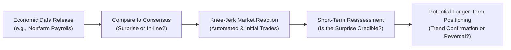

## Introduction and Core Concepts

Macroeconomic surprises happen when actual economic data—like GDP growth, inflation, or employment figures—comes in above or below the level that the market was expecting. Maybe you’ve heard traders say something like, “We got a big payroll surprise this morning.” That’s exactly it: the difference between consensus forecasts and what really happens. These surprises can have a significant influence on asset performance, whether we’re talking about equities, bonds, FX markets, or even commodities.

You might recall from your study of business cycles (see Chapter 3) and inflation (Chapter 4) that data releases such as nonfarm payrolls or Consumer Price Index (CPI) readings can quickly move markets. But the trick is that market participants have usually “priced in” their predictions. So if the actual release matches widespread expectations, you might see only a muted reaction. On the other hand, if the real numbers deviate significantly from consensus forecasts, you can get that “knee-jerk reaction” that might send equity prices, bond yields, or currency rates jumping around like a startled cat.

Below, we’ll walk through how surprises are measured, how different asset classes often respond, and how you can incorporate macroeconomic surprise analysis into your portfolio decisions.

## Measuring Surprises: Economic Surprise Indices

Economic Surprise Indices (ESIs)—like the Citi Economic Surprise Index (CESI)—aggregate the difference between actual data releases and consensus forecasts. A positive reading typically indicates that recent data has been surpassing expectations on average. A negative reading, of course, means the opposite.

• Practical Example: Let’s say a string of U.S. data—from retail sales to manufacturing PMIs—beats market estimates over a few weeks. The ESI likely flips higher, suggesting that the economy is running stronger than analysts initially thought. If this trend continues, equity markets may rise on optimism, while bond yields might climb because traders anticipate tighter monetary policy.  

• Signal vs. Noise: These indices help smooth out the wild swings in single releases and reveal an overall trend of data surprises. If you see the index consistently trending above zero, it usually means the economy is performing better than expected for a sustained period.  

Because the index rolls over time, big data misses or big beats gradually drop out, so one major surprise a month ago won’t distort today’s reading forever. This means if you want to gauge the momentum of “surprise,” it’s helpful to see the direction in which the index is trending, not just the absolute level.

## Expectations and Knee-Jerk Reactions

Traders and portfolio managers often rely on consensus forecasts to calibrate their positions in anticipation of major data releases. Let’s face it: nobody likes nasty surprises. But they happen.

When the released figure deviates meaningfully from consensus (for example, an unemployment rate that’s much lower than expected), market participants may react immediately—sometimes within seconds, driven by algorithmic trading. This instant response is often called a “knee-jerk move.” It can be large, but it might not last long. 

• If the surprise indicates stronger economic growth (such as a big jump in nonfarm payrolls), equity markets can rally initially, pricing in higher corporate earnings prospects. Bond markets, however, may see yields jump if investors believe the central bank will raise rates sooner.  
• If the surprise indicates weaker economic growth (like a significant decline in retail sales), equities might sell off, and bond prices might rise (yields falling) as the market anticipates more accommodative monetary policy or a flight-to-safety dynamic.

In many cases, these immediate moves can partially or fully reverse within hours or days. Why? Because as market participants reflect on the new data, they may filter out noisy signals and ask, “Does this single release really alter our longer-term outlook?”

## Short-Term vs. Longer-Term Shifts

A single data point—no matter how surprising—may not mean the entire economy is changing direction. So if there’s one lesson that took me forever to learn, it’s to avoid chasing every big data release without context. A knee-jerk reaction might fade unless additional data confirms a broader trend (or unless the single surprising release is extremely significant—like a massive spike in inflation that triggers a central bank policy shift).

• Temporary vs. Sustained: If nonfarm payrolls come out higher than expected but the underlying trend in other indicators—such as inflation, consumer confidence, or industrial production—remains lackluster, it might just be a blip.  
• Trend Confirmation: True longer-term trend changes typically need multiple data points heading in the same direction. For instance, a couple of consecutive surprises in core inflation might solidify the idea that the economy is heating up and prompt a genuine shift in monetary policy expectations.

## Impact on Different Asset Classes

It’s certainly not one-size-fits-all. Different markets weigh surprises differently.

### Equities

• Positive Growth Surprises: Equity markets typically cheer good news on growth. Earnings prospects improve, consumer spending might rise, and cyclical stocks (like retail or manufacturing) could lead the charge.  
• Negative Growth Surprises: Stocks often dip if the economy looks weaker than anticipated, especially if it spells trouble for corporate revenues.

### Fixed Income

• Inflation Surprises: Treasuries or government bonds can sell off (yields up) if inflation surprises signal that interest rates might rise. Long-duration bonds are particularly sensitive, as their prices drop more sharply when yields jump.  
• Growth Surprises: Positive growth sometimes leads to higher yields because players anticipate tighter monetary policy down the road. Conversely, negative surprises can prompt a flight to safe assets, pushing yields lower.

### Currencies

• Unexpectedly Strong Data: If you get a positive surprise in U.S. data while Europe’s data is coming in as expected, the U.S. dollar might strengthen. Markets often interpret better-than-expected data as a sign of monetary tightening ahead, boosting the currency.  
• Weak Data: The currency can soften if a major data release suggests the central bank might cut rates or if it signals slowing economic growth.

### Commodities

• Energy Sensitive: Surprises in growth data can move oil prices if they influence perceptions of future demand for energy.  
• Inflation Hedge: Precious metals like gold tend to rally if inflation spikes unexpectedly, especially if real rates are expected to remain low or negative.

## Differentiating “Noisy” Data from Real Trends

Here’s a personal anecdote: The first time I got burned by a data release was on a day when the Consumer Confidence Index soared way above analyst consensus. I jumped in, expecting a sustained surge in equities—only to watch them tumble the next day when a different indicator (new home sales) disappointed severely. Ouch.

The moral: One surprising data point might be a random outlier. So keep an eye on data consistency. Indicators often confirm or contradict each other. If you see multiple surprises in the same direction—like a bullish surprise in job creation plus strong manufacturing numbers—it’s a stronger signal that something real is happening.

Analysts often wait for confirmation, and sophisticated models incorporate multiple data releases. In practice, you might examine the Citi Economic Surprise Index by region—say the U.S. and Europe—to see whether a trend of positive or negative surprises is continuing. If both the U.S. and Europe are exceeding expectations, that might point to a globally synchronized upswing, with broad implications for equities and commodities.

## Trading and Investing Implications

### Rapid Analysis and Execution

Because markets reprice quickly upon a surprise, real-time data analysis and fast trading capabilities can be crucial, especially for short-term traders or algorithmic funds. Many traders run event-driven strategies to capture extra alpha if their internal forecasts diverge from the consensus. For instance, a sophisticated hedge fund might predict that payrolls will surprise on the upside and position accordingly.

### Longer-Horizon Investors

Longer-horizon investors, like pension funds, often aim to see if the surprise indicates a fundamental shift in the macro outlook (e.g., a more hawkish Federal Reserve if inflation runs hotter). They might tilt their portfolios by reducing duration (i.e., cutting back on long-dated bonds) or increasing their allocation to cyclical stocks that benefit from stronger growth. But they won’t drastically alter their strategies on a one-off data print—unless that one-off is game-changing.

### Avoiding Overinterpretation

Market watchers with multi-year horizons usually want signals, not noise. They’ll look at rolling averages, multi-quarter data, or the direction of potential policy. Is the central bank telegraphing that one strong inflation reading alone won’t change their stance? That’s an important clue.

## Diagram: How a Macro Surprise Flows into Asset Pricing

Here’s a simplified visual of the flow from a new data release to asset price reactions. This may help clarify how quickly and how differently assets can respond:

1. Data is released (nonfarm payrolls, inflation figures, etc.).  
2. The market compares actual data to consensus, identifying a surprise.  
3. Immediate reaction drives rapid price changes.  
4. Traders and analysts reassess significance—outlier vs. reliable indicator.  
5. If repeated surprises indicate a real trend, investors may adjust portfolios accordingly.

## Incorporating Surprises into Portfolio Strategies

• Economic Surprise Index Overlay: Some managers overlay an ESI (like the Citi index) into their macro models to identify turning points. A rising ESI could signal bullishness for equities, while a falling ESI might prompt a tilt into defensive assets.  
• Diversification: Surprises may affect asset classes divergently, so a diversified portfolio can help manage risks of abrupt changes.  
• Option Strategies: Investors sometimes use options to hedge against big data surprises. For instance, if you suspect a major divergence in an upcoming payroll release, you might buy a straddle on equity index futures.

## Common Pitfalls and Best Practices

• Overtrading on One Data Print: Acting too quickly on every surprising release can lead to losses if subsequent data contradicts it.  
• Confirmation Bias: If you expect hawkish monetary policy, you might cherry-pick inflation surprises and ignore negative growth surprises that run counter. Always keep an open mind.  
• Data Revisions: Even serious indicators like GDP or payroll data get revised, sometimes significantly. A data “surprise” might be reversed in the next release.  
• Interpreting Soft vs. Hard Data: Soft data (surveys, sentiment, etc.) can be even noisier than hard data (actual consumer spending). Always note which type of data is surprising the market.

## Ethical and Professional Considerations

At the Level I stage, you’re likely familiar with the CFA Code of Ethics and Standards of Professional Conduct that emphasizes diligence and a reasonable basis for all investment analyses. That principle applies here too: ensure that your use of macroeconomic data surprises is grounded in sound research. Also, be mindful of fair dealing and material nonpublic information rules. Economic data might be released publicly, but if you have early or special access, that can pose serious compliance issues.

## Final Exam Tips

• Understand Market Consensus: Recognize that markets price in expected values. Only deviations from these expectations typically spark big moves.  
• Connect Surprises to Policy Outlook: For many exam questions, linking a macro surprise to potential monetary or fiscal policy responses is critical.  
• Risk Management Angle: Consider how a portfolio’s exposure might change if an expected surprise doesn’t materialize, or if a negative surprise enters the picture.  
• Multi-Step Problems: You may face item sets where you interpret multiple data releases over different time horizons. Focus on the interplay between short-term and longer-term impacts.

## References and Further Reading

• Citi Economic Surprise Index (CESI) – a widely cited measure of how economic indicators stack up against consensus.  
• Bloomberg’s Economic Surprise Indicators: https://www.bloomberg.com/  
• “Market Reactions to Economic Data Releases,” Journal of Finance, various studies on how markets immediately and over time re-price important data.  
• Chapter 3 of this volume, “Business Cycles,” for more on cyclical fluctuations and data analysis.  
• Chapter 4 of this volume, “Inflation and Deflation,” for deeper context on inflation data surprises and bond market implications.  

## Test Your Knowledge: Macroeconomic Surprises and Asset Performance



### Which statement best describes a macroeconomic surprise?

- [ ] It is any scheduled release of economic data.
- [ ] It is an unexpected revision of prior data only.
- [x] It is a deviation of actual data from the expected consensus.
- [ ] It refers only to news about central bank decisions.

> **Explanation:** A macroeconomic surprise arises when actual data deviates from the widely held consensus forecast. This contrast between expected and realized data is what drives unexpected market reactions.

### What aspect of market activity is often referred to as the “knee-jerk reaction”?

- [ ] A carefully considered, long-term portfolio shift.
- [x] The immediate, often automated, price movement following a data release.
- [ ] A revision of previously released economic statistics.
- [ ] A delayed reaction after multiple data prints confirm a trend.

> **Explanation:** The “knee-jerk” reaction happens quickly after the data release, often due to algorithmic trading or swift market responses, and may be reversed as traders reassess the information.

### Why might bond prices fall after a positive economic growth surprise?

- [ ] Investors expect more government borrowing, lowering bond demand.
- [x] The strong growth may prompt higher interest rates, raising yields and lowering bond prices.
- [ ] Market participants believe inflation will plummet.
- [ ] The central bank is not in a position to change rates.

> **Explanation:** A positive growth surprise can indicate a hotter economy, which often leads markets to anticipate rate hikes. Because bond prices move inversely to yields, bond prices typically decline when yields are expected to rise.

### Which approach is most effective for long-term investors after a single macroeconomic data surprise?

- [ ] Immediately reshuffle the entire portfolio to exploit short-term profits.
- [x] Assess whether future releases confirm a broader trend before making major allocation changes.
- [ ] Place large leveraged bets against the market.
- [ ] Ignore all future data and focus solely on that single release.

> **Explanation:** Long-term investors should watch for confirmation from multiple data releases, ensuring any change in outlook is not based on noise or an outlier.

### Which of the following correctly identifies how positive inflation surprises might affect markets?

- [x] Bond yields may rise, causing bond prices to fall.
- [ ] Equity markets typically experience no impact.
- [x] Central banks might move more quickly toward a hawkish stance.
- [ ] The local currency always declines against peers.

> **Explanation:** Inflation surprises often cause rising bond yields if traders expect tightening monetary policy. Equities can be mixed, but central banks may indeed tighten faster, which can, however, strengthen or weaken a currency depending on broader international factors.

### Which tool can measure the aggregated difference between actual and forecasted economic indicators?

- [ ] Phillips Curve
- [x] Economic Surprise Index
- [ ] Moving Average Convergence Divergence (MACD)
- [ ] Stochastic Oscillator

> **Explanation:** Economic Surprise Indices such as the Citi Economic Surprise Index measure how data releases compare to consensus forecasts over time.

### What is a common pitfall when interpreting unexpected data releases?

- [x] Overreacting to one release without confirming if it’s part of a larger trend.
- [ ] Using multiple data points to see if there is a consistent direction.
- [x] Letting confirmation bias overshadow contradictory signals.
- [ ] Assessing how the data release aligns with existing portfolio allocations.

> **Explanation:** Common pitfalls include reacting too quickly to a single release and ignoring data that doesn’t fit your narrative, both of which can lead to misguided investment decisions.

### Which statement accurately describes why a currency may strengthen after a positive economic surprise?

- [ ] The central bank is guaranteed to intervene and buy that currency.
- [ ] Inflation always drops when the economy is strong.
- [x] Investors may expect a faster pace of rate hikes, attracting capital flows.
- [ ] Demand for risk-free assets immediately plummets.

> **Explanation:** Strong economic data can prompt markets to anticipate more aggressive rate hikes, which typically attracts foreign capital, thus strengthening the currency.

### What might happen if a significant data release, such as GDP, is later revised downward?

- [x] The earlier macro surprise effect could reverse in part if the revision contradicts the initial reading.
- [ ] The initial reaction to the data typically remains permanent.
- [ ] Traders ignore all revisions regardless of magnitude.
- [ ] Monetary policy usually remains unaffected even if data drastically changes.

> **Explanation:** Revisions can lead markets to adjust previous positions if the new data changes the perceived trajectory of the economy.

### True or False: A strong headline number can still be met with little market reaction if it aligns exactly with consensus expectations.

- [x] True
- [ ] False

> **Explanation:** Markets often “price in” widely anticipated data releases. If the release matches the consensus, there is no surprise, and therefore the market reaction may be negligible.


