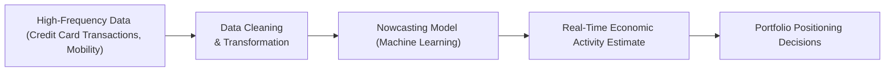

## Overview

One challenge in economic analysis is that “official” data—like quarterly GDP, monthly industrial production, and retail sales—often reaches us with a substantial time lag. We can be well into a new economic cycle by the time the data reveals a downturn or upswing. Nowcasting seeks to bridge this gap by leveraging real-time, high-frequency data to estimate economic conditions as they happen. Let’s explore how nowcasting works, where it fits in portfolio management and risk control, and what pitfalls and best practices accompany its use.

## Key Concepts and Benefits

### Defining Nowcasting
Nowcasting is the practice of estimating current economic activity using a wide variety of real-time data—think credit card transactions, mobility data from mobile phones, online job postings, even foot traffic in shopping malls. It aims to give you a snapshot of the economy’s state right now—before we see official numbers that might appear weeks or months later.

• It might feel almost futuristic, right? You open your nowcasting dashboard and see that consumer spending has dropped 2% within the last five days, and you adjust your portfolio accordingly.  
• Early signals can be critical in catching sudden market shifts—imagine a pandemic-related closure that quickly reduces retail activity. Nowcasting can detect that “shock” faster than official statistics.

### High-Frequency Data
High-frequency data updates daily, or sometimes by the hour. This could include:  
• Credit card usage and bank transactions  
• Traffic congestion or public transportation usage  
• Electricity consumption rates  
• Online searches and job postings  

High-frequency data points represent slices of the real economy that help us infer broader trends. The speed and granularity of these indicators make them valuable for short-term forecasts or “nowcasts.”

### Potential Advantages in Portfolio Management
• Timely insights: Rapidly identify whether the economy is slowing or picking up.  
• Improved risk management: Spot vulnerabilities (e.g., a sudden drop in auto loans or mortgages) to adjust exposures before large market sell-offs.  
• Enhanced alpha generation: Exploit real-time data to front-run official announcements—particularly relevant for macro-oriented strategies, currency trades, or sector rotation.

## Real-Time Indicators in Practice

### How Data Is Collected
Data collection often uses web scraping, APIs from financial institutions, aggregator platforms, and other digital channels. I once spoke to a data vendor who analyzed anonymized cell phone geolocation pings from trucking fleets—“Sure,” the vendor said, “we can see if a manufacturing plant is humming or on pause based on the volume of inbound and outbound trucks every day.” It sounded a bit like science fiction, but it's a powerful approach to gauge industrial production activity.

### The Nowcasting Process
Below is a simple flowchart illustrating how these real-time signals might feed into a nowcasting model:



1. Data Intake: Aggregate diverse data sources—some might be daily credit card spending, others might be weekly jobless claims.  
2. Cleaning and Transformation: Standardize the data, handle missing values, and adjust for outliers (like a large merchant’s server outage that artificially suppresses credit card transactions for a day).  
3. Modeling: Use statistical or machine learning approaches (e.g., linear regression, random forests, neural networks) to synthesize signals.  
4. Estimation: Arrive at a “nowcast” for main economic metrics, such as quarterly GDP growth or consumer spending, before official releases.  
5. Decision Making: Integrate these insights into investment strategies, sector allocation, and hedging decisions.

### Example: A Simple Regression-Based Nowcast
A straightforward way to create a nowcast is to regress official GDP on high-frequency variables. For instance, let’s say we have data for “mobility” (like foot traffic in stores) and “credit_card_spending.”

Below is a minimal Python snippet that illustrates how a simple multiple linear regression might be set up:

```python
import pandas as pd
from sklearn.linear_model import LinearRegression

data = {
    'mobility': [100, 95, 110, 115, 105],
    'credit_card_spending': [500, 480, 520, 530, 510],
    'official_gdp': [2.0, 1.8, 2.2, 2.1, 2.0]
}
df = pd.DataFrame(data)

X = df[['mobility', 'credit_card_spending']]
y = df['official_gdp']

model = LinearRegression()
model.fit(X, y)

print("Intercept:", model.intercept_)
print("Coefficients:", model.coef_)
```

Conceptually, our model might look like this:

$$
\text{Nowcast}_t = \beta_0 + \beta_1 \times \text{Mobility}_t + \beta_2 \times \text{CreditCardSpending}_t + \epsilon_t
$$

We can then plug in the latest “mobility” and “credit_card_spending” values—say as of yesterday—to estimate GDP right now.

## Data Noise and Limitations

Of course, real-time data can be messy—no question there. It’s easy to get lured by the excitement of daily updates but forget that some signals might represent anomalies or partial coverage of the broader economy.

• Data revisions: A large aggregator might revise or re-benchmark their past data, leading to back-and-forth in your nowcasts.  
• Sample bias: Credit card spending might not represent all consumers (e.g., older demographics might rely on cash).  
• Volatility: High-frequency data is inherently more variable than monthly or quarterly aggregates. A single day’s disruption can disproportionately affect your signal.  
• Stability vs. agility: Some real-time datasets might vanish if the data provider changes policies, leading to discontinuities.

The savvy nowcaster typically cross-checks with “soft data” (like business sentiment surveys) and “hard data” (like industrial production) to see if the signals align. Continuous calibration is key—you’ll likely compare your nowcasts to eventual announced GDP or retail sales data to see how well your real-time approach tracks the final result.  

## Integrating Nowcasting into Portfolio Management

### Tactical Asset Allocation
Portfolio managers might shift allocations more quickly in response to a negative signal received from high-frequency data. For example, if consumer spending decelerates rapidly, they may trim exposure to consumer discretionary equities.

### Risk Management
Early detection of a slowdown or potential crisis can help managers lock in gains or hedge. Suppose you see a large spike in corporate credit card spending but no commensurate increase in consumer spending; that mismatch might signal trouble for small or midsized businesses.

### Seeking Alpha in Fixed Income and FX
Bond traders often watch for macro data surprises. Swiftly updated nowcasting models can help them position in government bonds or currency pairs ahead of official announcements, potentially capturing extra returns if the final data confirm the nowcast.

### Potential Pitfalls 
• Overreacting to daily “noise” might lead to excessive trading and transaction costs.  
• Confusing correlation with causation: Just because foot traffic is high does not always guarantee robust retail sales.  
• Data “decay”: COVID-19 lockdowns, for instance, changed consumer behavior. Models based on pre-lockdown patterns suddenly lost accuracy.  

## Nowcasting Best Practices
• Diversify Data Sources: Combine multiple indicators (mobility, spending, job postings) to reduce reliance on one volatile dataset.  
• Incorporate Qualitative Checks: Integrate anecdotal or industry-specific insights to sanity-check your model’s output.  
• Align with Traditional Macro Models: Use standard macro frameworks—e.g., production function approaches—to confirm or question your real-time signals.  
• Recalibrate Often: As official data is released, measure how far off your nowcast was and update your model accordingly.  

## Exam Relevance and Tips
If you’re studying for advanced CFA-level exams, you might see scenario-based questions on using nowcasting in an investment strategy:  
• Constructed-response items could require you to explain how a real-time indicator might influence a policy portfolio’s weighting in equities versus fixed income.  
• Item sets might present high-frequency data with anomalies, asking you to interpret them in light of possible sample biases.  

Here are a few suggestions for your exam preparation:  
1. Understand the difference between real-time or high-frequency data and official “lagged” data.  
2. Be prepared to discuss how noise and revision risk influence the reliability of nowcasts.  
3. Familiarize yourself with machine learning terminology—regression, ensemble methods, feature engineering—since they often appear in nowcasting contexts.  
4. Practice writing concise, direct essay responses that connect real-time indicators to asset allocation, risk control, and sector rotation decisions.

## References and Further Reading
• Federal Reserve Bank of New York’s Nowcasting Report:  
  https://www.newyorkfed.org/research/policy/nowcast  

• “Big Data and Machine Learning in Macroeconomics,” Central Bank Research publications  

• Various articles on real-time economics in the Journal of Econometrics  

• CFA Institute Level II and Level III curriculum references on Econometrics, Forecasting, and Data Analysis  

• Local central bank reports that may publish nowcasting frameworks or early release data  

-----

## Nowcasting and Real-Time Indicators: 10 Practice Questions



### 1. Which of the following best describes the primary purpose of nowcasting?

- [ ] To provide a historical revision of economic data.  
- [ ] To replace official GDP estimates in policymaking entirely.  
- [x] To generate near-real-time estimates of economic activity.  
- [ ] To correct official statistical errors by government agencies.  

> **Explanation:** Nowcasting fills the gap between traditional release delays and current economic conditions by providing timely estimates based on high-frequency data.

### 2. Which of the following would likely be classified as “high-frequency data” in a nowcasting model?

- [ ] Quarterly corporate earnings reports.  
- [ ] Annual population census surveys.  
- [x] Daily credit card transaction volumes.  
- [ ] Weekly meteorological updates.  

> **Explanation:** High-frequency data generally refers to indicators updated daily or more frequently, such as credit card transactions. Earnings and census data are produced too infrequently to be considered high frequency.

### 3. Which statement about using a single source of high-frequency data is most accurate?

- [ ] One data source is sufficient if it’s large in sample size.  
- [x] A single data source may provide an incomplete economic view.  
- [ ] Multiple sources cause more noise and confusion.  
- [ ] Single-source data is always more accurate than official GDP.  

> **Explanation:** Relying on just one data source—no matter how big—can introduce bias and reduce comprehensiveness. A more robust approach uses a combination of data.

### 4. In the context of nowcasting, “calibration” refers to:

- [x] The ongoing process of adjusting a model’s parameters to improve predictive accuracy.  
- [ ] Replacing data sources with new datasets.  
- [ ] Ensuring the official GDP release matches the nowcast exactly.  
- [ ] Eliminating all historical data from the forecasting process.  

> **Explanation:** Calibration involves refining the model as new data arrives and as the final official numbers are published, which helps maintain or improve accuracy.

### 5. An equity portfolio manager sees a drastic plunge in real-time consumer spending data. She decides to reduce consumer discretionary holdings immediately. Which nowcasting benefit does this best illustrate?

- [x] The ability to act on emerging signals before monthly or quarterly data is published.  
- [ ] The guarantee of correct timing in portfolio rebalancing.  
- [ ] Minimization of all transaction costs.  
- [ ] Complete immunity to data misinterpretation.  

> **Explanation:** Real-time data helps managers adjust their portfolios quickly, well before official data gets released. However, it doesn’t guarantee that timing is always correct or cost-free.

### 6. One critical drawback of high-frequency data for nowcasting is:

- [x] Potential for substantial noise and revisions, leading to volatility in estimates.  
- [ ] Reduced transparency of official statistical methods.  
- [ ] Unavailability of machine learning techniques to handle such data.  
- [ ] Clear superiority over soft data like sentiment surveys.  

> **Explanation:** High-frequency data can be highly volatile and subject to revisions, making it harder to interpret signals accurately.

### 7. A nowcasting model outputs a daily GDP estimate that repeatedly overshoots official releases. Which approach is most likely to resolve this issue?

- [x] Recalibrate the model based on official release deviations.  
- [ ] Reduce the amount of data used to only one data source.  
- [x] Introduce an additional variable that captures relevant economic factors.  
- [ ] Eliminate all real-time data and rely solely on official monthly data.  

> **Explanation:** If the model systematically overshoots, you might adjust the parameters (i.e., recalibrate) and consider including more variables. Simply ignoring the real-time component is counterproductive.

### 8. Which statement is true regarding the integration of nowcasts with traditional macroeconomic forecasts?

- [x] Nowcasts complement, rather than outright replace, traditional methods.  
- [ ] Traditional macro forecasts have no use if nowcasts are available.  
- [ ] Nowcasts must completely ignore historical data to remain objective.  
- [ ] Traditional methods are more accurate and always overshadow nowcasts.  

> **Explanation:** Nowcasts provide real-time information suitable for filling the gap before official releases, but they typically work best in tandem with established forecast processes.

### 9. If you wanted to build a nowcasting model focusing on consumer confidence trends, which of the following data sources might be least useful?

- [ ] Social media sentiment analysis.  
- [ ] Daily foot traffic to shopping malls.  
- [ ] Online retailer sales volume.  
- [x] Annual company shareholder letters.  

> **Explanation:** While voluntary corporate disclosures have value, annual shareholder letters are relatively low-frequency and thus not particularly helpful in a “real-time” nowcasting context.

### 10. Nowcasting helps portfolio managers primarily by:

- [x] Providing more immediate insights into economic trends.  
- [ ] Guaranteeing official data accuracy.  
- [ ] Eliminating the need for risk management.  
- [ ] Replacing all forms of fundamental analysis.  

> **Explanation:** Nowcasting’s key contribution is delivering timelier insights, enabling managers to make faster, more informed decisions, but it does not guarantee perfect data nor replace the entire discipline of fundamental analysis.


