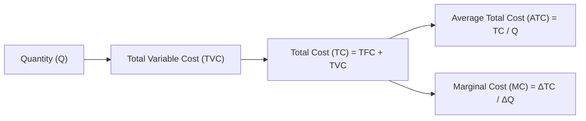

## Introduction
Sometimes, I recall a friend who opened a charming coffee shop, brimming with passion, but got blindsided by costs when business slowed in the off-season. This story might sound familiar: you’ve got a business dream, but do you really know how your costs behave? Understanding cost structures is like grabbing a trusty roadmap to navigate your firm’s path to profitability (and to figure out when to pull back). In this section, we’ll delve into the types of costs, how to calculate vital cost metrics, and why a breakeven analysis is essential. We’ll also talk about the dreaded shutdown scenario—when it might make more sense to close shop (at least for a bit) rather than keep going. So, let’s walk step-by-step through these concepts from a real-world perspective, with a little friendly banter along the way.

## Distinguishing Fixed and Variable Costs
One of the first things that hits you in the face when you run a business is that some costs are stubbornly unchanging (like the monthly rent), while others balloon or shrink with output. Formally:

• Fixed Costs (FC): Costs that remain constant regardless of how many units you produce or sell. Lease payments on your facility, insurance premiums, some salaries—those are typically fixed.  
• Variable Costs (VC): Costs that fluctuate in direct proportion to production. Raw materials, hourly wage expenses, and the electricity bills that soar when your production line is in full swing—these fall under variable costs.

It’s worth noting that in the long run, almost all costs can become variable (since lease contracts eventually expire, capital equipment can be replaced, etc.). But in the short run—where at least one input is fixed—you typically treat some costs as locked in, no matter how your output changes.

## Total, Average, and Marginal Costs
When analyzing cost structures, you’ll hear about total, average, and marginal concepts all the time:

• Total Cost (TC) is the sum of all costs for a given level of output Q:  
  $$
  \mathrm{TC} = \mathrm{TFC} + \mathrm{TVC}
  $$
  Here, TFC is total fixed cost, and TVC is total variable cost.

• Average Total Cost (ATC) is calculated by dividing total cost by the quantity produced:
  $$
  \mathrm{ATC} = \frac{\mathrm{TC}}{Q}
  $$
  This gives you a sense of what it costs, on average, to produce each unit.

• Average Variable Cost (AVC) zooms in on variable costs alone:
  $$
  \mathrm{AVC} = \frac{\mathrm{TVC}}{Q}
  $$

• Marginal Cost (MC) measures how much total cost increases if you produce one more unit:
  $$
  \mathrm{MC} = \frac{\Delta \mathrm{TC}}{\Delta Q}
  $$
  In many textbook scenarios, marginal cost curves are crucial for deciding profit-maximizing output. Firms typically like to set output levels where marginal cost = marginal revenue (MR).

To visualize these relationships, let’s look at a simple flow-style diagram of how these costs connect (using Mermaid.js notation):



Think of it this way: quantity produced influences your total variable cost. Add your total fixed cost, and you get total cost. From total cost, you can compute your average total cost and marginal cost. Each step in this chain affects your decisions about how much to produce.

## Breakeven Analysis
Breakeven is that magical point where total revenue (TR) exactly matches total cost (TC). At this juncture, you’re neither making a profit nor incurring a loss. It can be an eye-opener for business owners who are used to seeing revenues but forget to check if those revenues sufficiently cover all costs.

Mathematically, in its simplest form:
$$
\mathrm{Breakeven \; Point} \quad \text{where} \; \mathrm{TR} = \mathrm{TC}.
$$

If price is P and quantity is Q, then
$$
\mathrm{TR} = P \times Q, \quad \mathrm{TC} = \mathrm{ATC} \times Q.
$$

So the breakeven condition is:
$$
P \times Q = \mathrm{ATC} \times Q.
$$

If Q > 0, you can cancel out Q and see the breakeven price is simply equal to the average total cost:
$$
P = \mathrm{ATC}.
$$

### A Small Example
Imagine your fixed costs are \$10,000 a month, and each unit you produce has a variable cost of \$25. If you sell your product at \$50 per unit, you might ask: “How many units do I need to sell to cover all my costs?”

• Let Q be the number of units required to breakeven.
• Total revenue: \$50 × Q  
• Total cost: \$10,000 + (\$25 × Q)

Set them equal:
$$
50Q = 10{,}000 + 25Q
$$
$$
25Q = 10{,}000
$$
$$
Q = 400
$$

So, you must sell 400 units to breakeven. Below that, you’re losing money; above it, you’re making a profit—at least in theory.

## Short-Run Shutdown and Long-Run Exit
Now, let’s add a twist. Even if you’re not making an overall economic profit, sometimes you continue producing in the short run—but sometimes it’s better to shut down production temporarily. How do you know?

### Short-Run Shutdown Rule
If the price (P) is below your average variable cost (AVC), then each unit you produce doesn’t even cover the variable costs. It’s cheaper to produce zero units and just pay the fixed costs than produce at a loss that’s worse than just the fixed costs alone. Put differently:

• If \\( P \ge \mathrm{AVC} \\), then produce (or keep producing).  
• If \\( P < \mathrm{AVC} \\), then shut down.  

This might sound a bit counterintuitive. Why would you produce and still incur a loss if P is between AVC and ATC? Because you’re at least covering all your variable costs and contributing something toward fixed costs you’re stuck with anyway in the short run.

### Long-Run Exit Rule
In the long run, if \\( P \\) is below your average total cost (ATC) for a sustained period, it may indicate that your enterprise is not viable under normal market conditions—so you exit. In the long run, you have more flexibility: you can renegotiate rent, sell off equipment, or move on to a new venture.

Here’s a quick flowchart to illustrate how this decision-making might happen:

```mermaid
graph LR
    S["Start: Observe Market Price (P)"] --> Q1["Compare P to AVC"];
    Q1 -->|P < AVC| A["Short-Run: Shutdown (Produce Q=0)"];
    Q1 -->|P ≥ AVC| Q2["Compare P to ATC over time"];
    Q2 -->|P < ATC (Long-run)| B["Plan to Exit Market"];
    Q2 -->|P ≥ ATC| C["Continue Production"];
```

## Strategic Implications of Cost Structures
As you refine your firm’s strategy—particularly for those who might manage multi-product firms or multi-plant operations—understanding how your cost structure behaves is critical. Factors like high fixed costs (think heavy upfront investments in factory machinery) often push firms to produce closer to capacity to achieve economies of scale. But if demand drops suddenly, covering those large fixed costs can become a painful drag on profitability.

Additionally, technology can lower variable costs or shift the entire cost curve if you adopt newer, more efficient methods. Labor market changes—like wage rate hikes—directly affect your variable costs. When faced with price volatility or new competition, these changes in cost curves can alter your breakeven and shutdown points significantly.

## Connecting to CFA® Program and Real-World Applications
In the CFA® curriculum, cost analysis underpins many decisions in corporate finance, equity analysis, and even fixed income. For instance, analyzing a firm’s cost structure helps you forecast operating leverage, a measure of how sensitive operating income (EBIT) is to changes in revenue. When revenue declines, a high fixed-cost structure can quickly erode margins, potentially impacting credit ratings, the firm’s debt covenants, and stock valuations.  
From an investment standpoint, if you see a firm approaching its breakeven point—or dancing dangerously near shutdown territory—it may be a sign that the company is in trouble or has to pivot. Moreover, multi-asset portfolio managers assess these cost structures when gauging sector rotations or cyclical downturn effects in industries like manufacturing and utilities.

## Exam Tips and Common Pitfalls
• Show All Steps in Your Calculations: CFA exam graders want clarity on how you derived your breakeven quantity or marginal cost. Briefly list each step.  
• Watch Out for Units: Candidates sometimes lose points by mixing up total cost vs. average cost. Keep track of \\( /Q \\) terms.  
• Interpret Shutdown Points Correctly: Distinguish short-run decisions (AVC focus) from long-run viability (ATC focus).  
• Edge Cases: You might see tricky items set up with piecewise cost functions or step costs—be sure to handle numeric changes carefully.

During constructed-response questions, you might be asked to evaluate a scenario where a reduction in product price affects the firm’s decision to operate or shut down. Be precise: if the new price is above AVC but below ATC, the correct short-run choice is to keep producing (to cover part of the fixed costs). In the long run, however, the firm might exit if the situation persists.

## References for Further Study
1. Mankiw, N. G. (2020). Principles of Microeconomics. Cengage Learning.  
2. Pindyck, R. S., & Rubinfeld, D. L. (2018). Microeconomics (9th ed.). Pearson.  
3. Investopedia: Breakeven Analysis. https://www.investopedia.com/terms/b/breakeven-analysis.asp

## Test Your Knowledge: Cost Structures, Breakeven, and Shutdown Points



### If a firm’s price is lower than its average total cost but higher than its average variable cost in the short run, which action is typically justified?

- [ ] Shut down immediately to avoid further losses
- [x] Continue producing in the short run
- [ ] Lower the price even further to gain market share
- [ ] Raise fixed costs to increase leverage

> **Explanation:** As long as the price covers average variable costs (even if it doesn’t cover fixed costs fully), the firm minimizes its losses by continuing production. Fixed costs must be paid regardless, but partial coverage of those costs is better than none in the short run.

### What is the breakeven quantity (Q) if a firm has a total fixed cost of $8,000, a variable cost per unit of $12, and a sale price per unit of $20?

- [ ] 100
- [x] 1,000
- [ ] 400
- [ ] 667

> **Explanation:** Breakeven is found by solving 20Q = 8,000 + (12 × Q). This reduces to 8Q = 8,000 → Q = 1,000.

### Which of the following best describes marginal cost (MC)?

- [ ] MC = Total Cost / Quantity
- [x] MC = Δ Total Cost / Δ Quantity
- [ ] MC = Variable Cost / Quantity
- [ ] MC = Price – Variable Cost

> **Explanation:** By definition, marginal cost is the increase in total cost from producing one additional unit of output.

### In the long run, when does a firm typically decide to exit the market?

- [ ] When Price is below AVC
- [x] When Price remains below ATC
- [ ] When Total Revenue equals Total Cost
- [ ] When Marginal Cost equals Marginal Revenue

> **Explanation:** In the long run, the firm can exit if the price is below the average total cost (ATC) for a prolonged period, as it cannot cover both variable and fixed costs fully.

### Which cost curve is used to decide if a firm should shut down in the short run?

- [ ] Average Fixed Cost (AFC)
- [ ] Marginal Cost (MC)
- [x] Average Variable Cost (AVC)
- [ ] Average Total Cost (ATC)

> **Explanation:** In the short run, the rule is: shut down if Price < AVC. Average total cost matters in the long run, but AVC is the key threshold for short-run shutdown.

### If Price = Average Total Cost at the firm’s profit-maximizing quantity, which statement is true about the firm’s profits?

- [ ] The firm is making a positive economic profit
- [ ] The firm’s short-run supply curve ceases to exist
- [x] The firm’s economic profit is zero
- [ ] The firm must immediately shut down

> **Explanation:** When Price = ATC, the firm is at the breakeven point, generating zero economic profit (normal profit).

### A firm notices that it is still losing money when Price is above its Average Variable Cost but below its Average Total Cost. Which approach is correct for the short run?

- [x] Continue producing to cover some fixed costs
- [ ] Immediately cease operations
- [x] Adjust variable inputs to reduce marginal cost
- [ ] Exit the market permanently

> **Explanation:** If P covers AVC, the firm should generally keep producing to partially offset its fixed costs in the short run. It may also optimize variable inputs to reduce MC. Exiting permanently is a long-run decision.

### Variable costs typically:

- [ ] Decrease as output increases
- [ ] Remain the same regardless of output
- [ ] Only apply to capital expenditures
- [x] Rise with increases in production volume

> **Explanation:** Variable costs increase with production level—e.g., raw materials or shipping costs.

### When marginal cost (MC) is below average total cost (ATC), what effect does increasing output have on ATC?

- [x] ATC decreases
- [ ] ATC remains constant
- [ ] ATC increases sharply
- [ ] ATC does not change until MC > ATC

> **Explanation:** Whenever MC < ATC, producing an additional unit pulls the average cost downward, decreasing ATC.

### A firm should shut down in the short run if:

- [x] True
- [ ] False

> **Explanation:** True, if Price < Average Variable Cost (AVC). In that case, producing any output adds more to losses than ceasing production.




