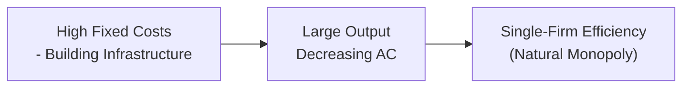
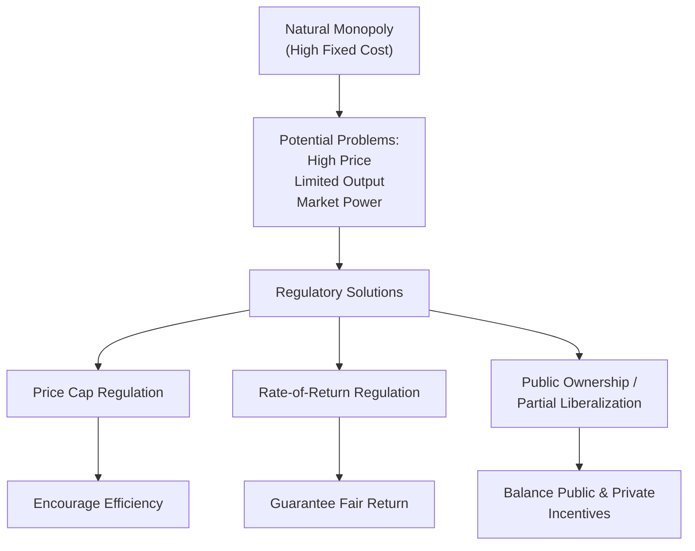

## Introduction and Core Concepts

Natural monopolies can be kind of fascinating, don’t you think? They pop up in industries like electricity distribution, water supply, and rail networks—sectors where one firm can meet the entire demand at a lower cost than if multiple firms entered the market. Anyway, the basic reason behind this phenomenon stems from massive fixed costs and powerful economies of scale. In simpler terms, the cost of building power lines or installing water pipes is so high that once you’ve done it, you can supply consumers at a far lower unit cost than if a competitor tried to set up the same infrastructure. And yeah, that’s exactly why we call it a “natural” monopoly: the structure of the industry makes it efficient—at least on paper—for only one firm to exist.

But there’s always a catch, right? Monopolies can lead to higher prices, lower quality, or hamper innovation unless there’s some oversight. That’s where regulation enters the story. A regulator might cap the prices, oversee rates of return, or even own/operate the firm in question. As we’ll see, the correct approach is rarely straightforward. Overregulate, and you suffocate potential investment; underregulate, and consumers face unfair pricing or subpar service.

This discussion fits right into our broader exploration of firm behavior and industry organization (cue references to prior sections, like how cost structures appear in 2.1 Cost Structures, Breakeven, and Shutdown Points). Let’s dive in.

## Defining a Natural Monopoly

A natural monopoly is a situation where a single firm can supply the total market demand more cheaply than multiple competing firms could. This advantage often traces back to enormous capital investment requirements—like setting up utility grids or rail tracks. Over the short run, these fixed costs seem daunting, but once they’re incurred, each additional unit of output becomes cheaper to produce.

In formal terms, you might see this reflected in a declining long-run average cost (LRAC) curve over the relevant range of output:


\text{LRAC} = \frac{\text{Total Cost}}{\text{Quantity}}


When LRAC falls continuously, it suggests that producing more lowers the per-unit cost, reinforcing the single-firm advantage.

## The Cost Structures Behind Natural Monopoly

One aspect that supports natural monopolies is the existence of substantial economies of scale. Economies of scale (often studied in earlier sections, like 2.2 Short-Run and Long-Run Cost Curves) mean that as production rises, average costs decrease—sometimes drastically. High fixed costs, such as the cost to lay down a rail network or run telephone cables, can be spread over a very large output. But imagine if multiple firms tried to replicate that infrastructure. They’d each incur similarly high fixed costs, leading to redundancy and likely higher total costs to society.

### Anecdote: The “Extra” Subway Track
Let me slip in a quick personal anecdote. A friend once was joking about how in big cities we sometimes want more than one subway operator to create “competition”—imagine adding a second, parallel set of underground tracks just so folks could choose between two providers. That’d be financially bonkers, right? The extra tracks would double the infrastructure cost while the total passenger demand might remain the same. In short, such an idea is absolutely cost-ineffective. That’s the essence of a natural monopoly: it’s simply cheaper for one firm (or one agency) to run it all, as building that second set of tracks would be a huge waste.

## Regulation of Natural Monopolies

### Why Regulate?
We might be tempted to let the monopoly reign if it’s the most cost-efficient structure. But—and there’s always a “but”—unregulated monopolies tend to generate a few headaches:

• Higher prices than a competitive market might yield.  
• Restricted output (so they can maximize profit).  
• Possibly underinvestment or misdirected investment if the firm focuses on short-term profits over long-term service quality.  

Regulation tries to tackle these worries, ensuring consumers receive essential services (like electricity, water, telecom) at “fair” prices while still allowing the monopoly a reasonable return on its investments.

### Regulatory Instruments
Let’s take a whirlwind tour of the most common regulatory tools.

1) Price Caps: Authorities limit the maximum price (or price path, e.g., tying it to an inflation index) the natural monopoly can charge. This approach can encourage cost efficiency but might also lead to profitability pressures if the cap is set too low.

2) Rate-of-Return Regulation: The monopoly’s allowed profits are tied to its cost of capital. This effectively prevents it from earning “excessive” profits. However, it can reduce the incentive for cost control—sometimes jokingly called the “cost-plus” or “gold-plating” scenario. If the firm’s profits are basically guaranteed, it might not have the strongest motivation to slash costs.

3) Public Ownership: In some cases, the service is offered by a government-owned entity. The government sets policy and ensures universal service, but criticisms can come from perceived inefficiency or politically motivated decision-making.

4) Average-Cost vs. Marginal-Cost Pricing:  
   • Average-Cost Pricing: The regulated price is set to cover total (average) costs, ensuring the firm can break even while providing the service.  
   • Marginal-Cost Pricing: The regulated price is set equal to the cost of producing one additional unit. While more efficient from a marginal analysis standpoint, if marginal cost is below average cost (often the case for large infrastructure networks), the firm might need subsidies to stay afloat.

We might glean from these that no single approach is perfect. A price cap might keep prices in check but risk underinvestment; average-cost pricing might keep the firm financially sound but risk overuse of capacity or cost inefficiencies.

## Visualizing Natural Monopoly Cost Structures

Below is a simple Mermaid diagram illustrating how total cost and average cost might behave in a natural monopoly setup. Notice that the average cost continues to trend down with increased output—a hallmark of economies of scale.

In this diagram, high fixed costs feed into scale economies, which then feed into conditions favoring a single-firm structure.

## Practical Examples of Natural Monopolies

• Electricity Distribution: Once the grid is in place, distributing one extra kilowatt-hour has a relatively small marginal cost compared to the original infrastructure cost.  
• Water Supply: The piping network is extremely expensive to lay down. Having two parallel water networks in the same region is usually impractical.  
• Rail Networks: Laying tracks is costly, so duplication rarely makes sense.  

Now, in some of these sectors, we do see competition in certain parts of the chain. For electricity, for instance, the generation stage can be competitive, while the distribution segment is still a natural monopoly. Regulatory frameworks often split these activities, allowing competition where it’s feasible (e.g., generation) and regulating only where the monopoly element persists (e.g., the cable network).

## Rate-of-Return Regulation: A Closer Look

Rate-of-return regulation is a classic approach. Suppose a utility invests capital (K) at a cost of capital (r). If the regulator allows the utility to earn r on K, the firm is guaranteed a return that covers both operating costs and an allowed profit margin. Symbolically:


\text{Allowed Revenue} = \text{Operating Costs} + \text{Depreciation} + r \times K


In principle, this ties the firm’s earnings to a “fair” rate. But in practice, sometimes the firm might overinvest or inflate their cost base: the well-known phenomenon called “gold-plating.” If your profit is (rate) × (capital employed), you might be tempted to spend more on capital improvements or plush offices than you truly need.

## Issues of Information Asymmetry

Regulating a natural monopoly is an asymmetric game. The firm typically has more accurate information about its costs, technological constraints, or possible future investments. The regulator can try to gather info, but it might be partial or outdated. This can lead to suboptimal regulation—think of a scenario in which a firm claims certain capital projects are absolutely necessary, but the regulator can’t easily verify whether these are cost-efficient or simply a disguised attempt to increase the capital base.

Quality of service is another dimension where asymmetry creeps in. Even if the regulator can monitor prices, it might be trickier to confirm that the firm is maintaining adequate service standards or investing in improvements over time.

## Balancing Average-Cost and Marginal-Cost Pricing

If the regulators set price at marginal cost (MC)—the cost of producing one more unit—this is, from a purely allocative efficiency standpoint, an ideal scenario. It ensures that consumers who are willing to pay at least the marginal cost of production will buy the product, thus no “deadweight loss.” Trouble is, if MC is below the average total cost (ATC), the firm might lose money on every unit. Over the long term, that’s simply not viable—leading to potential bankruptcies or a need for government subsidies. In many regulated industries, an “average-cost” approach is used so that the firm can break even. However, this can lead to inefficiencies where the firm’s production doesn’t align precisely with marginal cost signals.

Sometimes you see “two-part tariffs” in regulated industries: a fixed monthly charge (to help cover fixed costs) plus a per-unit charge set near marginal cost, balancing both equity and efficiency concerns.

## The Pros and Cons of Regulation

### Advantages
• Prevents the monopoly from charging exorbitant prices.  
• Can ensure universal coverage if the regulator mandates service for all customers (including low-income or remote users).  
• Potentially fosters accountability for service quality.

### Drawbacks
• Overregulation might curb the firm’s incentive to invest or innovate (“We can’t recoup more than some regulator-approved rate, so why bother upgrading?”).  
• Regulatory capture: in some cases, the firm might influence or “capture” the regulator, leading to regulations that serve the firm’s interest over public interest.  
• Bureaucratic inefficiencies: public ownership or heavy-handed oversight might be slow and unresponsive to market changes.

## Case Study: Telecommunications

Telecom networks used to be viewed primarily as natural monopolies since building a widespread copper-wire phone network was expensive. Over the years, new technologies (like wireless) emerged, reducing the cost of entry. Now, multiple providers can exist without building parallel copper-wire networks. Regulation has thus shifted from full-blown monopoly oversight to partial competition oversight, ensuring that new entrants can access critical network infrastructure or use spectrum resources fairly. This example underscores how technology can erode natural monopoly conditions over time.

## Technological Disruption: Decentralized Solar and Microgrids

Another illustration is the energy sector. Traditional electricity distribution is a natural monopoly, but decentralized solar panels and microgrids are beginning to crack the old model. Households or communities can partially self-supply, lowering the dependence on big utility monopolies. Regulators must adapt, possibly changing the pricing scheme for grid access, or rethinking how to ensure the main grid remains financially stable while more folks adopt behind-the-meter generation. 

## Privatization, Liberalization, and Competition

Some historically state-owned natural monopolies have been privatized or liberalized over the last few decades. The idea: break down the vertical chain and introduce competition where it’s feasible. Take British Rail’s privatization in the 1990s or electricity restructuring in many countries. Often, the infrastructure remains regulated (still a natural monopoly), but the “upstream” or “downstream” activities—like train operations or energy generation—are opened to competition.

These transitions aren’t always smooth. Regulators grapple with ensuring fair access to the network for new entrants, while the incumbent typically wants to protect its market share, citing everything from “safety standards” to “capacity constraints.” Nonetheless, partial liberalization can bring competitive pressures that improve efficiency, lower consumer prices, or spur service improvements.

## Diagram: Regulatory Approaches

Below is a mermaid diagram summarizing the interplay between natural monopoly infrastructure and the possible regulatory paths:

## Best Practices, Pitfalls, and Strategies

• Regulators often wrestle with setting the “just right” level of profit or price. Too low, the firm underinvests. Too high, consumers get fleeced.  
• One best practice is a periodic review: the regulator periodically adjusts price caps or allowed returns in response to productivity gains or cost changes. This approach is sometimes known as RPI-X regulation in the UK, where RPI stands for the Retail Price Index (inflation measure) and X is the expected productivity improvement the firm can achieve.  
• A common pitfall is ignoring service quality. Fixating solely on price or profit might lead the monopoly to cut corners—poor maintenance, delayed upgrades, etc.  
• A strategy is to combine a performance-based regulation with quality benchmarks. For instance, the firm’s allowed rate of return might be contingent on meeting reliability or service coverage targets.  
• Another pitfall: By trying to micromanage details of the firm’s operations, regulators might stifle innovation. This is especially relevant where technologies are changing swiftly.  

## Practical Application for CFA Exam Candidates

From a CFA perspective, it’s worth noting that natural monopolies and their regulation can affect equity valuations, fixed-income investments, and credit analysis. For instance, utility stocks might be seen as stable investments thanks to regulated returns, but regulatory risk looms large if a new pricing formula or more stringent oversight is introduced. Understanding regulation’s effect on cash flows, cost of capital, and growth prospects can be crucial for security selection and portfolio management. 

Moreover, analyzing a regulated entity often requires an understanding of that regulatory framework—especially the rate structure, scheduled reviews, or historical leniency of the regulatory body. And as technology disrupts what was once a “locked” natural monopoly, it opens new investment opportunities but also new risks.

## Table: Comparison of Key Pricing Approaches

| Pricing Approach          | Description                                         | Pros                                                           | Cons                                                                      |
|---------------------------|-----------------------------------------------------|----------------------------------------------------------------|---------------------------------------------------------------------------|
| Marginal-Cost Pricing     | P = MC                                             | Allocative efficiency; no deadweight loss                      | May be below ATC, requiring subsidies to operate                          |
| Average-Cost Pricing      | P = ATC                                            | Allows firm to break even; stable supply                       | Can be less efficient; potential for deadweight loss if P > MC            |
| Rate-of-Return Regulation | Price set to guarantee a “fair” return on capital  | Ensures solvency; stable climate for investment                | May lead to overinvestment or limited cost-control incentives (“gold-plating”) |
| Price Cap Regulation      | Regulator sets max price (often inflation-indexed) | Encourages cost-efficiency; firm keeps gains from cost cutting | Risk that cap is set too low (discouraging investment) or too high        |

## Conclusion and Practical Exam Tips

Natural monopolies remain an essential topic for candidates aiming for advanced finance credentials, including the CFA. They combine foundational cost theory with real-life policy and governance questions. To handle potential exam items:

• Grasp the concept of high fixed costs and economies of scale as the root cause of a natural monopoly.  
• Understand the regulatory trade-offs: price cap vs. rate-of-return, marginal-cost pricing vs. average-cost pricing, etc.  
• Watch out for the pitfalls: overregulation, regulatory capture, and underinvestment.  
• Evaluate the firm’s incentives under each regulatory scheme.  
• For scenario-based or item-set questions, carefully parse the details about how the regulator sets the price or cost of capital. That’s often key to deciding how a firm might respond or how an analyst should value the firm.  

Time management also matters within the exam. Be concise yet thorough in your short-answer responses. If you see a table or a figure showing cost curves, interpret them carefully, focusing on whether average cost is above or below marginal cost at given output levels.  

Lastly, don’t forget that these industries are subject to constant change. New technologies or political shifts can reshuffle the regulatory landscape. If you spot a reference to “innovations that lower entry barriers,” suspect a potential breakdown of natural monopoly or partial liberalization.

## References

• Laffont, J. J., & Tirole, J. (1993). A Theory of Incentives in Procurement and Regulation. MIT Press.  
• Berg, S., & Tschirhart, J. (1988). Natural Monopoly Regulation: Principles and Practice. Cambridge University Press.  

## Test Your Knowledge: Natural Monopoly and Regulation Quiz



### A natural monopoly is most likely to arise when:
- [ ] A firm has lower marginal costs than average costs.
- [x] One firm can supply the entire market at a lower cost than multiple firms could.
- [ ] The government strictly controls licensing of entrants.
- [ ] Network effects are minimal, and scale economies do not exist.

> **Explanation:** By definition, a natural monopoly exists when large economies of scale allow a single firm to meet total demand more cheaply than multiple firms.

### Which of the following is a potential drawback of rate-of-return regulation?
- [ ] It always leads to higher prices than in unregulated markets.
- [x] It can encourage overinvestment (gold-plating).
- [ ] It regularly allows excessive profits.
- [ ] It forces a natural monopoly to exit the market quickly.

> **Explanation:** With rate-of-return regulation, if returns are tied to the amount of capital invested, the firm might overinvest without focusing on cost efficiency.

### When regulators set a price equal to marginal cost in a natural monopoly:
- [ ] The firm always makes a positive economic profit.
- [x] The firm may need a subsidy if marginal cost is below average total cost.
- [ ] The firm operates at maximum profit without additional regulation.
- [ ] The firm’s costs are typically higher than in an unregulated setting.

> **Explanation:** Marginal-cost pricing is allocatively efficient but could place the firm below its average cost, forcing it to operate at a loss unless subsidized.

### Under price cap regulation:
- [ ] Prices are set to ensure the firm exactly recovers its total costs.
- [ ] The government directly approves every unit of capital expenditure.
- [x] The monopoly must keep prices below a maximum limit, often adjusted by inflation minus expected productivity gains.
- [ ] The firm can only earn a fixed return on investment equal to the risk-free rate.

> **Explanation:** Price cap regulation typically sets a maximum price or rate, sometimes factoring in inflation, and allows the firm to manage its own costs.

### One common pitfall of strong regulation in a natural monopoly setting is:
- [x] Reduced incentives to innovate or invest if the regulated returns are too modest.
- [ ] A guaranteed increase in consumer prices over time.
- [ ] The immediate breakdown of economies of scale.
- [ ] Encouraging multiple new entrants into the market.

> **Explanation:** If the monopoly is heavily regulated so that it cannot earn higher returns, it may have little motivation to upgrade infrastructure or develop new technologies.

### Why might a regulator allow average-cost pricing for a natural monopoly?
- [ ] It always equates price with the firm’s marginal cost.
- [x] It ensures the monopoly at least breaks even.
- [ ] It mimics a perfectly competitive outcome with no deadweight loss.
- [ ] It allows the firm to recoup some, but not all, of its fixed costs.

> **Explanation:** Average-cost pricing is often chosen so the firm recovers both fixed and variable costs, enabling it to continue operating without incurring losses.

### If a regulated firm has better information than the regulator about its costs, this situation is called:
- [ ] Golden parachute compensation.
- [x] Information asymmetry.
- [ ] Economies of scope.
- [ ] Excess capacity.

> **Explanation:** Information asymmetry occurs when one party (the firm) has more or deeper information than another party (the regulator).

### Which factor contributes most to the existence of a natural monopoly?
- [ ] Low fixed costs and no economies of scale.
- [ ] Perfect information and no barriers to entry.
- [ ] Government subsidies for all new entrants.
- [x] Extensive economies of scale and very high fixed costs.

> **Explanation:** Natural monopolies typically arise in industries characterized by large fixed costs along with significant economies of scale that drastically lower average costs as output expands.

### Under partial liberalization of a network industry (like electricity), regulators might:
- [ ] Immediately force multiple firms to each build separate transmission grids. 
- [x] Allow competition in generation or retail while regulating the grid infrastructure as a monopoly.
- [ ] Outlaw third-party access or reselling of capacity.
- [ ] Eliminate all price monitoring and regulation when new firms appear.

> **Explanation:** Regulators often split the production or retail segment where competition is feasible and continue to regulate the natural monopoly portion, such as the grid itself.

### A “two-part tariff” in natural monopoly contexts usually means:
- [x] A fixed charge plus a per-unit charge.
- [ ] A price that is strictly equal to fixed costs.
- [ ] Calling the CFP Board to confirm pricing policy.
- [ ] Bundling multiple products into a single package at one price.

> **Explanation:** Under a two-part tariff, consumers pay a fixed fee (helping to cover overhead) plus a usage-based fee, which helps the firm align usage incentives with marginal costs.


