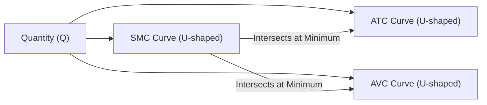
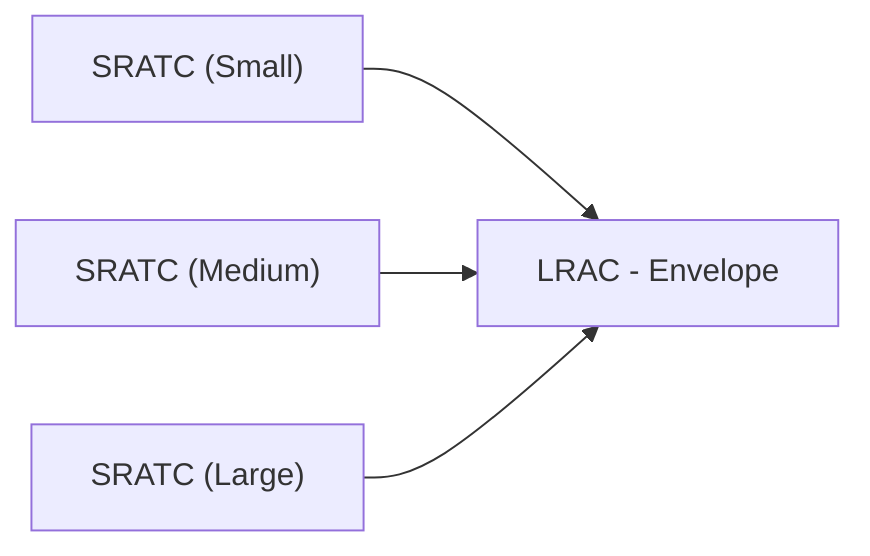

## Background and Context

When we talk about cost curves in microeconomics, we’re essentially painting a picture of how a firm’s total costs vary with its level of output. Over different time horizons, businesses face different constraints—and these constraints shape their cost structures. The short run is the period in which at least one factor of production (often plant size or capital equipment) is fixed, whereas the long run is the period in which all factors are variable. Understanding how costs behave under these different time frames helps firms determine their optimal level of production and plan strategic decisions about capacity, technology, and expansion.

I visited a small textile factory once—let’s call it “EverGreen Textiles”—that had just invested in a massive loom. This loom was so big that, in the short run, they really couldn’t upgrade or replace it without incurring significant downtime and capital costs. Yet they could freely hire more workers if orders suddenly spiked. That’s the short run: some inputs fixed (the loom), others variable (the labor). Fast forward a few years, the company decided to move to a bigger facility with fully automated weaving technologies. Now everything was on the table. That’s the long run: all factors variable. In what follows, we’ll apply this intuitive difference to the formal study of short-run and long-run cost curves.

## Key Principles of Short-Run Cost Curves

### Fixed and Variable Inputs in the Short Run
The short run is defined by the presence of at least one fixed input—typically capital (machinery, factory size, specialized equipment). Because this large piece of capital cannot be adjusted instantly, the firm’s capacity stays limited over the short-run horizon. Labor and raw materials are variable inputs: the firm can add or remove these quickly to accommodate changes in demand.

### Cost Components in the Short Run
Short-run costs can be broken down into:

• Fixed Costs (FC): Costs that do not vary with output in the short run. These often include depreciation, rent, and basic administrative overhead.  
• Variable Costs (VC): Costs that change with output, such as direct labor and raw materials.  
• Total Cost (TC): FC + VC.  

We define Average Total Cost (ATC) as:

(1)  

\text{ATC} = \frac{\text{Total Cost (TC)}}{\text{Quantity (Q)}}


Also, Average Variable Cost (AVC) is:

(2)  

\text{AVC} = \frac{\text{Variable Cost (VC)}}{\text{Quantity (Q)}}


The short-run Marginal Cost (SMC) is the change in total cost resulting from producing one more unit of output:

(3)  

\text{SMC} = \frac{\Delta \text{TC}}{\Delta \text{Q}}


### U-Shape of the Short-Run Average Cost Curves
For many firms, the short-run average cost curves (SAC)—specifically the Average Total Cost (ATC) and Average Variable Cost (AVC)—tend to have a U-shape. Early on, cost per unit decreases as production ramps up because of better utilization of fixed resources and labor specialization. Eventually, however, diminishing marginal returns set in—labor and other variable inputs become less efficient due to overcrowding or limited machinery—and the average cost per unit goes back up.

### Relationship Between SMC and SAC
Here’s a classic rule of thumb: the short-run marginal cost curve typically intersects the short-run average total cost curve at its minimum point. Why? Because when marginal cost is below the average cost, it pulls the average cost down; as soon as marginal cost goes above average cost, it starts pulling it up.

A quick illustration: If you scored consistently 82 on exams (your average), and then suddenly you score 90 (marginal), your average rises. But if your next score is 75, then your average begins to decline. The same principle applies to production costs.

Below is a simple Mermaid.js diagram showing the typical shape of short-run cost curves:

Notice how the marginal cost (SMC) curve cuts both the ATC and AVC at their respective minimum points.

## Transition to the Long Run

In the long run, no factor of production remains fixed. Firms can change their product lines, expand into new facilities, invest in advanced automation, or even exit a market altogether. Essentially, the firm can choose the scale (or size) of its business that minimizes its costs for each level of output. 

### The Long-Run Average Cost (LRAC)
The LRAC curve is like a smooth envelope that wraps around all possible short-run average cost curves, each corresponding to a different fixed plant size. For each output level, the firm chooses the plant size (and capital usage) that yields the lowest average cost. As a result, in the long run, we see an even more efficient cost frontier.

In simpler terms, imagine the factory in “EverGreen Textiles” could be small, medium, or large, each with its own short-run average cost curve. The long-run average cost curve picks the optimal scale of production for each quantity. If you plot all possible short-run curves for each scale, the LRAC tangentially touches (or “envelops”) them at the minimum points.

Here’s another Mermaid.js diagram to visualize:

Each short-run curve (SRATC) indicates a different factory size. The LRAC is the “envelope” that shows the best possible cost at each production level when the firm can switch among small, medium, or large plants.

## Economies, Diseconomies, and Constant Returns to Scale

### Economies of Scale
Economies of scale refer to declining long-run average costs as the firm increases its output. Picture a large retailer that can negotiate better prices with suppliers by purchasing in bulk. The more it produces, the more it can spread fixed costs—like marketing or R&D—over a larger output base. Some driving factors behind economies of scale include:  
• Specialization of labor and management.  
• Greater efficiency of larger machinery or processes.  
• Bulk purchases of inputs at discounted rates.  
• Spreading of overhead costs (e.g., R&D, advertising) over more units.

In formulaic terms, if a firm doubles all inputs (labor, capital, etc.) and more than doubles its output, it exhibits economies of scale.

### Diseconomies of Scale
At some point, however, as the firm expands further, complexity and inefficiencies can creep in:  
• Communication breakdowns grow as organizational layers increase.  
• Top management might lose insight into local issues.  
• Logistics become more cumbersome.  

If doubling inputs results in less than double the output, we have diseconomies of scale—and an upward slope in the LRAC beyond a point.

### Constant Returns to Scale
Between these two extremes often lies a region in which doubling inputs precisely doubles outputs, making the LRAC flat for a range of output. This is known as constant returns to scale. It represents an output range in which expanding the business does not bring significant new advantages or disadvantages.

## Marginal Cost in the Long Run
In the long run, marginal cost depends on the flexibility of varying all inputs. Firms can build or dismantle capacity to optimize production. Many advanced manufacturing facilities, especially with modular designs or “just-in-time” strategies, can keep marginal costs relatively stable. If technology shifts (e.g., introduction of robotics), the entire LRAC can move down, letting the firm enjoy a new, lower cost frontier.

## Technological Change and Shifts in Cost Curves
Process innovations—like automation, advanced software, or specialized production techniques—push cost curves downward by reducing the variable cost per unit or the required fixed costs. A technology upgrade might reduce labor requirements or enhance productivity per unit of capital. Over time, as more firms adopt efficient technology, competitive pressures generally shift industry cost structures.

## Practical Applications and Capacity Planning

### Expansion Decisions
Managers often grapple with the question: “Do we expand now or wait for better technology?” If current demand growth justifies an expansion, but a new technology is around the corner promising a significant drop in average cost, the firm faces a balancing act. It might maintain smaller-scale short-run operations until the new technology matures, then adopt it to achieve a lower LRAC.

### Optimal Scale of Production
In the short run, you might operate on a suboptimal point of the cost curve because you're stuck with existing capital. In the long run, you can choose the optimal scale that aligns with production targets. If you anticipate demand to stabilize at a higher level, it might be worth moving to a bigger (and more capital-intensive) operation, provided you remain in that economies-of-scale region.

### Real-World Thoughts
It’s easy to be lured by the idea of “bigger is always better,” but real-world examples demonstrate that size can breed inefficiency. Many massive conglomerates eventually spin off (or break apart) divisions to concentrate on core synergies. They realize that managing everything under one roof can become unwieldy and lead to coordination failures—classic diseconomies of scale.

## Putting It All Together for CFA® Candidates
For individuals preparing for the CFA® exams—especially at Level I—mastering cost structures is crucial for analyzing firm profitability, competitive positioning, and valuation. Here are some important connections:

• In equity valuation, cost structure analysis feeds into margins and profitability forecasts.  
• In credit analysis, understanding cost curves helps an analyst gauge how easily a firm can cover its fixed obligations, even with fluctuations in demand.  
• It also overlaps with non-financial metrics like capacity utilization, which you might have seen in our discussion of business cycles (see Section 3.7 in this volume).  

On exam questions, you may be shown typical cost curves and asked to identify points of equilibrium, or how a shift in technology influences cost structures over time. Familiarize yourself with the shape and behavior of these curves—they’re integral to standard microeconomics and frequently appear in item-set or scenario-based problems.

## Exam Tips and Strategies
• Recognize that short-run curves revolve around the presence of at least one fixed factor. Examine where SMC crosses SAC.  
• For the long-run viewpoint, remember that all factors are variable. The LRAC “envelopes” all short-run curves.  
• Identify economies of scale versus diseconomies of scale in both conceptual (qualitative) and numeric (quantitative) contexts.  
• Watch out for tricky question wording: the exam might show you graphs of average costs at different scales. Be prepared to pick the LRAC.  
• Keep an eye out for technology shifts: If you see an explicit improvement in manufacturing methods, expect a downward shift in the cost curves.  

## References for Further Study
• Varian, H. R. (2019). Intermediate Microeconomics: A Modern Approach (9th ed.). W.W. Norton & Co.  
• Besanko, D., & Braeutigam, R. (2020). Microeconomics (6th ed.). Wiley.  

Additional courses on cost accounting and managerial economics can also provide deeper insights. Understanding these fundamentals sets a solid base for advanced analysis in financial modeling and equity research.

---

## Short-Run and Long-Run Cost Curves: Practice Exam Questions



### Which statement best describes the short run in production?

- [ ] All inputs can be varied immediately.
- [x] At least one input remains fixed and cannot be adjusted.
- [ ] Marginal cost equals average total cost at the highest point.
- [ ] The firm cannot hire additional labor during this period.

> **Explanation:** In the short run, at least one factor of production—usually capital (plant capacity)—is fixed, while others (such as labor or raw materials) can be varied.

### In the short run, where does the marginal cost curve (SMC) typically intersect the short-run average total cost curve (ATC)?

- [ ] At the maximum of the ATC curve.
- [x] At the minimum of the ATC curve.
- [ ] They do not intersect at any point.
- [ ] Exactly at the same level as the firm’s fixed costs.

> **Explanation:** The short-run marginal cost curve (SMC) generally intersects both the average total cost (ATC) and average variable cost (AVC) curves at their minimum points.

### What happens to the long-run average cost (LRAC) when a firm experiences economies of scale?

- [ ] The LRAC curve remains completely flat.
- [ ] The LRAC curve shifts upward.
- [x] The LRAC curve slopes downward as output increases.
- [ ] The LRAC curve cannot be measured.

> **Explanation:** Economies of scale mean that as production increases, average costs decrease, causing the LRAC to slope downward in that output range.

### If a firm doubles all of its inputs and output less than doubles, it is most likely experiencing:

- [ ] Economies of scale.
- [ ] Constant returns to scale.
- [x] Diseconomies of scale.
- [ ] Increasing marginal returns in the short run.

> **Explanation:** When proportional increases in inputs lead to a less-than-proportional increase in output, the firm is experiencing diseconomies of scale.

### Which of the following factors could cause a firm’s long-run cost curves (LRAC) to shift downward over time?

- [x] Technological improvements.
- [ ] Higher interest rates on loans.
- [x] Process innovations in manufacturing.
- [ ] Scenario-based budgeting.

> **Explanation:** Advances in technology reduce the unit cost of production, shifting LRAC downward. Similarly, innovations in processes can achieve better productivity.

### In deciding whether to expand its production capacity in the long run, a firm should primarily consider:

- [x] Whether the new capacity leads to a lower average cost for the expected level of output.
- [ ] The fact that demand will remain constant indefinitely.
- [ ] Maximizing short-run average total cost.
- [ ] Abandoning existing capital to minimize fixed costs.

> **Explanation:** In the long run, the firm systematically evaluates whether the new facility or capitalization reduces costs over its expected production range. This is a key factor in expansion decisions.

### At what point on the short-run average total cost curve does the marginal cost (MC) equal average total cost?

- [x] The minimum point of the ATC curve.
- [ ] The maximum point of the ATC curve.
- [x] The point where AVC equals ATC.
- [ ] The point of diminishing marginal returns.

> **Explanation:** MC intersects ATC at the ATC’s minimum point. Note that at that output level, ATC is also at its lowest, and MC can intersect AVC at its minimum, but AVC generally lies below ATC.

### Which of the following does NOT typically result from diseconomies of scale?

- [x] Lower overall unit costs.
- [ ] Increased complexity in management.
- [ ] Inefficient use of resources.
- [ ] Higher long-run average costs.

> **Explanation:** Diseconomies of scale are associated with higher costs and complexity, not lower unit costs.

### In the short run, which costs remain constant regardless of the output produced?

- [x] Fixed costs.
- [ ] Variable costs.
- [ ] Total costs.
- [ ] Marginal costs.

> **Explanation:** By definition, fixed costs do not vary with output in the short run (e.g., rent on a factory, contractual obligations).

### True or False: The long-run average cost (LRAC) curve is derived as the upper boundary of a firm’s series of short-run average total cost curves, each corresponding to a different plant size.

- [ ] True
- [x] False

> **Explanation:** The LRAC is the “lower envelope” of a series of short-run curves, not the upper boundary. It picks the minimum points of those short-run curves and thus rests below them.


