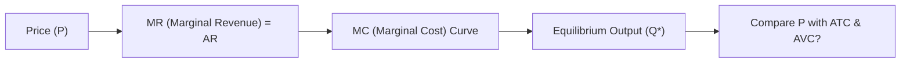
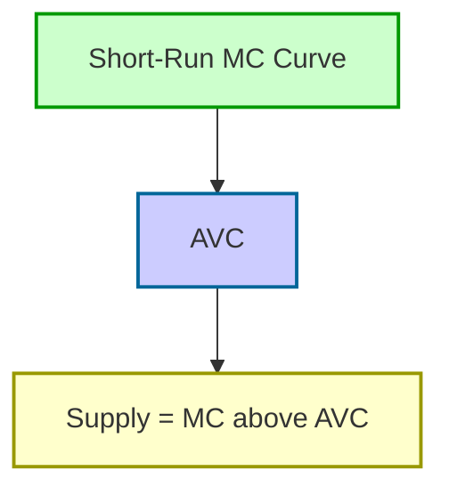

## Overview and Key Concepts

Perfect competition is one of those classic economic models that, for many learners, can spark a moment of awe: "Wait—there are so many firms that no one can set the price?" Indeed, the hallmark of perfect competition is that every participant takes the market price as given, acting as a price taker rather than a price maker. This model might seem a bit idealized, but it’s super powerful for giving us a benchmark of how markets can operate under conditions of full competition, free entry, and zero economic profit in the long run.

Below, we’ll explore the defining characteristics and assumptions behind perfect competition, short-run and long-run equilibrium conditions, and how this model informs our broader understanding of industry organization, economic efficiency, and even how we might estimate a firm’s competitive environment when performing company or sector analysis for portfolio selection.

## Basic Characteristics

In a perfectly competitive market:

• Many buyers and many sellers. No single participant is large enough to shift the market supply or demand curve on their own.  
• Homogeneous products. In other words, every firm’s product is virtually identical, so consumers are indifferent about which firm they buy from.  
• Perfect information. All market participants instantly know relevant factors like prices, available technology, and cost structures.  
• Free entry and exit. Firms can enter the market if they see profitability and exit if conditions become unprofitable, without major regulatory or capital barriers.  
• Firms are price takers. Each firm must accept the going market price determined by the collective forces of supply and demand.

These assumptions might feel quite strict—and they are. In real life, you’ll struggle to find a market that’s purely and perfectly competitive, but certain agricultural markets (for example, unbranded wheat or corn) can come close. 

From an investment standpoint, analyzing a nearly perfectly competitive industry can help you anticipate whether a firm has any sustainable edge. If the industry approximates perfect competition, it’s extremely tough for any single firm to maintain supernormal profits over time.

## Short-Run Equilibrium

### Price = Marginal Cost

In the short run, a perfectly competitive firm maximizes profit (or minimizes loss) by producing where price (P) equals marginal cost (MC), provided that P is at least as large as the average variable cost (AVC). This condition arises because each firm takes the price as given, then solves:

P = MC

Marginal cost is generally upward sloping after a certain point, reflecting diminishing marginal returns to production when at least one factor of production (often capital) is fixed. In short-run equilibrium:

1. If P ≥ Average Total Cost (ATC), the firm is making a profit.  
2. If AVC ≤ P < ATC, the firm is making a loss but will continue to operate in the short run (since it still covers variable costs and some portion of fixed costs).  
3. If P < AVC, the firm will shut down production in the short run (since it can’t even cover variable costs).

### Numeric Example: Short-Run Decision

Suppose a small wheat farm faces a market price of $5 per bushel. The farm’s short-run costs are:  
• AVC = $4 per bushel  
• ATC = $6 per bushel  
• MC = $5 per bushel at optimal output  

Since P = $5 and MC =$5, the farm will produce at the point where its marginal cost curve intersects $5. However, because ATC is $6, the farm is incurring a loss of $1 per bushel. Yet it continues to produce in the short run because $5 > AVC of $4, which allows it to at least cover all variable costs and part of the fixed costs.

## Long-Run Equilibrium

### Zero Economic Profit

One of the most elegant aspects of perfect competition is how the market self-corrects in the long run. If firms start earning profits above normal profit (i.e., supernormal profit), new entrants flood in, increasing total industry supply and pushing the market price downward. Over time, this process kills off the excess profit margin, eventually bringing the price down to the point where:

P = ATC = MC (at the minimum of the long-run average cost curve)

At this equilibrium, each firm earns zero economic profit (but still could be earning an accounting profit sufficient to keep running—this is often referred to as a "normal profit"). Conversely, if firms face persistent losses, some will exit, reducing market supply and increasing market price until losses disappear. The dynamic ensures that in the long run, perfectly competitive firms tend to produce at a point where they’re just breaking even in economic terms.

### Graphical Representation

To visualize the typical firm in a perfectly competitive market, consider the following Mermaid diagram of short-run cost curves:

• The firm takes the price as its marginal revenue (MR).  
• It produces where MR = MC.  
• It then checks whether the price is sufficient to cover average total cost (ATC) or at least average variable cost (AVC).  

In the long run, the equilibrium price ends up at the minimum of the long-run average cost (LRAC) curve, meaning each firm operates at its most efficient scale.

## Firm’s Short-Run Supply Curve

In perfect competition, the firm’s short-run supply curve is the portion of its marginal cost curve that lies above the AVC. Below the AVC, the firm won’t produce at all because it can’t even cover its variable costs. This portion of the MC curve is typically upward sloping, reflecting diminishing marginal returns in the short run.

## Efficiency Implications

### Allocative Efficiency

Allocative efficiency means price equals marginal cost (P = MC). Because firms produce where P = MC, the resulting market output precisely reflects consumer preferences. We don’t have unexploited gains from trade: the goods (and resources) flow to where they’re valued the most in consumption, given the existing technology and capital.

### Productive Efficiency

Perfect competition also fosters productive efficiency. In the long run, price equals the minimum possible average cost. Firms that can’t produce at this efficient scale either exit or adapt. Taken together, these twin efficiencies (allocative and productive) make perfect competition an ideal reference point for evaluating how resources might be best distributed across the economy.

## Impact of Shifts in Demand or Cost

Firms in a competitive market respond swiftly to changes in demand or input costs:

• Demand Increases: If market demand surges, price initially rises, existing firms enjoy supernormal profits, and new firms enter until the price drifts back to the long-run equilibrium.  
• Demand Decreases: If demand falls, price drops below cost, some firms exit, and the market supply decreases until the price moves back up to the long-run equilibrium.  
• Technological Improvements: Innovations shift the cost curves downward, enabling firms to produce at a lower cost. Price may decrease in the long run as more efficient firms enter, driving less efficient firms out.  

In a sense, the perfect competition framework gives a quick mental model of how supply expands or contracts with minimal friction—though in real markets, there are always some barriers to resource mobility and knowledge transfer.

## Real-World Context and Portfolio Implications

Now, we know real-world markets aren’t typically this ideal. Companies differentiate products, build brands, and erect barriers to entry. Still, the perfect competition model is extremely useful for:

• Benchmarking. It helps us assess whether an industry’s competitive pressures resemble the ideal “price-taking” conditions. If so, you can expect tight profit margins and minimal power to raise prices.  
• Strategy Analysis. When analyzing an industry with minimal product differentiation, expect minimal ability to sustain supernormal profits. Any firm that tries raising its price above market equilibrium will quickly lose customers.  
• Strategic Positioning. In industries close to perfect competition, many managers try to create some product differentiation (e.g., brand identity) or reduce costs via new technology—often to escape the trap of zero economic profit.

For CFA® Level I candidates and higher levels alike, understanding perfect competition is fundamental to analyzing how competition intensity shapes pricing power, profit margins, and cash flow forecasts in valuation models.

## Exam Relevance and Best Practices

At advanced levels (including the Level III exam for portfolio management), the perfect competition model may appear in item sets or constructive-response questions that probe your understanding of:
• Industry structure and its impact on risk.  
• Economic drivers of corporate profitability.  
• Scenarios where a shift in demand/cost changes valuations across competitive industries.  

As you integrate macro and micro factors in your forecasts, you might see how perfect competition explains why some cyclical or commodity-like industries revert quickly to normal returns. Being able to identify where a targeted company sits on the spectrum of market power can guide your decision-making in portfolio construction and risk management.

Here are a few tips for exam readiness:  
1. Master the cost curves (especially MC, ATC, and AVC). Understand precisely how short-run decisions hinge on covering variable costs, while long-run conditions revolve around covering total costs.  
2. Remember that zero economic profit is not the same as zero accounting profit. It means the firm is covering all implicit and explicit costs, including the opportunity cost of capital.  
3. In scenario questions, focus on whether new firms can enter or exit freely. This determines the speed at which supernormal profits get eroded.  
4. Use the supply = MC (above AVC) concept to map out short-run decisions for item set scenarios.

## References and Additional Reading

1. McConnell, C. R., Brue, S. L., & Flynn, S. M. (2018). Microeconomics: Principles, Problems, & Policies. McGraw-Hill Education.  
2. Khan Academy. Perfect Competition. (https://www.khanacademy.org/economics-finance-domain/microeconomics/perfect-competition-topic)  
3. CFA Institute Level I Curriculum. Economics. Official Readings on Market Structures.  
4. Pindyck, R. S., & Rubinfeld, D. L. (2017). Microeconomics. Pearson Education.  

--------------------------------------------------------------------------------

## Test Your Knowledge: Perfect Competition Fundamentals



### In a perfectly competitive market, which of the following statements best describes a firm's price-setting behavior?

- [ ] Each firm sets a price above its marginal cost curve to maximize profit.
- [ ] Firms can charge a higher price due to differentiated products.
- [x] Each firm acts as a price taker, accepting the market price.
- [ ] Monopolistic firms coordinate to fix higher prices.

> **Explanation:** A key assumption in perfect competition is that no individual firm is large enough to influence the market price. Hence, they must accept the equilibrium price determined by all firms’ collective supply and the overall market demand.

### Which condition indicates that a perfectly competitive firm should shut down production in the short run?

- [ ] Price is higher than average fixed costs.
- [ ] Price equals average total cost.
- [ ] Price is equal to marginal cost.
- [x] Price is below average variable cost.

> **Explanation:** If the market price cannot even cover average variable costs, the firm loses more by producing than by shutting down. Staying open would increase losses since fixed costs plus part of variable costs aren’t being covered.

### What is generally true about economic profits in a perfectly competitive market in the long run?

- [x] They tend toward zero as new firms enter or incumbent firms exit.
- [ ] They remain high if the firm operates above average fixed costs.
- [ ] They form a barrier that prevents new firms from entering.
- [ ] They get sustained indefinitely due to product homogeneity.

> **Explanation:** In the long run, free entry and exit erode supernormal profits, pushing the price to the point where each firm earns normal profits (i.e., zero economic profit).

### Which best describes the firm’s short-run supply curve in perfect competition?

- [ ] The entire marginal cost curve.
- [x] The marginal cost curve above the average variable cost curve.
- [ ] The average total cost curve above the marginal cost curve.
- [ ] The average fixed cost curve when price is above AVC.

> **Explanation:** In the short run, a firm will supply along its MC curve only in that region where price is above AVC, ensuring variable costs are covered.

### If the current market price exceeds average total cost for a typical perfectly competitive firm, which of the following is most likely?

- [ ] Firms are incurring high variable costs and should shut down.
- [ ] The firm is indifferent about producing and shutting down.
- [x] The firm is making supernormal profit.
- [ ] The firm is at breakeven point.

> **Explanation:** When price > ATC, the firm’s total revenue surpasses total costs, yielding a supernormal (economic) profit in the short run.

### In long-run equilibrium under perfect competition, which cost structure condition holds true?

- [ ] P = MC > ATC
- [ ] P < AVC
- [x] P = MC = ATC
- [ ] P > MC > ATC

> **Explanation:** Long-run equilibrium requires zero economic profit, which occurs at the point where price (P), marginal cost (MC), and average total cost (ATC) intersect at their minimum points.

### Which of the following outcomes underscores productive efficiency in perfect competition?

- [x] Firms operate at the minimum point of their average total cost.
- [ ] Firms increase brand loyalty to widen their margin.
- [ ] Market price equals average variable cost in the long run.
- [ ] Firms maximize profit by restricting output quantity.

> **Explanation:** Productive efficiency occurs when production takes place at the lowest possible cost, i.e., the minimum of the ATC curve.

### In a perfectly competitive market facing a permanent decline in demand, how do prices adjust in the long run?

- [ ] Prices remain constant if industry output is fixed.
- [x] Some firms exit, reducing supply, ultimately raising price to breakeven level.
- [ ] All firms keep producing, leading to large permanent losses market-wide.
- [ ] Firms collectively raise their prices to cover sunk costs.

> **Explanation:** If demand permanently falls, price initially dips below ATC for many firms. Those firms exit over time, reducing total supply. This process pushes the market price up to a level where the remaining firms can earn normal profit.

### The concept of “price taker” implies:

- [x] A firm has no control over the market price and must accept it.
- [ ] A firm can raise its price if it faces inelastic demand.
- [ ] Firms form cartels to set prices collectively.
- [ ] Prices are determined solely by government regulation.

> **Explanation:** Because each individual firm is so small relative to the total market, it must accept (take) the market price as given.

### Positive economic profit in a perfectly competitive industry attracts new entrants, eventually driving profit to zero. True or False?

- [x] True
- [ ] False

> **Explanation:** Under free entry and exit, new firms enter when ongoing firms realize supernormal profits, pushing industry supply up and driving market price down until profits are reduced to zero (economic profit).


