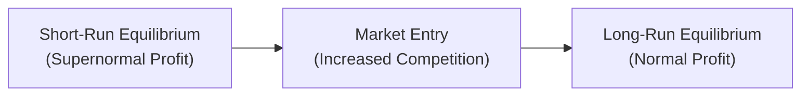

## Introduction

Monopolistic competition is one of those market structures that feels a bit like the “jack of all trades” in economic theory. You know, it’s a situation where you’ve got plenty of firms around, each selling products that are not identical but still do pretty similar things. Coffee shops are often cited as a classic example: sure, each café sells coffee, but one might emphasize organic beans, another might sell fresh-baked pastries, and a third might boast the world’s fastest Wi-Fi. Sound familiar?

From a financial analyst’s perspective, especially as you progress in your CFA journey, understanding how monopolistic competition works can clarify why certain firms maintain mild pricing power even with lots of competitors around. In this article, we’ll explore key features, discuss short-run vs. long-run equilibria, and link these insights to broader topics like advertising, brand loyalty, and the quest for sustainable profits. And we’ll do it with an informal lens—because real life doesn’t always stick to a neat, purely theoretical explanation.

## Core Features of Monopolistic Competition

Many Sellers, Differentiated Products  
It’s sometimes said that under perfect competition, you have many small sellers but with undifferentiated (identical) products. But in monopolistic competition, products have distinguishing features—branding, style, even a unique twist on the same good (like strawberry-infused coffee flavors, for instance). Why does it matter? Because differentiation gives each firm its own downward-sloping demand curve. It can raise its price a bit without losing all its customers, thanks to that slight uniqueness.

Price-Making Ability  
In a perfectly competitive market, firms are price takers. In monopolistic competition, by contrast, each firm has a little bit of wiggle room on price. However, this wiggle room is no blank check. If a firm tries to charge excessively high prices, consumers will switch to plenty of similar alternatives.

Entry and Exit  
Here’s the thing: if you found the “perfect” coffee recipe and started making hefty profits, it wouldn’t be long before more coffee shops appeared. With low barriers to entry, supernormal profit draws in new entrants eager to earn a share of that tasty margin. Over time, this means those profits get whittled down.

Non-Price Competition  
Firms in monopolistic competition often invest heavily in advertising, product features, service, packaging, or anything they think will set them apart. Don’t underestimate the power of these intangible factors to shift your demand curve. Customers might pay a small premium if they truly believe your coffee is special—be it the foam art or that genuine grin from the barista.

## Short-Run Equilibrium

In the short run, firms in monopolistic competition could earn supernormal (sometimes called abnormal) profits if there’s still room in the market for more variety or better features. Picture a new gourmet dessert café that opens up in a town starved for novelty. In that short run, the café might price its crêpe-and-cappuccino combo at a premium, capturing robust margins.

Graphically, each firm’s demand curve slopes downward. The marginal revenue (MR) curve also slopes downward, lying below the demand curve. The firm chooses output (Q*) where MR = MC (marginal cost). If the average total cost (ATC) at that output is below the price, the firm pockets an economic profit.

Anyway, it’s not all sunshine forever. This scenario sets the stage for new entrants who smell opportunity. More cafés pop up, and the original dessert café’s tasty margins begin to shrink. If you’re the existing café owner, you either adapt (improve your brand, tweak your products) or accept fewer customers at your original premium price.

Below is a simplified diagram illustrating how short-run supernormal profit eventually triggers additional market entry:

## Long-Run Equilibrium and Excess Capacity

A key highlight: in the long run, monopolistic competition tends toward normal profit. Firms still have a downward-sloping demand curve (unlike perfect competition), but as more rivals join the scene, each individual demand curve shifts leftward—fewer customers for each existing player.

At some point, price equals average total cost, meaning firms earn zero economic profit (though they might be profitable in an accounting sense). Because of product differentiation, firms don’t produce at the lowest point on their average total cost curve. This phenomenon is called “excess capacity.” Firms operate slightly below their minimum efficient scale since they’re trying to maintain brand identity and variety in the market.

If, for instance, your café only has partial seating filled most of the day, that’s excess capacity in action—typical in monopolistic competition. It’s not efficient in the pure economic sense (like perfect competition would be), but it caters to heterogeneous consumer tastes.

## Advertising, Brand Loyalty, and Non-Price Competition

It’s nearly impossible to cover monopolistic competition without talking about advertising. In a more personal anecdote, I recall once visiting a small coffee shop that specialized in single-origin beans and hand-labeled jars to highlight “eco-friendly supply chains.” They plastered the local bus stops with ads emphasizing their farmer relationships. This marketing move not only differentiated them from the competition but also created brand loyalty.  

In a broader sense, advertising can reduce price elasticity if done effectively—meaning customers become less likely to switch to a competitor at small price hikes. It also creates a bit of an entry barrier: new entrants must invest heavily to signal quality or secure a market presence. But let’s be frank, there’s no permanent fortress just through advertising alone. If the product is truly subpar, customers eventually catch on.

Another route for differentiation is product quality. From a finance viewpoint, firms sometimes face strategic decisions about capital allocation: do they invest in advanced equipment to improve quality, or do they cut costs to broaden margins? Each approach shapes how the firm’s demand curve stands up against competition.

## Monopolistic Competition vs. Other Market Structures

To put this in context, here’s a brief comparison among perfect competition, monopolistic competition, and monopoly.  

| Feature                   | Perfect Competition        | Monopolistic Competition           | Monopoly                                  |
|---------------------------|----------------------------|-------------------------------------|--------------------------------------------|
| Number of Firms           | Many                       | Many                                | One                                        |
| Product Differentiation   | None (homogeneous product) | Differentiated (features, branding) | Unique product, no close substitutes       |
| Demand Curve for Firm     | Perfectly elastic          | Downward-sloping                    | Downward-sloping but entire market demand |
| Barriers to Entry         | None or very low           | Low to moderate                     | High (legal, economic, or resource-based) |
| Long-Run Profits          | Normal only                | Normal only                         | Can sustain supernormal                    |
| Efficiency                | Productively and allocatively efficient | Some inefficiency; excess capacity | Potentially large inefficiency (deadweight loss) |

Monopolistic competition feels like the middle sibling—standing between the extreme perfection of many identical firms and the single giant in a monopoly. Each structure has distinct implications for pricing, output, consumer choice, and firm strategy.  

## Investment Analysis and Practical Implications

As a future CFA charterholder, you might wonder: “So how does this market structure inform an investment decision?” Well, first, analyzing a company’s brand loyalty and pricing power can hint at whether it has a durable moat (albeit smaller than a monopoly’s). A firm in a crowded sector that draws consistent demand at slightly higher prices might have intangible brand assets—a potential sign of stronger equity valuations.

Moreover, in an economic cycle upswing, differentiated firms that spent heavily on marketing could gain supernormal profits in the short run. Yet, if the industry has weak barriers to entry, watch for negative profit drift in the long run. This dynamic might appear in distressed-credit analyses, where you’re looking at the sustainability of a firm’s margins.  

Monopolistic competition can also matter for sector rotation strategies. Industries that thrive on product differentiation (apparel, consumer electronics) often see rapid “in-out” entry, with profits caught in a cycle. If your goal is to hold these for the long haul, keep an eye on brand equity, marketing spend, and intangible assets.

## Potential Pitfalls, Exam Tips, and Key Takeaways

• Firms appear to have some market power, but it’s always under threat from new entrants.  
• In the short run, you can have supernormal profits, but in the long run, those squeeze down to normal.  
• Despite zero economic profit in the long run, consumers pay slightly more than they would in perfect competition, and firms hold some idle capacity—giving rise to potential inefficiencies.  
• Advertising and brand loyalty are potent but not foolproof. They create partial barriers and can encourage non-price competition.  
• On the exam, be ready to explain how these features differ from perfect competition or oligopoly. You might see an item set describing a company with brand perks, or a scenario about fresh entrants cutting down a once-profitable player’s margins.  

When you tackle exam questions, look out for references to “differentiated product,” “many sellers,” “downward-sloping demand,” or “low barriers to entry.” These are typical code words for monopolistic competition. Also, your question might delve into how equilibrium is reached in the long run. The sweet spot is to identify when marginal revenue equals marginal cost and how that relates to average cost in both the short and long runs.

## References

- Perloff, J. M. (2018). Microeconomics (8th ed.). Pearson.  
- Schmalensee, R. (1982). Product Differentiation Advantages of Pioneering Brands. American Economic Review, 72(3), 349–365.  

## Practice Questions: Monopolistic Competition Essentials



### A firm in a monopolistically competitive industry faces a downward-sloping demand curve primarily because:  
- [ ] industry supply is very inelastic.  
- [x] its product is differentiated from those of its competitors.  
- [ ] it has a patent on its production process.  
- [ ] barriers to entry are extremely high.  

> **Explanation:** Under monopolistic competition, product differentiation gives the firm its own unique demand curve. Even with many competitors nearby, the firm holds some pricing power thanks to the uniqueness of its offering.

### In the short run, a monopolistically competitive firm may earn economic profits if:  
- [ ] it can perfectly price discriminate.  
- [ ] marginal cost exceeds average total cost.  
- [ ] market demand is perfectly elastic.  
- [x] the price it charges exceeds average total cost.  

> **Explanation:** If the firm sets its price above average total cost at the quantity where MR=MC, it earns an economic (supernormal) profit in the short run.

### What most accurately describes the long-run outcome of firms in monopolistic competition?  
- [ ] Permanent supernormal profits due to brand loyalty.  
- [ ] Zero economic profit and production at minimum average total cost.  
- [ ] Negative economic profit unless there is collusion.  
- [x] Zero economic profit but production at less-than-minimum average total cost.  

> **Explanation:** Long-run competition drives economic profit to zero and results in excess capacity. Firms operate below the efficient scale.

### Which characteristic distinguishes monopolistically competitive firms from perfectly competitive firms?  
- [x] Differentiated products with some control over price.  
- [ ] No barriers to entry.  
- [ ] Many buyers and many sellers.  
- [ ] All firms produce at minimum average cost.  

> **Explanation:** Both types of markets can have many sellers and relatively low entry barriers, but the key difference lies in product differentiation and the corresponding price-making ability.

### Excess capacity in monopolistic competition refers to:  
- [ ] firms producing more than the socially optimal output.  
- [ ] the market having too many firms to operate efficiently.  
- [ ] shortages leading to high marginal costs.  
- [x] firms operating below the minimum point on their average total cost curve.  

> **Explanation:** Because each firm’s output is less than at the minimum efficient scale, we say there's excess capacity. It’s a known inefficiency in monopolistic competition.

### A key motivation for advertising in a monopolistically competitive market is to:  
- [x] shift the firm’s demand curve to the right and make it less elastic.  
- [ ] reduce the marginal cost of production.  
- [ ] ensure zero economic profit in the short run.  
- [ ] increase barriers to exit for incumbents.  

> **Explanation:** Ads can appeal to new customers (shifting demand outwards) and build brand loyalty so that customers are less sensitive to price changes.

### When new firms enter a monopolistically competitive market:  
- [ ] the original firms’ demand curves shift outward.  
- [ ] average total cost decreases for all firms.  
- [x] the demand curves faced by existing firms shift inward.  
- [ ] the existing firms’ products become perfect substitutes.  

> **Explanation:** More entrants typically capture some market share, causing each incumbent firm's demand curve to shift inward.

### Which of the following can sustain a firm’s economic profit over the long run in a monopolistically competitive market?  
- [ ] Inability of competitors to produce at the same cost.  
- [x] Strong product differentiation and brand loyalty that newcomers cannot easily replicate.  
- [ ] The firm’s monopoly power over production resources.  
- [ ] A legally enforced patent on generic production methods.  

> **Explanation:** Though zero economic profit is the typical long-run outcome, some firms can retain a measure of economic profit if they continually innovate or maintain brand loyalty that new entrants struggle to match.

### In the long run, monopolistic competition is less efficient than perfect competition because:  
- [ ] profit margins remain high, causing overinvestment.  
- [x] firms operate with excess capacity and charge a price above marginal cost.  
- [ ] the marginal revenue curve is perfectly elastic.  
- [ ] demand is entirely determined by price competition.  

> **Explanation:** The nature of product differentiation and brand loyalty leads to excess capacity and a price above MC, resulting in allocative and productive inefficiencies.

### Under monopolistic competition, which statement is true?  
- [x] True  
- [ ] False  

> **Explanation:** Firms in monopolistic competition can differentiate their products through brand loyalty, advertising, and unique features, giving them slight pricing power.  


