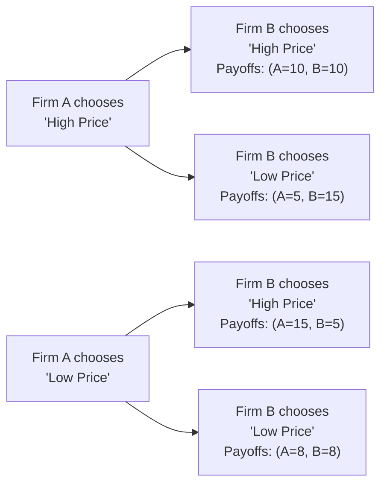

## Overview

Oligopoly is a fascinating market structure dominated by a handful of firms—enough to significantly influence one another’s decisions but still few enough that each firm can keep track of rivals’ actions. Think airlines, auto manufacturers, and big telecom companies: these players know each other well, monitor each other’s moves, and sometimes (to be honest) fret over how a rival will respond to a new product launch or price change. This interdependence sets oligopoly apart from both perfect competition and outright monopoly. 

Because strategic interaction is at the heart of oligopolistic behavior, game theory becomes a critical tool in explaining and predicting how these firms behave. Game theory helps us map out possible outcomes based on the strategies chosen by each participant. In this section, we’ll explore key concepts like payoff matrices, Nash equilibrium, and repeated games, along with the classical models—Cournot, Bertrand, and Stackelberg—that offer different perspectives on how firms in oligopolies make decisions regarding output, pricing, and timing. We’ll also chat about the potential for collusion (sometimes known as forming a cartel), and why maintaining such a cartel is harder than it might seem at first glance.

## Key Characteristics of Oligopolies

Oligopolies are typically characterized by:

• A small number of large firms: Each firm holds significant market share.  
• Interdependence: Because each firm’s actions affect the others, strategic thinking is key.  
• High barriers to entry: These might be due to large capital requirements, patents, or brand loyalty, making it tough for new players to break in.  
• Potential for long-term profits: Firms in oligopolies can maintain above-normal profits more easily than those in more competitive markets, assuming they manage rivalry effectively.  
• Product differentiation (sometimes): Some oligopolies (e.g., the automobile industry) compete on features, brand, and special models. Others produce more standardized goods (e.g., oil or cement).

Recent discussions in the academic and regulatory world point out that oligopolies can lead to stable yet sometimes less dynamic markets; innovation might slow if mutual rival monitoring becomes too cozy. However, in other cases—especially with repeated competition on new product features—oligopoly firms can become extraordinarily innovative, each attempting to leapfrog the others.

## Strategic Interaction and Game Theory

### Rationale for Game Theory

If you’ve ever tried negotiating with a friend about who does the dishes, you’ll have a teeny taste of game theory: you’re each picking a strategy with a certain payoff (like a clean kitchen or more free time), and those payoffs depend not just on your own choice but on your friend’s decision, too. In corporate environments, the stakes can be enormous—millions or billions in profits hinge on whether to expand capacity, set a lower price, or launch a new product line. 

Game theory is the framework we use to analyze these kinds of strategic interactions. Here are a few essential concepts:

• Players: The firms (or decision-makers).  
• Strategies: The actions each firm can choose (e.g., price high vs. price low).  
• Payoffs: The profit or utility resulting from a specific combination of strategies.  
• Nash Equilibrium: A set of strategies where no player can unilaterally improve their payoff by changing their strategy. 

### Payoff Matrix Basics

A straightforward way to visualize game-theoretic scenarios is via a payoff matrix. Let’s take a simplified example in which two firms—Firm A and Firm B—each pick a price: High or Low. Suppose the payoffs (profits) look like this:

• If both choose High, each gets a payoff of 10.  
• If both choose Low, each gets a payoff of 8.  
• If A goes High but B goes Low: A=5, B=15.  
• If A goes Low but B goes High: A=15, B=5.  

In this hypothetical, the best collective outcome (both pick High) yields a payoff of (10,10). But each has the temptation to deviate to Low price if the other is staying High. This tension leads to interesting strategic debates in real industries: Do we keep our price high (and hope we all do the same) or try to capture a bigger slice of the market by lowering our price?

### Dominant Strategies and Nash Equilibrium

A dominant strategy is one that yields the best outcome for a player no matter what the other player does. In many interesting oligopoly settings, however, dominant strategies don’t always exist—and the final outcome is rather shaped by mutual best responses.

A Nash equilibrium is a profile of strategies where no player would unilaterally change their decision, given the other players’ strategies. In the above matrix, if both choose Low, neither can do better by switching alone. That outcome can become stable, even though (High, High) might produce a better payoff collectively.

## Collusion and Cartels

When multiple firms realize that competing aggressively can erode profits, they may be tempted to collude. Collusion (or cartel formation) involves a formal or informal agreement to:

• Set higher prices collectively.  
• Restrict output to create artificial scarcity.  
• Share market territories or production quotas.  

The key challenge? Cartels are inherently unstable. Suppose you and your competitor agree to keep prices high; each firm can discreetly profit by offering a slightly lower price to capture more market share—essentially cheating on the agreement. Over time, distrust or regulatory scrutiny typically unravels explicit cartels. This is precisely why official cartel agreements are often illegal in many jurisdictions. Even implicit collusion (also called “tacit” collusion) can draw regulatory attention, especially where firms signal pricing intentions or capacity constraints in ways that hamper competition.

## Oligopoly Models

Classical economic theory provides a few well-known models to formalize how oligopolists make decisions. Although these models simplify reality, they still offer valuable insight—and show up often in exam questions.

### Cournot Model (Quantity Competition)

In the Cournot model, firms choose their production quantities simultaneously, each assuming the other’s output is fixed for that decision cycle. Market price is determined by the total output. Typically, you have an inverse demand function such as:

P = a - b(Q₁ + Q₂),

where Q₁ and Q₂ are the quantities produced by Firm 1 and Firm 2 respectively. Each firm sets quantity to maximize its profit, given an assumption about the other’s quantity. 

• Best-response functions can be derived, such that each firm’s optimal quantity depends on the other’s quantity.  
• The Cournot-Nash equilibrium occurs where these best-response functions intersect.  

A concise form for a standard two-firm Cournot best response might look like:

Qᵢ* = (a - c - bQⱼ*) / (2b),

assuming both firms have constant marginal cost c and face the same demand parameters. Each firm’s quantity choice influences the equilibrium price. When more firms enter a Cournot market, the outcome tends to approach perfect competition over the long run (provided costs and products remain similar).

### Bertrand Model (Price Competition)

The Bertrand model focuses on price as the strategic variable, usually under the assumption of identical products with no capacity constraints. The notion is:

• Each firm chooses a price simultaneously.  
• Whichever firm offers a lower price captures the bulk of the market (assuming no brand loyalty and no product differentiation).  
• The result can be quite extreme: in the classic Bertrand model with identical products and constant marginal cost, the equilibrium price is often driven down to marginal cost (“Bertrand Paradox”), because each firm undercuts the other by a small amount to gain market share.

In reality, firms produce differentiated products and face capacity constraints or brand effects. Yet, the Bertrand model highlights how price competition can be fiercer than quantity competition if products are near-identical.

### Stackelberg Model (Leader-Follower)

The Stackelberg model adds a timing element to the Cournot framework: one firm (the leader) chooses its quantity first, and the other firm (the follower) observes that choice and then picks its quantity. 

• The leader can anticipate the follower’s best response and choose an optimal quantity accordingly.  
• The follower, knowing the leader’s output, picks the best quantity in response.  
• Typically, the leader secures a higher profit than it would under Cournot, while the follower lags behind due to the leader’s “first-mover advantage.”

Some real-life examples might be seen in industries where a single, well-established player makes major capacity investments first, forcing others to adapt around that capacity.

## Repeated Interaction and Tacit Collusion

In many industries, competition isn’t just a one-shot game—firms interact over multiple periods or years. Repeated interaction helps them learn about each other’s reliability and fosters an environment where firms might sustain some form of tacit cooperation:

• Trigger strategies: If you cheat on the collusive outcome once, your rival punishes you severely for many future rounds, making cheating less profitable.  
• Tit-for-tat: A firm can mimic its rival’s previous actions, cooperating if the rival cooperated in the last period, or punishing if the rival cheated.  

These strategies can sustain higher prices and more stable market shares than a single-shot game would predict. That said, the threat of punishment alone might not always be effective if future payoffs are discounted heavily or if external shocks (like new entrants or technological changes) disrupt the equilibrium.

## Real-World Examples

• Airlines: Pricing is highly visible, and capacity decisions (like buying more planes or scheduling additional routes) follow a Cournot-like logic. At the same time, fierce price discounts sometimes resemble Bertrand rivalry. That’s why you occasionally see sudden fare wars or matched price drops.  
• Automobiles: Major automakers each introduce new models and forecast what others will do. Leaders sometimes appear in electric vehicle development, with followers quickly adjusting strategies.  
• Telecommunications: A small set of providers typically competes on both price plans and technology investments. Ongoing price-matching or data bundling deals can mirror repeated-game strategies, where each provider tries to avoid destructive price wars over the long run.  

I once had a friend who worked in the telecoms sector, and every few months, they’d see new promotional plans pop up. Then, after carefully observing each other’s moves, all the competitors would “mysteriously” gravitate toward nearly identical rates. That’s classic oligopolistic maneuvering—everyone is closely watching, maneuvering, and occasionally prodding the competition, but no one wants to trigger a full-blown price war.

## Implications for Financial Analysis and Portfolio Management

As a financial analyst or portfolio manager, understanding oligopolistic dynamics can be quite useful:

• Profit forecasts rely on how stable the oligopoly is. If it descends into fierce price competition, profits can plummet.  
• Entry barriers and cost structures determine if new firms could flip the game’s balance.  
• Collusion or tacit coordination may keep prices high, leading to stable earnings in the short to medium term, but it also raises the risk of regulatory sanctions.  
• Merger and acquisition rumors are more common in oligopolistic industries, as a move from four major players to three, for example, can dramatically increase pricing power (and scrutiny).  

From a Level I CFA standpoint, you might not be asked to deeply solve for every equilibrium, but you should be familiar with the strategic nature of oligopolies and how game theory illuminates that strategic interplay. In actual investment decisions, it’s critical to gauge whether an industry has the potential to sustain profitable outcomes (through tacit or explicit coordination) or if price wars are likely to erupt, stifling returns.

## Common Pitfalls, Best Practices, and Exam Tips

• Don’t assume that one theoretical model (Cournot, Bertrand, Stackelberg) always applies. Real markets often have hybrid features—some capacity constraints, plus product differentiation, plus repeated interactions.  
• Watch out for the difference between the short-term equilibrium (where a firm might deviate from a cooperative arrangement) and the long-term strategies (where repeated play might encourage discipline).  
• Remember that cartels are inherently unstable and typically illegal, so while explicit collusion might yield high short-term profits, it’s fragile—and tested frequently in real markets and courtrooms.  
• On exams, if you’re asked to identify a Nash equilibrium, systematically check if any player can improve their payoff by unilaterally changing their strategy. If they can’t, you’ve found a Nash equilibrium.  
• If you see questions about pricing and identical products, think Bertrand. If you see quantity-based competition, think Cournot. If you see sequential moves, you’re likely dealing with Stackelberg.  

When tackling constructed-response or item-set questions, be sure to read the scenario carefully. Spot the relevant details: Are we dealing with quantity or price? Is there a mention of sequential timing? These clues help you determine which model or concept to apply. Time management tip: If you can quickly figure out the model, the subsequent analysis becomes a lot more straightforward.

## References

• Tirole, J. (1988). The Theory of Industrial Organization. MIT Press.  
• Dixit, A., & Nalebuff, B. (2010). The Art of Strategy: A Game Theorist’s Guide to Success in Business and Life. W.W. Norton & Company.  
• Official CFA Institute Curriculum, Economics sections on market structures and competitive behavior.  

## Test Your Knowledge: Oligopoly and Game Theory



### In an oligopoly, which of the following best describes firm behavior?

- [ ] They ignore the actions of other firms due to minimal competition.  
- [x] They closely monitor one another’s strategies and outcomes.  
- [ ] They typically operate as price takers in a perfectly competitive market.  
- [ ] They have no barriers to entry.  

> **Explanation:** By definition, oligopolistic firms recognize their mutual interdependence in pricing, output, advertising, and other strategic decisions.

---

### Which of the following is a common obstacle preventing stable long-term collusion in an oligopoly?

- [ ] Perfect information among all consumers.  
- [x] Incentives for individual firms to cheat on the agreement.  
- [ ] Low profit margins.  
- [ ] Government subsidies for new entrants.  

> **Explanation:** Collusion can break down because each firm can gain by secretly undercutting others, leading to cheating and eventual collapse of the agreement.

---

### In a standard two-player payoff matrix, a set of strategies where no player can improve their payoff by changing their strategy unilaterally is called:

- [ ] Dominant strategy.  
- [ ] Pareto optimum.  
- [x] Nash equilibrium.  
- [ ] Cooperative outcome.  

> **Explanation:** A Nash equilibrium occurs where each player’s chosen strategy is the best response to the other player’s strategy.

---

### Which model specifically examines competition based on output quantities decided simultaneously by firms?

- [ ] Bertrand model.  
- [x] Cournot model.  
- [ ] Stackelberg model.  
- [ ] Schumpeterian model.  

> **Explanation:** The Cournot model deals with simultaneous quantity competition. In contrast, Bertrand focuses on price, and Stackelberg introduces sequential moves.

---

### In the basic Bertrand model (assuming identical products and no capacity constraints), price is often driven down to:

- [x] Marginal cost.  
- [ ] Average fixed cost.  
- [ ] Profit-maximizing monopoly price.  
- [ ] Collusive price.  

> **Explanation:** In the classic Bertrand model, each firm undercuts the other by a minimal amount until price equals marginal cost.

---

### In the Stackelberg model, the “leader” firm:

- [ ] Has no influence on the follower’s output.  
- [x] Moves first and anticipates the follower’s best response.  
- [ ] Sets price while the follower sets quantity.  
- [ ] Passes regulation to limit the follower’s market share.  

> **Explanation:** The Stackelberg model is characterized by sequential moves. The leader chooses output first, predicting how the follower will best respond.

---

### A repeated-game strategy that establishes cooperation by mirroring the opponent’s previous action is known as:

- [ ] Dominant strategy.  
- [x] Tit-for-tat.  
- [ ] Differentiation strategy.  
- [ ] Conjectural variation.  

> **Explanation:** Tit-for-tat replicates the rival’s last strategy—cooperating if the rival cooperated and punishing if the rival cheated.

---

### One significant difference between a monopoly and an oligopoly is that in an oligopoly:

- [ ] There is only one seller.  
- [ ] The firm faces a horizontal demand curve.  
- [x] A few firms must account for one another’s actions.  
- [ ] There are no entry barriers at all.  

> **Explanation:** Oligopolies feature several (often just a few) major players who must anticipate each other’s strategies. A monopoly has a single dominant seller.

---

### Which of the following industries is often cited as an example of oligopolistic behavior?

- [ ] Local pizza joints in a big city.  
- [ ] Street vendors selling identical hotdogs.  
- [x] Major airline markets.  
- [ ] Small family farms.  

> **Explanation:** Airlines, with only a few large carriers, exemplify the interdependent strategic behavior typical of oligopolies.

---

### True or False: Cartels are typically unstable because each member has an incentive to cheat to gain extra profit.

- [x] True  
- [ ] False  

> **Explanation:** Members often deviate to increase their own profit by undercutting the agreed-upon price or producing more, which leads to instability.


