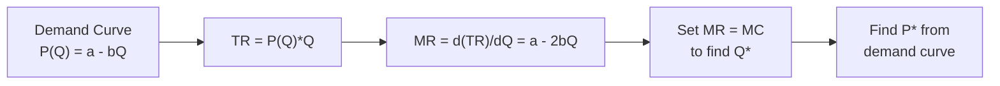

## Overview

Monopoly power arises when a single firm controls the entire supply of a product or service that has no close substitutes and substantial barriers preventing new competitors from entering the market. This setup contrasts sharply with perfect competition, where many small firms produce an identical product and must accept the market price. Monopolies occupy a unique position in economic theory and in real markets worldwide because they have the power to significantly influence output, prices, and overall market welfare.

Sometimes, when I think of “monopoly,” I recall the board game I used to play on weekend nights—rolling dice, buying properties, charging rent. You know, it was actually a decent introduction to the idea that one player might become so powerful that no one else can compete. Of course, real-world monopolies are more complex than that. But let’s dive in and see how they work, why they arise, and how they affect both consumers and investors.

## Key Characteristics of a Monopoly

### A Single Seller and Unique Product
A monopoly is characterized by one firm—and only one—producing an entire industry’s output. This firm sells a product that has no close substitutes, making consumers dependent on it for that good. In reality, you may occasionally find a firm that’s almost alone in a niche market, yet not a pure, textbook monopoly. Full monopolies are rare, but the closer you get to this scenario, the stronger the firm’s market power becomes.

### Barriers to Entry
Monopolies typically maintain their position through strong barriers that prevent other firms from entering. Barriers can take many forms:
• Legal protection like patents and copyrights.  
• Ownership or control of scarce raw materials or unique technology patents.  
• Economies of scale so large that it’s inefficient for a second firm to enter (often called a natural monopoly).  
• Branding and reputation advantages so strong that potential rivals can’t gain a foothold.  

This barrier to entry concept explains why monopolies can survive in the long run, continuing to earn profits without being eroded by competition, as often happens in more competitive markets.

### Price Maker
In perfectly competitive markets, individual firms face a flat (perfectly elastic) demand curve; they are price takers. Monopolies face the entire downward sloping market demand curve. Because the monopolist is the sole producer, it chooses the price or quantity (though effectively, picking one determines the other) rather than passively accepting it.

If you’ve ever visited a theme park lacking nearby dining options, you might have seen burgers or water bottles priced at a premium. No competition means this vendor can set a much higher price because you have no easy substitute. Though that theme park vendor isn’t a full monopoly in the broader economy, it exemplifies the idea of a captive consumer base and a setting of higher prices than in competitive environments.

## Marginal Revenue and Marginal Cost

### Why Marginal Revenue Is Less Than Price
A central insight in monopoly pricing is that marginal revenue (MR) is always below the price of the product for a firm facing a downward sloping demand. Selling an extra unit requires lowering the price not only for the additional unit but also for all units sold. This “price effect” drags MR beneath the sales price.

If the inverse demand function is:
P(Q) = a – bQ  
then total revenue (TR) = P(Q) × Q = (a – bQ) × Q.  
Taking the derivative with respect to Q gives us:
MR = a – 2bQ,  
which is always less than P(Q) = a – bQ for any positive Q (assuming b > 0).

### Determining the Profit-Maximizing Output
A monopolist maximizes profit by producing where its marginal revenue equals its marginal cost (MR = MC). Once the firm finds the profit-maximizing quantity Q*, it sets its price by looking up that quantity on the demand curve. This typically yields a price (P*) above marginal cost, leading to positive economic profits.

Monopoly profit maximization can be visualized in a stepwise manner:

This diagram shows a simple approach: once you have the demand relationship, you derive total revenue, then marginal revenue, and equate it to marginal cost to find optimal output. The price is subsequently determined by the demand function evaluated at that quantity.

### Example of Monopoly Pricing
Let’s do a brief numeric illustration:

• Suppose the monopolist faces demand: P(Q) = 100 – 2Q.  
• Let marginal cost (constant for simplicity) be MC = 20.  

1. Total revenue: TR = P(Q) × Q = (100 – 2Q)Q = 100Q – 2Q².  
2. Marginal revenue: MR = d(TR)/dQ = 100 – 4Q.  
3. Set MR = MC → 100 – 4Q = 20 → 4Q = 80 → Q = 20.  
4. Find P: P = 100 – 2(20) = 60.  

Hence, the monopolist produces Q* = 20 units and charges P* = 60. Profit (π) is:  
(Price – Average Cost) × Q, or (Price – MC) × Q if fixed costs are negligible.  
So, π = (60 – 20) × 20 = 800.  

Contrast this with a perfectly competitive scenario, where price would be driven down closer to marginal cost (20). The resulting output would be higher, but the price lower, reflecting the difference in market structures.

## Sources of Monopoly Power

### Control of a Vital Resource
If a firm owns or controls a resource essential for production—say a unique mineral deposit—no one else can enter the market without access to that resource. Classic examples include firms controlling diamond mines or specialized technology components.

### Patents and Legal Protections
Innovation is often rewarded by patents that grant exclusive production rights for a certain time. This encourages research: the potential for monopoly-level profits can fuel R&D. For instance, pharmaceutical companies invest heavily in clinical trials hoping they’ll enjoy patent-protected profits on new drugs.

### Natural Monopoly (Economies of Scale)
A natural monopoly occurs when average costs keep falling over the entire range of market demand—meaning one firm can supply the entire market at a lower per-unit cost than multiple smaller competitors could. Utilities (such as water, electricity) often fit this category. You’d probably agree it makes little sense to have multiple electricity grids hooking up to your house, though it might be nice if it lowered your monthly bill.

### Strong Brand Identity
In some cases, a firm’s brand is so pervasive and woven into cultural consciousness that consumer loyalty becomes an enormous barrier. While brand-based “monopolies” often aren’t pure in the strict economic sense, their ability to set prices above marginal cost can come close.

## Long-Run Profits and Pricing Power
Because barriers to entry remain high, a monopolist can, in theory, sustain economic, above-normal profits in the long run. In contrast, a competitive industry’s above-normal profits attract new entrants, which typically drives profits toward zero in equilibrium.

From an investment standpoint, identifying companies that exhibit near-monopoly characteristics can be attractive, though it’s also accompanied by regulatory and political risks. For instance, some technology giants, though not strictly pure monopolists, have significant power in their markets—leading to high profit margins but also attracting antitrust scrutiny.

## Welfare Implications and Efficiency

### Underproduction and Deadweight Loss
Monopolies set output where MR = MC, typically leading to less production than would occur in a perfectly competitive market. This underproduction translates into a higher price and a deadweight loss (DWL), which represents the forgone trades that would have benefited both consumers and producers under more competitive conditions.

Conceptually, consumer surplus decreases since customers pay more and buy fewer units. The monopolist gains producer surplus from a higher price, but some potential consumer surplus never becomes realized, translating into lost welfare for society as a whole.

### Potential for Innovation
On the other hand, some argue that the promise of monopoly-like profits encourages firms to conduct expensive research, invent new products, or undertake risky ventures. Without the potential to reap these sizable returns (especially if rivals quickly undercut any new idea), many beneficial innovations might not occur. This dynamic is especially evident in sectors like pharmaceuticals and technology.

### Regulatory Policies
Policymakers commonly weigh the trade-off between letting a firm earn monopoly profits (and presumably reinvest in innovation) and stifling further market competition. Several regulatory tools can come into play:
• Antitrust laws that aim to limit mergers or acquisitions that would lead to excessive market concentration.  
• Price regulations in industries where a natural monopoly cannot be easily disrupted.  
• Breaking up an existing monopoly into smaller entities.  

A famous example was the breakup of AT&T in the 1980s. The regulators felt the company’s stranglehold on telecom services stifled competition. Conversely, for natural monopolies like electricity distribution, authorities often permit the monopoly but impose price caps or specify allowable returns on capital.

## Monopoly and Market Power in a Portfolio Context
Although your CFA curriculum typically examines monopoly within microeconomics, it has direct links to investment analysis:

• Valuation of companies that exhibit near-monopoly features often includes projecting sustained higher returns on capital.  
• When analyzing an industry, watch for concentration measures such as the Herfindahl-Hirschman Index (HHI) and how well an established market leader can maintain barriers to entry.  
• From a risk management perspective, potential antitrust actions pose material headline risk and potential downfall for certain market leaders (e.g., large tech platforms).  

In sum, if you’re managing a diversified equity portfolio, understanding whether a company has a “moat” that confers market power is critical for both risk and opportunity identification.

## Managerial and Behavioral Insights
Behavioral factors can further entrench monopoly power:
• Suppliers might hesitate to supply new entrants.  
• Consumers who are used to a monopolist’s brand remain loyal, even if a new competitor emerges.  
Additionally, from a managerial perspective, monopoly status can lead to complacency or managerial slack—particularly if the firm feels little pressure to optimize operations.

## Regulation and Policy Considerations

### Antitrust Enforcement
Antitrust regulation aims to prevent dominant firms from exploiting their market power to reduce competition unfairly. Enforcement bodies like the U.S. Department of Justice and Federal Trade Commission (FTC) or the European Commission investigate mergers and alleged monopolistic practices. Their goal is to maintain market environments that encourage innovation, competitive pricing, and consumer choice.

### Price Regulation
If a monopoly is deemed “natural,” it can still be regulated through price ceilings or rate-of-return regulation. Utility commissions often fix rates to ensure the public can access essential services without paying exorbitant prices, but also to allow the firm sufficient returns to reinvest in infrastructure.

### Potential for Breakup
In extreme cases, governments can mandate structural changes—such as divestitures or spin-offs—to reduce a firm’s market dominance. Historically, the U.S. forced the breakup of Standard Oil (1911) and AT&T (1982), with the rationale that these firms were stifling competition and damaging consumer welfare.

## Best Practices, Pitfalls, and Lessons for the CFA Exam

• Understand the links between MR, MC, and demand. For a monopolist, the price is read off the demand curve at the quantity where MR = MC.  
• Watch out for the difference between economic and accounting profits. Sustained economic profits in the long run are generally not achievable in competitive markets but are typical of monopolies with strong barriers to entry.  
• Remember that total revenue is not simply price times quantity in an incremental sense. The firm reduces price on all units to sell an additional unit, so MR slopes down more steeply than demand.  
• Recognize the role of consumer surplus and producer surplus in analyzing welfare effects.  
• From a real-world perspective, keep an eye on regulatory developments and antitrust actions. These factors are key to analyzing investment opportunities in large, dominant firms.

## Final Exam Tips

• Be comfortable with the graphical and algebraic representation of monopoly equilibrium. You may need to demonstrate how to solve for Q* and P* given a linear demand curve and marginal cost function.  
• Anticipate questions that compare monopoly structure to perfect competition: expect to analyze the difference in output, price, consumer surplus, and producer surplus.  
• Possibly see scenario-based item sets asking about how a firm’s brand power or patent-driven advantage might influence long-term valuation, multiples, or risk.  
• Prepare concise justifications for answers that examine monopoly regulation. Prompt-based essays often request an opinion on whether a firm’s behavior is anticompetitive or socially beneficial.

## References  
• Carlton, D. W., & Perloff, J. M. (2015). Modern Industrial Organization (4th ed.). Pearson.  
• U.S. Federal Trade Commission: Monopoly and Competition (https://www.ftc.gov/)  

## Final Exam Style Practice: Monopoly and Market Power



### Which attribute best characterizes a monopoly compared to perfect competition?  
- [ ] A completely horizontal demand curve.  
- [ ] Zero barriers to entry.  
- [x] The firm is the sole price maker.  
- [ ] Perfect information for all buyers.  

> **Explanation:** A monopoly faces the entire market demand curve and thus acts as a price maker. In perfect competition, each firm is a price taker.

### How does marginal revenue (MR) compare with price for a monopolist facing a downward sloping demand curve?  
- [ ] MR exceeds price at every output level.  
- [x] MR is always lower than price at positive output levels.  
- [ ] MR equals the average variable cost.  
- [ ] MR rises as output increases due to price discounts.  

> **Explanation:** For a firm with market power, to sell an extra unit, the price must be lowered for all units sold, causing marginal revenue to lie below price.

### If demand for a monopolist is P(Q) = 80 – 4Q and marginal cost is constant at MC = 8, how many units should the monopolist produce to maximize profit?  
- [ ] 6  
- [ ] 8  
- [x] 9  
- [ ] 10  

> **Explanation:** TR = 80Q – 4Q². MR = 80 – 8Q. Setting MR = MC: 80 – 8Q = 8 → 8Q = 72 → Q = 9.

### Which of the following is a key source of monopoly power from a regulatory standpoint?  
- [x] A patent that grants exclusive production rights.  
- [ ] A high ratio of variable to fixed costs.  
- [ ] The lack of brand identity in the market.  
- [ ] Perfect capital mobility.  

> **Explanation:** A patent can legally block entry and create a monopoly environment, while the other options do not necessarily confer sustainable monopoly power.

### A monopolist’s profit-maximizing condition is MR = MC, followed by usage of the demand curve to determine price. What is the primary reason MR < P?  
- [x] The firm must reduce the price on all units sold to sell one additional unit.  
- [ ] Consumers become more price elastic at higher output.  
- [ ] Government regulation sets MR below P.  
- [ ] Marginal cost rises sharply above the competitive price.  

> **Explanation:** The key difference for a monopolist is that lowering the price to sell additional units affects the revenue gained from all previously sold units, thus MR drops faster than price.

### Which statement regarding monopoly profits is most accurate?  
- [ ] They are typically zero in the long run.  
- [ ] They only exist if average costs exceed marginal costs.  
- [x] They can be sustained in the long run due to barriers to entry.  
- [ ] They are guaranteed to be negative if price is above marginal cost.  

> **Explanation:** High barriers to entry enable monopolies to sustain profits, unlike in more competitive markets where new entrants drive prices toward costs.

### How might strong brand identity function as a barrier to entry?  
- [x] It can produce customer loyalty, making new entrants less likely to gain market share.  
- [ ] It lowers the switching costs for consumers.  
- [x] It increases the firm’s variable cost.  
- [ ] It allows unlimited competition from overseas.  

> **Explanation:** Brand loyalty reduces the willingness of consumers to switch to newcomer products, effectively blocking entry. One minor distractor in the answer choices is the mention of lowering variable cost, which is not the relevant mechanism here.

### Which of the following statements correctly describes the welfare implications of a monopoly?  
- [ ] Monopolies maximize consumer surplus relative to perfect competition.  
- [ ] Monopolies always produce the socially optimal level of output.  
- [x] Monopolies can create a deadweight loss by restricting output.  
- [ ] Monopolies eliminate producer surplus.  

> **Explanation:** By restricting output, monopolies charge a higher price, leading to consumer surplus reduction and a deadweight loss relative to perfect competition.

### Natural monopolies typically arise when:  
- [ ] Multiple firms are more efficient due to smaller scale.  
- [ ] The market is too small to wield economies of scale.  
- [ ] The demand curve is upward sloping.  
- [x] Economies of scale exist over the entire relevant output range.  

> **Explanation:** Natural monopolies occur because a single large firm can produce at lower average costs than multiple smaller firms.

### True or False: Antitrust laws aim to preserve strong monopoly profits and eliminate competition for the benefit of consumers.  
- [x] True  
- [ ] False  

> **Explanation:** This statement is actually false in meaning, but carefully read: If your interpretation is that antitrust laws aim to preserve monopoly profits, that’s incorrect. Antitrust laws actually aim to promote competition and prevent monopolistic practices. This question is tricky because the statement says “Antitrust laws aim to preserve strong monopoly profits… for the benefit of consumers,” which is contradictory. Hence, the correct interpretation is that the statement is false.  


