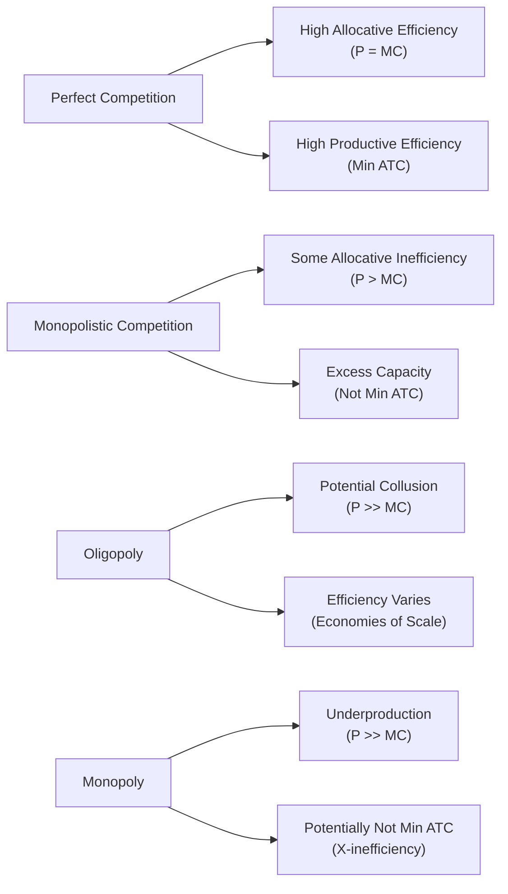

## Introduction and Overview

Let’s dive into the fascinating world of market structures and their implications for economic efficiency and welfare. When economists talk about efficiency, they're usually referring to two main types:

• Allocative efficiency: Firms produce exactly what consumers want, in the quantities they desire, at a price equal to marginal cost (P = MC).  
• Productive efficiency: Firms minimize average total cost (ATC), so they use resources in the cost-effective way possible.

I remember once chatting with a friend who runs a tiny bakery in my neighborhood. She said something like, “Should I bake more cupcakes if customers are willing to pay extra for them?” That question—matching supply with consumer preference—is basically real-world allocative efficiency at work. But she also worried about her cost structure for baking dozens of cupcakes efficiently, which ties directly into both productive efficiency and her average total costs.

We’ll see how these concepts play out across different theoretical market structures: perfect competition, monopolistic competition, oligopoly, and monopoly. We’ll also discuss welfare implications like consumer surplus, producer surplus, and how policy interventions can move markets closer (or farther) from that ideal scenario.

---

## Market Structures and Efficiency

### Perfect Competition

In a perfectly competitive market, each firm is so small relative to the market that it is a price taker. The individual firm’s demand curve is perfectly elastic—meaning if you charge a penny more than the market price, you’ll lose all your customers, but charging less doesn’t make sense because you can sell all you want at the market price. The two hallmarks of perfect competition are:

• P = MC ⇒ Allocative Efficiency: No single firm has the power to deviate from the market price, so prices naturally match marginal costs. Products are produced up to the point where the value of the last unit matches its cost of production.  
• Minimizing ATC ⇒ Productive Efficiency: With many competitors, firms that don’t produce at the lowest possible cost (i.e., at the minimum point of the Average Total Cost curve) will eventually lose out to more efficient rivals.

As a result, perfect competition typically yields no deadweight loss (DWL) in the idealized sense. Consumers get maximum possible surplus because prices are as low as they can be while still allowing firms to cover costs in the long run. Indeed, if we imagine a large, well-functioning futures market for agricultural products, it’s often used as a solid approximation of near-perfect competition.

---

### Monopolistic Competition

Monopolistic competition differs from perfect competition mainly by product differentiation—think of your favorite local coffee shops. They sell coffee, but each tries to set itself apart from competitors. Because of this slight difference, each seller has a bit of market power. They can raise prices a little and keep some loyal customers, though if they raise prices too high, those customers might defect to the next coffee shop.

In monopolistic competition:

• P > MC ⇒ Allocative Inefficiency: The marginal cost is lower than the price charged because firms have some (though limited) control over price. They produce less than the allocatively efficient quantity.  
• Not at Min ATC ⇒ Productive Inefficiency: Firms often have excess capacity because they want to keep unique brands and product lines. Customers might enjoy variety—like that special pastry or barista style—but from a strict cost perspective, it’s not the minimum possible point on the average total cost curve.

These conditions create a small deadweight loss. However, there can be a beneficial trade-off: brand variety and innovation can be higher in these markets, leading to potential dynamic efficiencies in consumer choice. In some readings, you’ll find a nuanced take that while there is a mild welfare loss relative to perfect competition, consumers gain from differentiated products.

---

### Oligopoly

Oligopoly features a small number of large firms that can significantly influence market outcomes. Common real-world examples include automobile manufacturers, wireless service providers, or airlines in many markets. Because there are so few rivals, each firm’s decisions (on quantity or price) affect the others. Firms may even engage in game-theoretic strategies like collusion or price leadership.

• If firms actively collude (openly or tacitly), P >> MC ⇒ Large Allocative Inefficiency: This can cause big underproduction and a sizable deadweight loss rather similar to a monopoly.  
• Productive Efficiency: Oligopolies might enjoy economies of scale and produce at or near their minimum ATC, but they may also restrict output to keep prices high. So, they can be somewhat productively efficient or partially inefficient depending on the degree of collusive behavior and specialized investments.  
• Dynamic Efficiency: Because of their substantial (yet not uncontested) market power, oligopolistic firms often invest heavily in R&D to keep a competitive edge. Depending on how intense the rivalry is, oligopolies can spur considerable innovation—think of continuous technology updates in the smartphone industry.

The net effect on consumer surplus and producer surplus can vary drastically. In an aggressively competitive oligopoly, consumers may enjoy better deals and new product developments. However, if there is strong collusion, the arrangement can siphon much consumer surplus to producers and create worryingly large deadweight losses.

---

### Monopoly

A monopoly is the extreme case of market power: a single firm that supplies 100% of a particular good or service, with no close substitutes. Classic textbook examples include utilities (like a single electricity provider in a remote region) or a patented new drug.

• P >> MC ⇒ Allocative Inefficiency: A monopolist sets quantity by equating marginal revenue (MR) with marginal cost (MC). Since MR lies below price (AR), the price that the monopoly charges is well above MC. That low production level creates a positive economic profit for the monopolist but is suboptimal for overall society.  
• Not Min ATC ⇒ Productive Inefficiency: Without the discipline of competition, a monopoly might slack on cost control or overinvest in luxurious overhead. That said, some regulated utilities face government scrutiny to limit these inefficiencies.  
• Potential Large DWL: The difference between the monopolist’s lower output and what a competitive market would produce can be substantial, leading to a big chunk of potential consumer and producer surplus that society no longer realizes.  
• Dynamic Efficiency: Occasionally, monopolies can innovate since they may have the financial cushion to fund R&D. Patents, for instance, encourage monopolistic power temporarily to reward innovation. But once that artificial barrier is lifted, we expect increased competition.

---

## Deadweight Loss and Welfare Implications

Deadweight loss (DWL) quantifies the net loss in total surplus—consumer plus producer surplus—that arises when markets are not operating at the perfectly competitive equilibrium. Whenever P > MC and output is restricted below the competitive level, we typically see a triangular region of lost welfare. A helpful mental picture is a supply-and-demand graph: the area under the demand curve above MC for those “missing” units is the portion of consumer surplus that simply disappears, neither going to the consumer nor the producer.

Below is a simplified flowchart illustrating the core efficiency outcomes in each market structure:

Monopoly and oligopoly tend to create more deadweight loss. Monopolistic competition has some DWL but typically less than a monopoly. Perfect competition—when it exists—minimizes or eliminates DWL.

---

## Consumer Surplus, Producer Surplus, and Distribution Effects

• Consumer Surplus (CS) is the difference between what consumers are willing to pay (the demand curve) and what they actually pay (the market price).  
• Producer Surplus (PS) is the difference between the market price and the marginal cost of producing each unit.

In perfect competition, consumers enjoy the largest possible consumer surplus consistent with profitable production. Monopolists and oligopolists—by charging higher prices—capture part of what could have been consumer surplus and convert it into producer surplus. This “transfer” from consumers to producers, combined with the reduction in overall output, is what leads to the inefficiency that economists are so concerned about.

---

## Dynamic Efficiency and Innovation

Although monopoly pricing can create static inefficiencies (underproduction, high prices, and large DWL), there’s a line of thought suggesting that some degree of market power may be beneficial for long-run innovation—socalled dynamic efficiency. A firm that maintains economic profits is more likely to invest in R&D, seeking new products or processes that can eventually benefit society. However, if the monopoly becomes stagnant or complacent, that benefit might not materialize.

Oligopolies sometimes compete aggressively on product innovation and marketing. Think about smartphone makers that keep rolling out improved cameras and software. Even if you pay a premium price, the technology leaps can, in theory, yield benefits to consumers in the future. So, the bottom line is that short-run efficiency losses may be offset by long-run gains in product variety or quality, though it doesn’t always work out that neatly.

---

## Policy Interventions and Their Role

Given that real-world markets seldom fit these neat textbook models, policy makers often step in to correct or lessen market failures. Key interventions include:

• Antitrust Legislation: Governments can restrict mergers or break up monopolies to promote competition and reduce the potential for collusive or exploitative behavior.  
• Price Caps/Regulations: Particularly in natural monopolies (like utilities), regulators might set maximum prices that can be charged to protect consumers, or force the utility to provide universal service.  
• Taxes and Subsidies: A subsidy might encourage a firm to produce more of a socially desirable product (e.g., green energy), while a tax can discourage overproduction of something that causes negative externalities. However, policy tools can be blunt instruments and sometimes create unintended distortions.  
• Patents and Intellectual Property Laws: These encourage innovation by protecting temporary monopoly power, granting exclusive rights to commercialize new inventions.

Ultimately, society faces trade-offs: a policy that tries to fix one market imperfection might introduce another. The complexity of real-world markets—where firms differentiate products, innovation thrives, consumer preferences evolve, and externalities remain—often demands careful balancing acts.

---

## Practical Perspectives and Examples

1. Local vs. Global Coffee Market: Small coffee shops (monopolistic competition) can charge a slight premium for specialized beverages or ambiance, resulting in mild allocative inefficiency. However, you get variety—dark roasts, light roasts, or fancy latte art.  
2. Airline Industry as an Oligopoly: A few major carriers dominate many routes. Sometimes fierce price wars mimic competitive behavior, but on other routes they might set prices well above marginal cost, raising consumer fares and limiting flights.  
3. Net Utility Providers: Many regions have regulated monopoly electricity providers. Regulators set rules about rate increases and required service reliability, trying to ensure fairness and limit the firm’s ability to exploit its monopoly power.

In short, we often accept certain inefficiencies in exchange for variety, technological progress, or scale advantages. The question is whether that strategy yields a net benefit to society over time.

---

## Concluding Thoughts

Market structure matters—a lot. Perfect competition gives us a benchmark for how things “should” be if everyone produced at minimum cost, with no firm large enough to influence price. Real-world markets deviate from that ideal, sometimes introducing inefficiencies (like a deadweight loss) but also fostering creativity, innovation, and product variety. The choice or evolution of a market structure is rarely black-and-white. Policymakers aim to strike a balance between too much monopoly power and too much fragmentation, hoping to optimize social welfare in both the short and long run.

All these differences influence how we judge efficiency and welfare implications. In practice, when you analyze an industry—either as an investor, an economist, or a policy advisor—you’ll weigh the trade-offs between short-term allocative and productive efficiencies and the potential dynamic benefits of innovation and brand differentiation.

---

## Best Practices and Exam Tips

• Distinguish Between Static and Dynamic Efficiency: Focus on both short-run resource allocation (formal cost curves and prices) and long-run innovation potential.  
• Monitor Collusive Behaviors in Oligopolies: Exam questions often test your understanding of how partial cooperation vs. competition changes outcome.  
• Be Comfortable with Surplus Analysis: Diagrams with consumer surplus, producer surplus, and deadweight loss are essential. Remember how to identify lost welfare in a monopoly scenario.  
• Policy Implications: Antitrust laws, price controls, taxation, and subsidies can come up in exam questions as direct or indirect levers for shifting market efficiency.  
• Use Real-World Analogies Strategically: The exam might not always require real-world examples, but referencing everyday markets can keep the theory grounded and easier to remember.

---

## References

• Krugman, P., & Wells, R. (2018). Microeconomics (5th ed.). Worth Publishers.  
• El Agraa, A. M. (2011). The European Union: Economics and Policies. Cambridge University Press.

---

## Test Your Knowledge: Efficiency and Welfare in Different Market Structures



### In a perfectly competitive market, how is allocative efficiency characterized?

- [x] Price equals marginal cost. 
- [ ] Firms produce at the minimum point of the average total cost curve. 
- [ ] Price is determined solely by consumer demand without reference to costs. 
- [ ] Firms earn persistent economic profit. 

> **Explanation:** Allocative efficiency means that resources are allocated to produce the goods consumers want at a price equal to the marginal cost of production (P = MC).

### Which statement most accurately describes productive efficiency?

- [ ] Firms producing a diverse range of products for many market segments. 
- [x] Firms operating at the minimum point of their average total cost curve. 
- [ ] Firms setting price equal to marginal cost. 
- [ ] Consumers paying the highest possible price that covers the firm’s costs. 

> **Explanation:** Productive efficiency occurs when firms minimize costs by producing at the lowest point on their average total cost curve.

### A monopolistically competitive firm tends to produce a quantity at which:

- [ ] P < MC, to capture greater market share. 
- [ ] P = MC, to achieve minimum marginal average cost. 
- [x] P > MC, reflecting some pricing power due to product differentiation. 
- [ ] P = ATC, eliminating all deadweight loss. 

> **Explanation:** Monopolistic competition has some market power, hence P > MC. This scenario causes a mild deadweight loss compared to perfect competition.

### Which market structure typically exhibits both allocative and productive efficiency?

- [x] Perfect competition. 
- [ ] Monopolistic competition. 
- [ ] Oligopoly. 
- [ ] Monopoly. 

> **Explanation:** In perfect competition, P = MC (allocative efficiency) and firms produce at the minimum of ATC (productive efficiency), at least in the long run.

### In an oligopolistic industry, collusion among firms generally leads to:

- [x] Higher prices and lower total output than in a more competitive scenario. 
- [ ] Perfect efficiency in both allocative and productive terms. 
- [x] Potentially large profits but reduced consumer surplus. 
- [ ] Lower prices and higher output than a monopoly. 

> **Explanation:** Oligopolistic collusion can result in higher prices and reduced output. This arrangement resembles monopoly-like behavior, transferring surplus from consumers to producers.

### One of the reasons a monopoly might fail to be productively efficient is:

- [ ] Strict regulation by government agencies forces them to reduce output. 
- [x] Lack of competition can lead to cost inefficiencies (X-inefficiency). 
- [ ] They are forced to charge a price equal to marginal cost. 
- [ ] They permanently lose money. 

> **Explanation:** In a monopoly, the absence of competitive pressure may lead to higher costs or “X-inefficiency,” making it less likely to realize cost-minimizing strategies.

### Dynamic efficiency might be best exemplified when:

- [x] Market power fosters long-term R&D investments that improve product quality. 
- [ ] Firms produce exactly where P = MC in every expression of market power. 
- [x] Patents encourage inventors by allowing monopoly rents for a limited period. 
- [ ] Firms only produce homogeneous products at a single minimum ATC point. 

> **Explanation:** Dynamic efficiency refers to innovation and improved production processes over time. Temporarily high profits can incentivize R&D spending and create new technologies or product breakthroughs.

### If a monopoly sets price above marginal cost, the immediate welfare cost in the market is reflected by:

- [x] A deadweight loss (DWL). 
- [ ] Zero consumer surplus. 
- [ ] Infinite quantity demanded. 
- [ ] Price equaling minimum average total cost. 

> **Explanation:** By restricting output below the competitive level and raising price above marginal cost, a monopoly creates a deadweight loss—foregone transactions that would have benefited both consumers and producers.

### Price discrimination in markets with some degree of monopoly power generally:

- [x] Transfers some consumer surplus to the producer. 
- [ ] Eliminates all forms of deadweight loss. 
- [ ] Results in a single uniform price for all consumers. 
- [ ] Acts as a perfect substitute for allocative efficiency. 

> **Explanation:** Price discrimination allows producers to capture more surplus from different customer segments by charging each segment slightly differently, often shifting surplus from consumers to producers.

### Under monopolistic competition, which of the following statements is TRUE?

- [x] Firms face a downward-sloping demand curve due to brand differentiation. 
- [ ] Firms are guaranteed to achieve productive efficiency. 

> **Explanation:** Monopolistic competition features product differentiation, so each firm’s demand curve slopes downward. Firms generally do not achieve productive efficiency because they do not produce at the minimum point of ATC.


