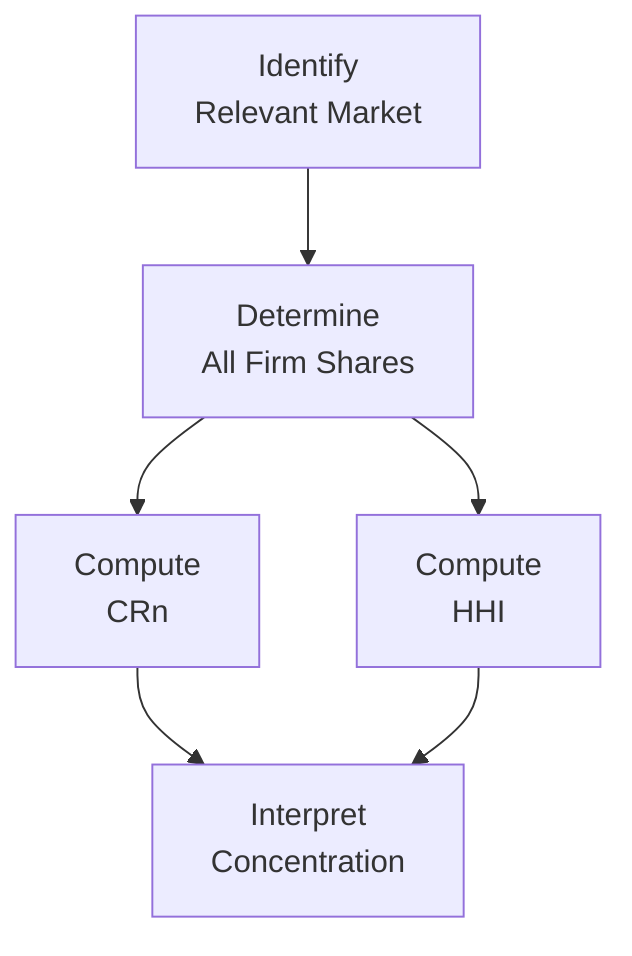
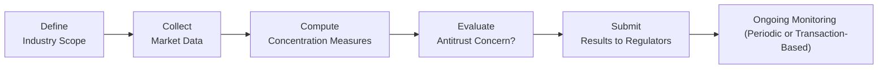

## Introduction

Industry concentration is a handy concept when analyzing how control of a market is distributed among its major participants. The more an industry’s market share is dominated by a few large players, the higher its concentration. Picture a small pizza shop in a neighborhood dominated by two major pizza chains: it’s tough to get a slice of the market if a handful of well-known brands claim most of the territory.

I remember the first time I tried applying these measures in a consulting project: I was helping a medium-sized agribusiness firm assess whether it could enter a new local market. We realized that in certain regions, the top three companies controlled almost 80% of the market, implying high barriers to entry. It felt like—how can I put it—trying to sell water at a beach that’s already owned by a couple of giant beverage stands. I was surprised how these concentration measures (like CR4 or HHI) guided strategic decisions so effectively.

In this section, we’ll explore the main tools for measuring industry concentration, delve into how they’re used, and offer advanced insights into their implications for mergers, acquisitions, and antitrust policy—a topic that frequently appears in both real-world corporate decisions and higher-level finance examinations.

## Key Measures of Industry Concentration

### Concentration Ratios (CRn)

A Concentration Ratio (CRn) tallies the combined market share of the top n firms in an industry. Often n = 4 or n = 8. So, if we see something like CR4 = 75%, that means the top four firms together control 75% of total industry sales or capacity.

• CR4 < 40% → More competitive industry.  
• CR4 between 40% and 60% → Moderately concentrated.  
• CR4 > 60% → Highly concentrated, indicating more oligopolistic conditions.

Think about the airline market in some regions. You might find that four major carriers control the lions’ share of flights, leaving smaller airlines with only niche routes. This real-world phenomenon underscores the value of a CR4 measurement: it’s a quick snapshot of the potential market power commanded by the largest participants.

### Herfindahl-Hirschman Index (HHI)

While CRn is a simple tool, the Herfindahl-Hirschman Index (HHI) is considered more nuanced by competition authorities worldwide (particularly in the United States). The HHI is computed by summing the squares of the market shares (in percentage form) of all firms in the market:


\displaystyle \text{HHI} = \sum_{i=1}^{N} (s_i \times 100)^2


where \\( s_i \\) is the market share (expressed as a decimal) of the \\(i\\)-th firm, and \\(N\\) is the total number of firms. For instance, if one firm’s market share is 30% (0.30), you square 30 (the percentage expression) to get 900, then add that to the squared percentages of all other firms.

• 0–1,500 → Unconcentrated (competitive)  
• 1,500–2,500 → Moderately concentrated  
• 2,500+ → Highly concentrated

In practice, a small number of large firms with high market shares drives the HHI upward more aggressively because squaring a large share magnifies its impact. Competition authorities use HHI thresholds to decide whether to allow mergers. For example, if two major players in a highly concentrated field plan to merge, the resulting HHI calculation might well exceed typical guidelines—potentially triggering further scrutiny or even blocking the deal.

Below is a brief Mermaid.js diagram illustrating how you might systematically compute these measures in a step-by-step approach:



## Defining Market Share and the Relevant Market

Calculating industry concentration can be tricky if you don’t define the “market” correctly. Market share is the proportion of total industry sales (or output, or capacity) attributed to a single producer. But how do we pin down total industry sales?

• Geographic Scope: Sometimes the relevant market is local (e.g., city-level for a local service provider), but in other industries—like consumer electronics—it might be global.  
• Product Boundaries: Are tablet computers and laptops in the same or different product categories? If consumers view them as substitutes, they might be combined under one “market.” Cross-elasticities of demand can clarify if a rise in the price of tablets leads to greater demand for laptops, implying these products are in the same competitive space.

I once saw frustration among my colleagues about how to classify “dairy desserts.” Are ice cream and frozen yogurt in the same “frozen dessert” market, or do they differ enough product-wise to be in separate categories? You can imagine that the lines get blurred, and that can affect each firm’s computed market share significantly.

When competition authorities investigate mergers or alleged monopolistic behavior, one of their first tasks is to define the relevant market. Cross-elasticity of demand is a key concept here: if a small price increase in one product drives consumers to buy the competing product, then both products belong in the same relevant market.

## Practical Applications: Mergers and Acquisitions

Concentration measures come front and center during mergers and acquisitions. Regulators look at the proposed, combined entity’s market share to decide whether the new firm would have undue market power. If the HHI increases substantially post-merger, it can lead to:

• Additional disclosures or structural remedies (e.g., forced divestitures).  
• Prolonged regulatory review periods.  
• Potential blocking of the merger if competition is threatened.

### HHI Changes from Mergers

To see how a merger might affect the HHI, consider a simplified example:

Suppose there are four firms with these market shares in percentages: 30, 25, 25, and 20. The HHI calculation before any merger is:


\text{HHI}_{\text{before}} = 30^2 + 25^2 + 25^2 + 20^2 
                           = 900 + 625 + 625 + 400 
                           = 2,550.


This is already a highly concentrated market by standard guidelines. Now, if the two firms with 25% each propose a merger, the new shares would be 30, 50, and 20. Then,


\text{HHI}_{\text{after}} = 30^2 + 50^2 + 20^2
                          = 900 + 2{,}500 + 400
                          = 3{,}800.


That’s a big jump (1,250 points) in the HHI (3,800 – 2,550), suggesting a significant reduction in competition. Antitrust authorities are likely to scrutinize such a scenario quite closely.

For your CFA studies—and especially in real engagements—understand how to compute and interpret these changes in HHI. They can show up in the exam in item-set questions, scenario analyses, or even short essays, letting you practice applying antitrust guidelines in a test setting.

## Limitations of Concentration Measures

### 1. Global Competition vs. Local Analysis

Concentration metrics may overlook international or interregional competition. If local measures say that the top two firms hold 50% market share, that might not matter if foreign competitors can easily enter and contest local prices, effectively lowering real market power.

### 2. Product Differentiation

Even if a combined share is high, if the merged firms produce goods that are quite distinct or cater to different consumer segments, actual market power might be less than the raw numbers suggest. For instance, an expensive high-end car might not directly threaten a mid-range sedan manufacturer, even if both are labeled “automobile producers.”

### 3. Rapid Technological Pace

Industries like social media, streaming platforms, or electric vehicles can transform quickly. A single product innovation might upend the existing order, rendering historical concentration data obsolete. Anyone remember the downfall of certain once-dominant phone manufacturers? The ground can shift pretty fast!

### 4. Data Quality

Calculating accurate market shares assumes consistent, reliable data. Mergers across borders or industries compound the difficulty of assembling and comparing reliable figures.  

### 5. Static View vs. Dynamic Realities

Concentration measures are snapshots in time. They don’t inherently capture competitive threats from potential entrants, nor do they necessarily incorporate capacity expansions that might alter future shares.

## Industry Dynamics and Periodic Monitoring

Many regulators and economists advocate for periodic recalculation of CRn and HHI. Industries experiencing disruption, like technology, e-commerce, or healthcare, can witness the rise of new entrants or quick consolidation (via acquisitions). Regulators often require data from merging firms on recent, current, and projected market shares, plus a discussion of future barriers to entry. 

A formal process might look like this:



If you’re an analyst or manager at a firm that’s thinking of expanding or merging, you’ll likely need to revisit these measures regularly—especially when you anticipate scrutiny from competition authorities or your strategy team.

## Best Practices, Pitfalls, and Strategies

• Always cross-check relevant markets. Missing an alternate product substitute can inflate or understate measured concentration.  
• Investigate supply- and demand-side factors that could quickly shift competition. For instance, intangible assets or disruptive R&D can shuffle the deck.  
• Combine CRn and HHI with more qualitative frameworks (e.g., Porter’s Five Forces, PESTEL analysis) to get a holistic view.  
• Don’t treat thresholds (like HHI > 2,500) as rigid. They’re guidelines, not absolute laws. Exceptions abound.  
• Reflect on how cross-elasticities can redefine your perimeter of analysis. A narrow definition can artificially inflate concentration; a broad definition can mask real monopoly power.

## Practical Example: Python Snippet

In case you’re evaluating multiple acquisitions or merger scenarios, you might find yourself coding quick routines to compute the HHI. Here’s a simple conceptual snippet:

```python
def herfindahl_hirschman_index(market_shares):
    """
    market_shares: List of market shares in decimal form. e.g., 0.3 for 30%
    """
    return sum([(ms * 100)**2 for ms in market_shares])

shares_before = [0.30, 0.25, 0.25, 0.20]
shares_after = [0.30, 0.50, 0.20]

hhi_before = herfindahl_hirschman_index(shares_before)
hhi_after = herfindahl_hirschman_index(shares_after)

print("HHI Before:", hhi_before)  # 2550
print("HHI After:", hhi_after)    # 3800
```

It’s straightforward to adapt this function for multiple scenarios. For robust analysis, you might incorporate data from real-time market reports or standardized databases, then feed them into your model to update HHI calculations.

## Conclusion and Exam Tips

Industry concentration measures, especially CRn and HHI, help investors, strategists, and regulators predict the implications of market power for profitability, competition, and potential antitrust action. A high concentration may signal that a handful of firms can command premium pricing—or that they might soon face the wrath of competition authorities. On many advanced finance exams, including the CFA Program’s top tiers, you could be asked to:

1. Calculate CR4 or HHI from given market shares.  
2. Interpret how a merger changes these metrics.  
3. Discuss regulatory concerns and strategic implications for a proposed combination.  
4. Evaluate the limitations of using concentration measures for dynamic, global, or tech-driven markets.

Keep in mind that precision and clarity matter: define your market well, clarify your data sources, and interpret the results strategically. Don’t let a simple numerical threshold lull you into ignoring deeper qualitative factors. Often, exam questions will mix these measures with real-world strategic or behavioral elements—like the nature of product differentiation or the potential for new entrants—so always stay alert for broader contextual clues.

CFA Level III candidates might see integrative case studies that combine these measures with risk analysis, portfolio management, or even macroeconomic conditions. Practice approaching such questions with a balanced perspective, weaving numeric results into a narrative that considers potential regulatory outcomes, competitive advantages, or synergy gains. 

Use these measures responsibly—like any quantitative tool, they’re only as good as the assumptions behind them. A small misstep in defining the relevant market or ignoring a strong newcomer can turn the neatest concentration calculation into a mismatch with reality.

## References and Further Reading

• Shepherd, W. G. (2012). The Economics of Industrial Organization. Waveland Press.  
• U.S. Department of Justice: Horizontal Merger Guidelines  
  (https://www.justice.gov/atr/horizontal-merger-guidelines)  
• CFA Institute Level III Curriculum Readings on Equity Valuation, Corporate Finance, and Industry Analysis.  
• Besanko, D., Dranove, D., Shanley, M., & Schaefer, S. (2020). Economics of Strategy. 8th Edition, Wiley.  
• Porter, M. E. (1980). Competitive Strategy: Techniques for Analyzing Industries and Competitors. Free Press.  

## Test Your Knowledge: Industry Concentration and Market Measures Quiz



### Which statement best describes a Concentration Ratio (CRn)?

- [x] It is the sum of the market shares of the top n firms in an industry.
- [ ] It is the sum of the squared market shares of all firms in an industry.
- [ ] It can only be used for measuring global monopoly power.
- [ ] It is exclusively utilized in tech-related industries.

> **Explanation:** CRn tallies the combined market share of the largest n firms, providing a quick measure of industry concentration.

### When calculating HHI, what factor most strongly drives an increase in the index?

- [ ] The total number of firms involved.
- [x] A high square of a single firm’s large market share.
- [ ] The presence of many small firms.
- [ ] Uniformly distributed market shares under 5%.

> **Explanation:** Large firms contribute disproportionately to the HHI, since the market share is squared.

### Suppose you are analyzing a market with four firms (A, B, C, D) holding respective market shares of 30%, 25%, 25%, and 20%. What is the approximate HHI?

- [ ] 2,000
- [ ] 2,250
- [x] 2,550
- [ ] 3,000

> **Explanation:** HHI = 30² + 25² + 25² + 20² = 900 + 625 + 625 + 400 = 2,550.

### Which of the following is a potential outcome if a proposed merger significantly raises the HHI in a highly concentrated market?

- [ ] Automatic approval without further evaluation.
- [x] Regulatory scrutiny or possible rejection of the merger.
- [ ] Reduced firm profitability due to competition.
- [ ] Immediate disintegration of other firms.

> **Explanation:** Substantial increases in the HHI often prompt regulators to investigate and sometimes block the merger.

### Which statement is most accurate regarding relevant markets?

- [ ] Relevant market is fixed geographically and never changes.
- [ ] Relevant market always includes only physically identical products.
- [x] Defining the market may shift based on cross-elasticities and geographic scope.
- [ ] Relevant markets ignore consumer substitution choices.

> **Explanation:** The scope of a relevant market depends on product substitutability (via cross-elasticities) and the geographic region in question.

### If CR4 in a particular industry equals 70%, which condition is likely?

- [x] The industry is highly concentrated, suggesting an oligopoly.
- [ ] The market is highly competitive with many firms.
- [ ] No firm has significant market power.
- [ ] The industry is considered unconcentrated by regulatory standards.

> **Explanation:** CR4 of 70% indicates the top four firms hold 70% of the market, pointing to an oligopoly-like structure.

### How does product differentiation affect concentration measures?

- [ ] It makes traditional concentration measures obsolete.
- [ ] It simplifies determination of market share data.
- [ ] It never impacts how industries are defined.
- [x] It can reduce the accuracy of concentration measures if substitutes are overlooked.

> **Explanation:** Product differentiation can blur market boundaries and reduce the precision of standard concentration metrics.

### In a dynamic industry with rapid technological shifts, concentration measures are best viewed as:

- [ ] Sufficient evidence on their own for regulatory approval.
- [ ] A permanent representation of market structure.
- [x] Point-in-time snapshots that may quickly change.
- [ ] Irrelevant to decision making.

> **Explanation:** In fast-evolving industries, concentration data must be periodically updated to reflect new entrants, departures, and product innovations.

### Which statement best characterizes a limitation of using CRn and HHI for antitrust analysis?

- [ ] These measures treat foreign firms as more threatening than domestic firms.
- [x] They may not fully account for global competition or shifting product categories.
- [ ] They presume short-run industry equilibrium.
- [ ] They are only used by private companies, ignoring public data sets.

> **Explanation:** CRn and HHI can mislead analysts if the market boundaries are too narrowly drawn or if new global competitors can rapidly enter.

### A true statement about antitrust regulatory thresholds for HHI is:

- [x] They serve as guidelines, and regulators may allow exceptions based on qualitative factors.
- [ ] They are fixed by law worldwide at 2,500 for all mergers.
- [ ] They do not exist in modern regulatory regimes.
- [ ] They pre-determine that any merger above 2,500 is illegal.

> **Explanation:** HHI thresholds (e.g., 2,500) are useful rules of thumb, not absolute or globally consistent laws. Regulators consider various qualitative factors too.


