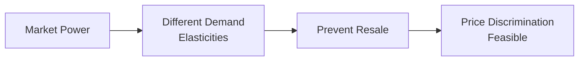

## Introduction

Price discrimination is one of those topics that can really make you raise an eyebrow: Why would a firm charge different people different prices for exactly the same product? I'll never forget the time I booked a last-minute flight for a personal emergency—you know the feeling when you see that terrifyingly high price, and there’s no other option. Later, when I told a friend about the hefty cost, she mentioned she bought the same ticket a month earlier for half the price. That was my “aha” moment: I was a textbook victim—or beneficiary, depending on perspective—of price discrimination.

Broadly defined, price discrimination is a firm’s practice of charging different prices to different consumers where these price differences are not fully driven by production cost differences. In other words, it’s not that it costs more to produce my seat on that last-minute flight; it’s simply that the airline can charge me more because, well, I really needed that seat. This concept touches on profit maximization, consumer surplus, and the firm’s power to segment markets. In efficient markets, it might seem odd that such pricing can persist, but as we’ll see, if some very specific conditions are met, price discrimination can be a strategic tool to boost a firm’s bottom line in many market structures.

## Key Principles of Price Discrimination

There are three major varieties of price discrimination, each with its own quirks and strategies:

### First-Degree (Perfect) Price Discrimination
First-degree (or perfect) price discrimination involves charging each individual customer the maximum price that customer is willing to pay for each unit. In a theoretical sense, the firm extracts all consumer surplus because each consumer is pushed to their highest acceptable price. It’s like if your local coffee shop could peer into your mind and charge you exactly what you’d pay—maybe that’s $5 if you’re desperate (like me on a Monday), or $2 if you’re less enthusiastic on a Friday afternoon. In reality, perfect price discrimination is rarely achievable because it requires incredibly detailed information about each consumer’s willingness to pay. Still, it offers a baseline concept: if a firm had perfect information and could block any arbitrage, it would capture nearly all the surplus for itself.

### Second-Degree (Quantity-Based or Menu Pricing)
Second-degree price discrimination is when firms offer different “price menus” depending on the quantity or version of the product purchased. Think of those buy-more, save-more deals. If you purchase a single unit, you might pay $10 each, but if you opt for the 10-unit bundle, you pay $8 per unit. The firm is effectively segmenting based on the consumer’s demand intensity. For instance, electricity companies often adopt tiered pricing for residential usage. You pay one rate for the first 200 kWh, a higher rate for the next 200 kWh, and so on. These are also called “nonlinear pricing” or “block pricing.”

### Third-Degree (Segment or Group-Based Pricing)
Third-degree price discrimination splits the market into groups based on certain observable characteristics—like age, location, or whether you’re a student, senior, or professional—and charges each group a different price. Public transportation often charges lower fares to seniors or students (because, presumably, their demand is more elastic), while professionals may pay a regular or higher fare. This approach depends on identifying segments with different price elasticities and ensuring there’s limited crossover among those segments.

## Conditions for Successful Price Discrimination

Firms don’t just decide on a whim to charge different prices. They need:

• Market Power: The firm must have some degree of control over price, so it can influence the terms of sale. Perfectly competitive firms, by definition, can’t do this because they’re price takers. But in monopolistic competition, oligopoly, or a monopoly, the firm has sufficient pricing flexibility.

• Distinguishable Consumer Groups: There must be at least two identifiable groups of consumers (or individuals) with different demand elasticities. In third-degree discrimination, this might be “students” and “non-students.” In second-degree discrimination, it’s “light users” and “heavy users.”

• Prevention of Arbitrage: The firm must be able to prevent or limit resale from the low-priced segment to the high-priced segment. Otherwise, a savvy consumer would simply buy in the cheaper segment and resell in the pricier one, undermining the firm’s strategy. Downloaded digital content, for instance, is typically locked to reduce resale risk.

• No Excessive Cost Differences: The product offered in each segment might be identical or nearly identical. Costs may not vary significantly by segment, otherwise price differences could be partially or fully explained by cost differences (which wouldn’t strictly be discrimination).

Below is a simple flowchart illustrating these conditions:

## How Price Discrimination Influences Profit and Consumer Surplus

In a single-price scenario, a firm sets one price and sells up to the point where marginal revenue equals marginal cost. Some consumers will happily pay that price, while others might have been willing to pay a bit less, so they’re priced out of the market. The firm also misses additional profits it could pick up from consumers willing to pay more.

With price discrimination:

• Firms Capture Consumer Surplus: By charging higher prices to less elastic (more inelastic) consumer segments, the firm effectively reduces the consumer surplus for that segment.  
• More Units Are Sold Overall: Firms may offer discounts to more price-sensitive consumers, selling additional units that wouldn’t have been sold at a single high price. This can potentially reduce deadweight loss—particularly in the case of first-degree discrimination.  
• Redistribution of Surplus: The total welfare pie can shift significantly in favor of producers, because they can appropriate much of the would-be consumer surplus.

Mathematically, for third-degree discrimination, the firm’s total profit π can be written as the sum of profits across each segment i:


\pi = \sum_i \left[ (P_i - MC) \times Q_i \right]


where Pᵢ is the profit-maximizing price for segment i, MC is constant marginal cost (assuming for simplicity it is the same across segments), and Qᵢ is the quantity sold in segment i. Each segment is priced where its own marginal revenue (MRᵢ) equals MC, leading to different prices P₁, P₂, …, Pₙ.

## Real-World Examples

You’ve probably encountered price discrimination more times than you realize. Let’s consider a few everyday situations:

• Airlines and Hotels: Advance-purchase discounts exist precisely to squeeze extra profits from business travelers (with inelastic demand) who often book last minute, while tourists (with more elastic demand) are price-sensitive and tend to book well in advance.  
• Student and Senior Discounts: Movie theaters, museums, and public transit often charge less to students and seniors. These consumer groups generally have lower disposable income and higher price sensitivity, and are thus more likely to forgo the service if it’s too expensive.  
• Peak vs. Off-Peak Utility Rates: Electricity providers often charge more during the high-demand hours (like mid-afternoon in a scorching summer) to both manage demand and reflect the higher cost of meeting peak load.  
• Loyalty Pricing: Retailers might give discounts to long-time or loyal customers, capturing additional surplus by encouraging more frequent or bulk purchases.

### A Quick Personal Story
I once discovered that my local gym offered a big discount to new members who joined in January (because that’s when signups spike with all the new year’s resolutions). But ironically, if you joined in, say, October, you’d pay full price. And the kicker: if you somehow found a “student” version of the membership (even for part-time students taking evening classes), you could pay an even lower price. It was basically a layered second-degree (time-sensitive offers) and third-degree (student discount) phenomenon rolled into one.

## Ethical and Legal Considerations

Now, you might be thinking, “Is this fair or even legal?” Regulators do keep an eye on pricing practices, especially if they appear to systematically disadvantage certain groups. In many jurisdictions, price discrimination becomes a concern if it’s based on protected classes (e.g., race or gender), which obviously leads to legal and ethical implications. More subtle forms of discrimination—like dynamic online pricing—also spark debate about consumer privacy and exploitation of personal data.

However, from an economic standpoint, a certain degree of price discrimination is generally permitted—even encouraged in some contexts—because it can expand output and provide lower prices to more elastic segments. It all comes down to how it is implemented, who is affected, and whether the practice runs afoul of consumer protection laws.

## Price Discrimination in Different Market Structures

A common misconception is that only monopolies can price discriminate. In fact, any firm with some pricing power (i.e., not perfectly competitive) can attempt it. Here’s how it could look in different environments:

• Monopoly: A single seller finds price discrimination particularly lucrative, since it already has the market to itself. It just needs to prevent entrants and manage different consumer segments effectively.  
• Monopolistic Competition: Firms with differentiated products can price discriminate by targeting loyal customers or offering time-based deals, given that they do have some control over their product’s perceived uniqueness.  
• Oligopoly: Large players might practice segment pricing, especially if they can coordinate strategies (legally or tacitly). But the risk of competitor undercutting can limit how aggressively they can discriminate.  
• Perfect Competition: Essentially impossible to price discriminate because each firm is a price taker. Consumers can switch to a competitor if someone tries to raise the price.

## Impact on Efficiency and Welfare

First-degree price discrimination can, in theory, eliminate deadweight loss since the firm is willing to sell to every consumer who values the product above marginal cost. In practice, it’s rarely fully achievable—but it highlights a possibility: price discrimination can improve allocative efficiency (more total units sold), even though it erodes consumer surplus by transferring it to the firm. The outcome generally depends on how well the firm can segment the market and how many extra consumers are brought into the fold at lower prices.

For second-degree discrimination (quantity-based discounts), high-usage consumers get a lower price per unit, which can encourage them to consume more, potentially leading to more efficient output levels. Third-degree discrimination’s efficiency effects are more nuanced: the firm sets separate prices to each group, each group’s quantity sold can move a bit closer to the socially efficient level if the group’s price is lowered relative to a single higher price. But it also can raise the price for a less elastic group, which reduces consumption there.

In other words, price discrimination typically results in a net shift in surplus toward producers and away from (some) consumers. Whether it increases or decreases total welfare depends on how many additional units are sold and the relative changes in consumer and producer surpluses.

## Best Practices and Common Pitfalls

• Market Segmentation: If you do not accurately project the demand elasticity of each group, you could end up losing money in one segment or failing to capture profitable opportunities in another.  
• Preventing Arbitrage: Overlooking the risk of a secondary market can undermine the entire strategy. For example, if a business traveler can buy from the discount channel easily, your carefully crafted high-price segment collapses.  
• Ethical Grounds: Keep an eye on regulatory boundaries. Charging certain protected groups more (directly or indirectly) can lead to serious legal consequences.  
• Dynamic Pricing Technology: While advanced algorithms can help you set prices in real time (like surge pricing for ride-sharing services), they may also spark consumer backlash if they’re perceived as unfair or discriminatory.

## Practical Advice for the CFA Exam

• Understand the Different Degrees: You should be able to define and distinguish the three degrees of price discrimination in a single sentence each, and identify common real-world examples.  
• Key Conditions: Be prepared to list out the conditions that make price discrimination feasible: (1) pricing power, (2) segmentable markets with different elasticities, and (3) ability to prevent resale.  
• Graphical Analysis: Practice drawing simple cost, demand, and marginal revenue curves to see how different segments might be priced differently. This might appear in item-set questions where you have to analyze how a monopolist charges different groups.  
• Link to Consumer Surplus and Welfare: Make sure you grasp how price discrimination can reduce consumer surplus but potentially increase total welfare if it expands output.  
• Regulation and Ethics: Know that price discrimination itself is not automatically illegal—but there are fairness issues and legislation around discriminatory practices. Real exam scenarios might focus on the distinction between legally acceptable segmented pricing (e.g., senior discounts) vs. unethical or prohibited discrimination.

## References

- Varian, H. R. (1989). Price Discrimination. In Handbook of Industrial Organization (Vol. 1). North-Holland.  
- Phillips, R. (2005). Pricing and Revenue Optimization. Stanford University Press.  

For additional insight, consider exploring:  
• Online microeconomics courses on Coursera, edX, or Khan Academy covering advanced pricing strategies.  
• Scholarly articles on dynamic pricing algorithms for real-time applications (especially in e-commerce).

## Test Your Knowledge: Price Discrimination Strategies Quiz



### Which of the following is a fundamental condition for a firm to implement price discrimination?

- [ ] The firm operates in a purely competitive market.
- [x] The firm must have some degree of market power.
- [ ] The product must have extremely low production costs.
- [ ] The product must have zero elasticity of demand in all segments.

> **Explanation:** A firm needs some control over price (market power) to charge different prices. In perfect competition, price discrimination is impossible because firms are price takers.

### Which of the following best describes first-degree (perfect) price discrimination?

- [x] Charging each buyer exactly their maximum willingness to pay.
- [ ] Offering bulk discounts for larger purchases.
- [ ] Charging different prices to different demographic segments.
- [ ] Dynamic pricing that changes every hour based on demand.

> **Explanation:** First-degree price discrimination involves charging an individualized price aligned with each consumer’s willingness to pay. It aims to capture the entire consumer surplus.

### In the context of preventing arbitrage, why is it critical for a firm practicing price discrimination?

- [x] If consumers can resell the product freely, low-priced buyers will undercut the higher-price segment.
- [ ] It ensures that marginal cost remains the same across segments.
- [ ] It allows the firm to switch from third-degree to first-degree discrimination.
- [ ] It has no effect on total surplus.

> **Explanation:** If there’s no effective way to stop buyers from reselling, the firm’s intended segmentation collapses—customers from high-price segments would just purchase from low-price segments.

### Under third-degree price discrimination, the firm sets different prices:

- [x] For different consumer segments based on observable characteristics.
- [ ] For every single customer, no matter how similar they are.
- [ ] Only after discovering each person’s exact willingness to pay.
- [ ] At the marginal cost in all markets.

> **Explanation:** Third-degree discrimination groups consumers by identifiable traits (e.g., age or region); each group faces a different price reflecting its demand elasticity.

### Which statement accurately describes the effect of price discrimination on consumer surplus?

- [ ] Price discrimination always increases consumer surplus for all consumers.
- [x] Some or all consumer surplus is transferred to the producer.
- [ ] Price discrimination is not related to consumer surplus.
- [ ] Consumer surplus entirely disappears, regardless of the degree of discrimination.

> **Explanation:** By charging different prices, the firm often transfers consumer surplus (at least partially) into producer surplus. In first-degree discrimination, the firm can nearly capture the entire surplus.

### Which of the following is a typical real-world example of second-degree price discrimination?

- [ ] Student discounts at movie theaters.
- [ ] Airline tickets priced higher for last-minute business travelers.
- [x] Electricity rates that increase after exceeding a certain usage threshold.
- [ ] Senior discounts in public transit.

> **Explanation:** Second-degree discrimination often takes the form of nonlinear pricing or tiered rates based on usage. Electricity block pricing is a classic illustration of this approach.

### Compared to a single-price monopolist, a perfectly price-discriminating monopolist:

- [x] Can, in theory, eliminate deadweight loss by selling more units.
- [ ] Earns exactly the same profit.
- [ ] Sells fewer units and charges a higher single price.
- [ ] Has no ability to capture consumer surplus.

> **Explanation:** With perfect information about each buyer’s willingness to pay, a monopolist could charge each buyer uniquely, removing the deadweight loss and converting consumer surplus into profit.

### Which of the following conditions is most critical to practicing third-degree price discrimination effectively?

- [ ] Perfect knowledge of each consumer’s willingness to pay.
- [x] An ability to identify and separate groups with different elasticities of demand.
- [ ] Very high production costs.
- [ ] Perfectly elastic demand across all markets.

> **Explanation:** A firm must segment consumers by elasticity (like students vs. professionals) and set different prices accordingly. They do not need perfect knowledge of each individual’s willingness to pay—just sufficient knowledge to group them.

### If an airline charges higher prices to business travelers and lower prices to leisure travelers, which factor is most responsible for these price differences?

- [ ] Because business travelers simply like paying more.
- [ ] Because flight attendants provide better service to business travelers.
- [ ] Because marginal cost is higher for business travelers.
- [x] Because business travelers have less elastic demand, while leisure travelers have more elastic demand.

> **Explanation:** Business travelers often face time constraints and exhibit inelastic demand, allowing airlines to charge them more. Leisure travelers, in contrast, tend to be more price-sensitive.

### Price discrimination is automatically illegal if:

- [x] False
- [ ] True

> **Explanation:** Price discrimination is not illegal per se. Many forms of price discrimination are entirely lawful, but it can trigger scrutiny under antitrust or consumer protection laws if it unfairly targets certain protected groups or restricts competition.


