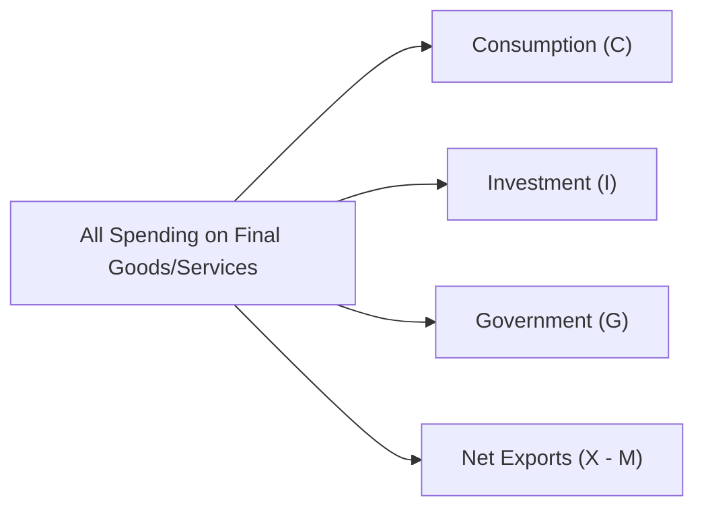

## Understanding the Concept of GDP

Sometimes, I look back at when I first heard the term “GDP” and thought it was some sort of top-secret government acronym. Turns out, almost everyone—economists, policymakers, analysts—throws around “GDP” like it’s the only thing that matters. Truth is, GDP is indeed one of the core metrics we track to gauge economic health and performance. Yet it’s basically just the total monetary value of all final goods and services produced within a country’s borders over a specific time period—usually one year or sometimes a quarter.

When economists say “final goods,” they mean goods or services actually purchased by the end user. Think of a brand-new car or the cup of coffee you buy at your local cafe. We don’t want to include the tires that go into that new car or the coffee beans the shop bought from a supplier—those are “intermediate goods.” If we did count all goods at every stage, you can imagine we’d double count or, worse, triple count, artificially inflating our GDP figure.

At CFA Level I, the fundamental idea is to recognize that GDP is not just an abstract figure but a yardstick for where the economy is in its business cycle. For portfolio managers and analysts—especially at Level III—that means we pay attention to whether GDP is growing, slowing, or contracting; these changes help shape our decisions in asset allocation, sector rotation, and risk management.

## Approaches to Measuring GDP

While “total GDP” might sound simple, things get more interesting when you actually measure it. Economists usually do this in three ways: the Expenditure Approach, the Income Approach, and the Value-Added (Output) Approach. Funny enough, if you do them correctly, they should theoretically give you the same result. Let’s see how it all comes together.

### The Expenditure Approach

The Expenditure Approach is probably the version you’ve heard most commonly. It’s a straightforward breakdown, expressed in a (famously remembered) formula:

$$
\text{GDP} = C + I + G + (X - M)
$$

where:

• \\( C \\) = Consumption by households  
• \\( I \\) = Investment expenditures by businesses (and sometimes households, such as on new housing)  
• \\( G \\) = Government spending on goods and services  
• \\( X \\) = Exports  
• \\( M \\) = Imports  

In plain terms, we add up all the requests for final goods and services—private individuals (consumption), businesses (investment), and the government. We then account for net exports, which is simply exports minus imports, ensuring that only domestic production is considered.

For instance, suppose you track your country’s consumption at $6 trillion (food, healthcare, iPhones, Netflix subscriptions, you name it), business investments at $2 trillion, government spending at $3 trillion, and net exports at -$0.5 trillion (meaning the country imported more than it exported). Then your nominal GDP, using this approach, would be $6 + $2 + $3 + (-$0.5) = $10.5 trillion.

Below is a simple mermaid diagram illustrating the Expenditure Approach conceptually:

### The Income Approach

Now, let’s flip the coin: Instead of looking at spending, we consider all income earned in producing those final goods and services. After all, every dollar spent on a good is someone else’s income—like your local coffee shop’s revenue, which then pays wages, rent, and so on.

Income components typically include wages and salaries, rental income, interest income, and corporate profits. Because certain taxes and subsidies can skew the measurement, economists also adjust for those. If you’re working a job, you’re part of the wages category; if you receive interest on a bond, that’s the interest portion; if you’re a landlord, it’s rental income, and so forth.

A simplified representation, ignoring some complexities, looks like:

• \\( \text{GDP} = W + R + i + \pi + \text{Adjustments} \\)  
  - \\( W \\) = Wages  
  - \\( R \\) = Rent  
  - \\( i \\) = Interest  
  - \\( \pi \\) = Profits  

### The Value-Added (Output) Approach

Ever buy a new house and think how many steps were actually involved? Value creation typically happens at several production stages, from raw materials to final consumer purchase. In the Value-Added Approach (sometimes called the Output Approach), we sum up the incremental value that each stage of production contributes.

For instance, a farmer grows wheat and sells it to a milling company, which then produces flour and sells it to a bakery, which finally bakes bread and sells it to you. The value at each stage is the difference between the cost of inputs and the final sale price at that stage—again, ensuring we don’t double count.

## National Income and Related Measures

Economists also want to see how the total “pie” of income is distributed. That’s where National Income (NI) measures come in. National Income is the total income earned by a nation’s residents for their contributions to production. You might see further breakdowns, such as Net National Product (NNP) or Net National Income (NNI). These are adjusted for depreciation (the wear and tear on capital) and indirect business taxes.

• Net National Product (NNP) = GDP + Income from Abroad - Depreciation - Indirect Taxes (in many cases, also adjusting for foreign factor income).  
• National Income (NI) = NNP after adjusting for certain taxes and government subsidies.  

In other words, while GDP focuses on domestic production, National Income deals more directly with the income flows to residents, which might be different if some of the domestic production is attributable to foreign-owned entities operating in the country (or if the country’s residents have production facilities abroad).

## GDP versus GNP (or GNI)

Here’s a question that used to trip me up early on: Why do some countries talk about Gross National Product (GNP) or Gross National Income (GNI) instead of GDP? GNP (or GNI, a term increasingly used) takes the viewpoint of ownership rather than geographic territory. Let’s break it down:

- GDP: based on location. All output produced within the country’s borders, whether by citizens or foreign-owned companies, as long as it’s physically inside the territory.  
- GNP/GNI: based on nationality or ownership. It accounts for the value of output produced by factors of production owned by that nation’s residents, whether the production happens domestically or abroad.

For large economies with significant foreign investments or heavy foreign ownership, the difference between GNP and GDP can be substantial. From a portfolio management perspective, GNP can sometimes be relevant if you want to see how a nation’s residents (and thus local investors) derive income from global operations.

## The Underground Economy

Now, let’s be honest. Not every transaction sees the light of official statistics. There’s a reason folks refer to the “shadow,” “informal,” or “underground” economy. This side of the economy includes transactions that may be perfectly legal but not fully reported for tax or regulatory reasons, plus illegal activities. A street vendor might not be diligently reporting all sales, or an informal barbershop might work purely on cash. In many emerging markets, this can represent a substantial slice of total output. 

For macro analysts—and especially for investment analysts—understanding the size and growth of the informal sector is crucial. Official GDP could understate the actual economic reality, affecting decisions on everything from consumer goods stocks to real estate investments. The bigger the informal sector, the trickier it can be to rely wholly on official GDP data when forecasting future consumption or policy impacts.

## Why GDP Matters for Market Analysis

GDP growth (or decline!) can shift the risk and return profiles of entire asset classes. When an economy grows robustly, corporate earnings may get a boost, potentially driving equity markets. At the same time, robust growth can prompt central banks to tighten monetary policy, leading to higher interest rates and varied bond market implications. For a portfolio manager, the pace and sustainability of GDP growth inform strategic asset allocations, factor investing approaches, and sector rotation strategies. Evaluating newly released GDP data—especially if it significantly differs from market consensus—often sparks immediate market reactions.

In the bigger picture, you’ll also see GDP data feeding into more advanced tools like cyclical indicators (covered later in this Business Cycles chapter) and even stress-testing or scenario analyses. For example, a slowdown in real GDP might suggest we’re heading into a recession, meaning that cyclical industries (like consumer discretionary or automobiles) could be particularly at risk.

## Potential Pitfalls in GDP Interpretation

• Double Counting: Failing to distinguish final goods from intermediate goods can inflate numbers.  
• Price vs. Volume Effects: We often talk about nominal GDP (market value in current prices) versus real GDP (adjusted for inflation). Real GDP is typically used to gauge the true “volume” of production.  
• Data Revisions: Preliminary GDP readings can be revised as new data emerges. Analysts should remain flexible and possibly check multiple data releases before finalizing an economic outlook.  
• Cross-Country Comparisons: Exchange rate movements, differences in purchasing power, and variations in measuring methodology can complicate direct comparisons of GDP across different countries.

## Best Practices in Analyzing GDP

• Check Multiple Measures: Looking at both the Expenditure and Income Approach can reveal discrepancies or potential data anomalies.  
• Focus on Key Components: For instance, keep an eye on business investment (I), as it can serve as a leading indicator of future production capacity.  
• Leverage Timely Indicators: High-frequency data (e.g., monthly consumption metrics, manufacturing indexes) can give early clues on GDP trends even before official quarterly data.  
• Adjust for Inflation: Use real GDP to understand volume changes; examine nominal GDP to see the role of prices and possibly track potential inflation.  

## Connecting to the CFA Exam

CFA exams typically test your ability to:  
• Distinguish between the various GDP calculation methods.  
• Interpret what changes in consumption or investment might mean for overall economic performance.  
• Understand how GDP connects to the business cycle and broader macroeconomic indicators.  
• Evaluate differences between GDP, GNP, and National Income and know when each measure is more relevant for certain types of analysis.

From a Level III perspective, you might see scenario-based questions that blend economic data interpretation with portfolio advice, e.g., deciding how to shift a global equity portfolio given an unexpected revision in GDP growth for a key economy. You could also find item sets that require you to analyze the role of net exports in a country’s economic expansion or the effect of an expanding informal sector on official GDP figures.

## References for Further Exploration

• Mankiw, N. G. (2019). “Principles of Macroeconomics.” Cengage Learning.  
• Bureau of Economic Analysis (BEA): https://www.bea.gov/  
• The World Bank Databank: https://databank.worldbank.org/

These resources will help you deepen your understanding of GDP components, how they’re measured, and how official agencies compile these figures.

--------------------------------------------------------------------------------

## Test Your Knowledge: Measuring GDP and National Income



### Which of the following best describes the concept of final goods in GDP measurement?

- [ ] Goods that undergo further processing before being sold.  
- [x] Goods and services used by the end consumer and not resold or processed further.  
- [ ] Goods that are exempt from indirect taxation.  
- [ ] Goods imported from abroad for final usage.  

> **Explanation:** Final goods are items purchased by the end user. Intermediate goods do not appear in the final GDP calculation to prevent double counting.

### Regarding the Expenditure Approach, which statement is most accurate?

- [x] GDP = C + I + G + (X - M).  
- [ ] GDP = Wages + Interest + Rent + Profit.  
- [ ] GDP includes all intermediate goods produced within a country.  
- [ ] Net exports are not considered.  

> **Explanation:** By definition, the Expenditure Approach adds consumption (C), investment (I), government expenditure (G), and net exports (X - M) to calculate GDP.

### If a country’s imports exceed its exports, how does that affect the GDP calculation via the Expenditure Approach?

- [ ] GDP remains unchanged.  
- [ ] Net exports become positive.  
- [x] GDP is reduced by the amount of net imports.  
- [ ] GDP increases due to larger import activity.  

> **Explanation:** When imports (M) exceed exports (X), (X - M) is negative, which subtracts from the total GDP.

### The Income Approach to measuring GDP sums up which of the following?

- [x] Wage income, rental income, interest income, and profit income.  
- [ ] Only wages and government subsidies.  
- [ ] The value of all final goods and services sold.  
- [ ] Consumption, investment, government expenditure, and net exports.  

> **Explanation:** The Income Approach is based on the total income generated—wages, rents, interest, and profits—while producing final goods and services.

### What is the primary difference between GDP and GNP (or GNI)?

- [ ] GDP is adjusted for depreciation, whereas GNP is not.  
- [ ] GNP excludes interest income from abroad.  
- [x] GDP measures production based on geographic location, while GNP is based on ownership or nationality.  
- [ ] GNP is exclusively for developed countries.  

> **Explanation:** GDP focuses on activity inside a country’s borders. GNP or GNI measures output according to who owns the factors of production, regardless of where they operate.

### Which of the following measures aims to exclude depreciation when calculating a nation’s overall income?

- [ ] Nominal GDP.  
- [ ] Real GDP.  
- [ ] Gross National Product (GNP).  
- [x] Net National Product (NNP).  

> **Explanation:** NNP is Gross National Product minus depreciation. It accounts for capital consumed during the year.

### Which statement is TRUE about the underground (informal) economy?

- [x] It may cause official GDP figures to underestimate the true level of economic activity.  
- [ ] It typically includes all types of government spending.  
- [x] It often involves transactions unreported for tax or regulatory reasons.  
- [ ] It’s always illegal.  

> **Explanation:** The underground economy can be both legal (but unreported) or illegal. If large, official statistics understate real economic activity.

### Which approach to calculating GDP sums the incremental value at each stage of goods production?

- [ ] Income Approach.  
- [x] Value-Added Approach.  
- [ ] Expenditure Approach.  
- [ ] Cross-Price Approach.  

> **Explanation:** The Value-Added Approach avoids double counting by measuring the value contributed at each production step.

### How might inconsistencies between the Income Approach and the Expenditure Approach arise?

- [ ] They can’t arise; both are always identical without exceptions.  
- [x] They can arise due to data collection issues, timing differences, and statistical discrepancies.  
- [ ] They only arise if intermediate goods are mistakenly classified as final goods.  
- [ ] They arise because the GDP formula in each approach is fundamentally different.  

> **Explanation:** In practice, data accuracy and timing differences often lead to minor statistical discrepancies between the two methods, even though theoretically they should match.

### True or False: GDP is always the best metric to compare economic well-being across countries.

- [x] True  
- [ ] False  

> **Explanation:** This is a bit of a trick. While GDP is widely important, in reality many economists argue that metrics like GDP per capita, PPP-adjusted GDP, or broader welfare indicators could be more meaningful. Still, on the exam, GDP remains a principal benchmark for cross-country comparisons while acknowledging its limitations.




