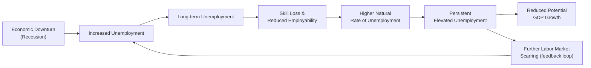

## Introduction and Context

So, let me start by saying: I've often heard people talk about recessions as if they're just temporary dips—like a little rain shower, you know? The thought goes that once the storm clears, the labor market will brighten up, and everything will go back to normal. But in reality, sometimes that storm has a way of leaving behind all sorts of problems that, well, stick around. This is the phenomenon we call “hysteresis” in unemployment. And honestly, it’s one of the most important ideas when we’re thinking about labor markets post-recession—because it challenges the usual assumption that economies naturally and quickly bounce back to something we might call full employment.

This concept connects closely to other themes in Chapter 3 on Business Cycles—particularly how cyclical downturns can morph into structural challenges (see 3.12 Labor Market Dynamics). It also ties in with the overall discussion on how unemployment interacts with GDP (3.1 Measuring GDP and National Income) and how potential output can be weighed down (3.11 Measuring Potential Output and Output Gap Approaches).

## Defining Hysteresis

Hysteresis is that pesky situation where a temporary spike in unemployment can persist long after a recession or downturn is over. In other words, once unemployment becomes elevated, it doesn’t always fall back to its previous level. Think about it: if a worker remains unemployed for a long time, their skills may rust, their professional networks might dwindle, and employers may be hesitant to hire someone with a big gap in their résumé. As a result, those individuals can struggle to find new jobs, which effectively increases the so-called natural rate of unemployment.

While cyclical unemployment is usually described as unemployment that arises purely from fluctuations in the business cycle, hysteresis suggests that cyclical unemployment can leave scars (commonly called “scarring effects”) on the labor force, transforming what is cyclical into something structural. This phenomenon is particularly visible during deep recessions—some workers end up jobless for so long that they effectively become unemployable.

## Key Mechanisms Behind Hysteresis

1. Skill Degradation (Scarring Effect)  
   Workers who are unemployed for extended periods often fall behind on new technologies or changing market practices. For example, imagine a software developer who was let go during a recession. If that developer cannot find work for a year or two, they may miss out on new programming languages or frameworks that become the industry standard. That skill gap can make them less attractive to employers or force them to accept a lower-paying position.

2. Loss of Network and Motivation  
   Staying unemployed for a long time can erode personal networks and reduce opportunities. Employers might look skeptically at sizeable employment gaps on a résumé, assuming there must be some reason other than the economy’s cyclical downturn. Meanwhile, the unemployed individual can become discouraged or disconnected from labor market opportunities. This psychological toll can prolong unemployment spells.

3. Negative Signaling and Employer Perceptions  
   Employers often interpret long-term unemployment as a negative signal, even if the actual reasons for that extended joblessness are external (like a deep recession). This dynamic can create a vicious cycle: the longer someone is out of work, the harder it becomes to get back in.

4. Institutional and Policy Barriers  
   Sometimes, labor market institutions—like stringent regulations on hiring and firing, or minimal retraining programs—can amplify hysteresis. Without policy measures aimed at reintegrating long-term unemployed individuals, the natural rate of unemployment can become entrenched at higher levels.

## Why Hysteresis Matters for Business Cycle Analysis

We often think, “When the economy picks up, companies will hire.” Historically, many economists adhered to models stating that after a negative demand or supply shock, the labor market would return to equilibrium at or near the natural rate. But hysteresis suggests the new equilibrium may be a less favorable one:

• Potential Output Shrinks: A growing proportion of unemployed workers losing relevant skills can lead to reduced productive capacity, thereby shrinking an economy’s potential output.  
• Increased Structural Unemployment: Even when overall demand picks up, you can end up with a mismatch between what companies need and what long-term unemployed individuals can offer.  
• Gradual Shifts in NAIRU: The Non-Accelerating Inflation Rate of Unemployment (NAIRU)—the concept that tries to pinpoint the unemployment rate consistent with stable inflation—can shift upward because of the prolonged joblessness. In essence, you might have to live with a higher unemployment rate to avoid inflationary pressures, because the labor market has changed.

This means that, from a policy standpoint, ignoring hysteresis could lead a central bank to underestimate just how many resources remain idle. If policymakers assume that they can’t push unemployment below a certain bound without triggering inflation, but that bound has shifted over time due to hysteresis, you can see how macroeconomic policies might be less effective (or could even produce undesired outcomes).

## A Simple Look at the Mathematics of Hysteresis

To illustrate how hysteresis might show up in a stylized mathematical form, consider the idea that the actual unemployment rate Over Time (Uᵗ) might affect the natural rate of unemployment (U*). One possible representation is:


U^*_{t+1} = U^*_{t} + \alpha(U_{t} - U^*_{t})


where:
• \\( U^*_{t+1} \\) is the natural rate of unemployment at time \\( t+1 \\).  
• \\( \alpha \\) is a parameter that captures the degree to which deviations in actual unemployment from its natural rate feed back into the natural rate itself.  
• \\( U_{t} \\) is the actual unemployment rate at time \\( t \\).  
• \\( U^*_{t} \\) is the natural rate of unemployment at time \\( t \\).

If \\( \alpha \\) is very small (close to zero), it means the impact of temporary shocks on the natural rate is minimal—i.e., no strong hysteresis. But if \\( \alpha \\) is larger, the deviation in actual unemployment from the current natural rate more strongly influences the future natural rate. Consequently, a significant recession-driven spike in actual unemployment can translate into a higher future natural rate, even after the recession ends.

## Spotlight Example: The Global Financial Crisis

One episode that highlighted hysteresis was the aftermath of the 2008–2009 global financial crisis. Unemployment soared in many advanced economies. While the initial reasoning was cyclical (banks cutting lending, consumer demand dropping, businesses laying off workers), many labor markets took years—some nearly a decade—to return to pre-crisis unemployment rates. Younger workers, in particular, found themselves locked out of the job market at a crucial time in their lives. Many ended up underemployed or even took jobs unrelated to their fields of study, hampering long-term career development. Those who were older sometimes faced age-discrimination or lost touch with evolving workplace technologies. As a result, some economists argued that the so-called “Great Recession” left a hysteresis imprint, raising the region’s baseline unemployment rate and trimming potential growth for several years.

## Practical Policy Implications

Policymakers who recognize the threat of hysteresis might react more proactively. Why? Because once unemployment gets entrenched, it’s a lot harder to bring back down. The standard policy tools (think monetary policy rate cuts or expansionary fiscal measures) might not be enough if the problem is no longer just a shortage of demand. You also need structural or labor-focused initiatives:

• Active Labor Market Policies (ALMPs): This includes targeted job training to help the long-term unemployed reskill or upskill, wage subsidies for at-risk groups, apprenticeship or internship programs to establish new labor networks, and job placement services.  
• Encouraging Labor Mobility: Sometimes, workers are unemployed in one region while job opportunities are plentiful in another. Policies that reduce the costs and frictions of geographic mobility—like housing subsidies or relocation assistance—can help.  
• Retraining and Vocational Programs: If entire sectors are in decline, workers might need entirely new skill sets. Consider what happened to certain manufacturing towns around the world. Once big factories closed, local unemployment soared—and it stayed high because there weren’t enough re-skilling programs to help these workers move into alternative sectors.  
• Unemployment Benefits with a Reemployment Focus: Unemployment insurance is crucial to support workers who lose their jobs, but pairing those benefits with mandatory job training, skill development, or job-search assistance can mitigate skill decay and help them remain “job-search active.”

## Diagram: Hysteresis Feedback Loop

Consider this Mermaid.js diagram illustrating how cyclical unemployment can spiral into a structural challenge—hysteresis:

Here’s how it works:

• Economic downturn leads to increased unemployment.  
• Prolonged joblessness contributes to skill loss.  
• This skill loss and employer bias push up the natural rate of unemployment.  
• Eventually, the cycle of difficulty in finding work can feed back into new rounds of labor force discouragement.

## Best Practices for Investors and Portfolio Managers

If you’re a portfolio manager or an analyst, you might be thinking, “So, how does this affect my forecasts or asset allocations?” Well, hysteresis can shape your macroeconomic assumptions in the following ways:

• Longer Recovery Path: If a recession triggers hysteresis, you might expect longer periods of below-trend economic growth. This can influence bond yields, equity valuations, and credit risk analysis.  
• Risks to Productivity Growth: A higher natural rate of unemployment might reflect deeper economic scarring, which can impact corporate earnings growth, especially in labor-intensive industries.  
• Assessing Labor Market Data: In practice, watch out for changes in long-term unemployment statistics and labor force participation rates. If you see a big jump in people dropping out of the labor force, it might indicate hysteresis is taking hold.  
• Parallel to Supply-Side Economics: Hysteresis is essentially the reverse side of the coin of supply shocks. Instead of new technology or expansions in labor markets boosting potential output, you have entrenchment of negative shocks lowering it. This factor can inform how you weigh cyclical vs. structural analyses in your models.

## Real-World Challenges and Anecdotes

I have a neighbor who was laid off during a major manufacturing sector downturn a few years back—let’s call him Dave. He had worked in the same plant for over 20 years, then suddenly found himself unemployed. Sure, he got some short-term benefits. But computer applications, coding, data analytics—these skill sets felt alien to him, so he kept applying for similar manufacturing roles. Unfortunately, those roles were disappearing or moving elsewhere. Dave’s been job-hunting for months, and each time he sends out his résumé, it seems like the first question from recruiters is about the gap in employment. That’s hysteresis in action—Dave’s prior skills aren’t transferring directly to new industries, and the length of his unemployment is making him look risky to potential employers. It’s a vicious cycle and is exactly what economists highlight when they talk about scarring effects.

## Linkages to Other Chapters

- (3.12) Labor Market Dynamics: Hysteresis interacts heavily with frictional, structural, and cyclical unemployment. As cyclical unemployment persists, it evolves into structural unemployment through skill-loss.  
- (3.9) Okun’s Law: The relationship between unemployment and GDP growth can be altered when the labor market doesn’t revert to its old normal. You might see weaker-than-expected improvements in GDP growth during the recovery if large numbers of workers remain sidelined.  
- (3.5) Phases of the Business Cycle: While expansions typically bring unemployment down, hysteresis can cause slower recoveries and lower maximum peak employment in subsequent cycles.  
- (7.7) Fiscal Policy Tools: Expansionary fiscal policy might still be crucial in times of high structural unemployment, but the focus shifts to targeted interventions, such as job training and subsidies, rather than broad stimulus.

## Critiques and Counterarguments

Not all economists completely agree on the extent to which hysteresis dominates labor market behavior. Some argue that recessions can induce labor reallocation—pushing people from declining sectors into more promising ones. Eventually, they claim, the workforce can adapt, and the unemployment rate can move back to its old baseline. Additionally, if the economy overheats, employers might be forced to hire those long-term unemployed, ironically helping reduce hysteresis. However, many economists point out that the process tends to be slow and uneven, and without strong policy interventions, hysteresis can become a serious drag on growth.

## Strategies to Mitigate Hysteresis

• Job-Matching Platforms: Online portals that use AI to match skill sets with employer needs in real-time can reduce friction and help job-seekers pivot more quickly.  
• Incentivizing Reskilling: Tax breaks or subsidies for companies that offer robust retraining programs to their workers or new hires.  
• Strong Ties to Education: Partnerships between governments, universities, and businesses that ensure curricula remain relevant to the changing job market, reducing the likelihood of skill obsolescence.  
• Support for Self-Employment: Dependency on big employers can be offset by supporting entrepreneurship through microloans or credit lines, potentially spurring local job creation.

## Common Pitfalls and Challenges

1. Overemphasis on Demand-Side Policies: Sometimes, policymakers believe that simply pumping up aggregate demand will solve unemployment. While this can help cyclical unemployment, it may do little for long-term unemployed workers whose skill sets need upgrading.  
2. Insufficient Labor Market Flexibility: Rigidities—like strict labor regulations or high bureaucratic hurdles to starting new businesses—can prevent the economy from adapting to new conditions, thereby worsening hysteresis.  
3. Neglecting Psychological and Social Dimensions: Prolonged joblessness can cause social isolation, mental health struggles, and erosion of confidence. Failing to address these factors can stifle the effectiveness of training and reemployment initiatives.  
4. Short-Term Funding Windows: Often, labor policies receive attention in the immediate aftermath of a recession, but that focus might fade after a few years. Hysteresis is a long-run concern, and sustaining these programs is crucial.

## Conclusion

Hysteresis in unemployment shines a spotlight on how a temporary downturn can leave deep and lasting scars on both individuals and the economy. It’s a subtle but incredibly important concept that can dramatically shift the labor market’s recovery trajectory. If you’re analyzing economies—whether for forecasting, investment decisions, or policy advising—failing to incorporate the potential effects of hysteresis can lead to overly optimistic growth and inflation forecasts. So, keep a watchful eye on long-term unemployment trends, skill development initiatives, and the shifting backdrops of structural change. After all, we’re witnessing that persistent layoffs in one era can shape the labor market for years to come, challenging old assumptions about bouncing back to “normal.”

## References and Further Reading

- Blanchard, O. & Summers, L. (1986). “Hysteresis and the European Unemployment Problem.” NBER Macroeconomics Annual.  
- Layard, R., Nickell, S., & Jackman, R. (2005). “Unemployment: Macroeconomic Performance and the Labour Market.” Oxford University Press.  
- OECD iLibrary on Labour Market Policies: https://www.oecd-ilibrary.org/  
- Chapter 7 of this Volume: “Monetary and Fiscal Policy,” for insights on active labor market policies.  
- Chapter 3.12: “Labor Market Dynamics” for a detailed look at frictional, structural, and cyclical unemployment.

## Test Your Knowledge: Hysteresis in Unemployment



### According to the concept of hysteresis, a temporary increase in unemployment can:
- [ ] Automatically revert to the pre-recession level.
- [ ] Have no effect on the long-run natural rate of unemployment.
- [x] Become persistent and raise the long-run natural rate of unemployment.
- [ ] Reduce the economy’s output gap permanently, but not its potential output.

> **Explanation:** Hysteresis suggests that prolonged periods of unemployment can raise the natural rate of unemployment, as workers lose skills, face negative signaling, or drop out of the labor force.

### Which factor best illustrates the scarring effect contributing to hysteresis?
- [ ] Workers receiving higher wages and preferring to remain jobless.
- [x] Loss of skills and professional networks during extended unemployment.
- [ ] Sudden increase in aggregate demand due to government spending.
- [ ] Rapid decline in inflation during economic expansions.

> **Explanation:** Hysteresis is driven by the scarring effect: as workers remain unemployed, they experience skill atrophy and weaker professional networks over time, hindering future re-employment.

### A key difference between cyclical and hysteresis-based unemployment is that:
- [x] Hysteresis-based unemployment may persist even after a recovery, raising the natural rate.
- [ ] Cyclical unemployment increases the workforce’s long-term productivity.
- [ ] Cyclical unemployment has no relation to changes in aggregate demand.
- [ ] Hysteresis usually disappears at the first sign of growth.

> **Explanation:** Cyclical unemployment is tied to fluctuations in demand and typically reverts once those fluctuations stabilize, whereas hysteresis can remain entrenched if labor skills and connections deteriorate.

### What is the primary policy implication of hysteresis?
- [ ] Monetary easing alone can solve hysteresis if real interest rates go negative.
- [x] Targeted labor market interventions (e.g., retraining) are needed to mitigate long-term unemployment.
- [ ] Full employment occurs automatically after short cycles.
- [ ] Capital market interventions are more important than labor market policies.

> **Explanation:** Hysteresis highlights that cyclical unemployment can morph into structural unemployment without active measures. Policymakers often need labor market interventions such as job training incentives and programs to reduce persistent unemployment.

### Which statement about the natural rate of unemployment (NAIRU) is most consistent with hysteresis?
- [x] The NAIRU can shift upward when workers lose skills and become structurally unemployed.
- [ ] The NAIRU is fixed and never changes regardless of economic conditions.
- [ ] The NAIRU cannot be influenced by long-term unemployment durations.
- [ ] The NAIRU primarily reflects cyclical rather than structural unemployment factors.

> **Explanation:** When workers remain unemployed for long periods, their productivity and employability suffer, potentially pushing the NAIRU upward.

### How do employer perceptions contribute to hysteresis?
- [x] Employers may view long spells of unemployment as a negative signal, making it harder for those workers to get rehired.
- [ ] Employers generally do not discriminate between short-term and long-term unemployed applicants.
- [ ] Employers provide premium wages to long-term unemployed workers.
- [ ] Employers prefer to hire out-of-work individuals over job-hoppers.

> **Explanation:** Extended joblessness can create negative signaling, compounding unemployment for those who have been out of work for a long period.

### Which scenario highlights a risk of hysteresis taking root?
- [x] A severe recession where a large segment of the population remains jobless for several years.
- [ ] A short contraction in which unemployment briefly rises but then drops rapidly to previous lows.
- [x] A demographic boom leading to an increase in labor force participation.
- [ ] High labor mobility ensuring most unemployed individuals relocate quickly for new opportunities.

> **Explanation:** A severe, prolonged recession fosters conditions under which hysteresis can emerge because the long out-of-work population may undergo skill and network deterioration.

### Which of the following policy approaches is most likely to be effective in reducing the risk of hysteresis?
- [x] Job retraining programs designed for long-term unemployed individuals.
- [ ] Raising interest rates to combat inflation.
- [ ] Imposing tougher labor market regulations to protect current workers’ jobs.
- [ ] Encouraging reduced work hours to spread jobs across more workers.

> **Explanation:** Active labor market policies, particularly retraining, help restore employability and reduce persistent unemployment—key to mitigating hysteresis.

### If hysteresis is significant, how might it affect equity market valuations?
- [x] It could reduce long-term corporate earnings growth, leading to a downward revision in equity valuations.
- [ ] It would immediately boost all stock prices, especially technology firms.
- [ ] It would have no impact on corporate profitability or dividend payouts.
- [ ] It can guarantee rapid wage growth and higher consumer demand.

> **Explanation:** Persistent unemployment means lower demand growth, weaker productivity, and less competition for high-skilled labor, which often hampers corporate revenue and profit growth.

### Hysteresis implies:
- [x] True
- [ ] False

That unemployment can become partly structural after a strong cyclical shock, thus influencing the labor market for the long-term.

> **Explanation:** The essence of hysteresis is that cyclical joblessness can morph into structural unemployment because workers face skill degradation and reputational hurdles.


