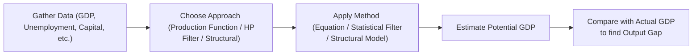

## Introduction

Ever wondered if the economy could, well, produce more without sending prices through the roof? That’s pretty much the essence of measuring potential output. It's the level of GDP an economy can crank out when labor and capital are utilized efficiently (but not overstretched). In practice, policymakers, economists, and market participants rely on this idea of a “potential” or “trend” GDP to guide monetary and fiscal decisions—particularly whether to keep stimulating or start tapping the brakes. You’ll see that measuring potential output is both art and science, combining math-based estimations with a bit of strategic judgment. In this section, we’ll explore the main methods—Production Function, Hodrick-Prescott Filter, and various Structural Approaches—and then dig into how we interpret the results through something called the output gap.

Alright, let’s dive in.

## Understanding Potential Output

To anchor all these pieces, let’s first define potential output in simpler terms: it’s that sweet spot—the maximum production level that can be sustained without provoking a change in the inflation rate. In other words, once you try to push the economy above this level, you generally get strains in labor and product markets. That leads to resource scarcity, wage and price pressures, and eventually, inflation. Conversely, operating below potential might indicate underemployed labor and underutilized capital, which could signal economic slack, unemployment, or deflationary tendencies.

### Why Potential Output Matters for Policy and Forecasting

• Monetary policy decisions: Central banks often look at whether the actual GDP is above or below potential. If the economy’s revving above potential, a rate hike might be on the table; if it’s languishing, a cut or other stimuli may be warranted.  
• Fiscal policy: Similarly, governments estimate potential output to gauge if they need to step in with spending or tax adjustments to close an output gap.  
• Investment analysis: For analysts, potential GDP estimates feed into macro forecasts, sector-level predictions, and risk assessments.

From a CFA viewpoint, understanding these concepts is crucial for asset allocation and top-down economic analysis—connect this with your inflation forecasts, cyclical considerations, or even credit cycle evaluations, and you have a powerful tool for making portfolio management decisions.  

## Approaches to Measuring Potential Output

There’s no single “best” way to estimate potential GDP. Each method has its quirks, assumptions, and demands on data. We’ll look at the three main categories and note the upside and pitfalls of each.

### Production Function Approach

One classic framework is the Cobb-Douglas production function, often expressed like this:


Y = A \times K^{\alpha} \times L^{\beta}


where:
• \\(Y\\) = Output (GDP)  
• \\(A\\) = Total Factor Productivity (the “secret sauce” that captures technology and efficiency)  
• \\(K\\) = Capital stock  
• \\(L\\) = Labor input  
• \\(\alpha\\) and \\(\beta\\) = Output elasticities with respect to capital and labor, respectively

In words, it says that output depends on how much capital and labor are available and how effectively they’re utilized (i.e., technology). Potential output gets computed by plugging in the “full employment” levels of labor (the so-called natural rate of unemployment) and normal capital utilization. Over time, each factor grows or changes, so you get a potential output series that evolves in line with population, investment, and productivity trends.

#### Practical Example: Production Function Estimation

Imagine you’re analyzing a small economy—let’s call it Econland. You know:
• Capital stock (K) = 500 units  
• Labor force (L) = 200 units  
• Technology factor (A) = 2  
• \\(\alpha\\) = 0.4, \\(\beta\\) = 0.6 (meaning 40% of output growth is attributed to capital and 60% to labor, in simplified form)

So, potential output might be:

Y = 2 \times 500^{0.4} \times 200^{0.6}

If you run the math (trust me, it's a bit tedious but straightforward), you’ll find some “baseline” figure for potential GDP. If, for instance, Econland hits a scenario in which labor hours or capital usage exceed their sustainability thresholds, you’d say it’s running above potential output, i.e., it’s at risk of inflation.

(Quick anecdote: I remember a professor telling me how once they forgot to adjust for a change in the capital depreciation rate in their model. The result? They overestimated potential output by a wide margin. Moral of the story—be careful with the assumptions that go into your production function!)

### Statistical Filters (Hodrick-Prescott Filter)

Let’s move on to something more data-driven than theoretical: the Hodrick-Prescott (HP) filter. The HP filter tries to separate a time series (like GDP) into two components:
• A trend component (which we interpret as potential GDP).  
• A cyclical component (the short-term booms and busts).

In a sense, the HP filter “smoothes” the data to reveal an underlying slow-moving trend. The smoothing parameter (\\(\lambda\\)) determines the rigidity of the trend line. A larger \\(\lambda\\) places more emphasis on smoothness, while a smaller \\(\lambda\\) allows potential output to adapt more often to short-term fluctuations.

#### Basic HP Filter Formula

The HP filter solves an optimization problem:


\min_{\tau_t} \sum_{t=1}^{T} (y_t - \tau_t)^2 + \lambda \sum_{t=2}^{T-1} [(\tau_{t+1} - \tau_t) - (\tau_t - \tau_{t-1})]^2


where:
• \\(y_t\\) is actual GDP,  
• \\(\tau_t\\) is the trend component (i.e., the potential GDP estimate),  
• \\(\lambda\\) is the smoothing parameter.

Yes, it looks complicated, but it basically says: we want \\(\tau_t\\) to be “close” to \\(y_t\\) while keeping \\(\tau_t\\) from zig-zagging too dramatically.

#### Example with Python

You can easily run an HP filter in Python. Let’s say you have GDP data in a Pandas DataFrame called df with a column named 'GDP':

```python
import pandas as pd
import statsmodels.api as sm

cycle, trend = sm.tsa.filters.hpfilter(df['GDP'], lamb=1600)  # typical lambda for quarterly data
df['HP_Trend'] = trend
df['HP_Cycle'] = cycle
```

With that code snippet, you’re effectively extracting your potential GDP (HP_Trend) from the raw data. The cyclical deviations (HP_Cycle) show where the economy is above or below potential.

One big advantage of the HP filter is that it’s relatively easy to implement. The disadvantage is that it’s purely statistical, lacking deeper economic logic about capital, labor, or productivity. Also, the choice of \\(\lambda\\) can drastically influence results (and can be debated among economists and analysts).

### Structural Methods

Finally, we have structural approaches, which combine theoretical frameworks and observed indicators like labor force participation, capital formation, capacity utilization rates, and productivity estimates. You could look at the level of labor market slack (or how close we are to “full employment”) or tally up how many factories are near maximum capacity.

Common elements might be:
• Estimating the NAIRU (Non-Accelerating Inflation Rate of Unemployment) for labor input.  
• Using average or benchmark capacity utilization rates as a “neutral” point for capital.  
• Incorporating direct measures of productivity growth to see how the economy’s structural efficiency evolves.

Structural methods can be data heavy, and sometimes you have to make judgment calls—like deciding what unemployment rate truly represents “full employment.” In some regions, skill mismatches or demographic shifts can push that natural rate up or down, making everything more complicated.

### Diagram: Measuring Potential Output

Below is a simple Mermaid diagram that shows how different approaches might feed into your final measure of potential GDP:



## The Output Gap

The output gap is simply the difference between actual GDP and potential GDP:


\text{Output Gap} = \text{(Actual GDP)} - \text{(Potential GDP)}


If actual GDP exceeds potential, you have a positive output gap, which typically indicates possible inflationary pressures. If actual GDP is below potential, you have a negative output gap, which points to slack in the economy, underemployment, and possible deflationary or disinflationary pressures.

Knowing the size and direction of the gap helps central banks calibrate interest rates and helps investors gauge the cyclical health of the economy. For instance, if you see a large positive gap, you might ask yourself: “Is the central bank likely to tighten soon?” On the other hand, a big negative gap could suggest continuing accommodative policy, which might spur bond prices or influence equity market performance.

### Linking Output Gap to Business Cycles

The business cycle’s phases—expansion, peak, contraction, and trough—are intimately connected to movements in the output gap. When an economy is in the latter stages of expansion and near its peak, we often see a positive gap. As it heads into contraction, that gap tends to close and turn negative, culminating at or around the trough. Then the cycle restarts.

For deeper reading on business cycles, we can cross-reference other sections in this volume—especially “3.5 Phases of the Business Cycle,” where we detail how expansions and recessions progress, and “3.8 Unemployment and Output Gaps” for a deeper dive into how job markets tie into the story.

## Practical Uses and Interpretation

• Policy Analysis: Central banks can lower interest rates or continue quantitative easing if the economy’s operating below potential. If you suspect the Federal Reserve or ECB sees a negative gap, it might keep yields lower for longer—a crucial insight when you’re making bond allocations.  
• Inflation Forecasting: If the gap is positive and climbing, you might expect rising inflation. If you see negative gaps in the data for a few consecutive quarters, that may lean more disinflationary.  
• Investment Strategy: Asset managers frequently incorporate output gap analysis to tilt portfolios. For instance, cyclical stocks (industrials, consumer discretionary) might be favored if we expect the gap to turn positive soon. Defensive sectors (utilities, consumer staples) might come into play if a negative gap is likely or if we suspect a recession.  

## Common Pitfalls and Best Practices

1. **Blind Reliance on One Method**  
   It can be tempting to treat the HP filter as a black box and just trust the numeric output, but you should cross-check results with other variables like unemployment or capacity utilization. Typically, a multi-angle approach yields more robust insights.

2. **Incorrect Parameter Choices**  
   Using an inappropriate \\(\lambda\\) in the HP filter can mislead you. Similarly, in the production function, if you calibrate the elasticity parameters incorrectly or misjudge the natural rate of unemployment, your potential GDP estimate will be skewed.

3. **Ignoring Structural Shifts**  
   Think about major changes like a shift in technology or a pandemic that abruptly changes labor market dynamics. Relying on old data might lead you astray in those “break” periods.

4. **Overfitting the Trend**  
   Trying to force a perfect fit to historical data can produce spurious results. Sometimes, it’s better to keep it simple and interpret broader signals from your potential output estimates.

## Encouraging Critical Thinking

When measuring potential output, it’s worth stepping back and asking “Does this estimate make sense given broader economic conditions?” For instance:
• Are there signs of wage inflation that contradict an estimated large negative gap?  
• Are there supply chain bottlenecks suggesting the economy’s actually operating at capacity?  
• Is there data about new industrial capacity or technology breakthroughs that might increase the potential beyond historical trends?

Engaging with these questions helps you become a more insightful and skeptical analyst—exactly what’s needed for the CFA Level III exam and real-world portfolio management.

## Final Exam Tips: Potential Output and Output Gap

1. **Link Concepts to Monetary Policy**  
   Remember: exam questions often ask you to interpret central bank actions in the context of whether the economy is above or below potential GDP.

2. **Practice Multiple Calculation Methods**  
   Be prepared to handle a quick production function question (e.g., to find potential GDP at full employment) and also interpret a chart from an HP-filter-based analysis.

3. **Watch for Trick Questions with Recent Shocks**  
   You might see scenarios that involve structural changes—like a new technology adoption or an exogenous labor shock. The question might test how you adapt your potential GDP estimate.

4. **Understand the Policy Implications**  
   You may have a constructed-response question about fiscal stimulus in a negative output gap environment or a question about tightening in a positive gap scenario.

5. **Be Familiar with Key Terms**  
   Terms like “NAIRU,” “capacity utilization,” and “trend GDP” are common exam jargon. Master how they interrelate.

## References and Further Reading

• De Loecker, J. & Goldberg, P. K. (2014). “Firm Performance in a Global Market.” Annual Review of Economics.  
• European Central Bank – Potential Output and Output Gap Analysis:  
  https://www.ecb.europa.eu/pub/pdf/other/art1_mb201103en_pp73-90en.pdf  
• IMF Working Papers on Potential GDP Estimation:  
  https://www.imf.org/en/Publications/wp  

You’ll also find plenty of discussions in official CFA texts around trend growth, sustainable capacity, and the role of potential output in policy decisions.

---

## Test Your Knowledge: Potential Output and Output Gap Quiz



### What does a positive output gap typically indicate about an economy?

- [x] The economy may face inflationary pressures.
- [ ] The economy is operating significantly below its potential.
- [ ] The economy is in a deep recession.
- [ ] The natural rate of unemployment is above actual unemployment levels.

> **Explanation:** A positive output gap occurs when actual GDP exceeds potential GDP, often pushing resources to (or beyond) capacity and fueling inflationary pressures.

### Which of the following methods uses a parameter λ to smooth out GDP data to estimate a trend component?

- [ ] Production Function Approach
- [x] Hodrick-Prescott Filter
- [ ] Structural Method
- [ ] Okun’s Law Method

> **Explanation:** The Hodrick-Prescott Filter is a statistical technique that separates a time series into trend and cyclical components, controlled by the smoothing parameter λ.

### In the Production Function Approach, which component typically captures improvements in technology?

- [ ] L (Labor Input)
- [ ] K (Capital Stock)
- [x] A (Total Factor Productivity)
- [ ] α (Elasticity Of Capital)

> **Explanation:** The term A in the production function (often called “technology” or “total factor productivity”) captures the efficiency or technology level that multiplies the productivity of capital and labor.

### What might be a limitation of purely statistical approaches (like the HP filter) for estimating potential output?

- [x] Lack of explicit economic relationships or structural insights
- [ ] Overreliance on production elasticity estimates
- [ ] The necessity to incorporate inflation and interest rates
- [ ] Estimation errors only occur with monthly data

> **Explanation:** The HP filter is a “black box” approach that doesn’t explicitly account for labor or capital structures, relying instead on smoothing out historical GDP data without deeper economic rationale.

### If structural changes such as demographic shifts significantly alter the labor force, why might certain methods understate or overstate potential GDP?

- [ ] Because α and β in the Cobb-Douglas function might be inverted
- [ ] Because HP filters tend to pick up short-term variations but ignore long-term trends
- [x] Because older parameter estimates may no longer reflect new labor force realities
- [ ] Because total factor productivity is unaffected by labor force changes

> **Explanation:** If a model fails to adjust for changes in demographics (e.g., an aging workforce or migration), the calibration of full employment or labor supply may become outdated, causing the estimate of potential GDP to be off.

### A negative output gap is often associated with:

- [ ] Overheating in the economy
- [x] Excess capacity and unemployment
- [ ] High rates of wage inflation
- [ ] Structural productivity decline

> **Explanation:** A negative output gap indicates that actual GDP is below potential, implying resources (labor, capital) are not fully employed, which typically aligns with lower wage pressures and higher unemployment.

### Which of the following is a key “structural” indicator used in some methods to measure potential GDP?

- [x] Capacity utilization
- [ ] Consumer confidence index
- [ ] Monetary base
- [ ] Overnight interest rate

> **Explanation:** Measures of “structure,” such as capacity utilization, help capture how effectively firms are using their existing plant and equipment, which ties directly into the concept of potential production.

### When using a production function approach, which of the following might cause you to revise upward your estimate of potential output?

- [ ] Decrease in labor force participation
- [ ] Lower capital investment
- [x] Discovery of a new technology that boosts productivity
- [ ] A higher λ in the HP filter

> **Explanation:** A jump in technology (i.e., higher total factor productivity) directly raises potential output under a production function framework, as the economy can produce more with the same capital and labor inputs.

### In practical macroeconomic policy analysis, how is the output gap often used?

- [ ] To adjust for foreign exchange volatility
- [x] As a signal of potential inflation or deflation pressures
- [ ] Primarily as a measure of government budget balance
- [ ] As a measure of total labor force participation

> **Explanation:** Policymakers often monitor the gap to see if the economy is overheating (positive gap) or underperforming (negative gap), which can translate into inflationary or deflationary pressures, respectively.

### True or False: A potential GDP estimate is universally agreed upon by economists and is rarely controversial.

- [ ] True
- [x] False

> **Explanation:** Potential GDP is inherently an estimate that depends on assumptions about labor, capital, technology, and even data filters. Different methods can yield different results, making consensus difficult.


