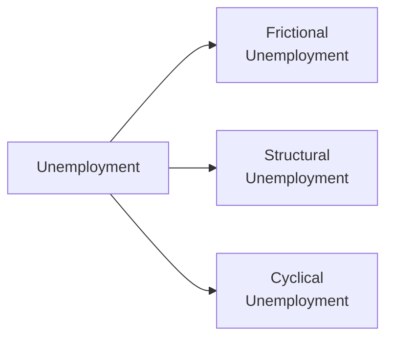

## Introduction
Have you ever wondered why some people are out of work even when the economy is—you know—doing fine? Or why workers might struggle to find a good job match even if opportunities technically exist somewhere else in the country? Anyway, labor markets can be surprisingly tricky to navigate. In our ongoing look at business cycles, it’s not enough to know that the economy expands and contracts; we also need to figure out how those expansions and contractions affect people’s livelihoods. That is where labor market dynamics come in. 

Understanding different types of unemployment is crucial for policymakers, analysts, and investors alike. After all, unemployment trends can signal shifts in consumer confidence, changes in aggregate demand, or even the need to reshuffle entire industries. And for a portfolio manager eyeing the next business cycle downturn, changes in employment might just be an early warning sign that prompts defensive investment positioning. In this section, let’s explore frictional, structural, and cyclical unemployment in detail, examine the real-world significance of each, and see how they fit into the broader context of economic policy and portfolio risk management.

## Theoretical Foundations of Unemployment
Before diving into the specific categories, consider the bigger picture of how unemployment is measured and analyzed. You might cycle back to Section 3.8 discussing unemployment and output gaps or consult 3.9 on Okun’s Law for insight into how changes in output relate to joblessness. In any healthy or “normal” labor market, there is often some level of unemployment—even during boom times. That baseline unemployment rate is sometimes called the “natural rate of unemployment,” which typically combines both frictional and structural unemployment. When total unemployment exceeds that natural rate, it often signals cyclical weakness tied to the business cycle.

One commonly used formula to break down unemployment might look like this:

Unemployment Rate = Natural Unemployment Rate + Cyclical Unemployment Rate

The natural unemployment rate in many advanced economies tends to hover in the range of 3% to 5%—though it differs by region. If an economy’s measured unemployment rate is, say, 7% while the natural rate is estimated at 5%, that 2% difference is generally tied to cyclical factors. In other words, the rest of the story (that 5%) might be frictional and structural.

## Frictional Unemployment
Frictional unemployment arises from the ordinary process of matching employees to employers. Even if there are plenty of job openings, you still need time to apply, interview, and get hired. Think of it like searching for the perfect new apartment: you may briefly be between leases before you find a place that suits your budget and tastes. 

### Causes
• Job Search and Voluntary Transitions: People quitting one job to look for another often experience short spells of unemployment.  
• Entry or Re-entry: Recent graduates entering the job market can also swell frictional unemployment numbers, as can individuals returning to work after some time away.  
• Normal Middle Periods: Not all workers and jobs perfectly align at the exact same moment. A short gap is part of life’s normal flow.

### Policy Responses
• Job-Matching Services: Online platforms, job fairs, and improved career services can quicken the match process.  
• Enhanced Information: Government or industry portals that post real-time job data can reduce search times.  
• Placement Initiatives: Programs that specifically reduce the lag between leaving one job and starting another can help.  

Because frictional unemployment reflects normal labor turnover, many economists see it as a healthy sign of a dynamic economy (as opposed to a stagnant job market where nobody changes roles).

## Structural Unemployment
Structural unemployment is more serious and longer-term than frictional unemployment. It arises when there’s a mismatch between workers’ skill sets or locations and the positions available.

### Causes
• Technological Shifts: Automation and new technologies can displace entire job categories, leading to layoffs of workers whose skills no longer align with market needs.  
• Globalization and Offshoring: If manufacturing relocates overseas, local workers might be left behind unless they adapt or move.  
• Changes in Consumer Demand: When consumer preferences change rapidly (e.g., from physical newspapers to online platforms), industries employing certain specialized workers can shrink.  
• Geographic Factors: Jobs can cluster in regions far from unemployed workers, who may or may not be able to relocate.

### Policy Responses
• Retraining and Professional Development: Government programs or private-public partnerships to help workers learn new skills.  
• Education Reform: Encouraging math, engineering, or digital skills in schools to match future market demands.  
• Mobility and Infrastructure: Housing incentives or transportation subsidies can help workers move (or commute) to where jobs exist.  
• Active Labor Market Policies (ALMPs): Include job-placement services, targeted wage subsidies, and other incentives to encourage hiring in high-unemployment areas.

Structural unemployment tends to endure unless properly addressed. It can persist or worsen during recessions or in periods of rapid technological change. From an investor’s perspective, a region with high structural unemployment might see decreased consumer spending power, impacting local markets and real estate.

## Cyclical Unemployment
Cyclical unemployment, also known as “demand-deficient” unemployment, tracks closely with the ups and downs of the economic cycle. So if you ever hear your neighbor mention they lost their job “because the economy tanked,” that’s cyclical in a nutshell.

### Causes
• Economic Downturns: Recessions, triggered by drops in aggregate demand, push employers to reduce production and cut jobs.  
• Financial Crises: Credit contractions can reduce consumer and business spending, leading to lower output and reduced labor demand.  
• Sectoral Shocks: A heavy blow to an industry—like an oil price collapse for energy-intensive regions—can create broad-based job losses if the ripple effects spread.

### Policy Responses
• Expansionary Monetary Policy: Central banks can lower interest rates or use quantitative easing to stimulate borrowing and spending.  
• Expansionary Fiscal Policy: Governments can increase spending or cut taxes to boost aggregate demand.  
• Automatic Stabilizers: Unemployment insurance and other welfare programs can cushion the blow for laid-off workers, supporting consumption.

Understanding cyclical unemployment is vital for analysts who track the business cycle’s turning points (as we explore throughout Chapter 3). For instance, a spike in unemployment might indicate that corporate earnings could fall, corporate bond default risk could rise, and equity market prices might come under pressure—all big signals for portfolio allocation decisions.

## Measurement and Indicators
If you imagine you’re an economist at a central bank, you might gather a range of indicators beyond the basic unemployment rate to see how frictional, structural, or cyclical unemployment is trending. Examples include:

• Job Vacancy Rate: A high number of unfilled positions can indicate frictional or structural factors (skills mismatch).  
• Duration of Unemployment: Extended durations can hint at structural issues, while shorter durations might mean frictional turnover.  
• Geographic Employment Disparities: Regions with chronically high unemployment rates often face structural problems.  
• Labor Force Participation Rate: In some cyclical downturns, discouraged workers leave the workforce entirely, which can mask the true extent of cyclical unemployment.

One of the trickiest tasks in macroeconomic analysis is separating cyclicality from structural trends. In advanced labor market research, economists sometimes look at wage growth or skill-level data to pinpoint which type is at play. If wages aren’t rising in sectors with unfilled positions, that might well be structural. If wages start to perk up in a broad-based recovery, cyclical improvements might be in effect.

## Interplay with Business Cycles and Policy
From the vantage point of business cycles:  
• Frictional unemployment, in general, remains stable and forms part of the economy’s natural churn.  
• Structural unemployment can become more visible during downturns, but it’s basically a mismatch that might linger through recoveries if unaddressed.  
• Cyclical unemployment can spike sharply in a recession and typically recedes in expansions, as firms rehire or expand to meet renewed demand.

When you read about governments using fiscal stimulus (see Chapter 7 on Fiscal Policy Tools) or central banks adjusting interest rates (see Chapter 7 on Monetary Policy Tools), one of their key goals is limiting cyclical unemployment. Meanwhile, frictional or structural unemployment call for longer-term, more specialized strategies: job portals, technical education, workforce retraining, relocation assistance, and so forth.

## Numeric Example: The Natural Rate versus Cyclical Unemployment
Suppose you have a country (let’s call it Redwoodia) with the following data:
• Current unemployment rate: 8%  
• Estimated frictional unemployment rate: 2%  
• Estimated structural unemployment rate: 3%  

In Redwoodia, we might estimate the natural unemployment rate as:

Natural Unemployment Rate = Frictional Unemployment Rate + Structural Unemployment Rate  
Natural Unemployment Rate = 2% + 3% = 5%

Given the current total unemployment rate of 8%, Redwoodia’s cyclical unemployment rate is:

Cyclical Unemployment Rate = Total Unemployment Rate – Natural Unemployment Rate  
Cyclical Unemployment Rate = 8% – 5% = 3%

That 3% difference is presumably attributable to an economic downturn and will likely decline once the business cycle moves into an expansionary phase (assuming Redwoodia deploys appropriate stabilization policies). However, the frictional 2% and structural 3% would remain unless Redwoodia invests in labor matching platforms, retraining initiatives, or other structural adjustments.

## Real-World Scenario
Let’s consider the 2008 Global Financial Crisis as a quick real-world illustration. In the immediate aftermath, cyclical unemployment skyrocketed because of a collapse in aggregate demand. Over time, however, we also saw a lingering displacement of certain skill sets, as banks and financial institutions streamlined their operations with more automation, thus intensifying structural unemployment in certain segments. So you had a double whammy: cyclical unemployment soared, and once the cyclical tide receded, some workers found themselves permanently out of step with the sector’s new profile. 

## Diagram: Types of Unemployment
Here’s a simple Mermaid flowchart that shows an overview of the three categories of unemployment:

• Frictional: Short-term, arising from job switching and new market entrants.  
• Structural: Long-term, tied to mismatches in skills or location.  
• Cyclical: Fluctuates with the business cycle.

## Best Practices for Economic Analysis
• Examine multiple data points: The unemployment rate alone can be misleading if labor force participation is falling.  
• Break down sector data: Identify which industries are shrinking and which are hiring. This reveals if changes are structural or cyclical.  
• Consider wage dynamics: Rising wages in certain sectors can signal skill shortages (structural).  
• Engage in forward-looking policy: Encouraging skill enhancement or relocation strategies can reduce structural unemployment in the long run.  
• Maintain flexibility: Rapid changes in technology (AI, automation) might shift labor demand faster than previously expected.

## Common Pitfalls and Challenges
• Misidentifying the source of unemployment: A mismatch in diagnosing frictional vs. structural vs. cyclical can lead to ineffective policy prescriptions.  
• Overreliance on headline figures: Headline unemployment might hide a high long-term unemployment rate (structural) or a large group of discouraged workers.  
• Timing issues in policy: Fiscal or monetary measures often work with a lag, meaning cyclical unemployment can persist longer than expected if policymakers act slowly.  
• Ignoring geographic bottlenecks: Even if national-level data looks fine, some regions can have structural crises that drag the overall labor market’s performance.  

## Subjective Anecdote
I remember taking a short break after grad school to backpack—um—pretty much across an entire continent. When I came back, I found I was counted among the “frictionally unemployed,” because I was actively job-hunting. It was basically a normal, healthy part of my life journey. But let’s say a technology wave had replaced half of the positions in my field while I was gone—that would lead me into structural territory! And if my entire country was suddenly in a recession, that would add a cyclical overlay, making my job search extra tough. 

## Implications for Portfolio Management
From a portfolio-management standpoint, cyclical unemployment is especially relevant when adjusting asset allocations with the business cycle in mind. Rising cyclical unemployment often warns of slowed consumer spending, potentially prompting a defensive tilt toward less cyclical stocks or higher-quality bonds. Meanwhile, persistent structural unemployment in a region or sector suggests a deeper economic realignment. That might signal new investment opportunities tied to industries benefiting from structural change (renewable energy, high-tech, etc.) and highlight the risk of stranded assets in shrinking sectors.

## Exam Tips
• Be prepared for questions that present an economy’s unemployment rate and ask you to break it down into frictional, structural, and cyclical components.  
• Familiarize yourself with relevant formulaic relationships, such as the natural unemployment rate = frictional + structural.  
• Understand how expansionary fiscal and monetary policies impact cyclical unemployment, and why they may not solve structural unemployment.  
• Cross-reference policies: Retraining programs for structural issues, job-matching services for frictional issues, and aggregate demand measures for cyclical issues.  
• Consider the effect on labor force participation in your analysis—especially in borderline or cross-chapter expansions that link to 3.8 (Unemployment and Output Gaps) or 3.11 (Measuring Potential Output).

## References
• Cahuc, P. & Zylberberg, A. (2014). “Labor Economics.” MIT Press.  
• Autor, D. H. (2010). “The Polarization of Job Opportunities in the U.S. Labor Market.” MIT Department of Economics.  
• World Economic Forum: Reports on the Future of Jobs and Labor Market Dynamics: https://www.weforum.org/reports  

## Practice Questions on Labor Market Dynamics



### In an economy with a 6% total unemployment rate, frictional unemployment of 2%, and structural unemployment of 3%, which of the following statements is correct?

- [x] Cyclical unemployment is 1%.
- [ ] The natural unemployment rate is 9%.
- [ ] Cyclical unemployment is 5%.
- [ ] Frictional plus cyclical equals the natural rate.

> **Explanation:** Total unemployment (6%) minus the sum of frictional (2%) and structural (3%) equals 1% cyclical unemployment.  

### Which type of unemployment typically remains even in a healthy economy?

- [x] Frictional unemployment.
- [ ] Cyclical unemployment.
- [ ] Seasonal unemployment only.
- [ ] There is no unemployment in a healthy economy.

> **Explanation:** Frictional unemployment exists in all functioning labor markets because of normal job transitions, re-entries, and search times.  

### What is the most direct policy approach to address structural unemployment?

- [x] Providing retraining programs and incentivizing skill development.
- [ ] Cutting interest rates to spur aggregate demand.
- [ ] Reducing income taxes on workers.
- [ ] Introducing job application deadlines.

> **Explanation:** Structural unemployment arises from skill mismatches or geographic mismatches, so retraining and upskilling directly address the issue.  

### Why might cyclical unemployment decline during an economic expansion?

- [x] Employers increase production, rehiring workers in response to rising aggregate demand.
- [ ] Workers suddenly become perfectly matched to jobs.
- [ ] Structural mismatches vanish overnight.
- [ ] The labor market is frictionless.

> **Explanation:** Cyclical unemployment responds to the economic cycle, and as aggregate demand recovers, businesses often expand their workforce.  

### During a recession, what primarily causes an increase in cyclical unemployment?

- [x] A fall in aggregate demand leading firms to reduce output and employment.
- [ ] Rapid retraining initiatives that make workers temporarily unemployed.
- [ ] A sudden mismatch of skills due to technological progress.
- [x] A tightening of overall workforce regulations.

> **Explanation:** When aggregate demand declines, firms cut production. Layoffs result in cyclical unemployment. (Note that in some countries, workforce regulations can amplify layoffs, but the primary cause is still demand shortfall.)  

### If a government wants to mitigate cyclical unemployment, which policy action is most appropriate?

- [x] Increase government spending or cut taxes to stimulate demand.
- [ ] Offer relocation subsidies for geographic mismatches.
- [ ] Focus on better job matching services.
- [ ] Leave the market entirely to correct itself.

> **Explanation:** Cyclical unemployment is caused by insufficient aggregate demand; expansionary fiscal policy helps revive spending and reduce unemployment.  

### A high average duration of unemployment might be evidence of which type of unemployment?

- [x] Structural
- [ ] Cyclical
- [x] Frictional
- [ ] Seasonal

> **Explanation:** Long-term joblessness often points toward structural issues, though frictional spells can also persist for individuals actively but unsuccessfully searching; still, a persistent high average can indicate structural mismatches are prevalent.  

### Which of the following best defines frictional unemployment?

- [x] Short-term joblessness due to normal search and transition between roles.
- [ ] Unemployment caused by shifts in the entire economy’s structure.
- [ ] Layoffs due to cyclical downturns.
- [ ] Seasonal factors in agriculture or tourism.

> **Explanation:** Frictional unemployment captures the short-term transitions in and out of jobs in a dynamic economy.  

### When unemployment is at its natural rate, which types of unemployment are still present?

- [x] Frictional and structural
- [ ] Frictional and cyclical
- [ ] Seasonal and cyclical
- [ ] None of the above

> **Explanation:** The natural unemployment rate is the sum of frictional and structural unemployment. Cyclical unemployment is zero at the natural rate.  

### True or False: Expansionary monetary policy can effectively eliminate structural unemployment.

- [x] False
- [ ] True

> **Explanation:** Structural unemployment arises from skill mismatches and other long-term factors. Monetary policy, designed to affect aggregate demand, generally cannot erase these mismatches.  


