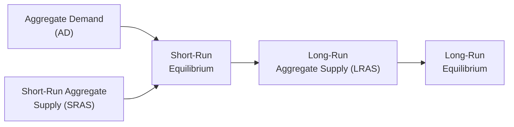

## Introduction to the AD–AS Model

If I’m being completely honest, the first time I saw a graph with Aggregate Demand (AD) and Aggregate Supply (AS), I felt like someone had drawn random curves on a plane and told me, “Hey, now you can predict recessions!” But let me tell you: once you get the hang of this model, you really start to see how it explains a lot of the big economic stories that occur around us—everything from inflationary booms to painful recessions. So let’s delve into it step by step.

The Aggregate Demand–Aggregate Supply (AD–AS) model is a powerful framework that shows us how the overall level of economic activity (real GDP) and the general price level are determined by the interaction of total demand in the economy and total supply. This is used all the time by policymakers, central banks, and analysts to figure out what’s causing changes in output and prices—and to decide on potential policy responses.

## Aggregate Demand: Key Components

Aggregate Demand (AD) represents the total spending on an economy’s goods and services at different price levels. Four big players determine this spending:

• Consumption (C) – This is household spending on goods and services.  
• Investment (I) – Firms buying machinery and equipment, or building factories or housing.  
• Government Spending (G) – Expenditures made by local, state, or national governments.  
• Net Exports (NX) = Exports (X) – Imports (M) – The difference between what we sell abroad and what we buy from abroad.

We often summarize it neatly as:  
AD = C + I + G + NX  

When the price level changes, you’ll see movement along the AD curve, because higher prices tend to reduce consumption and net exports (assuming wages don’t keep up instantly), while lower prices will boost them. But the entire AD curve can also shift due to events like changes in fiscal policy (e.g., tax rates or government spending), changes in consumer or business confidence, or shifts in monetary policy (interest rates, for instance).

## Short-Run Aggregate Supply (SRAS)

Next up is the Short-Run Aggregate Supply (SRAS). The reason we call it “short-run” is that some factor costs (most famously wages) don’t adjust instantly. Wages are often referred to as “sticky”—maybe labor contracts lock in pay rates for a year or two, or maybe it just takes time for workers to renegotiate. In the short run, modest increases in the price level can encourage firms to produce more because their revenues rise faster than their labor costs. 

Hence, SRAS typically slopes upward:  
• When prices rise, real output goes up (within reason), as firms try to take advantage of higher profit margins.  
• But if prices fall, firms reduce output because profits shrink, and some can’t cover their increasing real costs.  

An upward-sloping SRAS curve is at the heart of many short-run macroeconomic phenomena. If you’re curious, just look at the 1970s: oil shocks made input costs skyrocket, so the SRAS curve shifted left, resulting in higher inflation and lower output—a stagflation scenario that was pretty tough on the global economy.

## Long-Run Aggregate Supply (LRAS)

In the long run—imagine several years or more—wages and other costs do eventually adjust. Because of that, the economy’s capacity to produce goods and services is determined by the availability of fundamental resources: labor supply, capital stock (machines, factories, infrastructure), technology, and, of course, critical intangible factors like institutions and government policies. In the AD–AS model, this long-run capacity is represented by a vertical LRAS line, exactly at potential (or full-employment) GDP.

That vertical shape is extremely important: it says that in the long run, the economy settles into a level of output that depends on these structural factors, not on the price level. If the price level changes, in the truly long run, wages and other input costs all adjust proportionately, so there’s no net effect on how much the economy can produce. This is the ultimate anchor for our economy’s productive capacity.

## Equilibrium in the AD–AS Model

The intersection of AD and SRAS determines the short-run equilibrium price level and real GDP. Diagrammatically, it’s the point where the upward-sloping SRAS curve crosses the downward-sloping AD curve. Sometimes, you’ll see all three lines (AD, SRAS, and LRAS) graphed together, illustrating both short-run and long-run equilibria on the same chart.

Here’s a simplified representation of how these might look in a flowchart format:

• At the short-run equilibrium (point E), we have a specific price level and real GDP based on current AD and SRAS.  
• Over time, as wages and contracts adjust, the SRAS will move closer or further from LRAS, aiming for long-run equilibrium (point F).  

## Shifts in Aggregate Demand

Aggregate Demand can shift in or out for a variety of reasons:

• Fiscal Policy: If the government ramps up spending or cuts taxes, consumers suddenly have more disposable income, and/or businesses face higher demand. That usually shifts AD to the right. The opposite is also true: raising taxes or reducing government spending shifts AD left.  
• Monetary Policy: Central banks often change interest rates. When they cut rates, borrowing becomes cheaper, so firms invest more and consumers are more willing to spend. That also shifts AD right. Conversely, higher rates (to fight inflation) shift AD left.  
• Consumer and Business Confidence: If people feel good about the future (low unemployment, good wage prospects), they’re more comfortable taking out loans or buying major goods. Confidence is a huge factor behind shifts in AD.  

When AD shifts to the right faster than the economy’s capacity to produce, we risk inflation. When AD shifts left, we risk recession and higher unemployment.

## Shifts in Aggregate Supply

Aggregate Supply changes primarily come from changes in production costs, availability of resources, or technology:

• Input Prices: Energy prices, wages, raw materials—when they rise significantly, production costs increase, and SRAS shifts left. That implies that for each given price level, firms will produce less.  
• Technology and Productivity: If new tech arrives or productivity improves, production becomes more efficient, and SRAS shifts right.  
• Government Regulations or Policy: Policies that reduce the cost of doing business (like certain tax breaks or streamlined regulations) could shift SRAS right. However, stricter regulations or higher taxes on production may shift SRAS left.  

Long-run shifts in supply often depend on the factors that increase an economy’s potential output—like improved education systems, better infrastructure, or new technologies that permanently increase productivity.

## Inflationary and Recessionary Gaps

In everyday conversation, we often talk about “booms” or “busts.” In the AD–AS model, these are often referred to as inflationary or recessionary gaps:

• Inflationary Gap: Occurs when actual real GDP is above potential GDP (the LRAS). Production is beyond a sustainable level. Eventually, wages and other input costs climb (workers demand raises, input providers hike prices), which lowers SRAS and moves the economy back to potential output but at a higher price level.  
• Recessionary Gap: Occurs when actual real GDP is below potential GDP. There’s slack in the economy—unemployed labor and idle capital. Price pressures are low or negative. Over time, wages and input costs might fall, shifting SRAS right and pushing the economy back to potential GDP (though recessions can be stubborn if wages don’t fall quickly or if confidence is slow to recover).

Understanding these gaps helps policymakers decide if they should deploy fiscal or monetary tools. For instance, to reduce a recessionary gap, a government might authorize large infrastructure programs (fiscal stimulus) or a central bank might cut interest rates (monetary stimulus) to push AD back toward full employment.

## Policy Responses: A Balancing Act

Economists and policymakers use the AD–AS framework to test possible outcomes of different policy actions. A few typical scenarios:

• Expansionary Fiscal Policy: Government increases spending or cuts taxes, shifting AD right. This can help reduce unemployment but can also raise inflation if the economy is near or at full capacity.  
• Contractionary Fiscal Policy: Reducing government spending or raising taxes shifts AD left to curb inflation, but it risks slowing the economy and increasing unemployment.  
• Expansionary Monetary Policy: Cutting interest rates or using tools like quantitative easing can increase investment and consumption, shifting AD right.  
• Contractionary Monetary Policy: Raising interest rates to fight inflation shifts AD left and can slow economic growth.  

As you might guess, it’s never as simple as flipping a switch. Policy lags, political pressures, global financial markets, and the behavior of businesses and households all complicate the picture. Nonetheless, the AD–AS model remains a central tool in trying to anticipate the results of policy interventions.

## Real-World Illustrations

• The 2008 Global Financial Crisis: When major financial institutions struggled, credit markets froze, and consumer/business confidence plummeted. AD shifted left, causing a deep recessionary gap. Central banks worldwide tried expansionary monetary policies (slashing interest rates, then quantitative easing) while many governments launched fiscal stimulus programs.  
• The Oil Crises in the 1970s: OPEC oil embargoes drove up energy costs drastically, shifting the SRAS curve to the left. Real GDP fell, and the price level rose—stagflation. This forced policymakers to decide between combating inflation through contractionary policy (risking deeper recession) or boosting output at the expense of higher inflation.  
• Post-Pandemic Economic Stimulus (2021–2022): Massive government spending and ultra-low interest rates boosted AD. At the same time, supply chain disruptions and labor shortages impacted SRAS. Real output growth was accompanied by strong inflationary pressures in many nations.

## Strategic Exam Application

Understanding AD and AS is crucial for the CFA Level I exam because examiners often present scenario-based questions: “Due to a technology breakthrough, the cost of production falls. Show what happens to price levels and output.” They might also incorporate fiscal or monetary policy changes, making you illustrate or calculate how GDP and prices move in the short run. Keep these tips in mind:

• Pinpoint which curve is shifting. Is it AD or AS?  
• Determine the direction. Does the event raise or lower the willingness to spend (for AD) or produce (for AS)?  
• Assess the short-run versus long-run effects. Sometimes a curve shifts in the short run but the long run equilibrium remains pinned at the LRAS.  
• Always keep in mind how changes in wages, raw materials, or key global markets can shift these curves more than one might initially expect.  

For a constructed response question, examiners might ask you to graphically represent the shifts. Even if it’s purely conceptual, be prepared to discuss the effect on equilibrium price and equilibrium GDP. Practice linking the small details (like consumer confidence or energy costs) to the big picture (inflationary and recessionary gaps, changes in real GDP, and unemployment).

## Conclusion

The Aggregate Demand–Aggregate Supply model is the workhorse of modern macroeconomic analysis—both academically and in real policy decisions. Getting familiar with the logic of those shifting curves can help you interpret the broader economic conversation: you’ll recognize why expansions sometimes trigger inflation, or why supply disruptions can be particularly tough to manage. And for exam purposes, mastering these relationships sets you up well for analyzing a host of scenarios that revolve around economic cycles, price movements, and government responses.

In my experience, once you start mapping real-world news into an AD–AS framework—like noting whether a pandemic or a new trade agreement might shift supply or demand—it becomes almost second nature to ask, “How does that affect output and prices?”

So there you have it: AD–AS in a nutshell (well, a pretty big nutshell). Take a moment to review the main definitions, practice sketching the curves, then try connecting them to actual economic data or policy headlines. You’ll see your understanding grow in leaps and bounds—and that should help greatly on exam day and beyond.

## References

• Abel, A. B. & Bernanke, B. S. (2020). “Macroeconomics.” Pearson.  
• Mankiw, N. G. (2019). “Principles of Macroeconomics.” Cengage.  
• Lecture notes on AD–AS Modeling, Massachusetts Institute of Technology (MIT) OpenCourseWare:  
  https://ocw.mit.edu

## Test Your Knowledge: Aggregate Demand and Aggregate Supply



### In the AD–AS model, which component is NOT part of Aggregate Demand?

- [ ] Consumption
- [ ] Government Spending
- [x] Corporate Profits
- [ ] Net Exports

> **Explanation:** Aggregate Demand consists of consumption, investment, government spending, and net exports. Corporate profits, while important, are not directly part of AD; they're more of an outcome associated with how well the components interact.

### Which of the following best explains why the short-run aggregate supply (SRAS) curve slopes upward?

- [x] Some input costs, especially wages, are sticky in the short run.
- [ ] The central bank changes interest rates quickly in the short run.
- [ ] Consumers stop spending if prices fall.
- [ ] Net exports remain fixed in the short run.

> **Explanation:** SRAS slopes upward because certain costs (like wages) don’t change immediately, so as price levels rise, firms’ profit margins improve, leading them to increase production.

### Expansionary fiscal policy usually shifts the AD curve to the right. Which of the following is an example of expansionary fiscal policy?

- [ ] Increasing interest rates
- [ ] Restricting money supply
- [x] Cutting taxes and increasing government spending
- [ ] Introducing higher tariffs on imports

> **Explanation:** By cutting taxes and increasing government expenditures, the government puts more disposable income in the hands of consumers (and possibly more demand for goods and services), thus shifting AD to the right.

### In the long run, the level of real GDP is determined primarily by:

- [ ] The price level
- [ ] Sticky wages
- [x] The economy’s resources and technology
- [ ] Consumer confidence

> **Explanation:** In the long run, real GDP is determined by factors such as labor, capital, and technology, not the price level or wage stickiness, which are short-run phenomena.

### If a recessionary gap exists in the AD–AS model, which is most likely true?

- [x] Real GDP is below potential GDP
- [ ] Real GDP is above potential GDP
- [x] Unemployment is higher than the natural rate
- [ ] The price level is rising rapidly

> **Explanation:** A recessionary gap means the economy operates below its full-employment output. Unemployment is typically above its natural rate. Two answers are correct: real GDP < potential GDP and unemployment is above the natural rate.

### Which scenario would shift the short-run aggregate supply curve to the right?

- [x] A sudden decrease in energy prices
- [ ] A sharp tax increase on corporate profits
- [ ] A surge in import prices
- [ ] A devastating labor strike in manufacturing

> **Explanation:** Falling energy costs reduce production expenses, allowing firms to supply more output at each price level, shifting SRAS to the right.

### When Aggregate Demand rises and the economy is at or above potential output, what often happens?

- [x] Price levels rise (inflationary pressures)
- [ ] Real GDP declines sharply
- [x] Unemployment remains at or below its natural rate
- [ ] Input costs decrease fully

> **Explanation:** With an economy already at or beyond capacity, rising demand primarily pushes up prices. The economy can’t produce significantly more in the long run, but it can fuel inflation.

### A key reason that wages are said to be “sticky” is:

- [x] Long-term labor contracts and social norms around pay adjustments
- [ ] Workers enjoy constant wage changes
- [ ] Monetary policy has no effect on unemployment
- [ ] Fiscal policy is typically short-lived

> **Explanation:** Wages can be slow to adjust because of long-term contracts, minimum wage laws, cultural expectations, or negotiation processes.

### A double-digit wage increase for all workers in an economy would likely:

- [x] Shift short-run aggregate supply left
- [ ] Shift short-run aggregate supply right
- [ ] Shift aggregate demand left
- [ ] Have no impact on output or price level

> **Explanation:** Higher wage costs reduce profitability and firms supply less at every price level, shifting SRAS left. Over time, it might also affect AD, but the most immediate effect is on SRAS.

### True or False: In the long run, an economy cannot sustain production above its potential GDP.

- [x] True
- [ ] False

> **Explanation:** By definition, producing above potential implies pushing resources and labor beyond sustainable levels. In the long run, factor prices adjust, returning output to its potential.


