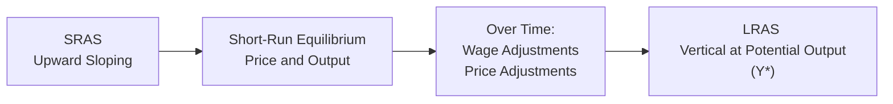

Understanding how aggregate supply behaves in both the short run and the long run can make or break our comprehension of business cycles, inflation, and economic policies. Were you ever caught off guard when a sudden spike in oil prices rattled your local economy, causing gas to shoot up overnight? That’s a supply shock in action—specific events in the economy that can shift short-run aggregate supply significantly and alter prices and output levels. In the long run, however, much of that volatility dies down, and the economy gravitates toward its potential output. Let’s unravel how this all works in more detail.

## Why We Care About Aggregate Supply

Aggregate supply (AS) represents the total quantity of goods and services that firms are willing and able to produce at different price levels in a given period. We often split aggregate supply into two segments:

• Short-Run Aggregate Supply (SRAS)  
• Long-Run Aggregate Supply (LRAS)

The distinction is crucial. In the short run, some input prices—especially wages—are “sticky.” They don’t adjust perfectly to changes in economic conditions. In the longer run, however, those contracts and wage rates become flexible, allowing the economy to revert to its full-employment (or potential) output. This separation into short run vs. long run forms the backbone of many macroeconomic analyses.

## Short-Run Aggregate Supply: The Upward Sloping Curve

When we talk about SRAS, we’re looking at a positive relationship between the aggregate price level and real output. “Upward sloping” means if the general price level (think of “average price tag” across the entire economy) rises, businesses are incentivized to expand production—at least to a certain extent in the short run.

Why does this happen? Well, imagine a firm that has committed to pay employees a set wage for the year. If the price level rises and their revenue goes up, but wage costs remain momentarily fixed, that firm can produce more and earn higher profits, so it ramps up output. This phenomenon is driven by:

• Sticky Wages: Labor contracts and social customs often lock in wages.  
• Sticky Input Prices: Some production costs, like certain long-term supply contracts, don’t immediately fluctuate with demand.  
• Imperfect Information: Not all firms instantly know changes in market conditions, so they adjust gradually.

### Positive Shifts in SRAS 
A friend of mine who runs a small manufacturing company once told me how a drop in the cost of imported steel (thanks to a newly inked trade deal) boosted his production almost overnight. That’s a prime example of a positive supply shock shifting the SRAS curve to the right. Positive supply shocks typically include:

• Lower commodity input prices (like cheaper oil or metal inputs).  
• Technological improvements that reduce costs (like new software or production methods).  
• Lower business taxes or subsidies.  

When SRAS shifts right, the economy can produce more goods at a lower overall price level—often a win-win scenario of expanding output and softer inflationary pressures.

### Negative Shifts in SRAS  
On the flip side, we sometimes get battered by negative supply shocks. Higher raw material costs, new import tariffs, supply chain disruptions, or natural disasters can all push the SRAS curve left, leading to lower output and a higher overall price level. Some may recall the oil crises in the 1970s, which combined crippling spiking oil prices with tumbling growth—an unfortunate combo known as stagflation: stagnant economic growth coupled with rising inflation.

## Long-Run Aggregate Supply: Potential GDP and the Vertical Curve

Long-run aggregate supply (LRAS) is special. It’s vertical because in the long run, the economy’s total output is determined by real factors—technology, productivity, available labor, and capital resources—rather than the price level. Here’s the logic: when wages and input prices fully adjust to changes in overall prices, there’s no reason for firms to produce more or less just because the price level moved. All that matters is the real capacity of the economy.

Economists usually place LRAS at the level of GDP where unemployment equals its “natural” or full-employment rate—sometimes called potential output or potential GDP. If we push actual GDP above this level, we risk inflationary pressures, and trying to produce slower than potential leaves resources (like workers or factories) underutilized.

### Factors Shifting LRAS

While SRAS can jump around with short-term commodity price swings, the LRAS curve tends to shift slowly over periods of many years or decades. The changes come mostly from:

• Technological Progress: Innovations can allow us to produce more with the same resources.  
• Labor Force Growth: A bigger workforce can typically produce more.  
• Capital Accumulation: Building more factories, creating more machines, or investing in advanced infrastructure.  
• Institutional & Policy Improvements: Strengthening property rights, promoting stable government, and enabling efficient financial markets can boost long-term productivity.

## Putting It All Together: SRAS, LRAS, and Economic Fluctuations

Short-run vs. long-run thinking is a big deal for policy decisions. Monetary or fiscal policies, such as lowering interest rates or ramping up government spending, can boost demand. In the short run, this demand might lift real GDP above its potential level if resources are underutilized. But eventually, as prices (including wages) adjust, the economy slides back toward its potential output, leaving price-level changes as the main lasting impact.

The difference in time horizons also explains why inflation might be mild or severe in different economic conditions, and why controlling inflation (say, via monetary tightening) can cause short-term slowdowns in growth. Over the long haul, real output is pinned down by technology and resources, not the price level alone.

## Practical Example: Analyzing a Hypothetical Policy

Imagine a central bank announces a big interest rate cut. In the short run, cheaper borrowing costs encourage more investment and consumer spending. The AD (aggregate demand) curve shifts right. If the economy was operating at or below potential, we get more output and higher prices—firms ramp up production because their wages haven’t fully caught up to inflation yet, so profits look more attractive.

But suppose we hold everything else constant for a while. As time passes, workers inevitably negotiate higher wages, and firms face rising costs. The SRAS curve shifts upward (left) due to cost pressures, leading to a new long-run equilibrium (where we hit that same old LRAS line). The net result? Potential output hasn’t changed much, but we might have higher inflation if we tried to push the economy beyond its sustainable capacity for too long.

## Visualizing SRAS and LRAS

Below is a simple Mermaid flowchart illustrating basic relationships among the short-run and long-run aggregate supply curves and equilibrium points:

This diagram is a simplified snapshot. In reality, we often combine SRAS with an Aggregate Demand (AD) curve to find the short-run equilibrium, then let wages or input costs adjust until we reach the LRAS line in the long run.

## Common Pitfalls and Best Practices

• Confusing Short Run with Long Run: Keep in mind that in the short run, prices are partly rigid, but in the long run, wage and price flexibility bring the economy back to potential output.  
• Overstating Policy Impact: Yes, policy actions can move the economy significantly in the short run, but overemphasizing these effects can lead to misguided conclusions about sustainable growth.  
• Ignoring Supply-Side Factors: Many students focus heavily on the demand side (like consumer behavior, interest rates, taxes) but forget that big supply changes (technology booms or supply chain bottlenecks) can shift the economy’s trajectory dramatically.  
• Stagflation Surprises: Don’t underestimate how a negative supply shock can drive up prices (inflation) and reduce output simultaneously, forcing policymakers to juggle tough trade-offs.

When analyzing case studies or scenario-based questions on the CFA exam, it pays to note whether the question is dealing with immediate price and wage stickiness (often a short-term horizon) or a scenario that spans enough time for wages, technology, capital, and labor adjustments (a long-term horizon).

## Conclusion

Short-run and long-run aggregate supply capture two very different perspectives of how the economy behaves. While SRAS acknowledges real-world “stickiness” in wages and input prices that can cause fluctuations in output and employment, LRAS represents a more fundamental ceiling (or capacity) where the economy functions at its long-run potential. Recognizing how each curve shifts, and why, helps us interpret everything from the daily headlines about supply chain disruptions to how central banks might tinker with interest rates.

## Final Exam Tips

• Carefully distinguish between short-run impacts (sticky wages, immediate changes to employment) and long-run outcomes (productivity, demographics, technology).  
• Use the SRAS-LRAS framework to illustrate the transition from an initial policy or shock to the economy’s eventual return to potential GDP.  
• Practice answering scenario-based questions that integrate supply shocks (both positive and negative), changes in productivity, or labor force shifts.  
• Be ready to address stagflation episodes and discuss how policy may differ when dealing with both decreased output and higher inflation.  

## Glossary

**Short-Run Aggregate Supply (SRAS):** A positive relationship between the price level and real output when wages and other input costs are partially fixed.  
**Long-Run Aggregate Supply (LRAS):** The economy’s maximum sustainable output over time, generally considered independent of the price level.  
**Stagflation:** A situation characterized by stagnant or falling economic growth alongside rising inflation, often triggered by a negative supply shock.  
**Potential Output:** The full-employment level of real GDP, where resources are used efficiently, also called the natural level of output.  
**Supply Shock:** An unexpected event that materially shifts aggregate supply, either raising or lowering production costs.

## References

• Olivier Blanchard, “Macroeconomics.” Pearson.  
• University of California, Berkeley, Lecture Videos on AS-AD Model.  
• Federal Reserve Education Resources: https://www.federalreserveeducation.org/

## Test Your Knowledge: Short-Run vs. Long-Run Aggregate Supply



### In the short run, which of the following factors best explains why the aggregate supply curve is upward sloping?

- [ ] Capital accumulation takes time to affect output.  
- [x] Wages and some input prices are sticky.  
- [ ] Demographic changes systematically increase productivity.  
- [ ] The price level does not affect real GDP in any scenario.  

> **Explanation:** A key reason SRAS slopes upward in the short run is that wages and other input costs do not adjust immediately to price changes. This stickiness causes firms to produce more when the price level rises.

### A rightward shift of the short-run aggregate supply curve is most likely to result from:

- [ ] A prolonged increase in the inflation rate.  
- [ ] A sharp rise in oil prices.  
- [x] A significant reduction in business taxes on production.  
- [ ] A temporary decrease in government spending.  

> **Explanation:** Lower production taxes reduce costs and encourage higher output, shifting the SRAS curve to the right (increasing output and lowering the price level, all else equal).

### Which statement accurately characterizes the shape of the long-run aggregate supply curve?

- [ ] It is always downward sloping.  
- [ ] It is positively sloped, reflecting wage stickiness.  
- [x] It is vertical, representing potential GDP.  
- [ ] It is horizontal, signifying output is infinitely elastic.  

> **Explanation:** LRAS is vertical at the economy’s potential GDP, indicating in the long run, the overall price level does not affect real output.

### Stagflation (rising prices and falling output) is most commonly associated with:

- [ ] A rightward shift of LRAS.  
- [x] A leftward shift of SRAS.  
- [ ] An overestimation of potential output.  
- [ ] A short-run equilibrium above potential GDP.  

> **Explanation:** Stagflation typically follows a negative supply shock that shifts the SRAS curve left, leading to higher prices and lower real output.

### If the economy is operating beyond its long-run capacity, which of the following is most likely to occur over time?

- [ ] A permanent increase in real GDP.  
- [ ] A drop in wages as the labor market becomes tight.  
- [x] Wages and input costs eventually rise, shifting SRAS left.  
- [ ] Rapid population growth that keeps wages stable.  

> **Explanation:** When the economy operates above potential, cost pressures from labor and other inputs cause the SRAS to shift to the left, returning the economy to its potential GDP but at a higher price level.

### In the long run, an expansionary monetary policy aiming to boost real GDP beyond its potential level is most likely to:

- [x] Result in higher inflation with little lasting effect on real GDP.  
- [ ] Lower the price level and permanently raise output.  
- [ ] Shift LRAS to the right and permanently enlarge the economy.  
- [ ] Cause stagflation.  

> **Explanation:** Over the long run, trying to push real GDP beyond potential generally leads to higher inflation, as resource costs rise. Real output reverts to its natural level.

### Which of the following factors would most likely shift the LRAS curve to the right?

- [x] Advances in technology and improved productivity.  
- [ ] A decrease in the inflation rate.  
- [x] Growth in the labor force.  
- [ ] The imposition of strict price controls.  

> **Explanation:** LRAS shifts right if an economy’s capacity expands via technology improvements or labor force growth. Inflation or price controls don’t directly change long-run capacity.

### A negative supply shock that reduces SRAS will:

- [ ] Increase the short-run equilibrium GDP and price level.  
- [x] Decrease short-run equilibrium GDP and increase the price level.  
- [ ] Leave real GDP unchanged but decrease the price level.  
- [ ] Increase short-run equilibrium GDP but reduce equilibrium prices.  

> **Explanation:** A negative supply shock (like a surge in commodity prices) typically raises production costs, reducing output while pushing prices upward in the short run.

### According to standard macroeconomic theory, an economy that is at its long-run equilibrium level implies:

- [x] The economy’s real output is at potential GDP, with no cyclical unemployment.  
- [ ] Wages are inflexible and never adjust to market conditions.  
- [ ] The economy is experiencing stagflation.  
- [ ] Fiscal policy has no effect on aggregate demand.  

> **Explanation:** At long-run equilibrium, the economy operates at potential output, which also implies employment is at or near its natural rate.

### True or False: The long-run aggregate supply curve will shift left if the price level experiences a sustained increase.

- [x] True  
- [ ] False  

> **Explanation:** This is a bit of a trick question. In truth, a mere increase in the price level, by itself, does not shift LRAS. However, if that price increase is caused by higher production costs or a permanent loss in productivity, LRAS might shift left. So strictly speaking, higher prices alone do not necessarily shift LRAS, but if embedded in them are real changes that reduce productive capacity (e.g., permanent resource depletion), LRAS could shift left over time.


