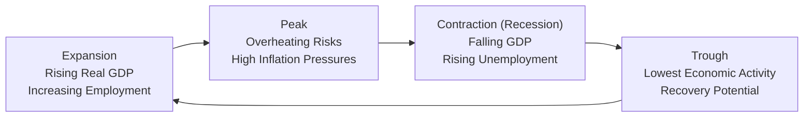

## The Business Cycle in Context

Sometimes, I think back to my first year working in finance—not too long before a major global slowdown hit. Everyone was optimistic, credit was flowing easily, and well, it felt like the party would never stop. Then, almost overnight, the economy stumbled and we saw once-thriving companies struggling just to keep the lights on. That sort of shift—rapidly going from economic boom to sluggishness—captures the essence of the business cycle. 

From a CFA exam perspective, understanding the business cycle is key not just for macroeconomic knowledge, but also for mastering how these ups and downs affect equity valuations, fixed income strategies, and asset allocation choices. So, let's dig into the phases—expansion, peak, contraction (recession), and trough—and see how they work in practice.

## Defining the Business Cycle

The business cycle refers to fluctuations in aggregate economic activity over time, generally measured by movements in real GDP, employment rates, industrial production, and overall consumer/business confidence. Broadly, the cycle can be broken into four phases:

• Expansion  
• Peak  
• Contraction (or recession)  
• Trough  

While the sequence of these phases typically repeats, the duration and intensity of each cycle can vary significantly. Factors like technological advancements, global supply chain shifts, fiscal stimulus packages, or even changes in consumer preferences can alter how quickly or slowly an economy moves from one phase to another. From a policy standpoint (whether that policy is monetary, fiscal, or regulatory), governments and central banks often aim to smooth out dramatic swings by adjusting interest rates, tax policies, or stimulus measures.

## Core Phases of the Business Cycle

### Expansion 
Expansion is often the phase that feels the best—rising real GDP, falling unemployment, and a general optimism flowing through both financial markets and real-life family kitchens. When you see jobs becoming more abundant, factories operating at higher capacities, and consumer spending on the rise, that’s typically an indication of expansion.

• GDP Growth: Real GDP grows steadily, often above its long-term trend.  
• Unemployment: Rates trend downward as businesses increase hiring.  
• Inflation Pressures: Often pick up as demand for goods, services, and even labor outstrips supply.  
• Interest Rates: In a typical environment, central banks might raise rates to prevent the economy from overheating.  

For example, consider the 2010–2019 period in many developed economies. In the aftermath of the global financial crisis, central banks introduced accommodative monetary policies—like historically low interest rates and quantitative easing—aimed at boosting aggregate demand. Over time, employment improved, GDP growth stabilized, and businesses found it easier to access credit. This is a classic expansion scenario.

### Peak 
Sooner or later, expansions reach a turning point we call the peak. This is where economic activity is at, or near, its maximum capacity—just before it begins to roll over.

• Overheating: Demand is high, but supply constraints lead to inflation concerns.  
• Tight Labor Markets: Unemployment is at or near cyclical lows, often increasing upward wage pressures.  
• Business Confidence: Can remain robust, but signs of caution begin to surface, like shortages of qualified labor or rising raw material costs.  

This phase can be tricky for investors because market euphoria can push asset prices to lofty valuations. But it’s also the point at which interest rates are often their highest in the cycle, given central banks’ attempts to keep inflation in check. The peak is the final push before the slowdown, though timing exactly when a peak will occur can be notoriously difficult.

### Contraction (Recession) 
When real GDP starts to decline for at least two consecutive quarters (the conventional but not exclusive definition of a recession), we enter the contraction phase. A more formal approach in the United States is taken by the National Bureau of Economic Research (NBER), which considers multiple economic indicators rather than just GDP.

• Decreasing GDP: Industrial output, consumer spending, and business investment typically fall.  
• Rising Unemployment: Employers trim their workforces, and job seekers struggle to find opportunities.  
• Credit Strains: Banks may tighten lending standards, making it harder for companies and individuals to borrow.  
• Inflation or Disinflation Pressures: Demand recedes, so inflation can slow or turn into deflation in severe downturns.  

From a market standpoint, equity prices often decline, credit spreads widen, and risk premiums increase. Investors may rotate into safer, more liquid assets such as government bonds or cash, which can put further pressure on riskier asset classes like equities or high-yield debt.

### Trough 
The trough represents the lowest point of economic activity, offering a hopeful signal that things are about to improve. Many times, it’s only in hindsight that we can pinpoint exactly where the trough occurred (another reason timing the market is so challenging).

• Stabilizing GDP: Contraction loses steam, and economic output stops declining.  
• Unemployment Peaks: It might still be high, but job losses slow significantly.  
• Monetary and Fiscal Easing: Policy makers often employ measures—such as lowering interest rates or initiating stimulus programs—to jumpstart the economy.  
• Inflection in Asset Prices: Some of the best stock market rallies often begin during recessions, well before economic data turn positive.  

When we look at historical cycles, for instance, the recession that followed the dot-com bubble in the early 2000s bottomed around 2002–2003. Although the labor market remained soft for a while, equity markets actually began recovering ahead of any official “all-clear” sign from the broader economy.

## A Visual Overview

One of the simplest ways to see these phases is through a basic cycle diagram:

In practice, the distance (length) of each arrow and the slope (intensity) of the incline/decline can vary widely across different business cycles.

## Factors Influencing Business Cycle Fluctuations

### Monetary Policy 
Central banks (e.g., the Federal Reserve in the U.S., the European Central Bank, the Bank of England) use policy tools to either stimulate growth (lowering rates, buying securities) or cool off an overheated economy (raising rates, selling securities). These monetary interventions can substantially affect corporate profitability, consumer confidence, and ultimately the length and strength of each cycle phase.

### Fiscal Policy 
Government spending and taxation decisions also play a role. Policies such as an infrastructure spending package or a big round of tax cuts can stimulate aggregate demand, leading an economy out of a contraction or helping an expansion gain momentum. Conversely, tax hikes and spending cuts might slow the pace of growth, intentionally or otherwise.

### External Shocks
Natural disasters, oil price spikes, geopolitical conflicts—these can create sudden disruptions in supply chains or demand patterns, hastening the onset of a contraction or cutting an expansion short. Similarly, breakthroughs in technology (e.g., the rise of smartphones in the 2010s) can unexpectedly boost productivity and prolong an expansion phase.

### Global Interconnectivity 
In today’s era of integrated supply chains and capital flows, a recession in one region can spill over into another. The contraction in domestic demand in a large economy often reduces import demand, hurting trading partners overseas. Going the other way, strong external demand can improve export performance and lengthen the domestic expansionary phase.

## Real-World Scenario: The 2008–2009 Crisis

Just to put all of this into a tangible case study: The 2008–2009 Global Financial Crisis can be roughly broken down into the classic cycle phases:

1. Expansion (early to mid-2000s): Credit was abundant; financial innovations like mortgage-backed securities thrived; housing markets boomed.  
2. Peak (2006–2007): Housing prices in many areas started stalling, and subprime mortgage defaults began to climb. Yet, markets overall still felt hot; consumer spending remained strong.  
3. Contraction (2008–2009): Lehman Brothers collapsed, credit dried up, and unemployment soared as GDP plunged. This was perhaps the sharpest contraction in decades.  
4. Trough (2009): Central banks slashed rates to near zero, launched quantitative easing, and governments unleashed fiscal stimulus. Stock markets began a lengthy bull run, even though unemployment stayed elevated for a time.

This example underscores that while the four-phase cycle is conceptually neat, real life can feel murky and chaotic. Asset prices often lead the broader economy, meaning a full recovery in the stock market might occur even as the labor market lags behind.

## Links to Financial Statements and Regulatory Standards

Although the business cycle isn’t directly spelled out in IFRS or US GAAP, the fluctuations it causes can affect corporate earnings, revenue forecasts, and asset valuations. For instance, in expansions, companies might capitalize on looser credit conditions to expand. In contractions, the same companies might struggle with lower sales and higher default risks, requiring impairment charges or more conservative revenue recognition.

Similarly, the CFA Institute Code of Ethics and Standards of Professional Conduct call for transparent communication with clients—particularly poignant during contraction phases when market values can plummet and emotion runs high. Disclosing the inherent risks of macroeconomic uncertainty is part of prudent management and upholding ethical standards.

## Investment Implications

### Asset Allocation Shifts 
Identifying where the economy stands in the business cycle can influence the relative attractiveness of equities, bonds, and alternative investments. During expansions, equities typically perform well. However, near the peak, some investors shift into safer assets like government bonds or defensive sectors to protect against the possibility of an upcoming contraction.

### Sector Rotation 
A common strategy is rotating among sectors based on anticipated macro shifts. For instance, cyclicals (such as consumer discretionary and industrials) tend to shine during expansions, while defensive sectors (like utilities and consumer staples) may be more resilient during contractions.

### Risk Management 
Risk tolerance levels often decrease as the peak nears and a downturn becomes more likely. Investors might add hedges via options, protective puts, or by reducing leverage. Stress testing and scenario analysis also become crucial in anticipating potential drawdowns during a contraction.

### Investor Sentiment Indicators 
Market participants monitor leading economic indicators (e.g., new orders, building permits), as well as advanced signals like the treasury yield curve or surveys of business/consumer sentiment. Shifts in these indicators often manifest before official GDP data confirm a turn in the cycle.

## Practical Tips for Portfolio Managers

• Correlate Macroeconomic Outlook with Asset Returns: By mapping leading indicators of each cycle phase to your portfolio holdings, you can anticipate which segments might be vulnerable versus which might still have upside potential.  

• Diversify: Even if you have a strong read on the business cycle, diversification remains the bedrock of risk management. Not all regions or industries move in perfect lockstep.  

• Be Aware of Policy Shifts: A big lesson from recent decades is that central bank interventions can extend or shorten each faze significantly. Watch for policy announcements, interest rate changes, or new fiscal stimulus packages that can alter the cycle’s natural progression.  

• Stay Nimble: Especially near peaks and troughs, changes in macro data or investor sentiment can be abrupt. That doesn’t mean chasing every fresh data print—but it does mean being prepared to adjust allocations if fundamental signals confirm a mismatch in your portfolio strategies.  

## Exam Tips and Common Pitfalls

In the CFA exam context, the business cycle can show up in many ways:

• Essay/Constructed-Response Questions: You might be asked to recommend an asset allocation strategy depending on where the economy stands in the cycle. Ensure you can articulate the rationale behind that choice.  

• Item-Sets: Often, you’ll see vignettes describing an economy’s key indicators (unemployment trends, inflation rates, consumer spending data) and you’ll have to identify which phase of the cycle it’s in.  

• Common Pitfalls:  
  – Over-simplifying. Remember that expansions and recessions can be lengthy or short, and there are many real-world complexities (like fiscal or monetary stimuli) that can distort pure textbook definitions.  
  – Missing the lead-lag relationships. Asset prices frequently move ahead of the real economy. If you wait for official data confirming a recession, you might have missed the opportunity to rebalance.  
  – Not addressing policy. The CFA exam often asks about central bank actions or government fiscal moves and how they can affect each phase.  

## References & Further Reading

- Burns, A. F. & Mitchell, W. C. (1946). “Measuring Business Cycles.” National Bureau of Economic Research.  
- National Bureau of Economic Research (NBER):  
  https://www.nber.org/  
- The Conference Board:  
  https://www.conference-board.org/  
- CFA Institute (Latest Edition). CFA Program Curriculum, Level I, Economics.  
- Mankiw, N. G. (2019). Principles of Economics (8th ed.). Cengage Learning.  

---

## Check Your Understanding: The Business Cycle



### Which of the following most accurately describes the expansion phase of the business cycle?

- [x] Real GDP is growing, unemployment is falling, and inflationary pressures often rise.
- [ ] Real GDP declines for at least two consecutive quarters, and unemployment spikes.
- [ ] The labor market experiences a brief pause in hiring while inflation is stable.
- [ ] Economic activity has reached its absolute lowest point in the cycle.

> **Explanation:** During an expansion, real GDP rises, unemployment tends to decline, and demand overtakes supply capacity, often resulting in higher inflationary pressures.

### During a peak phase, which of the following is most likely to occur?

- [x] High inflation pressures and tight labor markets.
- [ ] Rapidly declining GDP growth and soaring unemployment.
- [ ] Minimal credit restrictions with wide availability of credit.
- [ ] Historically low interest rates used to stimulate borrowing.

> **Explanation:** A peak typically occurs when the economy is operating at or near full capacity. Labor markets are tight, contributing to upward wage and inflationary pressures.

### Contraction phases are generally associated with which set of conditions?

- [x] Rising unemployment, declining GDP, potential deflationary pressures.
- [ ] Strong consumer confidence and increased hiring.
- [ ] High interest rates to combat excess demand.
- [ ] Overheating economic conditions leading to monetary tightening.

> **Explanation:** Contraction (or recession) is indicated by falling GDP, a rise in unemployment, and potentially falling prices due to weaker demand.

### A trough in the business cycle is best described as:

- [x] The point at which economic activity hits its lowest level before turning up.
- [ ] The stage where inflationary pressures become unmanageable, forcing a recession.
- [ ] A period of long-term economic stagnation with no chance of a rebound.
- [ ] A brief lull in GDP growth that interrupts a sustained expansion.

> **Explanation:** The trough is the transition point between the end of a recession and the move toward expansion.

### Which of the following would be most characteristic of a central bank’s policy during the contraction phase?

- [x] Lowering interest rates and/or engaging in quantitative easing to stimulate borrowing.
- [ ] Transferring its responsibilities to the Ministry of Finance.
- [ ] Raising interest rates aggressively to dampen strong demand.
- [ ] Ignoring unemployment trends and focusing solely on inflation.

> **Explanation:** In a contraction, central banks often adopt expansionary monetary policies—cutting rates or buying securities—to encourage lending and spark economic activity.

### From an investment standpoint, what is a common asset allocation shift as the economy nears its peak?

- [x] Moving from cyclical stocks to more defensively oriented sectors and possibly bonds.
- [ ] Increasing exposure to high-yield bonds and growth stocks due to strong economic fundamentals.
- [ ] Allocating all capital to short-term money market funds indefinitely.
- [ ] Immediately switching to foreign exchange trading only.

> **Explanation:** Near a peak, many investors rotate into defensive sectors or safer assets, preparing for a potential contraction.

### How does high consumer confidence typically affect the expansion phase?

- [x] Encourages higher spending and borrowing, reinforcing growth momentum.
- [ ] Reduces household spending, slowing GDP growth.
- [x] Contributes to potential inflation if demand grows faster than supply.
- [ ] Forces immediate contraction due to stock market panic.

> **Explanation:** During expansions, increased consumer optimism and spending boost demand; if the economy’s supply side doesn’t keep up, inflationary pressures can amplify.

### What is a likely outcome if policymakers implement significant fiscal stimulus during the trough?

- [x] Speedier recovery, as increased government spending boosts aggregate demand.
- [ ] Delayed recovery, because higher public spending reduces consumer spending.
- [ ] Immediate hyperinflation in all scenarios.
- [ ] Decreased interest in corporate investment due to crowding out.

> **Explanation:** Fiscal stimulus (e.g., government spending, tax cuts) at the trough can help jumpstart economic activity and quicken the transition into expansion.

### Why can it be challenging to identify a peak until after it has passed?

- [x] Because data updates often lag, and key macro indicators can remain strong even as the economy starts to slow.
- [ ] Because unemployment always continues falling steadily through a recession.
- [ ] Because overall GDP is not tracked by most governments.
- [ ] Because monetary policy typically remains ineffective in expansions.

> **Explanation:** Peaks are difficult to pinpoint in real time. Economic data is backward-looking, and sentiment can remain high despite underlying weaknesses that only become obvious later.

### True or False: Asset prices often begin recovering during the contraction phase, before official economic indicators turn positive.

- [x] True
- [ ] False

> **Explanation:** Markets are forward-looking; equity and bond prices can rebound based on anticipated policy measures and improving prospects, even if the broader economy is still contracting.


