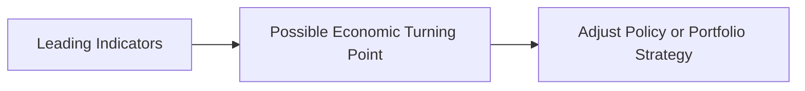

## Introduction
Have you ever watched the news and heard analysts discuss the “gain in new housing permits” or the “steady unemployment rate” as signals of where the economy might be headed? Um, I’ve certainly wondered how those data points fit together to form a picture of the economic landscape. Well, that’s precisely where economic indicators step in. They can help you, as an analyst, create a systematic approach to forecasting turning points in the business cycle—or at least get close enough that your portfolio doesn’t miss the boat on shifts in economic conditions. 

Economic indicators are typically lumped into three categories: leading, coincident, and lagging. Let’s explore them in detail and see how you can put these to use in all sorts of practical analysis—especially for the CFA Level I exam (and eventually in real life!). Along the way, we’ll discuss composite indicators, how to interpret them in a portfolio context, and how analysts weave them together to form a coherent economic outlook.

## Why Indicators Matter
First, let’s clarify why we care so deeply about classifying indicators into leading, coincident, or lagging. The business cycle has distinct phases—expansion, peak, contraction, and trough. Your goal is to identify these shifts early enough to make informed investment or policy decisions. Leading indicators help you catch that potential turning point before it’s obvious, coincident indicators confirm your suspicions about current conditions, and lagging indicators serve as evidence once the new phase is entrenched. 

For practical portfolio management, this is huge. If your models can detect early signals of a recession, maybe you rotate into more defensive sectors or reduce your portfolio’s overall beta. If your coincident measures confirm you’re in an expansion, you might get more aggressive. And if lagging data show that we’re well into a downturn, you can double-check that your defensive positions are still appropriate—or watch for the inflection that signals it’ll be time to pivot again.

## Leading Indicators
Leading indicators provide signals about future economic activity. They often shift in direction a few months (or sometimes quarters) before the broader economy. This is like spotting the first glimpse of dawn before the sun’s fully up. Common leading indicators include:

• New Orders for Durable Goods: When companies plan to buy new machinery or equipment, it often suggests they expect increased demand.  
• Stock Market Returns (Equity Indices): Stock prices can move in anticipation of corporate earnings and economic expansion.  
• New Housing Permits or Building Permits: Construction activity signals confidence and spending, especially in real estate and homebuilding.  
• The Yield Curve (particularly the spread between long-term and short-term rates): An inverted yield curve has historically preceded recessions.  

In policy circles, the excitement often revolves around these numbers. If new orders for durable goods spike, you might see economists and analysts saying, “Hey, we might be turning the corner on a recovery.” However, it’s good to remember that no single indicator tells the entire story. You know how it goes: a jump in new building permits might be seasonal or might reflect transitory factors.  

### A Quick Anecdote
I remember a time I got super excited because the Conference Board Leading Economic Index (LEI) posted a strong monthly increase. I told everyone that a major expansion was imminent. A few weeks later, an unexpected geopolitical event rocked the markets. The leading index prediction was overshadowed—at least temporarily—by external shocks. So keep in mind: leading indicators are powerful, but never infallible.

### Leading Indicators in Practice
• Investment Strategy: Portfolio managers watch leading data to decide if it’s a good time to tilt into cyclical sectors (e.g., consumer discretionary, industrials) or reduce exposure to risk assets if signs of slowdown appear.  
• Macroeconomic Forecasting: Government agencies, think tanks, corporate treasurers, and CFOs monitor leading indicators to budget for expansions or recessions.  

Below is a simple mermaid diagram illustrating how leading indicators feed into decision processes:



## Coincident Indicators
Coincident indicators move roughly in tandem with the economy. They’re sometimes referred to as “nowcasts” because they tell you how things are going right at this moment. If leading indicators are the forecast, coincident indicators are the actual weather station reading outside your window.

Common coincident measures include:
• Real GDP: The broadest measure of economic output, it captures current overall growth.  
• Industrial Production: Manufacturing output that responds promptly to changes in demand.  
• Personal Income Levels (excluding transfer payments): Reflects earnings from employment and other sources—very relevant to consumers’ current spending power.  
• Retail Sales: Showcases current consumer behavior and overall demand.  

Coincident indicators are often used to confirm or reinforce what leading data might have suggested. So if you suspect an upturn is coming (based on leading indicators), you check if GDP or industrial production numbers are also ticking up. If they are, your confidence level in that forecast grows.

### Portfolio Management Angle
• Sector Allocation: If industrial production is rising, you might tweak your allocations toward manufacturing or capital goods.  
• Government Policy: Policymakers track coincident data to calibrate current economic policies, such as deciding whether to enact expansionary or contractionary measures.

## Lagging Indicators
Lagging indicators, as the name suggests, move after the economy has already begun a new trend. So these confirm something that’s already in motion. Think of them as the shape in your rearview mirror that confirms you’ve passed or missed something.

Some well-known lagging indicators:
• Unemployment Rate: Typically peaks after a recession and only starts to decline when a recovery is well underway.  
• Corporate Profits: Financial statements come out after a quarter ends, so profits become clear once the economic shift has been in play.  
• Consumer Price Inflation (CPI): Price levels might continue to rise or fall well after underlying supply-demand shifts have taken root.

Let’s say you see a jump in the unemployment rate. Usually, that means the downturn may have been in progress for a while. Conversely, if the unemployment rate finally starts to fall, the economy might already be in a mid-recovery phase. 

### Investment Insight
Even though they confirm past trends, lagging indicators can still be useful:
• Validate a Trend: Analysts and policymakers use rising or falling unemployment data to confirm that the identified economic cycle direction was correct.  
• Stress-Testing Strategies: A consistent drop in corporate profits over time might prompt you to reevaluate your portfolio’s risk exposure.  

## Composite Indicators
Sometimes, one indicator alone isn’t enough to paint the full picture. This is where composite indices come in handy—like The Conference Board Leading Economic Index (LEI). These indices combine several data points (leading, in the LEI’s case), each weighted to produce a single, smoothed measure that helps reduce the “noise” from any one indicator’s volatility.  

For instance, The Conference Board LEI includes items such as:  
• Average weekly hours in manufacturing  
• Initial unemployment claims  
• Manufacturers’ new orders for consumer goods  
• Stock prices  
• Leading Credit Index™  

By blending these, analysts get a more holistic look at potential shifts in economic activity. A downward trend in the composite might signal a future slowdown—even if a couple of its components are giving mixed signals.

Sometimes you’ll see these composite indicators plotted in historical cycles to project if we’re close to a turning point. But, as always, no matter how good the composite may appear, exogenous shocks (you know, a major political crisis or severe weather events) can throw off even the best of them.

## Practical Example: Housing Market as a Leading Indicator
Let’s highlight how a leading indicator can ripple through the economy. Suppose you track housing starts:

1. A surge in housing starts suggests more construction workers will be hired.  
2. Demand for building materials (lumber, concrete, steel) rises.  
3. Consumer spending might increase as newly employed workers get paychecks.  
4. Consumer confidence might rise if home values increase.  
5. Mortgage-lending activity picks up, fueling further credit expansion.  

If you see a sustained spike in housing starts (and it’s not just a seasonally skewed blip), chances are the broader economy is on the upswing. Conversely, a sharp drop might warn of an impending downturn. 

## Using Economic Indicators for Portfolio Decisions
In a CFA Level III (capstone) context—though we’re discussing Level I concepts—tying economic indicators to actual portfolio choices is key. You may face questions on crafting a multi-asset portfolio strategy using leading data to reduce or ramp up your equity exposure. Or you might see an item set that walks you through a scenario: manufacturing indexes spiked last month while unemployment remains stubbornly high. Do you interpret that as a short-lived improvement or an actual turning point? You’d weigh both sets of data, possibly factoring in consumer sentiment, credit conditions, or sector rotation strategies.

• Fixed Income Implications: Leading indicators that point to a future slowdown might prompt you to buy longer-dated Treasuries to lock in rates ahead of potential interest rate cuts.  
• Equity Sector Rotation: Coincident data showing strong industrial production might encourage you to favor cyclical sectors in your equity allocation.  
• Alternative Investments: If lagging indicators confirm a recession is winding down, it might be a signal to re-engage with more growth-oriented alternative strategies.

## Potential Pitfalls and Best Practices
Even though these categories of indicators can be super helpful, you should be aware of common pitfalls:
• False Signals: A single month of data might be a fluke. Always look at trends over multiple months.  
• Revision Risk: Many economic indicators are subject to revisions, which can reinterpret signals after the fact.  
• Overfitting: Relying on too many specialized indicators or exotic data sets can obscure the big picture.  
• Confirmation Bias: Analysts might ignore data that contradicts their preconceived notions.  

### Best Practices
• Adopt a Balanced View: Use a blend of leading, coincident, and lagging data to triangulate your analysis.  
• Watch Composite Indices: They can smooth out volatility and give a clearer directional signal.  
• Confirm or Cross-Check: A leading signal is more convincing if a coincident measure starts moving in the same direction shortly thereafter.  
• Scenario and Sensitivity Analysis: Perform multiple “what-if” analyses with different assumptions about how indicators might shift.

## Data Gathering: A Quick Python Snippet
If you’re curious about how analysts might automate data retrieval for these indicators, here’s a short snippet (for illustrative purposes) that pulls data from the Federal Reserve Economic Data (FRED) API:

```python
import requests

API_KEY = "YOUR_FRED_API_KEY"
series_id = "UNRATE"  # For example, the U.S. Unemployment Rate
url = f"https://api.stlouisfed.org/fred/series/observations?series_id={series_id}&api_key={API_KEY}&file_type=json"

response = requests.get(url)

if response.status_code == 200:
    data = response.json()
    observations = data["observations"]
    print(f"Number of observations returned: {len(observations)}")
    # You could parse the data further to build historical time series.
else:
    print("Error fetching data from FRED API.")
```

This sort of approach lets you continuously monitor economic indicators in real time, automatically updating your spreadsheets or dashboards. While you wouldn’t typically write code in the actual CFA exam, you need to understand how data is collected and processed in practice.

## Bringing It All Together
Leading indicators give you a sneak peek. Coincident indicators confirm the “now.” Lagging indicators affirm what has already transpired. All three form a well-rounded toolkit to assess business cycle phases (expansion, peak, contraction, trough). For investment analysts, the interplay among these indicators not only shapes risk allocations and portfolio strategy but also drives important decisions around diversification and hedging. 

Every economic cycle is different, and none of these indicators—alone or in combination—will grant you 100% certainty. But they sure can tilt the odds in your favor if you use them wisely. Perhaps the biggest lesson is to remain vigilant about revisions or short-term noise, and always cross-examine multiple data sources.

## Conclusion and Final Exam Tips
When it comes to the CFA Level I exam, you’re likely to see straightforward questions asking you to classify a specific measure as a leading, coincident, or lagging indicator or to interpret how a given indicator’s movement might predict or validate the stage in the business cycle. At higher levels, you’ll be asked to apply this understanding to scenario-based or essay-style questions, showing how these indicators feed into investment decisions or strategic asset allocation.

• Common Pitfalls: Not recognizing that the unemployment rate is a lagging indicator, or mixing up leading and coincident signals.  
• Strategy for Constructed Response: If given a scenario about new durable goods orders spiking while unemployment remains high, argue for an early-stage recovery—leading data up, lagging data still negative.  
• Time Management: Keep an eye out for how many references to indicators you need to identify in an item set. The exam might require you to pick three out of five indicators for each classification.

Now that you’re armed with a deeper understanding—and maybe a dash of caution about overreliance—dive into practice questions. The best way to remember these categories and how they fit into the bigger economic puzzle is to see them in real data, interpret them, and then test yourself often.

## References
• The Conference Board Leading Economic Index:  
  https://www.conference-board.org/data/bci/  

• Federal Reserve Bank of St. Louis FRED Indicators:  
  https://fred.stlouisfed.org/  

• Zarnowitz, V. (1992). “Business Cycles: Theory, History, Indicators, and Forecasting.” University of Chicago Press.

## Test Your Knowledge: Economic Indicator Classification and Forecasting



### Which of the following best describes a leading indicator?
- [ ] It moves in perfect correlation with real GDP on a monthly basis.
- [x] It changes direction prior to changes in overall economic activity.
- [ ] It captures the past quarter’s corporate earnings performance.
- [ ] It strictly confirms the economy’s current phase.

> **Explanation:** Leading indicators typically move ahead of the overall economy, helping to forecast future business cycle turning points (e.g., new orders for durable goods, new housing permits).

### Which is most likely to be used as a coincident indicator of economic performance?
- [ ] The yield curve slope.
- [ ] Unemployment rate.
- [x] Real GDP.
- [ ] Capacity utilization from three years ago.

> **Explanation:** Real GDP captures current overall economic output and moves in tandem with the business cycle, making it a classic coincident measure.

### When the unemployment rate begins to decline after several months of contraction, it is considered:
- [ ] A leading signal of a forthcoming expansion.
- [ ] A coincident signal that the economy has turned around.
- [x] A lagging indicator showing the economy is already in recovery.
- [ ] A random signal unrelated to the business cycle.

> **Explanation:** Unemployment typically lags behind other indicators; it starts to fall only after a recovery is well underway.

### A spike in new housing permits is often viewed as:
- [x] A leading indicator that may predict increased consumer spending.
- [ ] A coincidence with current consumption trends.
- [ ] A lagging measure that confirms past growth in construction.
- [ ] An irrelevant measure for economic forecasting.

> **Explanation:** New housing permits usually lead broader building activity and consumer spend, making them a leading indicator.

### Which of the following is NOT a common pitfall of relying on a single leading indicator?
- [ ] It may produce false signals.
- [ ] It can be affected by seasonality or exogenous shocks.
- [ ] It may be revised significantly after the fact.
- [x] It offers guaranteed predictive validity across all economic cycles.

> **Explanation:** No single indicator can guarantee accurate predictions in all environments. Data volatility and revisions can lead to unreliable signals.

### If real GDP, personal income, and industrial production are all declining, the economy is most likely:
- [x] In a contraction phase, according to coincident data.
- [ ] On the verge of an expansion, led by future improving data.
- [ ] In a stable phase, as these indicators are lagging.
- [ ] Experiencing a supply shock unrelated to the business cycle.

> **Explanation:** Real GDP, personal incomes, and industrial production are coincident indicators. If they are moving down simultaneously, it points to a contractionary phase.

### Composite indices, like The Conference Board Leading Economic Index (LEI), are designed to:
- [x] Combine multiple leading indicators into one measure for better clarity.
- [ ] Replace coincident and lagging indicators altogether.
- [ ] Indicate final GDP growth with no revision.
- [ ] Only measure employment data for labor market forecasting.

> **Explanation:** Composite indicators aggregate multiple leading data points to provide a broader perspective on likely economic turning points.

### Which statement is most accurate regarding stock market indices as economic indicators?
- [x] They are often considered leading indicators because investors price future expectations.
- [ ] They strictly move with real GDP, making them coincident.
- [ ] They only respond to interest rate movements, making them lagging indicators.
- [ ] They are completely unrelated to the business cycle.

> **Explanation:** Stock market indices often reflect investors’ views on future corporate earnings and economic conditions, so they typically lead shifts in real economic activity.

### Consumer price inflation is most accurately categorized as:
- [ ] A leading indicator reflecting upcoming central bank actions.
- [ ] A coincident indicator that shows real-time pricing changes.
- [x] A lagging indicator that adjusts after supply-demand imbalances have already changed.
- [ ] A random measure with no correlation to the business cycle.

> **Explanation:** Inflation typically lags other economic figures. Price changes often filter through after demand or supply shocks have taken hold.

### The main advantage of using a composite leading index is:
- [x] It reduces the noise associated with any single indicator, offering a clearer signal.
- [ ] It relies on inflation data, which is always timely.
- [ ] It ignores revisions and seasonality.
- [ ] It guarantees exact timing of business cycle peaks and troughs.

> **Explanation:** By combining multiple leading indicators, a composite index can smooth out anomalies from any single component and better anticipate turning points.


