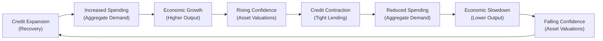
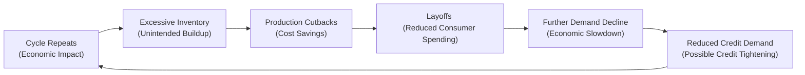

Overview of Credit Cycles  
Credit cycles are periods where access to credit, lending standards, and overall debt levels within the economy expand or contract—often reinforcing the broader business cycle. When times are good, banks and financial institutions get excited (in a cautiously optimistic way, hopefully) about lending. They relax lending criteria, and suddenly you have businesses ramping up capital expenditures, households buying more houses, and that extra injection of money fueling further economic growth. But, as we all know, what goes up in finance is often at risk of coming back down. When the economy begins softening, banks grow uneasy about borrowers’ ability to repay. They tighten their standards, restrict credit, and effectively tighten the spigot of economic liquidity.

I remember my first job at a small investment firm: we had a commercial real estate developer approach us during an economic expansion. The banks were happily handing out credit lines like candy. But a year later, during a mild recession, the same bank that had rolled out the red carpet was suddenly nowhere to be found, more or less slamming the door on new lending. This shift was all part of the credit cycle. The real estate developer was left scrambling for financing, reflecting how quickly credit conditions can cool off when the outlook sours.

Key Drivers Affecting Credit Cycles  
• Bank Risk Appetite: In expansions, banks perceive lower default risk, so they push loans aggressively. During contractions, risk aversion spikes—reducing credit availability or increasing interest rates (risk premiums).  
• Changing Economic Conditions: Rising GDP often encourages more lending. Conversely, when unemployment rises or corporate defaults tick up, lenders impose restrictions on credit or demand higher collateral requirements.  
• Monetary Policy Shifts: Central banks influence credit by adjusting policy rates, changing reserve requirements, or engaging in unconventional policies (like quantitative easing). When rates are low, borrowing typically surges. When rates climb, borrowing slows.  
• Regulation and Capital Adequacy Rules: Stricter regulations, such as higher bank capital requirements, can stifle credit expansion. Looser regulations can fuel risk-taking and push credit growth further.  

Amplification Mechanism  
Credit cycles tend to amplify the broader business cycle, acting like a feedback loop. When credit expands, companies can finance more projects, households can buy more homes and cars, and overall demand grows. This demand growth spurs more hiring, more consumer confidence, and even more borrowing. Meanwhile, during contractions, reduced lending stifles growth, prompting further retrenchment by businesses, which in turn weakens consumer sentiment and can lead to additional tightening by banks.  

Below is a simple Mermaid diagram showing expansions and contractions in the credit cycle and how each phase interlinks:

If we were to overlay typical business cycle phases onto this flow, you would see that credit expansions often coincide with or precede economic upswings, while tightening phases can align with or exacerbate recessions.

Practical Effects in Portfolio Management  
For a portfolio manager (someone probably preparing for advanced portfolios in CFA): Observing credit conditions is crucial for asset allocation and risk management. During a phase of easy credit, high-yield bonds might perform well as default risks are expected to be lower, and corporate earnings generally look solid. Conversely, in a tightening phase, you’d want to keep an eye on rising spreads as a potential early indicator of a broader economic downturn. You might consider rotating into higher credit quality or diversifying into assets less sensitive to credit risk.  

The Role of Inventories in Business Cycles  
It may seem that inventories—stocks of goods piled up in warehouses—are just a detail in the supply chain. But oh, they matter so much to the cycle. Firms constantly balance the costs of holding inventory (storage and financing costs) against the risk of running short of goods when demand suddenly spikes. When managers are convinced demand will continue to rise, they’ll accumulate more goods. A mismatch arises if consumers stop buying as quickly as expected, leaving firms sitting on unwanted inventory. That buildup can trigger production cutbacks, as managers strive to bring inventory levels back in line with slower demand.

I recall times when, in my own silly attempts running a small e-commerce shop, I’d be overconfident in holiday sales and order way more inventory than needed. When the holiday season ended, I stared at boxes of unsold products. On a much larger scale, businesses do the same—leading to booms and busts in production and investment spending.

How Inventories Affect Economic Fluctuations  
• Early Warning Signals: A rapid rise in inventories might signal that final demand is weaker than projected. In the national accounts, this phenomenon often appears as an unexpected inventory buildup. Analysts tend to watch for large deviations in the inventory-to-sales ratio.  
• Production Smoothing: Firms adjust production based on current inventory levels. If actual sales come in below expectations, production lines are cut back to avoid bloating future storage costs.  
• Investment Multiplier Effect: Inventory investment is a component of GDP. When inventories accumulate due to overestimation of demand, and production eventually slows, overall GDP growth takes a hit.  
• Policy Reactions: Central banks and governments sometimes watch inventory data to time policy interventions. An unexpected inventory build could influence monetary easing if it signals an impending slump.  

Below is another Mermaid diagram that illustrates how an unanticipated dip in demand can lead to excessive inventories, production cutbacks, and further macroeconomic repercussions:

When these cycles happen on a large scale, you might see entire industries scale back production at once, spurring higher unemployment and putting the brakes on both consumer and business confidence.

Credit Cycles and Inventory Interplay  
Credit availability influences inventory behavior, too. In expansions, cheap financing makes it easier for businesses to hold bigger inventories. They figure: “No big deal, interest costs are low, and demand is robust.” But if the market teeters and banks tighten credit, suddenly businesses are forced to cut back on building up stockpiles. That can lead to abrupt inventory adjustments—and potential disruptions in the supply chain.  

Consider the 2008 financial crisis: credit dried up dangerously fast, and many firms could no longer finance their normal inventory levels. Consequently, there was a sharp downturn in production because you can’t sustain large inventories if your credit lines are reduced or canceled. This phenomenon is sometimes referred to as the “inventories-credit nexus,” where credit conditions strongly affect how much inventory a firm can hold, which in turn feeds back into the business cycle.  

Table: Phases of the Credit Cycle and Typical Inventory Management  

| Credit Cycle Phase           | Lending Climate           | Inventory Management Tendency    | Economic Impact                               |
|------------------------------|---------------------------|----------------------------------|-----------------------------------------------|
| Expansion (Easy Credit)      | Low interest rates, banks eager to lend | Firms accumulate more inventories (relaxed financing) | Boost to GDP due to higher production and investment |
| Peak                         | Lending conditions still favorable but risk concerns emerge | Some slowing in inventory buildup; cautious approach | Economy still grows, but cracks may start to appear   |
| Contraction (Tight Credit)   | Higher lending standards, possible liquidity crunch | Rapid drawdown of inventories to conserve cash | Slow or negative growth in production, hamper GDP      |
| Trough                       | Minimal lending, economy at low point | Inventories typically at low levels, ready for next upturn | Economic activity bottoms, sets stage for next expansion |

Practical Examples  
• Computer Manufacturing: Tech firms often hold sizable inventories of components like microchips. In a credit-fueled expansion, they might stockpile extra chips, expecting robust sales of devices. When demand doesn’t materialize, they quickly ratchet production down, possibly triggering layoffs in related sectors.  
• Retail Industry: Inventory is a major cost center in retail. During expansions, retailers stock more aggressively. A credit or economic contraction can leave them overloaded with seasonal merchandise they can’t move, leading to discounting, margin squeezes, or canceled supplier orders.  
• Automotive Sector: Car manufacturers produce vehicles months in advance based on forecasts. If credit gets tight and customers aren’t securing auto loans, cars sit on dealer lots. The automakers respond by slowing production—impacting thousands of suppliers, from tire companies to seat manufacturers.  

Influence on Corporate Earnings and Stock Prices  
At the firm level, credit cycles and inventory management can strongly influence reported earnings. Over-optimistic inventory decisions can bleach near-term profits due to carrying costs. Later, if the firm has to slash production, overhead costs remain, which pinches margins further. Analysts often watch the firm’s “days sales of inventory” or inventory turnover ratio to gauge efficiency. They track credit metrics like debt-to-equity and interest coverage, especially in cyclical industries.  

From a valuation standpoint, an overhang of inventory can depress operating cash flow, which might be an early sign of trouble. Meanwhile, if a company draws on short-term financing to carry inventory, rising interest rates or a credit crunch can quickly erode profit margins. Equity analysts often highlight these risks in research reports, returning to credit cycles as a macro factor that can overshadow strong fundamentals.  

Best Practices and Pitfalls  
• Monitoring Inventory-to-Sales Ratio: Keep a close eye on whether inventories are growing in line with sales. A divergence often predicts a slowdown as companies correct the mismatch with production cuts.  
• Watching Bank Lending Surveys: Central banks or government agencies in many regions publish surveys of bank lending (e.g., Senior Loan Officer Opinion Survey). Analysts can detect whether banks are tightening or loosening credit standards ahead of official GDP releases.  
• Avoiding Overextension: Firms that rely excessively on short-term borrowing to finance inventory are more vulnerable to credit shocks. To mitigate risk, wise managers diversify their financing sources and maintain a cushion of working capital.  
• Considering Global Supply Chains: In a globalized environment, disruptions in credit or inventory at one node (say, a supplier in Asia) can ripple through worldwide production networks.  

Time Lags and Policy Considerations  
Central banks respond to credit expansions that risk fueling inflation by raising interest rates, often cooling both credit growth and inventory investment. These policy actions usually operate with a lag, so the effect on the real economy might not unfold for months. This delay can magnify cycle swings, as businesses and households might continue borrowing aggressively even as rates start to rise, only to get caught off guard when the credit configuration abruptly tightens.  

Exam Relevance and Strategies  
On the CFA exam, you may see scenario-based questions linking an unexpected inventory surge to macroeconomic slowdowns, or questions about how credit tightening influences GDP. You might be asked to comment on portfolio allocation decisions when credit conditions worsen. For instance, an essay question could present a case study of a fictional manufacturing firm showing rising inventories and a sharp drop in new orders. You’d interpret the data and discuss how it might foretell a deeper contraction.  

From a direct test-taking strategy, remember to integrate both credit cycles and inventories in your macro outlook. They are key signals for turning points in business cycles, and the exam loves to test your ability to interpret these signals.  

References  
• Bernanke, B. & Gertler, M. (1989). “Agency Costs, Net Worth, and Business Fluctuations.” American Economic Review.  
• International Monetary Fund (IMF) Global Financial Stability Reports: https://www.imf.org/en/Publications/GFSR  
• Ramey, V. (1991). “Inventories as Factors of Production and Economic Fluctuations.” American Economic Review.  

Below is a succinct glossary of key terms:

Credit Cycle  
The recurring pattern of expanding and contracting access to credit that moves in tandem with broader economic conditions.  

Credit Tightening  
The phenomenon where lending standards become more restrictive, often associated with higher interest rates and collateral requirements.  

Inventory Adjustment  
Firms’ actions to manage stock levels according to demand expectations; can involve ramping up or slashing production.  

Production Cutbacks  
Reductions in output aimed at aligning inventories with lower demand, often associated with worker layoffs.  

Amplification Mechanism  
A reinforcing process in which credit conditions exacerbate the magnitude of business cycles—easing credit fuels expansions, while tight credit deepens contractions.  

Now, let’s test your comprehension of how credit cycles and inventory management can drive or dampen a given economy’s performance, and how that knowledge might be critical for a CFA candidate or practicing financial professional.

## Test Your Knowledge: Credit Cycles and Inventory Dynamics



### During a credit expansion, how do manufacturers typically respond in terms of inventories?
- [x] They accumulate higher inventory levels due to easy financing.
- [ ] They reduce inventory levels to cut carrying costs.
- [ ] They maintain minimal inventory to reflect higher sales.
- [ ] They temporarily shut down production lines in anticipation of lower demand.

> **Explanation:** In a credit expansion, financing is cheaper and demand is stronger, encouraging manufacturers to hold larger inventories to meet expected sales.

### What is a common consequence for firms that hold excess inventory during a downturn?  
- [x] They face increased carrying costs and may have to slash production further.  
- [ ] They experience higher profit margins due to bulk buying.  
- [ ] They avoid layoffs by selling inventory at higher prices.  
- [ ] They maintain stable production and experience minimal cash flow impact.  

> **Explanation:** Excess inventories during a downturn often lead to higher storage and financing costs, forcing firms to cut production to align with weaker demand.

### Which metric best indicates whether companies are stockpiling too many goods compared to sales?  
- [x] Inventory-to-sales ratio  
- [ ] Return on equity  
- [ ] Accounts payable turnover  
- [ ] Earnings before interest and taxes (EBIT) margin  

> **Explanation:** The inventory-to-sales ratio highlights how quickly goods are moving relative to how many goods are on hand, providing a direct measure of stock buildup.

### How do credit cycles typically amplify business cycles?
- [x] By easing credit during expansions and tightening credit during contractions, thereby reinforcing spending trends.
- [ ] By maintaining stable credit availability, preventing extreme economic fluctuations.
- [ ] By aligning central bank policies with consistent credit supply across cycles.
- [ ] By eliminating default risk entirely, making downturns less severe.

> **Explanation:** The cyclical availability of credit can intensify expansions when credit is easily obtained and deepen contractions when banks restrict lending.

### Which factor usually triggers credit tightening?
- [x] A deterioration in borrower creditworthiness leading to higher default risk.
- [ ] A desire by financial institutions to expand market share aggressively.
- [x] Regulatory interventions that raise capital requirements.
- [ ] Lower interest rates that reduce bank profitability.

> **Explanation:** Credit tightening can arise if banks see rising default risks or face higher capital adequacy constraints. Both factors prompt more cautious lending.

### What is the primary motivation for a company to cut back production when inventories rise?
- [x] To align output with slower demand and avoid excessive storage costs.
- [ ] To hedge against unexpected demand surges.
- [ ] To take advantage of bulk discounts from suppliers.
- [ ] To maintain artificially high prices by limiting supply.

> **Explanation:** Companies reduce production when inventories grow beyond target levels, seeking to control carrying costs and match weaker demand.

### Which measure might a central bank take to moderate an overheating economy with rising credit growth?
- [x] Increase policy interest rates.
- [ ] Lower reserve requirements.
- [x] Implement tighter macroprudential regulations.
- [ ] Initiate bond purchase programs (quantitative easing).

> **Explanation:** Raising interest rates or tightening regulations are ways central banks can restrain credit growth in a potentially overheating economy.

### Why can reduced availability of short-term financing force a sudden drop in inventories?
- [x] Firms cannot afford the carrying costs without accessible credit.
- [ ] Firms choose to hoard cash to time equity buybacks.
- [ ] Firms immediately recognize new consumer demand spikes.  
- [ ] Firms experience a windfall of cheaper storage options.

> **Explanation:** If credit lines shrink, firms often lack resources to keep goods in stock, leading to a rapid inventory drawdown.

### What is one way credit cycles might affect corporate earnings?
- [x] High interest rates increase borrowing costs, squeezing profit margins.
- [ ] Higher inventories immediately boost net income through intangible gains.
- [ ] Tighter credit always leads to immediate share price growth.
- [ ] Looser credit discourages acquisitions.

> **Explanation:** When interest rates rise or credit becomes scarce, interest expense can climb and hamper profitability, reducing earnings.

### During a credit contraction, is it true that inventory overhang can exacerbate economic slowdowns?
- [x] True
- [ ] False

> **Explanation:** If inventories accumulate just as demand weakens, companies slash production more aggressively, amplifying the downturn’s severity.


