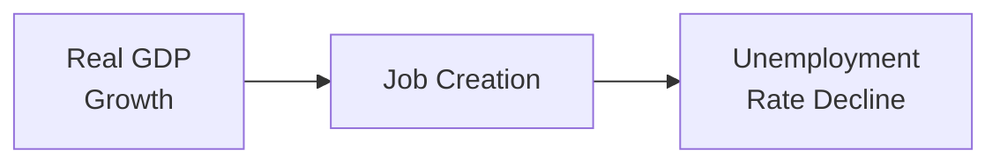

## Understanding the Relationship Between GDP Growth and Unemployment

Okun’s Law is one of those neat little relationships in macroeconomics that seems to pop up everywhere. You know how sometimes you look at an economy that’s growing fast and—almost like clockwork—you see unemployment start dropping? Well, that’s basically the essence of Okun’s Law. It’s an empirical observation that if real GDP grows above its potential or trend growth rate, unemployment tends to go down, and vice versa. Before we dig deeper, let me share a quick anecdote: I remember the first time I tried to “predict” the unemployment rate for an economics project in college. I was all sorts of excited, rummaging through data sets, plugging them into spreadsheets, and guess what popped out as one of my best-fitting models? Okun’s type relationship: a couple of percentage points of GDP above trend correlated with about a 1% decline in unemployment. That moment taught me that, while not a perfect law, Okun’s relationship is a powerful tool in a forecaster’s kit.

Below is a simplified representation of the connection:



Although this is a simplification, it captures the heart of Okun’s Law: higher real GDP growth spurs job creation, and job creation eases unemployment. Let’s see how that works in a bit more detail.

## The Empirical Nature of Okun’s Law

Okun’s Law is not a theoretical identity etched in stone—it’s an empirical relationship. In other words, economists observed the data and said, “Hey, we notice that changes in unemployment are often linked to how fast real GDP is growing.” It’s not guaranteed to hold with pinpoint precision across all eras, but historically, it has been a good rule of thumb in many (though not all) developed economies.

A common framing of Okun’s Law might look like this (in a simplified linear form):

$$
\Delta u = \alpha - \beta \times (g - \bar{g})
$$

where:  
• \\( \Delta u \\) is the change in the unemployment rate (for instance, going from 6% to 5%).  
• \\( g \\) is the observed real GDP growth rate.  
• \\( \bar{g} \\) is the economy’s potential or “normal” growth rate, sometimes referred to as the long-run trend.  
• \\(\alpha\\) is a constant (some models allow for a statistic representing frictional elements).  
• \\(\beta\\) is often referred to as the Okun coefficient, measuring how much the unemployment rate changes for a given deviation of GDP growth from its potential.

Depending on the model, you might see variations: some define the relationship in terms of “GDP gap” or “unemployment gap.” But the fundamental idea remains the same—unemployment is sensitive to how strongly the economy is growing relative to its trend.

## Interpreting Okun’s Coefficient

That coefficient, \\(\beta\\), is often somewhere around 2 to 3—that’s the textbook figure you’ll likely see. If \\(\beta = 2\\) in your particular model, it says that every 1 percentage point drop in unemployment is associated with roughly a 2 percentage point increase in real GDP growth above trend. Alternatively, if you see the relationship expressed as an “Okun gap” measure, you might read something like “A 1% shortfall of GDP from potential means an X% rise in unemployment.” The direction remains the same. The bigger the gap grows, the more unemployment will deviate from its (often frictional) natural rate.

During expansions, when real GDP outstrips that typical growth rate, the economy tends to spark more hiring. And the hiring might happen pretty quickly, especially in flexible labor markets. During downturns, if real GDP slips below potential (or shrinks outright), unemployment drifts upward.

However, you know that neat “2 to 3” figure we keep hearing? It’s not set in stone. Some countries have experienced coefficients near 1.5, or occasionally above 3, and it can shift over time. Factors like labor force participation shifts, technological changes, or even new labor regulations can cause that coefficient to get bigger or smaller.

## Why Okun’s Law Matters

The reason Okun’s Law matters in public policy—and for that matter, in investment decision-making—boils down to this: if a government or central bank wants to reduce unemployment, they might look to stimulate GDP growth beyond its normal trend. Stricter monetary policy that constrains economic activity can tamp down inflationary pressures, sure, but it can also hold the economy below potential growth, leaving unemployment higher than necessary. A typical policy question might be: “Do we worry more about inflation or about joblessness?” Okun’s Law offers a quick sense of how big a trade-off we might see in terms of lost jobs or lost output.

For a CFA candidate or an investment analyst, it’s important to integrate macroeconomic forecasts into your capital market expectations. If you anticipate real GDP growth to surge due to, say, expansionary monetary and fiscal policy, you might foresee a drop in unemployment—and plan accordingly, perhaps tilting toward cyclical sectors or consumer discretionary companies that tend to benefit when people feel more secure in their jobs.

## Practical Case Study: The Late 1990s Boom

Let’s recall the dot-com era of the late 1990s in the United States. Real GDP growth soared above potential for a number of years—the economy was riding a wave of tech innovation, consumer optimism, and some might say irrational exuberance. During that stretch, the unemployment rate plummeted. For instance, from 1996 to 2000, the U.S. real GDP growth often topped 4%, noticeably above the estimated potential of around 2.5–3%. The unemployment rate followed suit, dipping below 4% by the end of the decade.

Okun’s Law wasn’t a perfect predictor (it rarely matches the data perfectly in every quarter), but if you looked at the general trend, the relationship was there: surge in GDP growth → bigger job creation → falling unemployment.

## Structural Unemployment and Other Caveats

One of the challenges with Okun’s Law is that it focuses on cyclical unemployment—unemployment stemming from fluctuations in the business cycle. But structural unemployment, such as that caused by a mismatch of skills or changes in technology, isn’t reduced simply by “faster GDP growth.” If workers don’t have the skills demanded by new industries, robust GDP growth won’t magically solve that mismatch overnight. There’s also frictional unemployment, the short-term unemployment you get from people switching jobs or entering the workforce.

In a rapidly changing economy—think about the wave of AI automation we’re seeing—some individuals might find themselves without the specialized skills for new roles. Okun’s Law can’t fix that. So, if you see an economy with high (and persistent) structural unemployment, you might notice that the observed Okun coefficient is lower because job creation is not perfectly bridging the mismatch for certain categories of workers.

Additionally, labor force participation can throw a monkey wrench into the measurement. If large numbers of people give up looking for work (thus dropping out of the official labor force), the unemployment rate might go down, but that doesn’t necessarily mean the economy is generating robust job growth. Another interesting dynamic is that each region’s labor market rules—like how easy it is to hire and fire workers—can influence how quickly unemployment rates respond to output changes.

## Policy Implications

Okun’s Law is often invoked in discussions about what GDP growth target is “enough” to bring unemployment down. If an economy is just barely meeting its trend growth (say 2%), but structural unemployment is around 6%, policymakers hopeful to get it down to 4% might deduce they need a few consecutive years of 3–4% growth. This is a simplified, back-of-the-envelope approach, but it underscores the core lesson: stable but modest growth may not be enough to meaningfully reduce unemployment.

For investors, hearing that a government is aiming for higher growth—maybe through infrastructure spending or tax incentives—might shape your outlook for cyclical sectors, your forecast for consumer demand, and your expectations around labor-intensive industries.

At times, governments can get frustrated with slower-than-expected improvements in labor markets. They might refer to Okun’s Law and say, “Well, we’re targeting X% growth, so we expect unemployment to fall to Y%.” The tricky part is that the relationship can shift. One reason it might shift is changes in technology, globalization (outsourcing, offshoring), or major demographic transitions like baby boomers retiring in large numbers.

## A Visualization of the Growth-Unemployment Dynamics

Below is a more detailed conceptual flow of how growth transitions into changes in unemployment. Admittedly, it’s not an exact step-by-step, but it gives you a picture of the interplay between economic expansion, business sentiment, hiring, and the labor market.


In a typical cycle, you might see central banks loosen policy rates (A), leading to more spending (B), spurring growth (C). As businesses enjoy higher revenues (D), they expand their workforce (E), which leads to an improved labor market (F). However, this chain of events isn’t automatic or guaranteed in every scenario. That’s why Okun’s Law is typically described in terms of “on average” or “historically we found” relationships.

## Python Snippet: A Simple Regression Approach

If you want to see how a regression for Okun’s Law might look in practice, you could experiment with a data set of quarterly GDP growth and unemployment rates. Below is a small Python snippet just to illustrate the concept. (Don’t worry if you haven’t done this in your own practice; it’s only intended to show how an analyst might test Okun’s Law with real data.)

```python
import pandas as pd
import statsmodels.api as sm

# We also have a column 'Potential_GDP_growth' if we want to measure deviation from potential

data['GDP_dev'] = data['Real_GDP_growth'] - data['Potential_GDP_growth']

X = sm.add_constant(data['GDP_dev']) 
y = data['Unemployment_change']

model = sm.OLS(y, X).fit()
print(model.summary())

```

In a real-world scenario, you’d refine this approach by controlling for lags (unemployment may respond to last quarter’s growth) or structural breaks (periods with different relationships). But the gist is there: you’re checking how changes in unemployment correlate with GDP growing above or below potential.

## Imperfections and Ongoing Debates

While Okun’s Law is powerful, it’s definitely not a perfect forecasting tool. For one, many advanced economies have gone through periods (e.g., certain parts of Europe in the early 2010s) where real GDP growth was tepid, but unemployment improved slightly, possibly due to shifts in labor force participation or part-time work expansions. In some emerging markets, strong GDP growth might not necessarily lead to a massive reduction in unemployment due to the abundance of unskilled labor and potential structural barriers.

Economists have also discovered that in deep recessions, the unemployment rate might spike more severely than Okun’s Law would predict, possibly due to firm closures and credit constraints. In expansions, the law might underestimate job creation if consumer confidence surges. Consequently, if you’re thinking, “I’ll just memorize the 2–3% rule and I’ll be done,” be aware that real data can deviate in surprising ways.

## How This Ties In With Business Cycles (and the CFA Curriculum)

Okun’s Law is studied alongside other frameworks—like the Aggregate Demand and Aggregate Supply (AD-AS) model or indicators related to business cycles—because it provides a sense of how labor markets might behave across expansions and contractions. In Chapter 3, we’re dissecting business cycles, discussing phases of expansion, peak, recession, and trough. Okun’s Law highlights the link between the real GDP growth (one measure of the business cycle’s strength) and the labor market (unemployment).

For the CFA Level I candidate, it’s a straightforward concept: if you see a question about what might happen to unemployment when real GDP grows above potential for several quarters, you can confidently link that to a likely decline in unemployment rates. The exam might present a scenario with specific figures or might ask you to interpret data trends. Either way, the concept is that the economy’s growth performance has a direct impact on job creation—Okun’s insight.

## Common Pitfalls and Exam Tips

• Overreliance on a Specific Coefficient: Some might remember “2% for every 1%” a bit too rigidly. The exam might mention some alternative scenario with a coefficient near 1.7 or 3.2. Don’t get flustered. Okun’s coefficient is an empirical measure; it can vary across nations and time.  
• Ignoring Structural Issues: If the question references structural unemployment or skill mismatches, keep in mind that robust GDP growth might not fix that quickly.  
• Confusing Short-Run and Long-Run: Okun’s Law is primarily about short-run cyclical changes. In the long run, the unemployment rate is influenced by factors such as demographics, technology, and immigration policies.  
• Application in Policy Debates: If an exam item set discusses a central bank or government official wanting to reduce unemployment drastically, be prepared to see how bigger bursts of GDP growth might be required if \\(\beta\\) is large.  
• Integrating with Other Macroeconomic Tools: Sometimes, you’ll see Okun’s Law come up with other tools like the Phillips curve or discussions of inflation. Keep those frameworks organized in your mind so you can answer multi-part exam questions that link GDP growth, unemployment, and inflation.

## Real-World Observations

Time for a personal story: a career supervisor once told me (while I was an early analyst), “You know, if you can forecast the gap between GDP and potential, you’ll seem like an oracle to others!” And it’s true. People in finance get excited about the slightest signals that growth might undershoot or overshoot potential. Because if they can glean an insight into labor market movements, they can position trades or shape an investment strategy accordingly. That’s the magic of Okun’s Law. A bit of growth above potential can mean the difference between marginal expansion or robust hiring that changes consumer behavior significantly.

## Conclusion

Okun’s Law demystifies the link between unemployment and real GDP growth. While it’s no perfect crystal ball, it’s a helpful tool in the macroeconomic toolbox. From an investor standpoint, or as a candidate preparing for the CFA exam, understanding how employment tracks economic expansions can inform both your economic outlook and your investment decisions. Just remember: the relationship can change over time, so be flexible, watch for structural factors, and keep an eye on how potential GDP might be shifting as technology and demographics evolve.

## References and Further Reading

• Okun, A. M. (1970). “The Political Economy of Prosperity.” Brookings Institution.  
• Ball, L. & Leigh, D. (2013). “Okun’s Law: Fit at 50?” NBER Working Paper.  
• IMF Economic Research: https://www.imf.org/en/Publications  

## Test Your Knowledge: Okun’s Law and Economic Growth Quiz



### According to Okun’s Law, a decrease in the unemployment rate generally occurs when:

- [ ] Real GDP growth is below its long-term potential.  
- [x] Real GDP growth exceeds its long-term potential.  
- [ ] The unemployment rate is already at zero.  
- [ ] There is a decline in structural unemployment only.  

> **Explanation:** Okun’s Law implies that unemployment tends to fall when real GDP growth surpasses its potential growth rate.

### If the Okun coefficient is approximately 2, and the economy grows 1% above its potential for a sustained period, how might the unemployment rate respond?

- [ ] It will remain unchanged, since growth must be 2% above potential.  
- [x] It might drop by roughly 0.5%.  
- [ ] It might drop by roughly 2%.  
- [ ] It may not move unless structural unemployment is also addressed.  

> **Explanation:** With a coefficient of 2, a 1% increase above potential growth could correlate with about a 0.5% decrease in unemployment (the 1:2 ratio).

### In practice, one major limitation of Okun’s Law is that:

- [ ] It is a theoretical identity and never changes.  
- [x] Factors like structural unemployment and labor force participation can weaken the relationship.  
- [ ] It disregards the role of GDP in fueling inflation.  
- [ ] Central banks never refer to Okun’s Law in policy discussions.  

> **Explanation:** Structural unemployment, demographic shifts, and varying labor force participation can significantly alter how changes in GDP map to changes in unemployment.

### When an economy faces a mismatch of skills in the labor market, this is best described as:

- [ ] Frictional unemployment.  
- [x] Structural unemployment.  
- [ ] Cyclical unemployment.  
- [ ] Okun’s unemployment.  

> **Explanation:** Structural unemployment arises from fundamental mismatches in skills (or geography, technology changes), while frictional is short-term transitions and cyclical is related to the business cycle.

### If a country’s real GDP growth has consistently been 2% below its potential for the past two years, what does Okun’s Law predict for unemployment?

- [x] Unemployment will likely rise relative to its previous rate.  
- [ ] Unemployment will likely remain stable if inflation is under control.  
- [ ] Unemployment will likely fall quickly.  
- [ ] Unemployment will remain unaffected because real GDP growth is still positive.  

> **Explanation:** Dipping below potential growth generally corresponds to rising unemployment, according to Okun’s Law.

### In the context of Okun’s Law, which of the following statements is true regarding policy implications?

- [ ] Stimulating GDP growth is irrelevant to reducing unemployment.  
- [ ] Reducing unemployment does not necessitate any GDP growth.  
- [x] Targeting high GDP growth rates can help lower cyclical unemployment.  
- [ ] GDP growth cannot occur unless unemployment is already low.  

> **Explanation:** Okun’s Law suggests policymakers can reduce cyclical unemployment by achieving growth rates above the economy’s trend.

### In a scenario where the Okun coefficient is 3, how much additional GDP growth above potential is theoretically required to reduce the unemployment rate by 1%?

- [ ] About 0.5%  
- [ ] About 1%  
- [ ] About 1.5%  
- [x] About 0.33%  

> **Explanation:** If \\( \beta = 3 \\), then the economy needs only about 0.33% of additional growth above potential to reduce unemployment by 1%, because 1 / 3 ≈ 0.33.

### Which of the following best captures why Okun’s Law might vary across countries?

- [ ] Monetary policy is the same in all countries.  
- [ ] The concept of GDP doesn’t apply everywhere.  
- [x] Labor market institutions, demographics, and technology differ.  
- [ ] Most countries do not keep track of unemployment rates.  

> **Explanation:** Differences in labor market flexibility, demographics, and technological advancement cause variations in the empirical coefficient for Okun’s Law.

### Which term describes the “number” linking a given change in unemployment to an observed rise or shortfall in real GDP?

- [ ] Frictional Coefficient  
- [ ] Productivity Ratio  
- [ ] GDP Gap Index  
- [x] Okun’s Coefficient  

> **Explanation:** Okun’s Coefficient is the numerical value that defines how changes in GDP translate to changes in unemployment.

### True or False: A temporary spike in GDP growth will always cause a permanent decline in unemployment, according to Okun’s Law.

- [x] False  
- [ ] True  

> **Explanation:** Okun’s Law applies to cyclical changes, and if growth drops back below potential, unemployment can rise again. It’s not a permanent fix without sustained above-potential growth or measures addressing structural issues.




