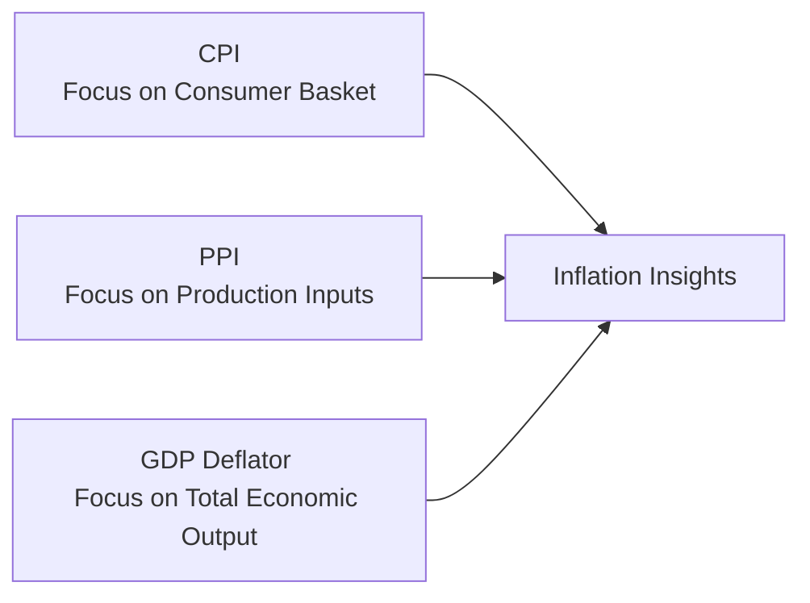

## Introduction

Inflation. That single word can spark more debate in economic circles than you’d expect—trust me, I’ve had more than a few animated chats over coffee about whether inflation is “too low,” “too high,” or “just right.” In plain terms, inflation is the sustained increase in the general price level of goods and services over time. When inflation hits, each unit of currency buys fewer goods and services than before—ouch. Governments and central banks keep a keen eye on inflation because it affects everything from monetary policy decisions to your grocery bill.

Economists typically monitor inflation using a few key metrics, each capturing different aspects of price behavior. The main instruments—Consumer Price Index (CPI), Producer Price Index (PPI), and the GDP Deflator—are crucial for understanding how inflation evolves across different stages of the economy, from the household’s daily shopping basket all the way to the country’s entire output. Let’s take a closer look at each, talk about how they’re constructed, and note some of the pitfalls.

## Why Measuring Inflation Matters

Before diving into formulas and indexes, it’s vital to understand the “why.” Inflation data helps:
• Central banks set interest rates.  
• Governments decide if fiscal stimulus is needed.  
• Firms plan production and pricing strategies.  
• Households assess changes in their cost of living.

If inflation starts raging, it reduces the purchasing power of every dollar (or euro, yen, etc.) you have. Conversely, deflation can be a signal of economic slowdown (which means, ironically, your money might buy more, but businesses could be hurting). Accurately measuring inflation is, therefore, a key puzzle piece in managing the economy.

## Consumer Price Index (CPI)

The CPI is perhaps the most common measure of inflation around the world. In everyday conversations, you’ll often hear “the inflation rate” quoted as the percentage change in the CPI over some period. Let me share a small personal anecdote: My first experience with tracking inflation was when I started noticing how the cost of my morning latte crept up year after year—slowly but surely. That creeping price increase is partially reflected in the CPI.

### Key Features

• Represents the cost of a basket of goods and services generally purchased by households (food, housing, transportation, etc.).  
• Uses a base period where the basket cost is normalized to 100.  
• Then compares current basket cost to the base cost, generating an index.  

Mathematically:


\text{CPI} = \frac{\text{Cost of basket in current period}}{\text{Cost of basket in base period}} \times 100


The composition of the basket is, of course, crucial. If you’re a big coffee drinker, and coffee beans surge in price, the CPI might or might not fully reflect your personal reality depending on how coffee is weighted in the official basket. Sorry, coffee-lovers.

### CPI Calculation in Action
Suppose the base-year cost of a basket of typical household items was \$200. If in the current year the same basket costs \$210, the CPI would be:


\text{CPI} = \frac{210}{200} \times 100 = 105


So, we’d say the “CPI is 105,” and the inflation rate since the base year is 5%. This inflation measure is nice and straightforward but comes with biases.

### Common Biases

• Substitution Bias: As some goods get more expensive, people buy substitutes. But the traditional fixed-weight CPI can overstate inflation by not fully capturing that shift.  
• Quality Bias: If cars are pricier but also safer or more fuel-efficient, part of the price hike might be due to higher quality rather than inflation.  
• New Product Bias: If the index doesn’t promptly include new gadgets or services—like the latest streaming platforms—it might not capture how consumer spending habits evolve.

All these factors can slightly distort the CPI from “true” inflation. Still, it’s widely used in wage negotiations, pension adjustments, and economic policy.

## Producer Price Index (PPI)

While the CPI focuses on the prices households face, the PPI (once called the Wholesale Price Index in some places) highlights the inflation experience at an earlier stage—what producers are getting paid. I remember encountering PPI back in my first economics course and thinking, “Why do we want to watch production costs?” Because these costs often trickle down to consumers.

### Key Attributes

• Tracks changes in prices producers receive for their output (which might be raw materials, intermediate goods, or final products).  
• Often seen as an early warning indicator of changes in inflation; if producers pay more for raw materials, guess what they might do? Pass that cost along as higher prices to consumers.  

To measure PPI, statisticians compile data from businesses across different industries—like metals, energy, or manufacturing. A formula similar to CPI is used, although the basket content is based on producer revenue streams instead of consumer spending.


\text{PPI} = \frac{\text{Cost of producer basket in current period}}{\text{Cost of producer basket in base period}} \times 100


### Significance

• Allows sector-by-sector analysis—like manufacturing vs. services.  
• Lets you see if commodity price swings (like an uptick in the price of steel or crude oil) are showing up in factory gate prices.  
• Acts as a possible leading indicator for CPI. If PPI is galloping, CPI might soon follow.

## GDP Deflator

The GDP Deflator, often called the Implicit Price Deflator, is a very broad measure of inflation. If you’ve got your eyes set on how the overall economy’s prices are evolving (including investment goods, government spending, exports, etc.), the GDP Deflator can be your go-to.

### Formula

Mathematically:


\text{GDP Deflator} = \frac{\text{Nominal GDP}}{\text{Real GDP}} \times 100


Here, “Nominal GDP” is the value of total output measured at current prices, whereas “Real GDP” is measured at base-year (constant) prices, adjusting for inflation. By dividing the two, you effectively get a gauge of how much of the nominal GDP changes come from price fluctuations rather than real output growth.

### Coverage

• Includes everything produced locally—consumer goods, business investment, government services, and net exports.  
• Excludes imports (since they’re not part of GDP).  
• Automatically updates when consumption and production patterns shift over time.

Because it tracks all domestically produced goods and services, it can diverge significantly from CPI. For instance, if the price of imported products skyrockets, the CPI feels that pinch (because consumers buy imports), but the GDP Deflator might not flinch as much because imports aren’t included.

## Visual Overview of the Indices

Below is a simple Mermaid diagram to help visualize how CPI, PPI, and the GDP Deflator feed into the broader concept of inflation measurement:

Each index gives a different angle on how prices move. Used together, they provide a more holistic view of inflation.

## Comparing the Three Measures

So you might ask: “Which one is right?” The quick answer is they’re all right, but each is tailored for a different purpose. 

• CPI is heavily focused on the cost of living—if your landlord raises your rent or your grocery bill spikes, that’s in CPI’s wheelhouse. It’s often used for wage negotiations and adjusting social security payments.  
• PPI picks up changes in the production side of the economy. It can be ahead of CPI in timing because prices at the factory level might eventually pass through to consumers.  
• GDP Deflator captures how price levels are evolving across the entire economy, including capital goods and government spending. If you want to know the overall inflation in the domestic economy’s production, the GDP Deflator is more comprehensive.

### A Quick Table

| Measure          | Focus                     | Coverage      | Common Use                              |
|------------------|---------------------------|---------------|-----------------------------------------|
| CPI              | Household consumption     | Fixed basket  | Cost-of-living adjustments, policy      |
| PPI              | Producer prices           | Producer goods & services | Early inflation signal, sector analysis |
| GDP Deflator     | All goods & services in GDP | Entire economy, excluding imports | Macro-level price changes, real GDP calculations |

## Potential Pitfalls

It’s easy to assume that if one index is rising, the others must be rising as well—but they can differ. Consider a scenario where the world price of petroleum skyrockets. If it’s mostly imported, CPI might go up (since consumers pay more for gas at the pump), but the GDP Deflator might not register as large of an increase because it excludes imported oil. 

Another pitfall is ignoring the nuances of chain-weighted indexes versus fixed-weight approaches. Modern statistical agencies often use “chain-weighting” to account for changes in consumption patterns, which helps mitigate some substitution bias but can complicate year-to-year comparisons.

## Best Practices in Using Inflation Data

• Combine indices: Looking at CPI alone might skew your view if imported products or capital goods are playing a big role in price changes.  
• Adjust for biases: Understand the composition of each index. The CPI has known biases—substitution, quality changes, new products. Typically, official agencies like the U.S. Bureau of Labor Statistics make periodic adjustments to address these issues, but the biases might persist.  
• Compare current data with historical trends: Inflation, by definition, is about changes over time. A single month’s reading could be a blip.  
• Watch timing differences: PPI changes may appear before CPI. The GDP Deflator is usually updated quarterly with GDP releases, so it might lag more frequent price updates from CPI or PPI.

## Strategic Applications for the CFA Candidate

For an aspiring financial analyst, these inflation measures are not just academic concepts:

• **Portfolio Management**: Inflation can affect asset allocation. Stocks may benefit from moderate inflation as companies can pass on cost increases, but bondholders often worry about inflation eroding fixed-interest returns.  
• **Asset Valuation**: Cash flow forecasting in an inflationary environment requires adjusting future costs, prices, and discount rates.  
• **Risk Management**: Derivatives and other hedging tools might be used to hedge inflation risk, especially if you can foresee rising PPI and anticipate that it’ll pass through to consumer prices.  
• **Economics-based Forecasting**: If the PPI is trending upward, you might factor in higher future CPI readings. And a discrepancy between CPI and the GDP Deflator might signal shifts in trade patterns or changes in domestic production.

## Minor Anecdotes on Real-World Usage

I recall a time when a sharp rise in energy prices caused a large spike in the PPI index. Local factory owners began complaining—they had to raise prices, cut corners, or reduce staff. Meanwhile, the CPI took a few months to catch up. Eventually, we saw that feed into higher utility and transportation costs for consumers. So, yep, PPI was a good heads-up for the upcoming jump in consumer prices.

## Common Exam Pitfalls and How to Avoid Them

• **Confusing the Base Year**: Always keep track of which year is used for reference in the index calculations.  
• **Mixing Up PPI and CPI**: The PPI is about producer prices, the CPI is about consumer prices—stay vigilant on the difference.  
• **Forgetting Imports in the Deflator**: The GDP Deflator excludes imports—but CPI includes them if consumers buy them.  
• **Ignoring Substitution Effects**: This can lead to an overestimation of inflation if you believe the CPI is a perfect measure of cost-of-living changes.

## Conclusion

Inflation measurement uses multiple lenses. CPI is your household-centric measure, PPI your producer-centric measure, and the GDP Deflator is your big-picture measure. Each is indispensable for different reasons, but they must be understood together to get a nuanced view of inflation’s path. That’s especially important when you’re doing advanced portfolio analysis, forecasting, or economic evaluation. 

When you next hear someone debate whether inflation is “really rising” or not, you’ll know the index they refer to might only tell part of the story—time to start pulling out the other measures. For the CFA exam, master how to calculate, interpret, and compare these indices. And remember, keep that substitution bias and scope difference in mind because these details often show up in exam questions.

## References and Further Reading

• Bureau of Labor Statistics (BLS): [https://www.bls.gov/](https://www.bls.gov/)  
• International Monetary Fund (IMF) Data: [https://www.imf.org/en/Data](https://www.imf.org/en/Data)  
• N. Gregory Mankiw, Macroeconomics  
• Official CFA Program Curriculum readings on Measuring National Income and Inflation  

----------------------------------------------------------------------------------------------------

## Test Your Knowledge of CPI, PPI, and GDP Deflator



### Which statement best describes the CPI?

- [x] It measures changes in the prices paid by consumers for a representative basket of goods and services.
- [ ] It measures only the prices of commodities traded on global exchanges.
- [ ] It includes only goods purchased by government agencies.
- [ ] It only measures price changes for imported goods.

> **Explanation:** The CPI is designed to capture changes in the retail prices of a fixed basket of goods and services typically consumed by households.

### Which statement about the PPI is most accurate?

- [ ] It excludes energy and food inputs due to high volatility. 
- [x] It tracks changes in the prices producers receive for their output, potentially signaling future consumer-level inflation.
- [ ] It reflects price changes only in the services sector.
- [ ] It is always lower than the CPI reading.

> **Explanation:** The PPI focuses on producer-level prices and can foreshadow changes in consumer prices as cost increases might be passed on to consumers.

### How is the GDP Deflator generally calculated?

- [ ] (Real GDP ÷ Nominal GDP) × 100
- [x] (Nominal GDP ÷ Real GDP) × 100
- [ ] (Nominal GDP ÷ CPI) × 100
- [ ] (Real GDP ÷ CPI) × 100

> **Explanation:** By dividing Nominal GDP by Real GDP and multiplying by 100, you get the GDP Deflator, a broad price index that reflects price changes for all goods and services included in GDP.

### Which of the following goods would be reflected in the CPI but not in the GDP Deflator?

- [ ] Locally produced machinery purchased by a domestic company
- [ ] Government-provided street cleaning services
- [x] Imported smartphones purchased by consumers
- [ ] Domestically grown grain used for export

> **Explanation:** Imported consumer goods affect the CPI but are excluded from GDP, and hence from the GDP Deflator.

### What is a key difference between the CPI and the GDP Deflator?

- [x] The CPI measures prices of a fixed consumer basket, while the GDP Deflator covers all domestically produced goods and excludes imports.
- [ ] The GDP Deflator only includes energy products; CPI includes all products.
- [ ] The CPI adjusts for quality changes, but the GDP Deflator does not.
- [ ] They use identical methods of calculation based on a single representative basket.

> **Explanation:** CPI is a fixed basket of consumer items (often including imports), whereas the GDP Deflator encompasses a broader set of domestically produced goods and services.

### Substitution bias in the CPI means:

- [x] The CPI can overstate inflation because consumers will switch from higher-priced goods to cheaper substitutes.
- [ ] The CPI might understate inflation because it accounts for luxury items.
- [ ] The CPI only measures price changes in substitute goods.
- [ ] The PPI is always higher than the CPI.

> **Explanation:** Because the CPI is based on a basket of goods and services that may not change promptly to reflect consumer behavior (substituting cheaper items), it can overstate cost-of-living increases.

### Which index would you examine first if you wanted an early signal of inflationary trends?

- [ ] CPI
- [x] PPI
- [ ] GDP Deflator
- [ ] Import Price Index

> **Explanation:** The PPI reflects prices at an earlier stage of the production process, so cost increases here can later translate into higher CPI readings.

### Which index is generally considered the most comprehensive measure of domestic inflationary pressures across an entire economy?

- [ ] CPI
- [ ] PPI
- [x] GDP Deflator
- [ ] Wholesale Price Index (WPI)

> **Explanation:** The GDP Deflator covers the breadth of domestic production, including goods and services purchased by businesses and government, making it a broader measure than CPI or PPI.

### The PPI is especially useful for:

- [x] Analyzing inflationary pressures by sector, such as manufacturing or services.
- [ ] Measuring changes in foreign currency exchange rates.
- [ ] Determining the real interest rate in an economy.
- [ ] Calculating cost-of-living adjustments for retirees.

> **Explanation:** The PPI breaks down price changes by industries or sectors, which can inform analysis of which industries might see changes in margins or profitability.

### True or False: The GDP Deflator and the CPI usually report exactly the same inflation rate because they both measure broad price changes.

- [x] True
- [ ] False

> **Explanation:** They often diverge because they measure different baskets and follow distinct methodologies. The GDP Deflator excludes imports and updates weights frequently, whereas the CPI focuses on a fixed consumer basket that can include imported goods.


