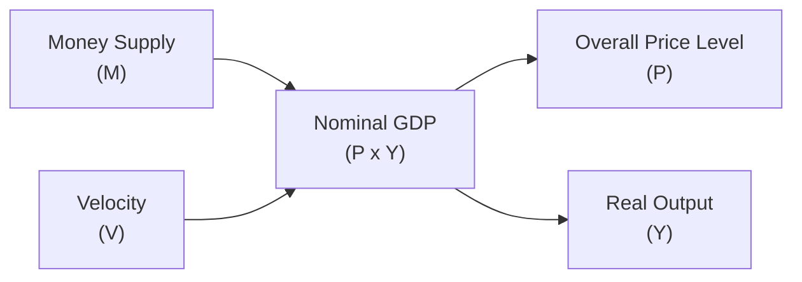

## Overview and Historical Context

So, I remember the first time I tried to connect the dots between how much money floats around in the economy and the price of stuff we buy every day. I was in a coffee shop—yep, sipping on my cappuccino—when I noticed how prices had gone up compared to the previous year. My friend asked, “Why is it more expensive?” and I thought, “Wait, maybe there’s more money chasing the same amount of coffee beans?” Although it’s a bit simplistic, that’s basically the Quantity Theory of Money in a nutshell.

At its heart, the Quantity Theory of Money is built around the equation of exchange:


M \times V = P \times Y,


where:  
- \\(M\\) is the money supply in the economy,  
- \\(V\\) is the velocity of money (the frequency with which a single unit of currency changes hands),  
- \\(P\\) is the overall price level, and  
- \\(Y\\) is the real output (often referred to as real GDP in many contexts).

For many years, classical economists assumed that both velocity \\(V\\) and real output \\(Y\\) stayed relatively stable or changed only gradually in the short run. Under these assumptions, if the money supply \\(M\\) grows faster than real output, \\(P\\) (the price level) will rise proportionately. This classical chain of thought has dominated long-run perspectives on inflation, especially in the work of monetarists like Milton Friedman.

## Short-Run vs. Long-Run Dynamics

But let’s not stop with a quick cappuccino analogy. In real-world investment analysis—especially for portfolio managers who must factor in inflation risks—considering both short-run and long-run dynamics is crucial:

• Short-Run:  
  Sometimes, velocity takes wild turns. Maybe new e-payment technologies accelerate the speed of transactions, or perhaps consumers lose confidence and hoard cash. Economic cycles, interest rates, and even psychological factors can affect how rapidly money changes hands. So in the short run, \\(M \times V\\) can be quite volatile, and it’s not always straightforward to predict \\(P\\).  
  Meanwhile, real output \\(Y\\) might be far from its potential level if the economy is in recession or slightly above if it’s overheating. In other words, both \\(V\\) and \\(Y\\) can fluctuate significantly, psyching out economists (and sometimes central bankers) who try to bring precision to short-term predictions.

• Long-Run:  
  Over longer horizons—once technology, consumer habits, and business investment cycles settle—monetarists argue that changes in the money supply become the dominant factor influencing the price level. Friedman famously quipped: “Inflation is always and everywhere a monetary phenomenon.” That might sound bold (and it has been debated!), but in broad strokes, historical data suggest that a persistently rapid growth in \\(M\\) relative to \\(Y\\) usually leads to sustained inflation.

## Mechanism and Policy Relevance

With the Quantity Theory of Money, the basic “mechanism” is straightforward: more money chasing the same amount of goods (or fewer goods) can cause prices to go up. If you’re part of a central bank, thinking about controlling \\(M\\) (the money supply) feels like a neat way to control \\(P\\) (the price level). In practice, it’s trickier:

1. Central Banks and Money Supply  
   Modern central banks influence \\(M\\) through open-market operations, reserve requirements, and by setting policy rates. For instance, a central bank might purchase government bonds to inject money into the system. If they keep doing this more quickly than real output grows, inflation can rise over time.

2. Velocity’s Surprises  
   Perhaps you remember in times of financial turmoil or crises, the velocity of money can skydive because individuals and businesses hoard cash or deposits. Conversely, in boom times—especially if payment technology is racing forward—velocity can pick up. This unpredictability in \\(V\\) sometimes undercuts the neat correlation \\(MV \approx P Y\\) in the short run.

3. Real Output Dynamics  
   A key critique of the Quantity Theory is that \\(Y\\) might not be fixed (or even stable) in the short run. Economies can face recessions, expansions, supply shocks, or technology-driven productivity leaps. All these influence how changes in the money supply filter through to prices versus real output.  

From a CFA® Level I vantage point—but also relevant to advanced portfolio construction—understanding these monetary relationships refines your forecasts of inflation. And inflation affects interest rates, which in turn play a big role in the risk-return dynamics of fixed income and equity assets.

## Modern Monetarism and Policy Approaches

It might seem like a done deal: More money means more inflation. However, modern monetarists (and many other economists) refine this basic claim:

• Monetary Phenomenon Over the Long Run  
  Friedman’s stance remains influential: in the long run, persistent inflation must be driven by sustained growth in the money supply above the growth rate of real output. This conceptual framework continues to guide monetary authorities when deciding on, say, a 2% inflation target.

• Generational Shifts in Velocity  
  Velocity is not as stable as early theorists presumed. Shifting consumer preferences—think about digital wallets, artificial intelligence in finance, or even major disruptions like pandemics—can cause the velocity of money to gyrate. These changes can be relatively short-lived, but they complicate central bankers’ tasks in controlling inflation with precision.

• Short-Run Deviations  
  Central banks often rely on a variety of tools (interest rate corridors, liquidity facilities, forward guidance, etc.) to manage short-run fluctuations. The modern perspective: it’s not purely about expanding or contracting the money supply but also about managing expectations and financial market confidence.

## Critiques and Alternatives

You might hear from colleagues, “Oh, come on, that Quantity Theory thing is too simple.” Indeed, there are critiques:

1. Non-Constant Velocity  
   As mentioned, velocity can fluctuate wildly. In a liquidity trap—where interest rates are close to zero—people have less incentive to spend. Velocity can drop precipitously. That means even if \\(M\\) rises, \\(P\\) might not rise in lockstep if that new money isn’t actually circulating.

2. Aggregate Demand Focus  
   Keynesian approaches often focus on aggregate demand management: in the short run, government spending, consumer confidence, and private investment are seen as more powerful drivers of inflation than just the money supply alone. Hence, we see expansions and contractions in demand that might alter both \\(Y\\) and \\(P\\) significantly.

3. Financial Frictions and Credit Constraints  
   Sometimes, expansions in the monetary base get “stuck” in banks’ balance sheets if credit channels aren’t working well (like in a credit crunch). So the overall economy doesn’t necessarily experience the inflationary impact that the Quantity Theory might predict if money isn’t being lent out effectively.

## Practical Example and Case Study

Let’s talk about a hypothetical scenario—just to ground all this in something relatable:

Imagine an economy in which real output \\(Y\\) is growing at 2% per year because of steady population growth and mild productivity improvements. If the money supply \\(M\\) grows at 2% as well, and if velocity \\(V\\) remains stable, the Quantity Theory suggests that overall prices \\(P\\) should remain relatively stable—close to 0% inflation, or maybe a small fraction if velocity drifts up slightly.

But suppose velocity starts rising because of new fintech apps making transactions happen more frequently. Suddenly, for the same \\(M\\), more transactions occur in the same time frame, effectively boosting \\(M \times V\\). If \\(Y\\) is still growing at only 2%, you might see upward pressure on \\(P\\). Now, if the central bank does nothing (assuming they were targeting stable prices), inflation could creep higher than expected. This scenario is a classic illustration of how velocity can upset the neat equilibrium described by the theory.

## Visualizing the Equation of Exchange

Below is a simple Mermaid diagram laying out the flow of the Quantity Theory of Money. It doesn’t capture every last nuance, but it gives a basic sense of the interplay among money supply (\\(M\\)), velocity (\\(V\\)), real output (\\(Y\\)), and the price level (\\(P\\)).

In this diagram, the product of \\(M\\) and \\(V\\) leads to nominal GDP (\\(P \times Y\\)). Breaking that nominal GDP down includes part going into the price level \\(P\\) and part into real output \\(Y\\). Of course, the real world is far fuzzier than this, but it’s a useful conceptual tool.

## Application to Portfolio Management Decisions

For a Level I candidate, you might wonder: “Why does this matter so much for investing?” Let’s see:

• Inflation Risk and Fixed Income  
  If the money supply rises too quickly and inflation expectations spike, bond prices can drop as yields rise to compensate for the erosion in purchasing power. As a portfolio manager, you’ll watch central bank signals on monetary expansion. Even though velocity might confound short-run predictions, a persistent upward trend in \\(M\\) is a red flag.

• Equity Valuations  
  Moderate inflation can sometimes be okay or even supportive for equities (companies can pass along rising costs), but high or unanticipated inflation often unsettles earnings outlooks and discount factors. Firms face higher cost of capital, and consumer demand patterns shift. Monitoring real output growth is critical to gauge the broader sustainability of profits.

• Real Assets and Commodities  
  Some investors pivot into tangible assets, such as real estate or commodities, when inflation is expected to climb, partly as a hedge. If \\(M\\) persistently outpaces \\(Y\\), those real assets can hold or gain value relative to fiat currencies.

## Best Practices and Common Pitfalls

1. Integrate Multiple Approaches  
   Don’t rely solely on the Quantity Theory for short-term inflation forecasting. Combine it with analyses of fiscal policy, business cycles, and global macro events.

2. Distinguish Between Cyclical and Structural Changes  
   If velocity shows a spike, try to assess whether it’s short-lived (due to cyclical optimism) or structural (like widespread adoption of e-payments). This matters a lot when calibrating inflation projections.

3. Beware of Lag Effects  
   Changes in money supply can take time to filter through the economy, especially if confidence is low or banks are reluctant to lend. Real output can also expand faster than anticipated, mitigating inflationary pressures—at least temporarily.

4. Don’t Underestimate Supply Shocks  
   The Quantity Theory focuses mostly on monetary factors. But, for instance, a sudden supply disruption (oil, food, microchips) can drive up prices independently of money supply changes. This can generate “cost-push” inflation episodes.

## Final Exam Tips

• Practice writing out the equation \\(MV = PY\\) in your own words—many exam prompts will ask you to interpret each component or illustrate how a change in one variable might ripple through to another.  
• Keep in mind how velocity can derail short-run predictions. On previous CFA exams, short-answer questions often test your ability to articulate that velocity isn’t constant and that short-run inflation can deviate from what the model prescribes.  
• Be fluent in comparing modern monetarist views to Keynesian or other economic schools of thought. The exam typically expects you to understand these theoretical debates.  
• Use real-world events—like episodes of hyperinflation or financial crises—as case studies. You might be asked to interpret how money supply expansions contributed to historical inflation patterns.

## References for Further Study

- Milton Friedman, “The Quantity Theory of Money: A Restatement.”  
- Ben S. Bernanke, Essays on the Great Depression.  
- CFA Program Curriculum Readings on Monetary Policy Implementation.  
- Mishkin, Frederic S., The Economics of Money, Banking, and Financial Markets.  
- Woodford, Michael, Interest and Prices: Foundations of a Theory of Monetary Policy.  

## Test Your Knowledge: The Quantity Theory of Money



### According to the quantity theory of money, which variable is assumed constant or slowly changing in the short run?

- [x] Velocity (V) and Real Output (Y)
- [ ] Price Level (P) and Velocity (V)
- [ ] Money Supply (M) and Real Output (Y)
- [ ] Price Level (P) and Real Output (Y)

> **Explanation:** In the classical framework, velocity (V) and real output (Y) are often assumed constant or slowly changing in the short run, making changes in money supply a direct driver of changes in the price level.

### In the equation of exchange MV = PY, what best describes V?

- [ ] The wage rate in the economy
- [x] The frequency with which money circulates
- [ ] The level of government expenditure
- [ ] The unemployment rate

> **Explanation:** V (velocity of money) captures how many times a unit of currency changes hands over a given period.

### Which statement is most closely associated with Milton Friedman’s view?

- [ ] “Fiscal policy is the only determinant of monetary inflation.”
- [x] “Inflation is always and everywhere a monetary phenomenon in the long run.”
- [ ] “Market forces are irrelevant for price stability.”
- [ ] “Velocity of money is entirely unpredictable in all contexts.”

> **Explanation:** Friedman emphasized that long-run inflation is mainly driven by money supply growth outpacing real output growth, embodying the quote that “inflation is always and everywhere a monetary phenomenon.”

### If money supply grows much faster than real output, what’s the typical long-run outcome?

- [x] Rising general price levels (inflation)
- [ ] Declining interest rates
- [ ] Constant velocity
- [ ] Reduction in nominal GDP

> **Explanation:** When money outpaces real output, a classic outcome is inflation in the long run, as more currency chases the same (or fewer) goods.

### Which factor makes the Quantity Theory less accurate in the short run?

- [x] Changes in velocity due to payment innovations or sentiment shifts
- [ ] Perfectly stable money demand
- [ ] A fixed reserve ratio
- [ ] A constant real output over time

> **Explanation:** Velocity can fluctuate for many reasons (technology, confidence, crisis), undermining the assumption that V remains stable in the short run.

### In a liquidity trap, why might increased money supply fail to raise prices according to some critiques?

- [x] Banks and consumers may hoard cash, lowering velocity
- [ ] More money always increases inflation anyway
- [ ] The reserve requirement forces more spending
- [ ] The government mandates price controls

> **Explanation:** In a liquidity trap, adding money does not necessarily translate into higher spending. Velocity can remain low as people prefer holding cash or safe assets.

### What is the typical monetarist prescription for controlling inflation?

- [ ] Focus only on fiscal policy to manage aggregate demand
- [x] Manage the growth rate of the money supply to align with output growth
- [ ] Keep interest rates near zero indefinitely
- [ ] Encourage speculative capital flows

> **Explanation:** Monetarists emphasize controlling inflation by regulating money supply growth, ideally matching the economy’s capacity to produce goods and services.

### Which of the following scenarios best illustrates a direct application of MV = PY to portfolio decisions?

- [x] Predicting inflationary pressures that could affect bond yields
- [ ] Using regression to forecast corporate earnings
- [ ] Evaluating sector rotation in equity markets
- [ ] Conducting a technical analysis of stock price movements

> **Explanation:** Bond yields (and hence bond prices) are heavily impacted by inflation expectations, which can be inferred partly from changes in money supply and velocity relative to real output.

### What primary shortcoming do critics highlight regarding the Quantity Theory?

- [ ] It fails to explain historical hyperinflation
- [ ] It makes no mention of monetary policy
- [ ] It underestimates the importance of price stability
- [x] It assumes velocity is constant or stable, which can be unrealistic

> **Explanation:** Critics often point out that velocity fluctuates significantly, undermining the direct relationship between money supply and price levels.

### The statement “Inflation is always and everywhere a monetary phenomenon” is:

- [x] True
- [ ] False

> **Explanation:** In the long run, monetarists uphold that persistent inflation is driven by excess growth in money supply. While there can be short-run deviations, the overarching principle stands from a monetarist perspective.


