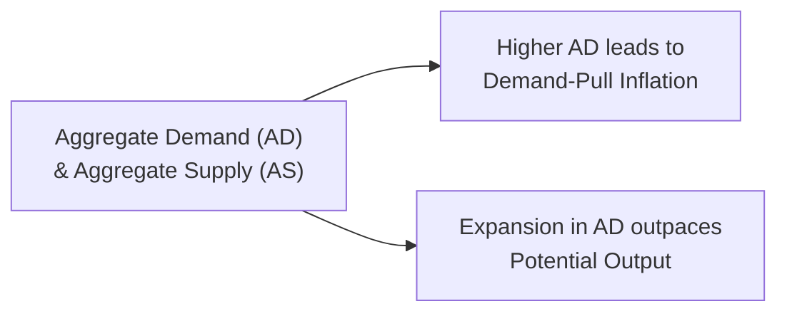
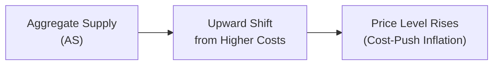

## Overview

Inflation is one of those all-pervasive concepts in economics—kind of like that distant hum in the background that you don’t notice until it gets really loud. Well, when it does get loud, it tends to shake markets, consumer confidence, and long-term investment planning. At its simplest, inflation is a sustained increase in the general price level of goods and services over time. But the reasons prices rise (and keep rising) can differ. They can be broadly split into two main types: demand-pull and cost-push. 

Candidates often discover that recognizing the driver of inflation is essential for implementing appropriate policy responses or portfolio strategies. If inflation is mostly fueled by excessive demand, central banks might reach for the brakes via monetary tightening; if it’s driven by a spike in production costs, policymakers face a more complex puzzle because controlling cost-push inflation can bump into growth and employment objectives. 

Below, we’ll walk through the key dimensions of demand-pull and cost-push inflation, explore a few additional inflation-related phenomena like wage-price spirals, imported inflation, disinflation, and reflation, and toss in some strategic considerations—because as a CFA® candidate, you’re probably thinking about how all this ties back to asset allocation and portfolio returns.

## Demand-Pull Inflation

Demand-pull inflation occurs when aggregate demand outstrips aggregate supply in an economy. Think of it like too much money chasing too few goods. Picture a bustling economy where consumers are confident, jobs are plentiful, and businesses are firing on all cylinders—sometimes to the point where they can’t keep up. That’s the classic scenario for demand-pull inflation.

Causes:  
• Expansionary Monetary Policy: Central banks might lower interest rates to encourage lending, consumer spending, and investment. When these are overdone, aggregate demand can surge, outpacing the economy’s capacity to produce.  
• Expansionary Fiscal Policy: Governments boosting expenditure or cutting taxes can stoke household spending. With more disposable income, consumers might buy more goods and services, pushing up prices.  
• Rapid Growth in Exports: Heavy demand for a country’s exports from global markets can pressure local production capacity, especially if domestic supply chains can’t keep pace.

Key Indicators:  
• High or rising capacity utilization rates—factories are near full tilt.  
• Low unemployment, which often brings wage pressures.  
• Growing consumer confidence measures and broad-based upticks in consumer spending.

In my own experience working in macroeconomic research, I recall an episode when a major central bank slashed rates aggressively, hoping to jumpstart a weak economy. Well, it worked almost too well; over a couple of quarters, businesses were scrambling to meet all the new orders, employees put in extra shifts, and eventually, consumer prices trended upward—classic demand-pull.

### Demand-Pull Inflation in the AD/AS Model

A quick look at the Aggregate Demand (AD) and Aggregate Supply (AS) framework can be super helpful here. If AD increases faster than AS, the economy’s equilibrium point moves up along the AS curve to a higher price level.



When you see a shift of the AD curve to the right (due to factors like an uptick in government spending or consumer confidence), and the AS curve can’t shift to meet it, the result is upward pressure on prices.

## Cost-Push Inflation

Cost-push inflation, by contrast, originates from a rise in production costs. Rising wages or increasing prices of raw materials—oil, metals, agricultural commodities—prompt firms to raise their prices to preserve margins. When this happens in a widespread manner, a generalized inflationary trend sets in.

Causes:  
• Rising Input Costs: A common culprit is a jump in commodity prices. For instance, if global crude oil prices skyrocket, it affects everything from transportation to plastics production, so consumer-facing prices go up.  
• Wage Hikes: If wage demands surge significantly (and especially if they’re not matched by productivity gains), these higher labor costs can be passed on to consumers.  
• Supply Shocks: Natural disasters, geopolitical tensions, or policy decisions (e.g., tariffs) can curtail supply, raising the cost of production across industries.

Key Indicators:  
• A quick spike in per-unit labor costs or raw material expenses.  
• Slower economic growth or even a recessionary environment if businesses cut back their output when costs become too prohibitive.  
• Vertical or near-vertical short-run AS curve segments indicating capacity constraints.

### The Dilemma of Cost-Push Inflation

One reason cost-push inflation can be tricky to deal with is that standard anti-inflation measures (like raising interest rates) can curb demand even further. If inflation arises primarily because the cost side has ballooned, then restricting demand might worsen unemployment and reduce GDP growth. This leads to the classic policy conflict: Do you fight inflation at the risk of economic slowdown, or do you keep the economy chugging at the risk of allowing inflation to fester?



## Other Inflationary Dynamics

Inflation rarely exists in a single, isolated form—real economies are messy. Demand-pull and cost-push can coincide, morph, and feed into secondary effects. Below are some key dynamics that often appear in tandem with or follow from these base forms of inflation.

### Wage-Price Spiral

We all know that wages form a large chunk of production costs. So if workers, anticipating further inflation, negotiate higher wages, these wage hikes can produce higher production costs and more inflation, which in turn leads them to push for still higher wages—hence a spiral. 

• Self-Reinforcing: The feedback loop between wages and prices can overheat an economy if it persists.  
• Role of Expectations: Often, inflation expectations themselves stoke wage demands; once people believe inflation is here to stay, they want to protect their purchasing power.

### Imported Inflation

Imported inflation arises when a currency depreciation or rising global commodity prices make imports more expensive. If a country is very reliant on, say, imported oil or electronics, a sudden drop in the currency exchange rate can dramatically raise domestic prices.

• Currency Depreciation: Weaker currency means higher costs for foreign goods.  
• Commodity Shocks: When globally traded commodities (oil, metals, wheat) jump in price, this can feed local inflation.  
• Policy Implications: Some central banks might step in to prop up their currency (using foreign exchange reserves or interest rate hikes) to limit imported inflation, possibly dampening domestic economy growth.

### Disinflation

Disinflation is not the opposite of inflation; it’s a slowdown in the rate of inflation. For instance, if the inflation rate goes from 4% to 2%, prices are still going up, but more slowly. Disinflation can be driven by effective monetary policy, productivity enhancements, or the easing of supply-chain bottlenecks.

• Importance for Markets: Disinflation often leads to lower yields in bond markets, because it can signal that central banks might cut rates.  
• Potential Pitfalls: Rapid disinflation sometimes surprises consumers and businesses, affecting bullish earnings estimates or forcing portfolio revaluations.

### Reflation

Reflation refers to deliberate policy actions designed to rekindle inflation or economic growth, especially if the economy is at risk of sliding into deflation. Governments might dexterously combine fiscal measures (e.g., stimulus checks, infrastructure spending) with accommodative monetary policy (e.g., lower rates, asset purchases) to bring the inflation rate back up to a healthier range.

• Classic Example: Post-crisis periods, such as after the 2008–2009 financial crisis, saw numerous reflationary policies attempted worldwide.  
• Balancing Act: Overdoing reflation can push the economy into a demand-pull inflation scenario if not timed carefully.

## Strategic Portfolio Considerations

Although this topic is nominally under Macroeconomics, inflation is a critical consideration in portfolio construction and asset allocation. Let’s think about a few angles:

• Fixed Income vs. Equity: If inflation is driven by strong demand (demand-pull), corporate earnings can remain buoyant for a while, potentially supporting equities despite rising input costs. However, once central banks tighten, bond yields typically rise, causing bond prices to fall.  
• Real Assets: Inflation is often a friend to real assets (like real estate or commodities) because as prices rise, these assets may appreciate or at least hold their value in real terms.  
• Monetary Policy Changes: When central banks respond to inflation—whether cost-push or demand-pull—interest rates often shift. That shift can cause capital flows across different asset classes.  
• Stagflation Risk: A persistent cost-push scenario without robust demand growth can lead to a dreaded “stagflation”—rising prices and stagnant (or even contracting) output. This environment challenges conventional portfolio strategies since both equities (hit by lower corporate earnings) and bonds (hit by inflation) can suffer.

## Case Studies

• 1970s Oil Shocks (Cost-Push): In the early to mid-1970s, oil prices quadrupled as a result of OPEC embargoes. This set off a wave of cost-push inflation because oil was (and still is) a key input in virtually every industry. Many economies experienced high inflation and low growth (stagflation).  
• Post-World War II Expansion (Demand-Pull): After WWII, several countries like the United States saw a surge in pent-up demand. Households had saved during the war years and were eager to purchase goods, fueling robust demand-pull inflation as factories struggled to keep up.

## Common Pitfalls and Best Practices

Pitfalls:  
• Over-Reliance on a Single Indicator: Inflation can come from multiple sources; focusing solely on wage data or commodity prices might give you an incomplete story.  
• Failing to Distinguish Short-Term Spikes from Sustained Trends: Supply shocks (such as a hurricane affecting oil production) may cause a short-term price jump. Overreacting with policy or portfolio shifts might cause suboptimal outcomes.  
• Ignoring Expectations: In many respects, inflation is as much about psychology as data. If inflation expectations are firmly anchored, a sudden commodity price surge may not evolve into a sustained inflationary spiral.

Best Practices:  
• Monitor a Basket of Indicators: Track the labor market, commodity indices, consumer sentiment, and exchange rates.  
• Consider Long-Term Structural Trends: Productivity improvements, demographic changes, and technology adoption can all shape inflation paths over time.  
• Risk Management through Diversification: If you suspect cost-push inflation is looming, hedging with exposure to commodity assets or inflation-protected securities (like TIPS in the U.S.) can mitigate potential losses.

## Exam Relevance and Tips

When approaching questions on inflation—especially scenario-based essay or item set questions at advanced levels—candidates often need to:  
• Identify the primary driver of price increases in a presented scenario (is it soaring demand or an exogenous supply shock?).  
• Evaluate the likely policy response (interest rate hikes vs. supply-side measures) and how those might affect asset classes differently.  
• Incorporate the role of inflation expectations, wage negotiations, and supply chain constraints into your analysis.  
• Consider whether inflation might prompt a shift in portfolio allocation from fixed-income instruments toward equities or real-return products.  
• Prepare to handle multi-part item sets in which the first question might address the macro environment and subsequent questions might shift focus to portfolio positions or risk management tools.

A common exam pitfall is forgetting to connect macro insights to portfolio outcomes. For instance, you might correctly identify that rising oil prices cause cost-push inflation, but you must go further by applying that insight to how a portfolio might be restructured or hedged—maybe adding commodity-linked investments or reevaluating certain equity sector exposures (e.g., consumer discretionary might be hit harder if the cost of energy or other inputs surge).

## Example: Calculating Inflation from CPI

It might help to have a basic formula in mind for inflation, especially if you see a question with Consumer Price Index (CPI) data:

(1)  
Inflation Rate =  
( (CPI<sub>current</sub> – CPI<sub>previous</sub>) / CPI<sub>previous</sub> ) × 100

In Python, that might look like:

```python
cpi_previous = 210.0
cpi_current = 216.3

inflation_rate = ((cpi_current - cpi_previous) / cpi_previous) * 100
print(f"Inflation Rate: {inflation_rate:.2f}%")
```

## References

- Blanchard, Olivier. Macroeconomics. (Chapters on Inflation).  
- Parkin, Michael. Macroeconomics. (Discussions on Demand-Pull vs. Cost-Push).  
- International Energy Agency (IEA) Commodity Price Data.  
- CFA Institute. CFA® Program Curriculum, Various Volumes on Macroeconomics and Monetary Policy Tools.

----

## Test Your Knowledge: Inflation Types and Dynamics



### A scenario describes significant consumer optimism, booming retail sales, and low unemployment. Which inflation type is most likely?

- [x] Demand-pull inflation
- [ ] Cost-push inflation
- [ ] Imported inflation
- [ ] Reflation

> **Explanation:** Strong demand and low unemployment suggest an economy at or beyond its capacity, pushing prices upward due to robust aggregate demand.


### Which of the following factors typically drives cost-push inflation?

- [ ] Excess consumer spending
- [x] Rising commodity or labor costs
- [ ] Lower taxes
- [ ] Higher savings rate

> **Explanation:** Cost-push inflation emerges when firms face higher input costs and pass them on to consumers in the form of higher prices.


### Disinflation refers to:

- [ ] The complete absence of inflation
- [ ] A contraction in economic output
- [x] A reduction in the rate of inflation (while still above zero)
- [ ] Inflation caused by currency depreciation

> **Explanation:** Disinflation means a slowing pace of inflation, not negative inflation. Prices still increase but at a declining rate.


### A key challenge in addressing cost-push inflation through monetary policy is:

- [ ] It maximizes GDP growth
- [x] Tightening monetary policy may further slow an already weakening economy
- [ ] It lacks political support
- [ ] It has no impact on commodity prices

> **Explanation:** When inflation results mainly from supply-side factors, raising interest rates can hurt economic growth without necessarily solving the root cause of rising production costs.


### Imported inflation may result from:

- [x] A declining domestic currency that makes imports costlier
- [ ] Increased domestic productivity
- [x] Global commodity price spikes
- [ ] A steep decline in consumer demand

> **Explanation:** Imported inflation is largely a product of rising global commodity prices or higher (foreign) input costs due to currency depreciation.


### A wage-price spiral is best described as:

- [x] A self-reinforcing cycle where higher wages increase prices, prompting further wage demands
- [ ] A government intervention program to reduce wage levels
- [ ] Inflation driven exclusively by central bank policies
- [ ] The phenomenon of consistent price decreases followed by wage contractions

> **Explanation:** In a wage-price spiral, wage increases drive up business costs and prices. Workers then demand further wage increases to maintain purchasing power.


### Which policy measure is commonly used to address strong demand-pull inflation?

- [x] Raising interest rates to dampen aggregate demand
- [ ] Reducing regulatory burdens to stimulate more production
- [x] Cutting government spending or raising taxes
- [ ] Allowing the currency to depreciate

> **Explanation:** Conventional steps to cool demand-pull inflation include interest rate hikes (tightening monetary policy) and fiscal tightening (reducing spending or increasing taxes).


### Stagflation is characterized by:

- [x] High inflation and slow economic growth
- [ ] High inflation and high economic growth
- [ ] Negative inflation and high unemployment
- [ ] Low inflation and low unemployment

> **Explanation:** Stagflation (common in severe cost-push scenarios) involves stagnant or contracting output and inflation occurring at the same time.


### Reflationary policies aim to:

- [x] Increase economic output and raise prices when there is a risk of deflation
- [ ] Convert cost-push inflation into demand-pull inflation
- [ ] Halt inflation altogether
- [ ] Anchor inflation expectations at zero

> **Explanation:** Reflationary measures involve shifting policy to encourage spending and investment—often to counteract deflation or too-low inflation.


### True or False: Disinflation always indicates a recession.

- [x] True
- [ ] False

> **Explanation:** This is a tricky one at times. While disinflation often accompanies a slowdown in economic activity, it doesn’t necessarily mean the economy is in a recession. However, historically, many episodes of robust disinflation have coincided with a broader economic slowdown or attempts to curb an overheated economy. (In some contexts, disinflation can occur outside of recession territory, but on exams, it’s often correlated with weaker growth.)


