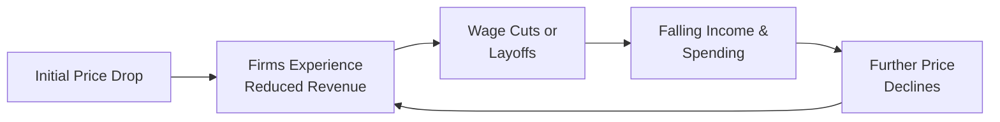

## Introduction
Inflation and deflation are among the most pivotal forces influencing markets, policy decisions, and everyday life. Maybe you’ve noticed how that cup of coffee you bought for $3 somehow feels expensive at $3.50 just a year later—welcome to inflation in action. On the other hand, deflation—while it sounds attractive at first (prices going down)—can unfortunately usher in some tough economic realities. From capital market expectations to household finances, understanding these two phenomena is critical for both professionals (like portfolio managers or corporate treasurers) and individuals on a strict family budget.

This section will help you grasp the key consequences of inflation and deflation, drawing on real-world examples (like Japan’s deflation in the 1990s or historical hyperinflation episodes). By the end, you’ll appreciate why most central banks aim for low, stable inflation, and why deflation, ironically, can often be worse.

## The Big Picture
In the most basic sense, inflation is a persistent rise in the overall price level—things generally cost more over time—while deflation is a broad-based decline in prices. A stable or gently rising price environment is typically considered healthy. Too much of anything, though, can be problematic. High inflation reduces purchasing power, creates uncertainty, and disrupts plans. Deflation can sap corporate profits, inflate real debt burdens, and discourage spending. Ultimately, understanding these dynamics forms part of the foundation for advanced investment management decisions, including portfolio rebalancing and strategic asset allocation.

## Consequences of Inflation
Inflation isn’t just about rising prices at the grocery store. It moves through the financial system like a ripple in a pond, influencing wages, long-term investments, and even the viability of certain market structures. Let’s break it down step by step.

### Reduced Purchasing Power
When inflation is present, each unit of currency buys fewer goods and services over time. If you’re a portfolio manager assessing the real return of a bond, you’ll subtract expected inflation from the nominal interest rate. Formally, we often write:


\text{Real Interest Rate} \approx \text{Nominal Interest Rate} - \text{Expected Inflation}.


• Personal story alert: Back when I worked in a small retail shop, we’d watch the supplier raise prices every season, which forced us to reassess the cost of goods and how much our customers could afford. Over time, that inflation chipped away at the profit margin if we didn’t respond quickly.

• For individuals on fixed incomes—like retirees relying on a pension that doesn’t adjust for the cost of living—this can be a real ordeal: your monthly check stays the same, but the rent, groceries, and even your power bill keep inching upward.

### Menu Costs
Menu costs refer to the time, effort, and resources businesses spend updating prices. Think about restaurants reprinting menus each year (or more often). In an online era, it might be simpler to adjust prices on a website, but there’s still programming time, database updates, and the potential for confusion or errors in invoicing.

Here’s a basic illustration of the potential ripple effect:

• Companies might divert funds from R&D or marketing to constantly monitor competitor prices.  
• Admin departments spend more time reconfiguring POS systems and signage.  
• In extreme cases of hyperinflation, physical price tags can become nearly meaningless, leading to real chaos in day-to-day commerce.

### Shoe-Leather Costs
The term “shoe-leather costs” is a somewhat whimsical reference to walking more frequently to the bank (and thus wearing out your shoes) in an era before digital banking. Nowadays, it may be more about spending extra effort transferring funds between accounts or into short-term instruments. Whenever inflation runs high, the opportunity cost of holding idle money spikes, so individuals and firms scramble to keep their cash in interest-bearing accounts or investments. This constant shifting of assets can add stress and daily management tasks.

### Uncertainty
Inflation that’s both high and volatile wreaks havoc on long-term planning. It’s tough for corporations to commit to multi-year capital projects or for investors to determine the true present value of future cash flows. Even from a behavioral standpoint, people may become reluctant to lend or invest, fearing the real value of their returns will be eroded by further surges in inflation.

• Corporations uncertain about future input costs or labor costs might underinvest in expansions.  
• Lenders might demand higher nominal rates or more stringent terms to hedge against the risk of unexpected price surges.

### Income Redistribution
Inflation pivots the balance of power among different economic agents. Borrowers often gain if interest rates are fixed in nominal terms—the money they use to repay debts is worth less than before. Lenders, or anyone receiving fixed nominal payments, lose out, as those payments lose purchasing power.

• From a government perspective, moderate inflation can potentially reduce the real burden of public debt, but it can also erode confidence among bondholders if they suspect the government is tacitly inflating away its obligations.  
• Households living off fixed-rate bond interest or pensions might find their living standards squeezed while property owners with large mortgages might enjoy an easier repayment environment.

## Consequences of Deflation
Now let’s flip the coin to deflation. It often looks nice on paper—hey, cheaper goods!—but too much deflation can bog down an economy. Historically, deflation episodes have been linked with economic stagnation.

### Increased Real Debt Burden
When prices fall, the real value of existing debt rises. Essentially, from the debtor’s perspective, they now need to pay back a loan in “heavier” dollars (or euros, yen, etc.). If wages and revenues also drop during deflationary periods, repaying the same principal amount becomes more challenging.

• This dynamic can weigh heavily on companies and households, both of which may eventually default if the squeeze becomes too severe.  
• Banks suffer from higher default rates, leading to tighter credit conditions. This credit crunch can further intensify the downturn.

### Delayed Spending
There’s a reason why persistent deflation is almost universally feared by policymakers. If you believe prices will drop next month, you might say, “Why not wait?” That new car you planned to buy for $30,000 might be $28,000 next year. Multiply that logic across millions of potential buyers—and many billions of dollars in corporate investment decisions—and aggregate demand can fall off a cliff.

### Declining Revenue
For firms, deflation is a double whammy. While revenue (unit price × quantity sold) declines with falling prices, many expenses—contracts, salaries, loans—still remain in nominal terms. If revenue plummets while nominal debt payments and wage bills stay the same, profit margins may erode to the point of layoffs or even bankruptcy.

• Picture a hotel chain that locked into a long-term construction loan at a fixed interest rate and built new properties assuming stable or slightly rising prices. If room rates plunge with deflation, the difference between operating cash flow and debt service can become scarily small.

### Risk of a Deflationary Spiral
One of the scariest aspects of deflation is its ability to feed on itself. The sequence might look like this:

In a deflationary spiral, one round of price cuts sets off a chain reaction that ultimately loops back to push prices down even more. Japan in the 1990s (the so-called “Lost Decade”) illustrated some of these dynamics, where near-zero inflation and deflationary pressures led to subpar economic performance for years.

## Best and Worst Scenarios
Central banks worldwide typically aim for a low and stable inflation rate. It’s a bit like adding just the right level of seasoning—too much can ruin the dish, but none at all might leave the economy bland or worse. Let’s break down the extremes:

• Low, stable inflation (usually around 2% in many developed economies): Encourages spending, supports modest wage growth, and gives policymakers a little wiggle room to adjust interest rates.  
• High inflation: Can snowball into hyperinflation (like Zimbabwe or Germany in the 1920s), destroying savings, trust, and efficient market functioning.  
• Sustained deflation: Risky because it can strangle consumer demand, corporate profits, and hamper growth, leading to a downward spiral.

## Real-World Cases and Lessons
• Japan’s Deflation (1990s to early 2000s): Despite aggressive monetary policy steps, the country faced stagnant demand, falling prices, and an aging demographic that further curtailed consumption.  
• Hyperinflation in Zimbabwe (late 2000s): Rampant inflation soared into the billions of percent. Ultimately, the currency collapsed, forcing the government to adopt foreign currencies as legal tender.  
• European Central Bank’s Price Stability Mandate: The ECB systematically publishes inflation bulletins to keep inflation near but below 2%. That’s an example of a formal framework to avoid the perils of both inflation and deflation.

## Strategies to Mitigate Inflation and Deflation
From a portfolio management perspective, we don’t just observe these phenomena; we plan around them:

• For Inflation:  
  – Inflation-linked securities (TIPS in the US) can help preserve real value.  
  – Real assets such as property or commodities can hedge against moderate inflation.  
  – Diversification across currencies might reduce exposure to a single inflationary environment.

• For Deflation:  
  – Holding longer-term government bonds can be beneficial if falling prices lead to lower interest rates.  
  – Having cash or near-cash instruments can be advantageous if asset prices fall (though watch out for potential zero or negative interest rates).  
  – Focus on stable-income sectors like utilities or consumer staples, though deflation can erode even those sectors if severe.

## Glossary
• Menu Costs: Expenses related to changing prices, such as printing new menus or updating digital listings.  
• Shoe-Leather Costs: Resources spent to continually adjust liquidity positions to avoid holding cash that’s losing value during inflationary times.  
• Deflation: A sustained decline in the general price level.  
• Real Debt Burden: Debt balance adjusted by inflation or deflation; it goes down in times of inflation, up in times of deflation.  
• Deflationary Spiral: A cycle in which falling prices prompt lower spending and income, perpetuating even lower prices.

## References and Further Reading
• Bank of Japan, “Case Studies in Deflation.”  
• The European Central Bank’s Inflation Bulletins (<https://www.ecb.europa.eu/home/html/index.en.html>).  
• IMF Working Papers on “The Deflation Dilemma.”  
• Historical analyses of hyperinflation in Weimar Germany and Zimbabwe, for deeper insights into extreme inflation scenarios.

## Final Exam Tips
• Be ready to discuss how inflation affects both nominal and real variables in the context of capital market expectations.  
• Remember the real interest rate formula; expect to see it in variations on the exam, especially for inflation-linked instruments.  
• Show awareness of government policy tools—especially monetary policy responses—to inflationary or deflationary pressures.  
• For essay questions, incorporate real-world examples if asked about the impact of deflation on corporate strategy or household spending.  
• In item sets, you might see data that tracks a country’s inflation (or deflation) over several quarters. Practice analyzing potential consequences for bond yields, equity returns, or foreign exchange rates.

## Test Your Knowledge: Consequences of Inflation and Deflation Quiz



### Which of the following best describes “menu costs” in an inflationary environment?

- [ ] The fees paid by restaurants to generate new recipes.
- [x] The administrative and resource costs a firm incurs to periodically change prices.
- [ ] The cost of printing menus only once per year.
- [ ] The opportunity cost of holding inventory when prices are falling.

> **Explanation:** “Menu costs” refer to the various expenses and efforts businesses incur when updating prices, not just physical printing costs.

### Why can sustained deflation be detrimental to an economy?

- [ ] It always leads to higher wages.
- [x] Deflation increases the real value of debt and encourages people to delay purchases.
- [x] Companies may see lower profit margins as nominal costs remain fixed while prices decline.
- [ ] It ensures that consumers enjoy a higher standard of living.

> **Explanation:** Deflation can harm debtors and reduce demand when consumers postpone purchases, often hurting corporate cash flows and wages.

### Who typically benefits from higher-than-expected inflation?

- [x] Borrowers with fixed-rate debt.
- [ ] Lenders who hold fixed-rate bonds.
- [ ] Retirees on fixed nominal pensions.
- [ ] Workers on flexible, inflation-linked wage contracts.

> **Explanation:** Borrowers gain when the debt they repay is in cheaper currency. Lenders, in contrast, see the real value of their repayments decrease.

### Which scenario is typically viewed as optimal by central banks?

- [x] Low, stable inflation.
- [ ] Periodic episodes of hyperinflation.
- [ ] Persistent deflation.
- [ ] Zero inflation with no possibility of interest rate adjustments.

> **Explanation:** Most central banks target a moderate and predictable inflation rate, often around 2%, to support steady economic growth and manageable interest rates.

### In a deflationary environment, why might firms struggle to maintain profitability?

- [x] Their revenues decline due to falling prices while many costs remain fixed.
- [ ] Their employees demand permanent wage increases.
- [x] Debt service becomes more burdensome in real terms.
- [ ] Government taxes always increase during deflation.

> **Explanation:** Firms see prices (and thus revenues) drop, while nominal obligations like debt payments and wages remain much the same. This dynamic pressures profit margins.

### What is one key reason high and volatile inflation discourages investment?

- [x] It increases the uncertainty of future returns.
- [ ] It stabilizes the cost of raw materials.
- [ ] It always improves real wage growth.
- [ ] It discourages all central bank interventions.

> **Explanation:** When inflation is unpredictable, long-horizon projects, borrowing, or lending become risky, dampening investment confidence.

### Which of the following best describes “shoe-leather costs”?

- [x] Resources devoted to minimizing cash holdings during high inflation.
- [ ] The costs of purchasing footwear in an inflationary period.
- [x] The overhead of frequently transferring funds or updating financial strategies.
- [ ] Central bank expenses related to printing new currency notes.

> **Explanation:** The phrase originally referred to walking back and forth to banks, wearing out your shoes, though now it’s more broadly about the extra effort in managing cash.

### What tends to happen to the real burden of debt when deflation takes hold?

- [x] It increases.
- [ ] It decreases.
- [ ] It stays constant.
- [ ] It fluctuates randomly.

> **Explanation:** With falling prices, repaying the same nominal debt is more expensive in real terms, raising the debt burden for borrowers.

### Which term describes the risk that deflation will feed into even lower demand, wages, and prices?

- [x] Deflationary spiral.
- [ ] Hyperdeflation cycle.
- [ ] Inflationary trap.
- [ ] Zero-bound phenomenon.

> **Explanation:** A “deflationary spiral” implies that one round of price cuts triggers cost-cutting, wage reductions, and lower demand, perpetuating further price declines.

### True or False: In general, moderate inflation can help reduce the real burden of public debt.

- [x] True
- [ ] False

> **Explanation:** Moderate inflation erodes the real value of debt, making it relatively easier for governments to repay long-term obligations.


