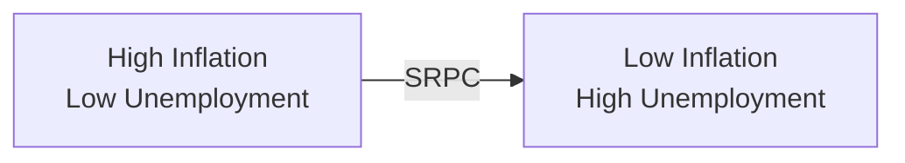
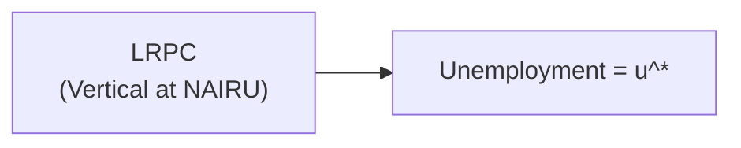
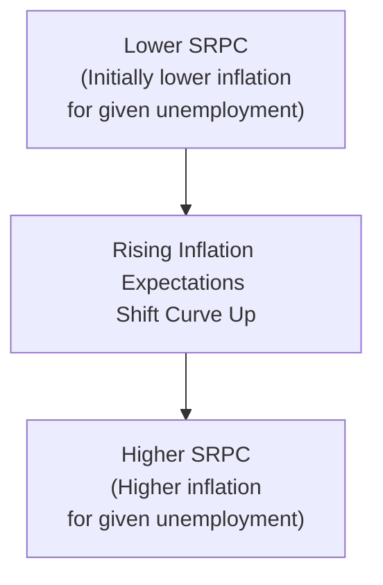

## Introduction
I’ll never forget the first time I heard about the Phillips Curve in an economics lecture—my professor got animated and practically jumped out of his seat explaining it. We had all these fancy charts and, honestly, my classmates and I sat there a bit puzzled: why would unemployment and inflation be inversely related? But over time, it clicked that the interplay between labor market dynamics and price fluctuations is central to how policymakers shape monetary policy.

The Phillips Curve is one of those foundational concepts in modern macroeconomics that attempts to describe a short-run trade-off between inflation and unemployment. In its most traditional form, it suggests that when unemployment is low, the economy is running “hot,” so demand for labor is higher, pushing wages—and thus prices—up. Conversely, when unemployment is high, there’s less upward pressure on wages and prices, so inflation tends to moderate. While it seems straightforward at first, the intricate part is that the relationship changes once economic agents adjust their expectations. Over the past decades, this perspective has informed how central bankers and governments approach price stability.

## The Phillips Curve in the Short Run
In the short run, the Phillips Curve is often depicted as a downward-sloping curve relating the inflation rate (on the vertical axis) to the unemployment rate (on the horizontal axis). The idea is simple: lower unemployment (i.e., more competition among businesses trying to hire workers) typically coincides with higher wage growth. Companies, facing higher labor costs, raise prices, leading to more inflation. 

Mathematically, economists sometimes express a simplified short-run Phillips Curve (under adaptive expectations) as:


\pi = \pi^e - \alpha \left(u - u^*\right),


where
- \\(\pi\\) is the actual inflation rate,
- \\(\pi^e\\) is the expected inflation rate,
- \\(u\\) is the actual unemployment rate,
- \\(u^*\\) is the “natural” or equilibrium unemployment rate (NAIRU),
- \\(\alpha\\) is a positive constant that measures sensitivity of inflation to changes in the unemployment gap \\((u - u^*)\\).

In plain language, when unemployment is below its natural rate, there’s upward pressure on inflation because wage demands exceed expectations, and vice versa.

Below is a simple Mermaid diagram illustrating a typical short-run Phillips Curve (SRPC), sloping downward:

In practice, policymakers sometimes rely on this relationship to “fine-tune” the economy. If unemployment is too high, they might enact expansionary policy in an attempt to lower it, acknowledging that this often leads to more inflationary pressure—at least in the short run.

## The Phillips Curve in the Long Run
Over the years, economists like Milton Friedman and Edmund Phelps argued that the trade-off visible in the short-run Phillips Curve breaks down in the long run. Their reasoning is that, over time, workers and other economic agents adjust their expectations of inflation. Consequently, the trade-off becomes less stable and eventually disappears. 

Once inflation expectations fully adjust to an expansionary policy (which was introduced to push unemployment below its natural rate), workers demand higher nominal wages to keep up with expected price levels. This pressures firms to raise prices further, feeding ongoing inflation without sustainably lowering unemployment. The result: unemployment returns to the so-called natural rate, while inflation remains higher than before.

Hence, the long-run Phillips Curve (LRPC) is depicted as a vertical line at the economy’s natural rate of unemployment (\\(u^*\\)):

In this picture, changes in monetary policy cannot permanently lower unemployment below this natural rate without risking ever-rising inflation. In other words, there is no long-run “free lunch” in term of a permanent inflation-unemployment trade-off.

## Role of Inflation Expectations
If there’s one thing that can shift the short-run Phillips Curve (SRPC) up or down, it’s inflation expectations. We typically categorize them in two broad ways:

• Adaptive Expectations: People (and businesses) base their forecasts of future inflation on recently observed inflation rates. Think of it like saying: “Well, inflation has been 3% for the last few years, so I’ll assume it’ll stick around 3%.” If actual inflation starts exceeding that assumption, over time, people will revise their expectations upward.

• Rational Expectations: Economic agents use all available information—historical data, current policy, and even future policy—to form a more informed guess about inflation. This can lead to quicker adjustments in wages and prices, effectively neutralizing policy effects faster.

When inflation expectations rise, the entire SRPC shifts upward. You might find that for a given unemployment rate, inflation is now higher than before. This phenomenon can lead to a situation in which trying to maintain an unemployment rate below the natural rate results in spiraling inflation rates if expectations are not well-anchored.

## Price Stability and the NAIRU
Central to monetary policy objectives in many countries is the notion of price stability—typically defined as a low and stable inflation rate around some target (often around 2% in many developed economies). A primary reason is that high, volatile inflation can disrupt economic decision-making. Firms hesitate to invest if they can’t predict costs accurately. Households delay purchases if they expect big price swings.

The Non-Accelerating Inflation Rate of Unemployment (NAIRU) or “natural” rate of unemployment is a vital concept here. It’s the unemployment rate at which inflation remains stable—i.e., there is no tendency for inflation to either accelerate or decelerate. If unemployment dips below NAIRU, inflation might start accelerating upward. If unemployment is above NAIRU, inflation might moderate or decelerate.

There is an ongoing debate about whether or not one can pin down an exact NAIRU, especially since it may change over time due to:
- Shifts in labor force composition (e.g., changes in demographics),
- Variations in labor market policies (e.g., unemployment benefits, unions),
- Technological changes that influence how labor is used.

Regardless, the broad concept remains important for policymakers trying to gauge how “hot” the labor market is relative to its sustainable capacity.

## Historical Context: Breaking the Traditional Phillips Curve
A famous historical episode that challenged the straightforward Phillips Curve narrative was the stagflation of the 1970s. During this period, many economies experienced high unemployment and high inflation simultaneously. This basically “broke” the short-run Phillips Curve for a while: original models indicated that you shouldn’t see inflation and unemployment both being high at the same time, at least not for very long.

Why did stagflation happen? Factors include:
- Oil price shocks (causing cost-push inflation),
- Loose monetary policy leading to persistent inflation,
- Structural weaknesses in some labor markets,
- Expanding inflation expectations, as workers expected higher future inflation and demanded wage increases.

This era underscored the idea that changes in inflation expectations can drastically alter the dynamics between inflation and unemployment. It also gave credibility to the vertical long-run Phillips Curve perspective, reinforcing the view that expansionary policy might temporarily reduce unemployment below NAIRU, but eventually inflation expectations catch up and hamper any lasting boost in employment.

## Practical Illustrations and Policy Implications
Consider a central bank that wants to reduce unemployment from 6% to 4% (assuming its estimate for NAIRU is 5%). If it launches a monetary expansion (e.g., lowering interest rates, quantitative easing, etc.), firms might initially hire more workers, feeling confident about increased consumer spending. Unemployment may temporarily drop—everyone’s happy.

But if inflation starts picking up more than expected and people revise their expectations upward to match the new, higher inflation path, then wages rise further. This can erase the central bank’s initial effort, returning the unemployment rate toward its NAIRU, now with inflation stuck at a higher level.

For the CFA exam context, it’s essential to see how the Phillips Curve sets the stage for understanding why monetary authorities care so much about “anchoring” inflation expectations. When inflation expectations are well-anchored—meaning the public believes the central bank will maintain stable inflation—short-run fluctuations in unemployment are less likely to cause big changes in inflation. If these expectations become unmoored, however, the stability can break down quickly.

## Common Pitfalls and Exam Tips
• Overlooking Expectations: A common trap is to treat the Phillips Curve as a permanent menu of policy choices. Remember that once expectations adjust, a central bank cannot continuously exploit the trade-off.

• Confusing Short Run vs. Long Run: Make sure you differentiate between the downward-sloping SRPC and the vertical LRPC. Exam questions often hinge on whether an economic scenario is short-term or long-term.

• Misidentifying NAIRU: Remember that NAIRU is neither zero nor necessarily stable. It’s an estimate, and it’s influenced by the structure of the labor market. Don’t treat it as a fixed point.

• Stagflation Scenarios: Be ready for scenario-based questions about oil shocks, supply shocks, or sudden policy changes. Understand how these shocks can shift the curve or move the economy away from the standard inflation-unemployment trade-off.

• Policy Reaction Functions: You might also be tested on how central banks incorporate output gaps and employment disparities into decisions on rate hikes or cuts. Linking the Phillips Curve concept to actual policy decisions can help you answer constructed-response questions thoroughly.

## Mermaid Diagram: Shifting the Short-Run Phillips Curve
Below is a simplified depiction of how inflation expectations can shift the SRPC upward over time (if expectations are rising):

Such a shift means that even if unemployment remains the same, inflation intensifies due to changes in perceived future price movements.

## Conclusion
The Phillips Curve, in both theory and practice, reveals why there’s no simple one-size-fits-all solution for balancing low unemployment with stable inflation in the long run. Policymakers must walk a delicate line: stimulate enough to keep people employed, but not so much as to stoke runaway inflation. In the CFA exam realm, you’ll find that an accurate understanding of how inflation expectations evolve and how the short-run trade-off differs from the long-run outcome is crucial for analyzing macroeconomic scenarios and central banking decisions.

If I may offer a final note from personal experience: don’t get stuck in the purely mechanical interpretation of the Phillips Curve as “choose your favorite unemployment level.” That was the naive interpretation that got overshadowed in the 1970s. Instead, see it as a framework that, especially when integrated with expectations, helps illustrate why inflation-targeting is such a cornerstone of modern monetary policy. Understanding that nuance will serve you well, both in your exam and in real-world analysis.

## References and Further Reading
- Phillips, A. W., “The Relation Between Unemployment and the Rate of Change of Money Wage Rates in the U.K., 1861–1957.”  
- Friedman, M., “The Role of Monetary Policy,” 1968.  
- Phelps, E., “Money-Wage Dynamics and Labor-Market Equilibrium,” 1968.  
- CFA Program Curriculum (Inflation, Deflation, and Phillips Curve Readings)  
- Additional academic literature on adaptive vs. rational expectations (John F. Muth, Robert Lucas Jr.)  

## Test Your Knowledge: Phillips Curve and Price Stability



### Which statement best captures the short-run Phillips Curve relationship?
- [ ] It shows a permanent trade-off between inflation and unemployment at any level.
- [x] It reflects a temporary inverse relationship between inflation and unemployment.
- [ ] It shows that monetary policy cannot lower unemployment in the short run.
- [ ] It is vertical, indicating no trade-off between inflation and unemployment.

> **Explanation:** In the short run, changes in unemployment can coincide with inflation changes due to wage and price stickiness, creating a downward-sloping curve. However, it is not permanent.

### Why does the long-run Phillips Curve tend to be vertical?
- [ ] Because unemployment has no correlation with inflation in the short run.
- [ ] Because wage rigidity dominates the long run.
- [x] Because inflation expectations adjust, causing unemployment to revert to its natural rate.
- [ ] Because the central bank ceases to conduct monetary policy over the long run.

> **Explanation:** Over time, people adjust their inflation expectations, which means any attempt to keep unemployment below its natural rate leads only to persistent inflation, causing unemployment to return to the NAIRU.

### What is the primary factor causing shifts in the short-run Phillips Curve?
- [ ] Government budget deficits
- [ ] Changes in real GDP growth
- [x] Changes in inflation expectations
- [ ] Structural unemployment

> **Explanation:** The short-run Phillips Curve can shift up or down primarily due to variations in expected inflation. When expected inflation rises, the SRPC shifts upward (to higher inflation for a given unemployment rate).

### Which scenario demonstrates “stagflation?”
- [ ] Low unemployment and high inflation
- [x] High unemployment and high inflation
- [ ] Low unemployment and low inflation
- [ ] An economy growing at its potential with stable inflation

> **Explanation:** Stagflation is characterized by stagnant economic growth (associated with higher unemployment) combined with rising inflation.

### Which of the following statements is true regarding NAIRU (Non-Accelerating Inflation Rate of Unemployment)?
- [x] It is the unemployment rate at which inflation does not tend to increase or decrease.
- [ ] It is measured precisely and does not change over time.
- [x] It can shift if there are structural changes in the labor market.
- [ ] It is always zero.

> **Explanation:** NAIRU is an estimate and might shift over time. It is not necessarily zero and can change with labor market policies or demographic shifts.

### According to adaptive expectations theory:
- [x] Individuals base future inflation forecasts primarily on past inflation.
- [ ] Individuals use all available data to predict inflation accurately.
- [ ] Inflation expectations never change.
- [ ] Inflation expectations are irrelevant to the Phillips Curve.

> **Explanation:** Adaptive expectations theory suggests that people look at past inflation data and adjust slowly, which can cause the short-run Phillips Curve to shift if actual inflation deviates from what was expected.

### According to rational expectations theory:
- [ ] People ignore past data and guess inflation at random.
- [ ] The short-run Phillips Curve never shifts.
- [x] Individuals use all available information to forecast inflation, speeding up adjustments.
- [ ] The economy cannot experience any inflation.

> **Explanation:** Rational expectations mean economic agents use comprehensive information (not just past data) to anticipate future inflation, leading to quicker erosion of the short-run trade-off.

### Which statement about policy implications is correct?
- [x] Attempting to keep unemployment below its natural rate leads to higher inflation over time.
- [ ] Policy interventions can permanently reduce unemployment below NAIRU.
- [ ] The Phillips Curve suggests no trade-off at all in the short run.
- [ ] Central banks never use the Phillips Curve concept in policy decisions.

> **Explanation:** Sustained attempts to keep unemployment below the NAIRU ultimately push inflation higher without permanently lowering unemployment.

### Which event in the 1970s challenged the traditional short-run Phillips Curve model?
- [ ] Low unemployment and high growth
- [x] Oil shocks leading to high inflation and high unemployment (stagflation)
- [ ] Falling inflation despite high wage growth
- [ ] A great moderation in economic cycles

> **Explanation:** The 1970s oil price shocks triggered stagflation, an environment of high inflation and high unemployment, undermining the simple short-run Phillips Curve premise.

### Under the vertical long-run Phillips Curve framework, which statement is the most accurate?
- [x] The economy reverts to the natural rate of unemployment in the long run.
- [ ] Monetary expansion can indefinitely reduce unemployment below the natural rate.
- [ ] Inflation never increases when the central bank loosens policy.
- [ ] Expected inflation has no effect on wage negotiations.

> **Explanation:** The long-run Phillips Curve indicates that, ultimately, unemployment gravitates back to the natural rate. Any initial gains in employment from accommodative policy fade, leaving higher inflation in the long run.


