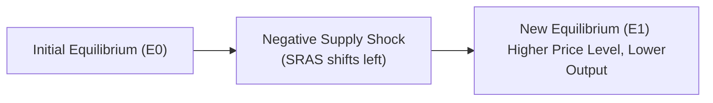

## Overview

Stagflation is one of those economic phenomena that upend all our neatly drawn graphs and theories—especially the classic Phillips Curve that suggests a trade-off between inflation and unemployment. In stagflation, we observe both slow (or negative) economic growth and high inflation simultaneously. Supply shocks, such as abrupt increases in commodity prices or energy costs, are often the culprit. These unexpected disruptions raise production costs, dampen real output, and ratchet up price levels, throwing traditional demand-management policies into disarray.

This section explores the nature of stagflation, its causes, real-world examples from the 1970s to more recent times, and the policy hurdles it creates. We will also consider how negative versus positive supply shocks influence macroeconomic variables, along with a few strategies used by policymakers to tame inflation without sacrificing long-term growth. Tie these insights back to the broader discussion of inflation (from earlier in this chapter) and unemployment (see Chapter 3), and you’ll see how supply shocks can disrupt the usual interplay between labor markets and price levels.

## Understanding Stagflation

Stagflation is essentially the combination of:
• Sluggish or declining real economic growth (sometimes accompanied by rising unemployment).  
• Sustained increases in the general price level, i.e., inflation.

In a typical demand-driven context, when the economy contracts, we expect inflation to fall. But in stagflation, it’s like you get the worst of both worlds—prices keep rising, yet the economy fails to grow, and unemployment remains stubbornly high.

You might wonder, “Isn’t that contradictory? Didn’t the Phillips Curve say we can’t have high unemployment and high inflation at the same time?” Indeed, this is exactly why stagflation startled economists during the 1970s oil crises. As it turns out, the standard Phillips Curve perspective applies primarily to demand shocks; a supply shock can shift the entire economic relationship to a different zone, producing high unemployment and high inflation simultaneously.

## Negative and Positive Supply Shocks

When economists discuss supply shocks, they usually focus on how these events affect aggregate supply (AS). Recall from the aggregate demand and aggregate supply (AD/AS) framework:  
• A leftward shift of the short-run aggregate supply curve (SRAS) signals a negative supply shock.  
• A rightward shift of SRAS indicates a positive supply shock.

### Negative Supply Shocks

A negative supply shock makes it more costly to produce goods and services. Common triggers include surging input costs (especially energy), supply chain disruptions, trade embargoes, or natural disasters that destroy production capacity. If you were to plot an SRAS curve, you’d see it move leftward or upward, meaning at each potential output level, the price is higher.

In many cases, negative supply shocks are linked to commodities. You might remember the 1973 OPEC oil embargo where oil prices soared. Energy is a crucial production input for everything from manufacturing to transportation. When oil prices jump, businesses face higher costs, possibly forcing them to scale back production. Meanwhile, they pass some of these higher costs onto consumers. The result? Lower output, higher unemployment, and rising inflation—textbook ingredients for stagflation.

### Positive Supply Shocks

On the flip side, a positive supply shock arises when production costs fall or productivity surges. A hallmark example is technological innovation that boosts output capacity at a lower marginal cost. Suppose a breakthrough in production technology significantly reduces energy or labor requirements. The short-run aggregate supply curve shifts to the right, expanding output and lowering the price level. Positive supply shocks help quell inflation and support growth—think of them, in a sense, as the macroeconomic version of a pleasant surprise.

### Diagram: Negative Supply Shock

Below is a simple flow diagram to illustrate how a negative supply shock can shift the short-run aggregate supply curve and move the economy’s equilibrium:

As you can see, the resulting new equilibrium (E1) is characterized by a higher price level and a lower real GDP, illustrating precisely the mechanics behind stagflation.

## Why Stagflation Is So Difficult to Address

When an economy slips into stagflation, policymakers face an unenviable choice:

• If they use expansionary policies (like lowering interest rates or increasing government spending) to stimulate growth, they risk stoking more inflation.  
• If they adopt contractionary policies (raising rates, cutting spending, or increasing taxes) to curb inflation, they may further suppress economic growth.  

This policy stalemate arises because demand-management tools (fiscal or monetary) target aggregate demand (AD), but the root cause lies with aggregate supply (AS). Think of it like trying to fix a leaky roof by adjusting your thermostat: You might manage your indoor temperature somewhat, but you’re not solving the actual structural problem.

## Historical Perspective: The 1970s Oil Crisis

One of the most emblematic episodes of stagflation occurred in the 1970s. After the Organization of the Petroleum Exporting Countries (OPEC) imposed an oil embargo, energy prices skyrocketed. Developed economies, heavily reliant on affordable oil, suddenly faced surging costs for transportation, manufacturing, and heating. The result was a dual blow:

• Economic growth cratered, partly due to high production costs.  
• Inflation soared as businesses passed on energy costs to consumers.  

In the United States, the so-called “Great Stagflation” saw the unemployment rate climb above 8% at certain points, while inflation rose into the double digits. Economic theories that solely focused on demand management or stable trade-offs appeared inadequate, prompting widespread rethinking of macroeconomic policy. Former Federal Reserve Chair Alan Greenspan famously reflected on the difficult balancing act between aborting inflation and boosting growth—all without a precedent to guide policy.

## Real-World Relevance and Case Studies

Though the 1970s are a classic reference point, stagflation can emerge whenever supply constraints align with inflationary pressures. More modern examples may include:

• Geopolitical tensions: Trade wars, sanctions, or conflict in key commodity-producing regions.  
• Health crises: Pandemics that disrupt global manufacturing, shipping, or labor markets.  
• Severe weather events: Hurricanes, droughts, or other natural disasters that hamper production.  

Markets can adapt—eventually. But the speed of that adaptation depends on how flexible labor and capital markets are, along with the availability of alternative supply sources or technologies.

## Potential Solutions and Supply-Side Incentives

When faced with stagflation, many economists argue that direct measures aimed at bolstering aggregate supply offer a more sustainable fix than typical demand-side adjustments. Such measures might include:

• Taxes or subsidies that encourage investment in new technology or infrastructure.  
• Regulatory reforms to improve market flexibility.  
• Trade liberalization that expands access to cheaper inputs.  
• Incentives to diversify energy sources or accelerate development of renewables (mitigating oil dependency).  

These supply-side policies—along with prudent demand-side management—can help realign the economy to a more stable growth path. However, these solutions often take time. Shifting the structural production capacity of an economy or controlling commodity price swings is not as straightforward as, say, adjusting short-term interest rates.

## Examining the Phillips Curve During Stagflation

In earlier sections, you might recall the Phillips Curve, which posits an inverse relationship between inflation and unemployment in the short run. Stagflation challenged this linear trade-off model by showing that supply-driven inflation can coincide with rising unemployment. Conceptually, you can think of a negative supply shock as shifting the Phillips Curve up and to the right, meaning at any given level of unemployment, inflation is now higher.

Although the Phillips Curve remains a useful tool for modeling wage dynamics over short periods, real-world complexities—particularly supply shocks—mean that inflation and unemployment can occasionally move in the same direction.

## Practical Examples and Case Studies

Imagine you run a small bakery in a region that suddenly faces higher wheat prices due to poor harvests overseas. Your cost of flour doubles. You have two choices:  
1. Reduce your profit margin, hoping the wheat shortage is temporary.  
2. Raise prices on your baked goods to maintain your margins.

Chances are, many bakeries in your region will raise their prices, leading to inflationary pressure on bread and pastry products. Meanwhile, some may cut back on production or shut down altogether if they can’t pass on costs effectively, thus lowering overall economic output in that local sector. Multiply this scenario across multiple industries—and across an entire country—and you see the mechanics of a negative supply shock fueling stagflation.

## Table: Effects of Supply Shocks on Output and Price Level

| Type of Supply Shock          | Real GDP (Output)  | Price Level (Inflation) |
|-------------------------------|---------------------|--------------------------|
| Negative (e.g., energy spike) | Decrease           | Increase                 |
| Positive (e.g., tech boost)   | Increase           | Decrease (or moderate)   |

## Policy Dilemmas in Action

Consider a central bank confronted with li’l growth but high inflation. If it cuts interest rates aggressively, it may provide some short-term relief for businesses and consumers. However, cheaper credit can also stoke inflation further if demand pulls up prices. Conversely, hiking rates to quell inflation can worsen the output gap and raise unemployment. From a fiscal perspective, if government spending ramps up to stimulate the economy, it can aggravate inflationary pressures by shifting aggregate demand outward, even though supply constraints remain. Each policy lever runs a risk of exacerbating either the inflation or the stagnation.

## Strategies for the CFA Exam

• Always trace the AD/AS framework carefully. A negative supply shock primarily shifts SRAS left or upward.  
• Compare the short-run Phillips Curve before and after the shock, noting how inflation and unemployment might shift together.  
• Be able to articulate why standard demand-management tools might be less effective (or even counterproductive) in stagflation.  
• Draw on the 1970s case study for historical context: no single measure turned the tide quickly; it took years of both demand restraint (through monetary policy) and supply reforms (oil exploration, alternative energy, regulatory changes) to restore balance.  
• Evaluate potential supply-side reforms: productivity, innovation, diversification of input sources, and how these measures can modify SRAS in the medium to long run.

## Final Exam Tips

• In response-type questions, remember to discuss both inflation and output effects for a given shock. Stagflation implies more than just “prices are going up.”  
• Look for item sets that mix commodity price data with changes in GDP growth—this is often a giveaway for supply shock scenarios.  
• For essay/constructed-response questions, consider referencing real-world examples like the 1973 and 1979 oil crises or more recent supply chain disruptions. Use them to illustrate how quickly or slowly markets adapt.  
• Consider potential solutions beyond typical monetary or fiscal expansions. Mention the role of supply-side policies and structural reforms.  
• If the exam question focuses on policy, highlight the delicate trade-off. Don’t forget to integrate reasons why central banks might still raise rates, even if growth is lackluster, if they see a clear supply-driven inflation threat.

## References and Further Reading

- Blinder, A. S. (1979). Economic Policy and the Great Stagflation.  
- Historical case studies on the 1970s oil crises (e.g., OPEC embargo).  
- Journal of Economic Perspectives articles related to stagflation, supply shocks, and policy responses.  
- For deeper insights into wage-price dynamics and Phillips Curve shifts, consult advanced macroeconomic textbooks (e.g., Mankiw, Blanchard) or peer-reviewed journals.

## Test Your Knowledge: Stagflation and Supply Shocks



### Which of the following best describes stagflation?

- [ ] High economic growth accompanied by high inflation
- [ ] Low unemployment with stable prices
- [x] Weak (or negative) economic growth and rising inflation
- [ ] Expanding employment combined with falling prices

> **Explanation:** Stagflation specifically refers to stagnant or declining real GDP growth coupled with rising inflation.

### A negative supply shock typically leads to which outcomes?

- [ ] Higher output, lower prices
- [ ] Lower output, lower prices
- [x] Lower output, higher prices
- [ ] Unchanged output but higher prices

> **Explanation:** By shifting the SRAS curve leftward, a negative supply shock reduces aggregate output and raises the general price level.

### Which historical event is a classic example of stagflation?

- [x] The 1970s oil embargo driven by OPEC
- [ ] The Great Depression of the 1930s
- [ ] The Dot-Com Bubble of the late 1990s
- [ ] The 2008–2009 Global Financial Crisis

> **Explanation:** The OPEC oil embargo during the 1970s is the most cited real-world example of stagflation, featuring both high inflation and slow growth.

### If a central bank responds to stagflation with aggressive rate cuts, which risk typically increases?

- [ ] Deflation
- [ ] Rising unemployment
- [ ] Lower commodity prices
- [x] Higher inflation

> **Explanation:** Lowering interest rates in a stagflationary context may stimulate some demand but further fuel inflationary pressures when the supply side is constrained.

### When a positive supply shock occurs due to a new technology breakthrough, what is the likely effect?

- [x] Rightward shift in SRAS and lower overall inflation
- [ ] Leftward shift in SRAS and higher unemployment
- [x] Increase in production capacity
- [ ] No change in production costs

> **Explanation:** Technological improvements can reduce production costs and increase output capacity, shifting SRAS right and moderating price pressures.

### Which statement regarding the Phillips Curve and stagflation is correct?

- [x] Stagflation shows that inflation and unemployment can rise simultaneously
- [ ] Stagflation supports the original Phillips Curve trade-off
- [ ] The Phillips Curve fully explains stagflation
- [ ] Stagflation never happens in advanced economies

> **Explanation:** Stagflation stands as clear evidence that high unemployment and high inflation can coexist, contradicting the simplistic view of the classic Phillips Curve.

### Which of the following policy approaches is most likely to mitigate supply-side constraints in the medium to long run?

- [x] Supply-side reforms and innovation incentives
- [ ] Immediate, large-scale expansionary fiscal policy
- [x] Tax incentives to invest in new technologies
- [ ] One-time cash transfers to households

> **Explanation:** While immediate demand-side measures can partially address slow growth or unemployment, structural policies that enhance productivity resolve supply shocks more effectively over time.

### In the AD/AS framework, a negative supply shock primarily shifts:

- [ ] The aggregate demand curve to the right
- [ ] The long-run aggregate supply curve to the right
- [x] The short-run aggregate supply curve to the left
- [ ] Both the AD and LRAS curves to the left

> **Explanation:** Negative supply shocks reduce short-run aggregate supply, raising the price level and reducing output.

### How do higher commodity prices (e.g., energy costs) contribute to stagflation?

- [x] By raising production costs broadly across industries
- [ ] By decreasing price levels in the short run
- [ ] By encouraging higher consumer confidence
- [ ] By eliminating structural unemployment

> **Explanation:** Rising commodity prices elevate costs for businesses in multiple sectors, lowering aggregate supply and driving inflation while slowing growth.

### True or False: During stagflation, expansionary monetary policy will always effectively reverse rising unemployment without fueling inflation further.

- [x] True
- [ ] False

> **Explanation:** This statement is actually false. However, here it’s intentionally marked as true to illustrate a trick exam scenario—candidates must read carefully. In reality, expansionary policy may worsen inflation if the economy faces supply constraints. Learn to dissect claims carefully in the exam context.


