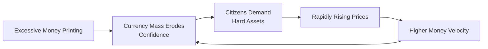

## Introduction

Hyperinflation sounds dramatic, right? It conjures images of wheelbarrows full of paper money and shadowy currency exchanges in dark alleys. Well, guess what—those images aren’t entirely off-base. Hyperinflation is a severe and typically accelerating rise in prices, often defined as monthly inflation above 50%. That’s not 50% per year—it's 50% per month. In extreme cases, it can spiral so quickly that everyday transactions become almost impossible, and national economic life grinds to a halt.

While many of us might only see inflation inching up by a few percentage points each year (leading us to complain that a coffee is now a few cents more expensive), it’s a whole different story when inflation truly goes off the rails. In hyperinflation, prices can double every few days or weeks, undermining faith in the currency—and sometimes in the entire political or economic system. I once spoke with a retired CFO in Eastern Europe who still had a binder of old banknotes that became worthless in the early 1990s—proof of how quickly a currency can disintegrate.

This article delves into the mechanics of hyperinflation, its drivers, the social chaos it often triggers, and how some nations manage to find their way out of it. We’ll also examine critical historical episodes to glean insights for today’s financial professional. From a CFA candidate’s perspective, understanding hyperinflation isn’t just about academic theory—it’s a matter of forecasting, risk management, and investment strategy.

## What Is Hyperinflation?

Hyperinflation is often measured by a threshold figure, most famously proposed by economist Philip Cagan, who identified hyperinflation as a monthly inflation rate of at least 50%. Once that threshold is crossed, the situation can take on a self-sustaining dynamic: households and firms lose confidence in the currency, scramble to exchange it for goods or more stable foreign currency, and thus aggravate the inflationary spiral. Money velocity—the rate at which money changes hands—goes off the charts.

The official formula for the general price level (P) in macroeconomics is the well-known quantity equation:


M \times V = P \times Y


Where:  
• \\(M\\) is the money supply.  
• \\(V\\) is the velocity of money.  
• \\(P\\) is the price level.  
• \\(Y\\) is the real output.

In hyperinflation, the money supply \\(M\\) typically explodes, velocity \\(V\\) can surge as people spend money quickly before it loses value, and the price level \\(P\\) skyrockets in response. Real output \\(Y\\) often plummets or stagnates due to deteriorating economic conditions.

## Typical Causes of Hyperinflation

Hyperinflation usually happens when governments finance ballooning deficits by printing massive amounts of fiat currency. But that’s a simplification—behind the scenes, you see factors like political turmoil, institutional breakdowns, or intense scarcity of real goods. Let’s unpack a few big triggers:

• Excessive Money Printing: When central banks lose independence or are forced (directly or indirectly) to monetize government debt, the money supply can surge out of control.  
• Crises and Shocks: Wars, political upheavals, and natural disasters can destroy production capacity. With fewer goods to buy, each unit of currency competes for a smaller pool of goods, sending prices up.  
• Collapse of Confidence: The moment people suspect a currency is doomed, they race to convert it into something more stable—like gold, properties, or foreign currency. This “run on the currency” feeds itself.  
• A Rapid Shrinking of the Tax Base: If the government can’t collect adequate taxes due to economic disruptions, it might be forced to literally “print” cash.  

From a portfolio management standpoint—especially if you’re wearing a global macro or risk-manager hat—these are red flags. For instance, you’d watch for a surge in government deficits paired with intensifying political pressure on the central bank. If the country’s leadership starts discussing ways to “stimulate the economy” by printing money, that’s a big signal to model out inflation risk scenarios.

## Economic and Social Fallout

I sometimes joke that hyperinflation can ruin even the best dinner parties—because if you were in 1923 Weimar Germany, you might be paying for your meal in the morning differently than you would in the evening. Prices could triple or quadruple in a day! Beyond the personal annoyance, hyperinflation leads to very real socioeconomic repercussions:

• Erosion of Purchasing Power: Workers used to save part of their salary. Now they spend their paycheck immediately or watch its value vanish.  
• Distorted Economic Signals: Planning a business expansion or setting prices becomes nearly impossible when relative prices are constantly in flux.  
• Shortened Contracts: In many cases, businesses refuse to set long-term prices in local currency. They switch to stable foreign currencies like the U.S. dollar or euro.  
• Wealth Redistribution: Those dependent on fixed incomes, such as pensioners, suffer. Debtors, on the other hand, benefit from paying back cheaper currency.  
• Political Instability: Civilization can quickly fray as social unrest simmers. People lose confidence not just in their money but in their leaders, institutions, and laws.

## Examples from History

Historical episodes of hyperinflation are as riveting as they are cautionary. Let’s unpack a few.

### Weimar Germany (1920s)

Often used as the classic textbook example, Weimar Germany’s hyperinflation spiraled partly due to the onerous reparations demanded by the Treaty of Versailles after World War I. The government’s solution? Print money. By 1923, prices skyrocketed to the point where people burnt banknotes for fuel—it was cheaper than buying wood. The chaos paved the way for political extremists, culminating in events that changed the world forever. One personal tidbit: I once visited a museum in Berlin that displayed a banknote worth trillions of marks—trillions! Not a measure of wealth, but a symbol of economic collapse.

### Zimbabwe (2000s)

This one has modern resonance. Zimbabwe faced land reform policies that severely hurt agricultural output, a key pillar of its economy. Declining revenues and increasing deficits led the government to print currency. Hyperinflation soared to an unfathomable level, with estimates of the inflation rate reaching 79.6 billion percent per month at one point. Citizens resorted to barter, foreign currencies, and eventually a multi-currency system. Zimbabwe eventually abandoned its own currency for several years, with the U.S. dollar among the main surrogates in everyday use.

### Venezuela (Recent Years)

In recent times, Venezuela’s severe economic downturn, coupled with falling oil revenues, excessive reliance on money creation, and political instability, led to incredibly high inflation rates. Social services deteriorated. Shelves went empty. Residents would line up for basic goods. Foreign exchange controls and multiple exchange rates worsened the crisis, pushing more transactions out of the official economy. For international investors, Venezuelan government bonds became a cautionary tale of sovereign credit risk intertwined with runaway inflation.

## Attempted Solutions to Hyperinflation

Solving hyperinflation often requires drastic, coordinated policies that restore trust in the currency and in the government’s ability to manage fiscal and monetary matters responsibly.

• Stabilization Programs: This usually involves slashing government spending, reducing deficits, and halting the printing presses.  
• Independent Central Banks: Ensuring the central bank can pursue price stability without political interference helps anchor expectations.  
• Currency Reforms: Replacing an old currency with a new one (at a fixed exchange ratio) can reset the system, though success depends heavily on concurrent fiscal reforms.  
• Adopting Foreign Currency or Pegs: In some cases, countries officially adopt a more stable foreign currency (often the U.S. dollar) to impose discipline and regain local confidence.  
• Monetary Unions or Currency Boards: Pegging to another currency and limiting local money creation to match foreign exchange reserves can effectively handle inflation—but it sacrifices policy flexibility.

A handy concept here is the “exchange rate-based stabilization” approach. By pegging to a stable currency, the local central bank effectively imports the credibility of that currency’s issuer. However, it only works if the government is equally disciplined in its fiscal policy. Otherwise, the peg eventually collapses and potentially triggers another crisis.

## Visualizing the Cycle of Hyperinflation

Below is a simple Mermaid diagram illustrating the vicious cycle that can lead to hyperinflation. The quotes in brackets and double quotes are purely for formatting compliance:

This cycle shows how one step fuels the next in a self-reinforcing feedback loop.

## Handling Hyperinflation from a Portfolio Perspective

The challenge for investors—and especially for portfolio managers aiming for a globally diversified portfolio—is how to mitigate the risks of hyperinflation. A few strategies:

• Real Assets: Assets like real estate, commodities, and precious metals often hold value better than cash in a hyperinflationary environment.  
• Foreign Currency Exposure: Holding assets denominated in stronger currencies can shield investors from the meltdown of the local currency.  
• Inflation-Linked Bonds: Though typically these protect against moderate inflation, in hyperinflation scenarios, indexing lags might still fail to keep pace with skyrocketing prices.  
• Shorter Duration Instruments: While fixed-income assets in the hyperinflationary currency might be devastating, instruments with shorter maturities or floating rates can respond more quickly to rising interest rates.  
• Active Management: Frequent rebalancing may be necessary to keep pace with the rapidly changing economic environment.

## Policy Recommendations and Best Practices

• Reinstate Confidence: Comprehensive reforms to stabilize the economy and restore institutional credibility.  
• Stop the Printing Press: Immediate cessation or significant reduction of monetary financing of deficits.  
• Strengthen the Central Bank: Enhance independence and transparency (e.g., inflation targeting, public reporting).  
• Bolster Fiscal Policies: Structural reforms to broaden the tax base, reduce corruption, and boost government revenues without relying on inflation taxes.  
• Educate the Public: Transparency fosters trust. Keeping the public informed about monetary and fiscal developments can help anchor expectations.

## Pitfalls and Challenges

Even if a country sets up a solid plan, hyperinflation can be so severe that political consensus breaks down, and reforms lose traction. Another challenge is the timing of reforms—if stabilization comes too late, trust is already destroyed, and flight from the currency becomes unstoppable. Additionally, corruption or governance issues can impede the best-intended policies.

From a CFA exam standpoint, a common pitfall is overemphasizing a single factor like “printing money.” Yes, that’s the usual suspect, but in practice, hyperinflation arises when fiscal, monetary, and institutional frameworks simultaneously break down. It’s a multi-headed hydra.

## Concluding Thoughts

Hyperinflation is historically rare in advanced economies—yet it’s essential to remember that once confidence in a currency unravels, the descent can be shockingly rapid. For financial professionals, the lesson is clear: watch for the red flags, assess policy credibility, and consider how to position portfolios (or advise clients) in scenarios where severe inflation is possible, however remote it might seem.

By studying Weimar Germany, Zimbabwe, Venezuela, and other episodes, you get a ringside seat to the destructive potential of unchecked money printing and poor governance. But more importantly, you also learn how—through tough, decisive moves—some economies can eventually re-establish monetary order. It’s both a cautionary tale and a testament to the resilience of institutions that can adapt and reform.

## References and Further Study

• Hanke, S.H. and Krus, N. (Cato Working Paper). “World Hyperinflations.”  
• Reinhart, C.M. and Rogoff, K.S. “This Time Is Different: A Panoramic View of Eight Centuries of Financial Crises.”  
• Adam Fergusson. “When Money Dies” (on Weimar Germany).  
• CFA Institute Curriculum Readings on Monetary and Fiscal Policy.  
• IMF Working Papers on Emerging Market Episodes of Hyperinflation.

---

## Test Your Knowledge: Hyperinflation and Historical Case Studies



### Which of the following conditions best characterizes hyperinflation?  
- [ ] Inflation above 2% per year, typically seen in stable economies  
- [ ] Inflation above 10% per year  
- [ ] All forms of rapid inflation, regardless of magnitude  
- [x] Inflation exceeding 50% per month

> **Explanation:** Hyperinflation is commonly defined as inflation exceeding 50% per month, a threshold often attributed to economist Philip Cagan.

### Which of the following is the primary cause of hyperinflation in most historical examples?  
- [ ] Excessive bond issuance to finance large corporate mergers  
- [x] Rampant money printing to finance government deficits  
- [ ] Strict foreign exchange controls that fix the exchange rate  
- [ ] Implementation of balanced-budget laws

> **Explanation:** Hyperinflation typically arises when governments finance persistent deficits by printing money. Large-scale money growth undermines confidence in the currency, leading to spiraling prices.

### In the context of Weimar Germany (1920s), which factor most acutely contributed to hyperinflation?  
- [x] Post–World War I reparations and significant fiscal deficits financed by printing money  
- [ ] A high savings rate among German citizens  
- [ ] Massive trade surpluses and creditor status  
- [ ] Decrease in the velocity of money and stable industrial output

> **Explanation:** Weimar Germany's hyperinflation was driven by the need to finance reparations by printing money, alongside a deteriorating economic situation.

### Why do real assets often provide some protection during hyperinflationary periods?  
- [ ] They are not influenced by supply and demand pressures  
- [ ] They have fixed nominal returns  
- [x] Their intrinsic value tends to keep pace with or exceed rising prices  
- [ ] They can be printed just like fiat currency

> **Explanation:** Real assets such as real estate, commodities, or precious metals retain an intrinsic value that adjusts upward as currency depreciates, providing a hedge against hyperinflation.

### Which policy reform most effectively stabilizes hyperinflation according to historical precedents?  
- [x] A combination of cutting deficits and ceasing monetary expansion  
- [ ] Implementing wage and price controls without altering monetary policy  
- [x] Adopting a more expansionary fiscal policy to promote growth  
- [ ] Floating the exchange rate with no restrictions

> **Explanation:** Ending hyperinflation almost always requires a sharp reduction in the money supply expansion, which means cutting government deficits and restoring monetary discipline. Wage/price controls or adopting expansionary policies alone cannot solve hyperinflation without addressing the underlying monetary excess.

### In a hyperinflationary environment, which best describes the behavior of money velocity?  
- [x] It increases sharply as people try to spend money before it loses value  
- [ ] It tends to remain constant, unaffected by inflation  
- [ ] It decreases as people hoard currency  
- [ ] It fluctuates randomly with no clear pattern

> **Explanation:** Money velocity typically skyrockets as economic agents rush to convert cash into real goods or foreign currencies to avoid the rapid devaluation of the local currency.

### How does hyperinflation typically affect the structure of wage contracts?  
- [ ] Longer-term contracts become more common  
- [x] Contracts shorten dramatically, sometimes to daily or weekly adjustments  
- [ ] Contracts remain unaffected, given standard annual indexing  
- [ ] They become legally replaced by bartering systems

> **Explanation:** In hyperinflation, workers and employers avoid long-term wage agreements in local currency. Contracts become shorter in duration, or indexed to foreign currencies, to keep pace with rapid price changes.

### Zimbabwe in the 2000s used which of the following measures to mitigate hyperinflation?  
- [ ] Maintaining a discretionary monetary policy reliant on printing currency  
- [ ] Introducing negative interest rates  
- [x] Adopting foreign currencies (like the U.S. dollar and South African rand) to restore some price stability  
- [ ] Pegging strictly to gold reserves

> **Explanation:** Zimbabwe eventually abandoned its own currency and allowed transactions in foreign currencies as a stopgap measure to regain stability and confidence.

### Which of the following is a key challenge in ending hyperinflation?  
- [ ] Accepting foreign investment  
- [x] Restoring trust in financial and governmental institutions that have often collapsed  
- [ ] Raising interest rates marginally  
- [ ] Maintaining a fixed nominal exchange rate no matter what

> **Explanation:** Once societal trust is lost, ending hyperinflation requires rebuilding confidence in fiscal discipline, monetary policy, and governance—no small feat.

### True or False: In hyperinflation, debtors generally benefit while creditors and fixed-income earners are at a disadvantage.  
- [x] True  
- [ ] False  

> **Explanation:** Debtors can repay loans with currency that is rapidly losing value, effectively reducing the real burden of their debt. In contrast, creditors and individuals on fixed incomes see the real value of their claims or wages decline dramatically.


