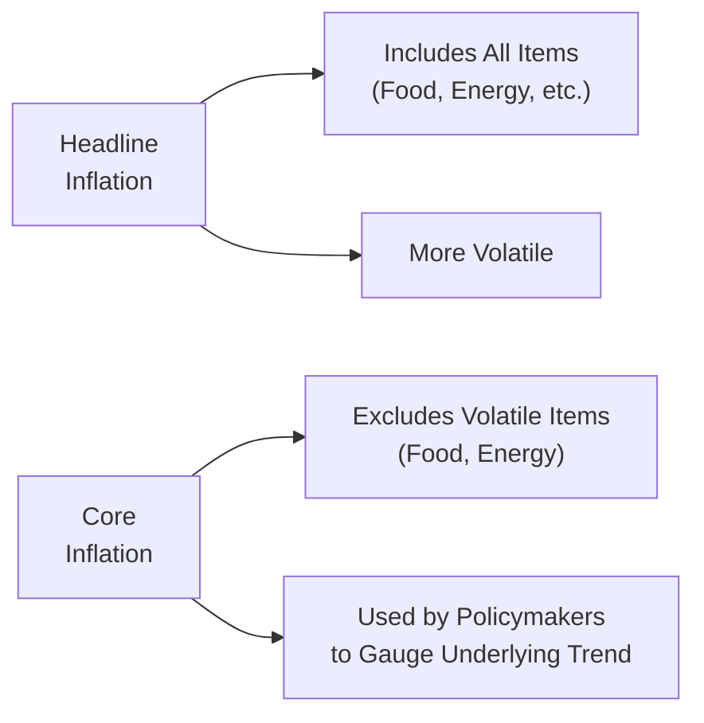

## Introduction
Inflation, in its broadest sense, refers to the general increase in prices across an economy, eroding consumers’ purchasing power over time. But let’s be honest: inflation doesn’t always perfectly follow a tidy pattern. Sometimes energy or food prices surge unexpectedly—maybe due to a poor harvest or an oil pipeline disruption—and your grocery or gas bill shoots up for a few weeks. Other times, these same prices may plummet. So, if your data is heavily influenced by short-term shocks, how do you tell the real trend from the noise?

That’s where headline and core inflation measures come into play. Headline inflation includes just about everything in the consumer pricing basket—food, energy, and all the rest—while core inflation filters out some of the most volatile components in that basket, typically energy and food. Having both measures allows economists, policymakers, and investment analysts to gauge how deep or lasting price changes might be.

## Headline Inflation
Headline inflation is essentially the broad stroke. It’s the measure you see in media headlines whenever inflation results are announced—hence the name. It reflects changes in the cost of all goods and services within a defined basket (often the Consumer Price Index, or CPI). Since every consumer needs to buy food and energy in some form, many argue this is the best measure of real-life inflation. After all, if your grocery bill skyrockets, you feel that pinch immediately, so ignoring those prices doesn’t necessarily reflect your everyday experience.

However, from a policy or investment standpoint, headline inflation can be a little jumpy. Think of how crude oil markets trade. A geopolitical event in a major oil-producing nation can push oil prices up overnight, which in turn can spike your transportation costs. By next month, that situation might get resolved, reverting oil back to prior price levels. Headline inflation captures all these fluctuations in real time—great for capturing the immediate impact, but sometimes less useful if you want to interpret deeper, more persistent price trends.

### Influence of Commodity Swings
One big personal lesson I learned a while back: I was sifting through monthly inflation data, noticing that inflation shot up to almost 6%, causing quite an uproar in market commentary. A closer look revealed that most of the jump was concentrated in an energy price spike. Within a couple of months, oil prices corrected, and inflation dropped back near the prior trend. If you were a policymaker making a long-term interest rate decision based solely on that one-month jump, you might have overreacted. Headline inflation’s volatility can sting if you rely on it for immediate policy decisions without deeper analysis.

## Core Inflation
Core inflation tries to “see through” short-term noise by excluding certain components known for frequent and erratic price changes—usually food and energy. By doing this, it aims to reveal a steadier, underlying inflation trend. Central banks like the U.S. Federal Reserve or the European Central Bank frequently emphasize core inflation in their policy frameworks because it presumably reflects more stable and persistent price pressures. If core inflation is consistently picking up, that signals that prices for a wide array of goods and services are rising in a more systematic way.

### Components Typically Excluded
The exact definition of core inflation can vary. Commonly excluded items include:  
• Food products (which can be heavily influenced by weather, pests, or commodity market swings)  
• Energy (including gasoline, fuel oil, electricity)  
• Sometimes certain administered prices (e.g., government-regulated tariffs)  

Trimming away these volatile items means the index moves more gently, giving policymakers a clearer sense of lasting inflationary (or deflationary) trends—like wage growth or persistent changes in demand. Of course, there’s an inherent critique: food and energy are not luxuries but essentials, so ignoring them may not always reflect the stresses faced by households.

### Why Polymakers Lean on Core Measures
We’ve already hinted at it, but let’s be explicit: when central banks set monetary policy, like changing interest rates or conducting open market operations, they focus on whether inflationary pressures will be long-lasting. Transient fluctuations in veggies or car fuel prices are less relevant if they’re expected to revert soon. Core inflation data helps identify if an economy is really running too hot or too cold, beyond the noise in commodity markets.  

From a Level I CFA perspective—particularly if you’re building up your foundational knowledge—remember that many major monetary authorities have formal or informal inflation targets. Often these targets are couched in terms of a headline measure, but their day-to-day analysis might favor core readings.

## Headline vs. Core: Practical Implications
So how do you decide when to use headline inflation and when to use core? If you’re a long-term bond portfolio manager, for example, you might lean on core inflation for interest-rate forecasting. You want to know the “sticky” inflation that central banks are trying to combat. In contrast, if you’re a consumer goods analyst tracking input costs, you might be all about headline numbers, since raw materials and commodity prices can directly affect a company’s bottom line in the next quarter.

### Example: Policy Rate Setting
Central banks typically set policy rates with an eye on core measures. If headline inflation spikes due to a temporary jump in the price of gasoline, but core remains benign, the central bank might keep monetary policy unchanged, expecting that short-term volatility will fade.

### Example: Household Budgeting
A family might care more about headline inflation—because if food prices surge, that affects this month’s grocery budget whether or not the change is labeled “volatile.” As a result, they’ll spend more or less of their disposable income on necessities right away. In the long run, though, that might even out.

## Advantages and Disadvantages of Core Inflation
Let’s lay it out simply:

• Advantage: Helps isolate medium- to long-term inflation trends, particularly useful for policymaking and inflation targeting.  
• Advantage: Less prone to dramatic short-term swings, making it easier to interpret labor market conditions and capacity constraints that influence sustained price changes.  
• Disadvantage: Excluding food and energy can understate the real pain consumers feel if those prices move up significantly for an extended period.  
• Disadvantage: If volatile components experience structural price changes (for instance, persistent increases in energy costs due to environmental shifts), then focusing too exclusively on core might cause policymakers to respond more slowly.

## Mermaid Diagram: Headline vs. Core
Below is a simple diagram to help visualize the difference between headline and core inflation:

## Why It Matters for Portfolio Management
For a CFA candidate—especially if you’re shooting for mastery in macroeconomic factors—knowing how markets react to inflation data is crucial. Headline inflation may rule the immediate conversation because big spikes or dips get attention. Bonds, currencies, and equities can all scramble in response to a surprising headline number. Meanwhile, longer-horizon traders might ignore short-term commodity moves and focus on the persistent upward trend found in core data.

Let’s say you’re constructing an asset allocation model that factors in expected inflation for the next year. You might want to use core inflation forecasts to plan your strategic allocations—particularly for assets sensitive to real interest rates, like Treasury Inflation-Protected Securities (TIPS) or inflation-swaps. But for near-term trading and hedging strategies, headline inflation surprises can create short-lived volatility that an active manager could capitalize on.

## Critiques and Ongoing Debates
There is a common rebuttal: volatile items excluded from core aren’t always “transient.” If energy prices remain high for structural reasons—like persistent underinvestment in oil production or major disruptions to supply lines—those costs eventually filter into the broader economy. Even if initial spikes in energy or food are referred to as “noise,” consistent updrifts can affect wage negotiations, production costs, and the entire inflation picture.

Moreover, from a household’s viewpoint, essential goods are essential. You can’t just skip eating or heating your home for a few months until prices settle down. Some critics argue that weighting them out or excluding them to measure “core” means ignoring how profoundly real consumer behavior can shift when prices spike.

## Best Practices, Common Pitfalls, and Strategies to Overcome Them
• Best Practice: Monitor both headline and core measures in tandem. Headline can signal immediate changes in consumer costs, while core indicates more stable pricing pressures.  
• Common Pitfall: Over-focusing on core inflation for too long might lead you to ignore structural trends in commodity markets that eventually spill over into core components.  
• Strategy to Overcome: Conduct scenario analyses that incorporate potential worst-case “persistent volatility” in items like oil. This helps you plan for scenarios where volatile items remain high for extended periods.  
• Best Practice: Policy analysts often run “trimmed mean” or “median” inflation measures as alternatives to pure “headline vs. core,” to reduce volatility in a more nuanced, data-driven way.

## Simple Illustrative Calculation
Below is a high-level illustration showing how a nation’s official statistics agency might calculate headline and core inflation for a given month:

• Headline CPI this month: 108.5 (index)  
• Headline CPI previous month: 107.0 (index)  

Headline Inflation Rate (Month-over-Month) =  

\frac{108.5 - 107.0}{107.0} \times 100 \approx 1.40\%


Now, if excluding food and energy yields:

• Core CPI this month: 105.2 (index)  
• Core CPI previous month: 104.8 (index)  

Core Inflation Rate (Month-over-Month) =  

\frac{105.2 - 104.8}{104.8} \times 100 \approx 0.38\%


Here, we can see a significant difference in the monthly numbers: 1.40% vs. 0.38%. At first glance, you might think inflation is accelerating quickly if you only look at headline. But the core measure suggests that a big chunk of the jump might be from mainly food or energy prices, which could calm down soon—or not. That’s the real interpretive work for policymakers and analysts.

## Exam Tips for CFA Candidates
• Understand the definitions deeply: you may be tested on what items get excluded in core inflation calculations.  
• Know which measure central banks target or reference more frequently—they often talk about headline, but decisions are shaped heavily by core data.  
• Be prepared for scenario-based questions asking you to differentiate how short-term commodity shocks influence both measures.  
• Look for how persistent or “sticky” inflation might show up in wage data—a key driver of longer-term inflation.  
• In essay-style questions, you may be asked to discuss the implications for policy or asset allocation. Be sure to connect core inflation’s significance to long-term interest rate setting and its effect on bond pricing.

## References and Further Reading
• Federal Reserve: Discussions on headline vs. core inflation. Visit:  
  [https://www.federalreserve.gov/](https://www.federalreserve.gov/)  
• European Central Bank (ECB): Research papers on core inflation measures.  
• International Monetary Fund (IMF): Working Papers on inflation targeting and macroeconomic stability.  
• For deeper explorations of inflation in a portfolio management context, consult the CFA Institute’s official materials on economic analysis.

---

## Test Your Knowledge: Core vs. Headline Inflation Quiz



### Which of the following best describes headline inflation?

- [ ] It excludes food and energy prices to reduce volatility.
- [x] It captures overall price changes in a consumer basket, including all goods and services.
- [ ] It focuses exclusively on long-term wage-driven inflation trends.
- [ ] It measures changes in industrial input prices and ignores consumer goods.

> **Explanation:** Headline inflation includes all goods and services in the consumer price basket, reflecting the total cost of living changes.

### Policymakers often focus on core inflation for which primary reason?

- [x] It reduces the short-term noise from volatile components, revealing underlying trends.
- [ ] It measures the immediate impact of rising food prices on households.
- [ ] It strictly follows energy price fluctuations.
- [ ] It sets interest rates based solely on fluctuations in oil and dairy prices.

> **Explanation:** Core inflation excludes items like food and energy to provide a clearer picture of persistent, longer-term inflation trends that matter for policy.

### Which of the following is a key drawback of focusing too heavily on core inflation?

- [ ] It includes every single item that a typical consumer buys.
- [ ] It perfectly predicts long-term market expectations without error.
- [x] It can overlook the real impact of sustained increases in food or energy costs on households.
- [ ] It makes interest rates fluctuate daily.

> **Explanation:** Core inflation excludes food and energy, which can constitute significant portions of household budgets. Sustained rises in these excluded categories could still have lasting economic effects.

### Suppose the CPI for all items rises from 200 to 206 in one year, while the CPI excluding food and energy rises only from 190 to 192. Which statement is correct?

- [ ] Headline inflation is 1%.
- [ ] Core inflation is higher than headline inflation.
- [x] Headline inflation is 3%, and core inflation is about 1%.
- [ ] Core inflation is 3%, and headline inflation is about 1%.

> **Explanation:** Headline inflation = (206−200)/200 = 3%. Core inflation = (192−190)/190 ≈ 1%. The difference indicates the impact of volatile components.

### A sudden spike in oil prices caused headline inflation to jump from 2% to 4% annually. Core inflation, however, rose only from 2% to 2.2%. How might a central bank respond?

- [x] Maintain current policy if they view the shock as temporary, given the modest rise in core inflation.
- [ ] Immediately raise interest rates by 500 basis points.
- [x] Provide forward guidance emphasizing transitory effects.
- [ ] Completely ignore both headline and core data.

> **Explanation:** Central banks often “look through” temporary shocks if core inflation remains stable, using communication or moderate policy adjustments.

### How do short-term commodity price shocks typically affect the difference between headline and core inflation?

- [x] They widen the gap, as headline inflation captures these fluctuations, but core excludes them.
- [ ] They have an equal effect on both measures.
- [ ] They lower headline inflation but raise core inflation.
- [ ] They only influence the bond market, not inflation measures.

> **Explanation:** Temporary commodity price shocks are reflected in headline inflation, whereas core omits these volatile components.

### An investor is analyzing inflation data to anticipate possible interest rate moves. Which measure should they prioritize if they want insight into the central bank’s long-term policy stance?

- [x] Core inflation, because it offers a clearer view of underlying trends.
- [ ] Headline inflation, because it is more volatile.
- [x] Both measures, because large, persistent changes in headline components could bleed into core trends.
- [ ] Neither measure; the central bank sets interest rates randomly.

> **Explanation:** Core inflation is crucial for understanding long-term policy, but large swings in headline components can eventually influence core, so both matter.

### If food prices remain chronically elevated for an extended period, how might this eventually affect core inflation?

- [x] It could push up wages and affect other prices, thus increasing core inflation over time.
- [ ] It has zero effect on core inflation, by definition.
- [ ] It causes bond prices to fall but doesn’t change the inflation index.
- [ ] It only influences the stock market and not the inflation measure.

> **Explanation:** Even though food is excluded from core inflation, persistent high costs in essentials can spill over into the broader economy, indirectly raising core prices.

### Which metric is generally better for short-term consumer budgeting decisions?

- [x] Headline inflation, as it reflects immediate changes in the cost of all goods and services.
- [ ] Core inflation, because it excludes critical consumer staples.
- [ ] Only the producer price index (PPI).
- [ ] Only the GDP deflator.

> **Explanation:** Households tend to feel the impact of volatile components like food or energy immediately, making headline inflation more relevant for short-term budgeting.

### True or False: Core inflation excludes both food and energy prices to smooth out short-term volatility.

- [x] True
- [ ] False

> **Explanation:** Core inflation is often calculated by removing food and energy components due to their frequent and sometimes extreme price swings, giving a greater emphasis to long-term trends.


