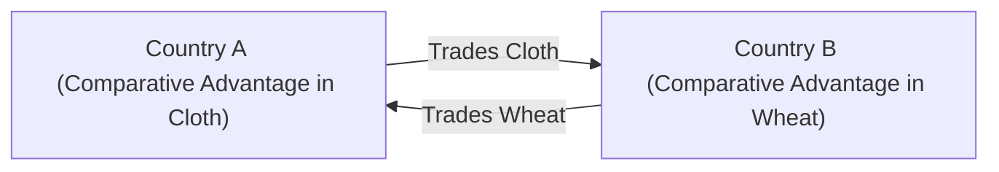

## Introduction

Have you ever wondered why we buy some products from abroad even though we might have the resources to produce them at home? Or why countries bother exchanging goods if one is more efficient than the other in making basically everything? Well, that’s where the concept of comparative advantage swoops in. It might sound fancy, but it’s really about figuring out the best way to allocate resources so that everyone ends up better off. Comparative advantage is a cornerstone of international trade theory, forming the basis for why trade can be beneficial for all parties involved—even if one country appears to be more efficient in producing every good (that’s known as absolute advantage).

This topic is part of International Trade and Capital Flows, which is critical for analyzing global markets in a CFA® context. If you’re aspiring to be a professional who advises on portfolio strategies worldwide, you need to grasp why countries choose to specialize and how that influences corporate earnings, currencies, global supply chains, and risk factors. Let’s dig in.

## The Foundations of Comparative vs. Absolute Advantage

Before we go too far, let’s define two essential terms:

• Absolute Advantage: A country (or any economic actor) has an absolute advantage if it can produce a given good using fewer resources (labor, materials, capital) than another country.  
• Comparative Advantage: A country has a comparative advantage if it can produce a given good at a lower opportunity cost than another country.

Opportunity cost is the key. It’s the value of what you give up when you choose one activity over another. In trade theory, the question is: "What must a country not produce in order to produce one more unit of something else?" That forgone alternative is the opportunity cost.

### A Quick Anecdote

I remember, back in my undergraduate days, I had a heated (but friendly) debate in the campus café about why my home country imported shoes from a country I was convinced had more expensive labor. It seemed counterintuitive. But as I learned, we import from them because, unbelievably, they forego fewer alternatives to produce those shoes—making them cheaper, overall, to bring to market than if we did it ourselves. That’s textbook comparative advantage.

## Understanding Opportunity Cost

Consider two countries—Country A and Country B—each producing two goods: wheat and cloth. For simplicity, let’s assume only one resource matters: labor (though in reality you’d analyze many factors, including technology and capital).

- Country A can produce either 1 unit of wheat or 2 units of cloth with one hour of labor.  
- Country B can produce either 4 units of wheat or 4 units of cloth with one hour of labor.

Country B has an absolute advantage in both goods because it can produce more per hour in both categories. Yet, we’ll see how comparative advantage may differ.

### Calculating Opportunity Costs

• For Country A:  
  – 1 unit of wheat costs 2 units of cloth in forgone production (because that same hour could have produced 2 cloth).  
  – 1 unit of cloth costs 0.5 units of wheat in forgone production (because using labor to produce 1 cloth means giving up 0.5 wheat).

• For Country B:  
  – 1 unit of wheat costs 1 unit of cloth.  
  – 1 unit of cloth costs 1 unit of wheat.

From these numbers, we see:

- Country A’s opportunity cost of 1 wheat is 2 cloth, which is quite expensive in terms of cloth. Meanwhile, Country B’s opportunity cost of producing 1 wheat is only 1 cloth, which is lower. So, Country B has a comparative advantage in wheat production.  
- Conversely, Country A’s opportunity cost of 1 cloth is 0.5 wheat, while Country B’s opportunity cost of 1 cloth is 1 wheat. Because 0.5 < 1, Country A has a comparative advantage in cloth.

The result? Even though B is more efficient in an absolute sense, each country should focus on the good they produce at the lowest opportunity cost. That is, Country A specializes in cloth, and Country B specializes in wheat. Then they trade.

## Specialization and Gains from Trade

### The Concept of Specialization

Specialization means zeroing in on producing those goods in which you hold a comparative advantage. Once specialized, countries exchange goods according to negotiated prices—“terms of trade”—so that both parties can end up with more than if each had tried to produce everything on its own.

In practice, terms of trade (TOT) must lie between the opportunity cost ratios of the partners for both to benefit. If you take the wheat-cloth example:

- A’s opportunity cost ratio (for 1 wheat) is 2 cloth.  
- B’s opportunity cost ratio (for 1 wheat) is 1 cloth.

So beneficial TOT per 1 wheat has to be somewhere between 1 cloth and 2 cloth. For instance, if the final trade ratio is 1 wheat for 1.5 cloth, both countries improve their consumption possibilities.

Here’s a simplified (perhaps too simplified—but we like to keep examples straightforward) illustration:

The chart above shows the basic direction of trade. In a real advanced economy, you’d have multiple goods, capital flows, and more complicated logistic or regulatory layers. But the principle remains: each produces where it has a lower opportunity cost, then trades.

### Numerical Example: Mutual Gains

Let’s get a bit more quantitative. Suppose if each country spent 10 labor hours, we’d have:

- Country A: Specializing in cloth → 10 hours × 2 cloth/hour = 20 cloth, 0 wheat  
- Country B: Specializing in wheat → 10 hours × 4 wheat/hour = 40 wheat, 0 cloth

If they don’t trade, that’s their respective production and consumption (20 cloth for A, 40 wheat for B). If they set up some TOT where 1 wheat = 1.5 cloth, and Country B trades 6 wheat for 9 cloth, we get:

- Country A after trade: (20 – 9) cloth + 6 wheat = 11 cloth + 6 wheat  
- Country B after trade: (40 – 6) wheat + 9 cloth = 34 wheat + 9 cloth

Both countries now consume some of each good. In fact, they each have a combination of wheat and cloth that could be unattainable if they produced both goods on their own without trade. That’s the crux of gains from trade.

## Real-World Relevance

### Ricardian Model vs. Heckscher-Ohlin Model

In the Ricardian model, comparative advantage stems purely from differences in labor productivity and technology. Each country’s unique expertise or technology fosters a comparative advantage in certain goods. Meanwhile, the Heckscher-Ohlin (H-O) model broadens the perspective and links it to factor endowments (e.g., labor, capital, natural resources). A labor-rich country might specialize in labor-intensive goods, while a capital-rich country focuses on capital-intensive goods.

In a real business context, multinational enterprises might base their offshoring decisions on these principles. They’ll set up production where they have a factor advantage—be it cheap labor, availability of specialized capital, or advanced technology. That said, strict real-life application is more complex due to exchange rates, regulations, shipping costs, or even brand positioning.

### Shifting Comparative Advantage Over Time

Comparative advantage isn’t necessarily fixed. Countries invest in education, develop infrastructure, or adopt new technology—shifting productivity and factor endowments. For example, some emerging markets once specialized mainly in labor-intensive goods (like low-cost apparel) but now have moved up the value chain into electronics manufacturing or software.

For CFA® candidates analyzing equity or bond markets, such shifts can materially influence corporate earnings and investment opportunities. You might see an economy pivot from primarily exporting raw materials to exporting refined, high-value-added products. In portfolio management, capturing these transitions early can be a key source of alpha.

## Practical Applications in Finance

From a Level I or even a Level III CFA® vantage point, the main reason to understand comparative advantage is to interpret how trade flows evolve, how national income changes, and how capital flows respond to international cost differences. For example:

- If you’re evaluating a multinational firm’s competitive positioning, you might look for cost-savings strategies based on factor endowments in various countries.  
- You might project currency trends by assessing a country’s export base. Consistent trade surpluses can indicate upward demand for the currency in foreign exchange markets.  
- You could also analyze capital budgeting decisions for global expansions, factoring in local labor or technology conditions to see if those expansions align with factor-based (H-O) or productivity-based (Ricardian) advantages.

Although there is no direct IFRS or US GAAP “standard” that instructs how to handle “comparative advantage,” multinational companies must disclose cost structures, segment revenues, and intangible assets (e.g., technology, brand capital) that reveal how or why they choose to produce or source goods abroad. Meanwhile, an analyst adhering to the CFA Institute Code of Ethics and Standards of Professional Conduct should present objective reasoning about these trade dynamics when advising clients or writing research reports—be sure to note if any conflicts of interest exist, and maintain independence in your conclusions.

## Potential Pitfalls and Best Practices

1. Oversimplification: In the real world, shipping costs, environmental regulations, and tariff barriers complicate the theoretical elegance of comparative advantage. Forecasting intangible factors like brand power or political shifts can be tricky.  
2. Neglecting Terms of Trade: Even if a country has the “right” comparative advantage, unfavorable terms of trade might negate or reduce expected gains. CFA exam questions often revolve around calculating these TOT boundaries.  
3. Not Considering Transitional Costs: Workers in less competitive sectors might lose jobs in the short run, leading to social and political backlash. While the overall economy gains, these frictions affect policy decisions and can spark trade wars or tariffs.  
4. Failing to Update Models: Factor endowments can change fast if a country invests in technology or experiences an influx of foreign direct investment (FDI). Historical advantage doesn’t guarantee future advantage.  
5. Ignoring Currency Volatility: Exchange rates can swing quickly, temporarily giving or removing cost advantages, so analyzing currency risk is vital.

## Diagram of a Simple Production Possibility Frontier (PPF)

Below is a conceptual Production Possibility Frontier for a single nation deciding how to allocate resources between two goods, Good X and Good Y.

• Point A: All resources devoted to producing Good X (no production of Good Y).  
• Point C: All resources devoted to producing Good Y (no production of Good X).  
• Points along the frontier B: Efficient combinations of producing both goods using full resource capacity.  

When a country trades, it can consume at a point *beyond* its own PPF because it can exchange goods produced relatively cheaply (where it has comparative advantage) for goods that would be costlier to produce domestically.

## Exam Tips: Constructed Response and Item Set

• Data Table Approach: On the CFA exam, a question might provide data tables showing how many units of two goods each country produces per unit of resource. Your job is to calculate opportunity costs, identify comparative advantages, and propose a beneficial range for terms of trade.  
• Don’t Confuse Absolute with Comparative: It’s a common slip to assume that a country with absolute advantage in all products also has comparative advantage in all. That simply can’t happen.  
• Watch the Ratios: Opportunity cost is typically the “rise over run” formula. If you’re focusing on Good A, check what must be given up of Good B.  
• Link to Exchange Rates: Some advanced item sets might incorporate currency movements. A country’s advantage can appear or vanish with exchange rate fluctuations.  
• Ethical and Regulatory Considerations: While theoretical, exam questions might cite voltage in the political environment or mention compliance with WTO rules. Understand how that might shift trade policies or TOT.

## References and Further Reading

- Paul R. Krugman and Maurice Obstfeld, “International Economics: Theory & Policy”  
- World Trade Organization (WTO): https://www.wto.org  
- David Ricardo, “On the Principles of Political Economy and Taxation”  
- International Monetary Fund: https://www.imf.org  

These resources deepen your understanding of trade theories, policy frameworks, and real-life case studies.

---

## Mastering Comparative Advantage and Gains from Trade: A Practice Quiz



### Which concept most directly determines if a country has a comparative advantage in producing a particular good?

- [ ] Absolute efficiency in producing the good
- [ ] Presence of a trade surplus
- [x] Opportunity cost of producing that good
- [ ] Government intervention in setting subsidies

> **Explanation:** Comparative advantage depends on the concept of opportunity cost. A country will specialize in and export goods for which it foregoes less production of other goods.

### According to comparative advantage theory, when should two countries trade?

- [ ] Only if one has absolute advantage in producing both goods
- [x] If each specializes in producing the good with the lower opportunity cost
- [ ] When their exchange rates are equal
- [ ] Only if the terms of trade benefit one side more

> **Explanation:** The basis of mutually beneficial trade is specialization according to lower opportunity cost. Both countries can gain if they specialize in what they produce relatively more efficiently.

### In a Ricardian model, what primarily explains why a country might have a comparative advantage?

- [ ] Differences in relative capital stock
- [x] Differences in technology or labor productivity
- [ ] Differences in trade barriers or tariffs
- [ ] Luck in discovering natural resources

> **Explanation:** The Ricardian model focuses on variations in technology and labor productivity as the source of comparative advantage.

### If Country A’s opportunity cost of producing one unit of Good X is 2 units of Good Y, what must be true for a mutually beneficial terms of trade with Country B?

- [x] The trade ratio of X to Y lies between Country A’s and Country B’s opportunity cost ratios
- [ ] Country B must accept 2 X for 1 Y
- [ ] The ratio must be exactly 2:1
- [ ] There can be no benefit since 2 is the highest ratio

> **Explanation:** Gains from trade occur when the exchange ratio (terms of trade) falls between the two countries’ respective opportunity costs for that pair of goods.

### Which of the following scenarios can shift a country’s comparative advantage over time?

- [ ] Lopsided trade surpluses in the short term
- [ ] Arbitrarily changing exchange rates on a daily basis
- [ ] Population distribution changes within a month
- [x] Technological improvements that increase worker productivity

> **Explanation:** Improving productivity, such as through technological innovations, is a key factor that can fundamentally shift opportunity costs and thus comparative advantage over time.

### Which statement best describes the Heckscher-Ohlin (H-O) model?

- [x] It explains comparative advantage through factor endowments such as labor and capital
- [ ] It focuses solely on differences in technology
- [ ] It requires that countries run trade surpluses
- [ ] It states that countries cannot benefit from trade

> **Explanation:** Unlike the Ricardian model, the H-O model emphasizes how a country’s relative abundance of factors (labor, capital, resources) determines which goods it should specialize in.

### Which of the following best explains why a nation with an absolute advantage in multiple goods might still import some goods?

- [ ] Import controls fluctuate daily
- [x] The country might have a higher opportunity cost in certain goods, giving other nations a comparative advantage
- [ ] Global fairness rules in the WTO
- [ ] Strict tariff policies to protect domestic industries

> **Explanation:** Even if a nation is absolutely efficient in producing everything, there may still be goods for which its opportunity cost is higher than other countries’, so it can benefit by importing those goods.

### A likely cause of friction in trade discussions is the short-run impact of specialization, which may lead to:

- [ ] Lower production possibilities for both countries
- [ ] Currency appreciating rapidly across all markets
- [ ] Complete stability in labor markets
- [x] Structural unemployment in industries losing comparative advantage

> **Explanation:** One recognized pitfall is friction due to workers who may lose jobs in now less-competitive sectors when countries specialize. Though overall welfare might rise, dislocations bring political and social challenges.

### When analyzing a firm’s global supply chain under IFRS or US GAAP, which factor would most closely relate to comparative advantage in an analyst’s report?

- [ ] Reporting intangible assets at fair value
- [ ] Firm’s internal budgeting process for corporate overhead
- [x] Locational costs or productivity data explaining why certain manufacturing is done abroad
- [ ] Patent expiration dates for intangible R&D

> **Explanation:** The main link is understanding how cost structures and productivity factors drive a firm’s decision to place production in certain countries, aligning with comparative advantage considerations.

### True or False: If two countries specialize and trade based on comparative advantage, at least one of them must end up worse off.

- [ ] False
- [x] True (This is a trick question as phrased, see explanation)

> **Explanation:** Actually, the classic theory says both countries can be better off. The question statement is reversed. If two countries specialize according to comparative advantage, both can gain—nobody necessarily ends up worse off. (Note: Be careful reading question wording on the exam.)


