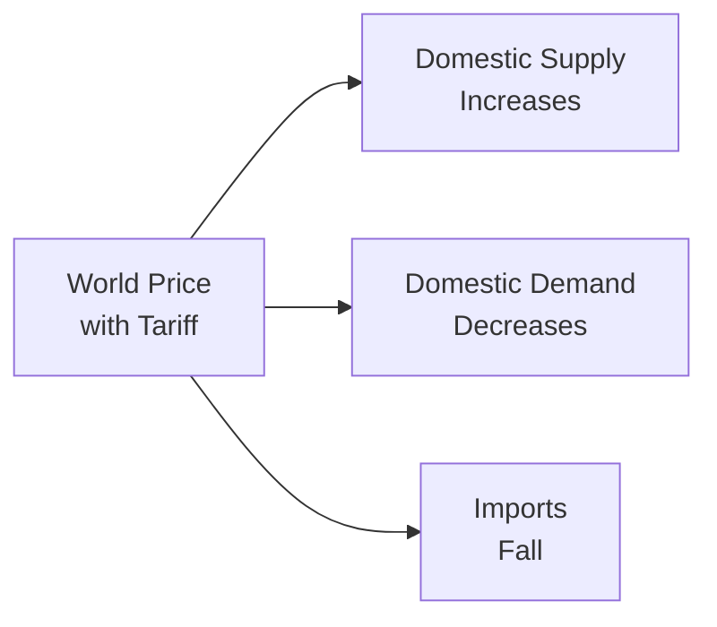

## Overview

Global trade and capital flows shape the landscape of international capital markets, impacting everything from bond prices to equity valuations and currency movements. For CFA candidates—particularly at the advanced (Level III) stage—understanding how tariffs, quotas, and a range of other trade barriers function is vital to forming robust capital market expectations, stress-testing portfolio assumptions, and anticipating policy-driven market shifts.

If we think back to fundamental supply and demand concepts (as introduced in earlier chapters, such as Chapter 1 on Market Forces of Supply and Demand) and combine them with the macroeconomic frameworks (from Business Cycle analyses to Inflation and Deflation dynamics), we uncover how trade policies can significantly alter equilibrium outcomes. In a portfolio management context, the imposition of import restrictions can create ripple effects in costs of goods, corporate margins, currency exchange rates, and strategic trade relations, all of which matter for asset allocation and risk management.

Below, we dissect major types of trade barriers, their mechanics, and their theoretical underpinnings. You will also find diagrams illustrating how tariffs shift supply curves, plus examples connecting these policies to real-world portfolio considerations.

## Key Concepts and Motivations Behind Trade Barriers

Trade barriers are imposed by governments for a variety of reasons, ranging from protecting domestic “infant industries” and preserving jobs to responding to alleged unfair trade practices (e.g., dumping). The complexity and structure of these barriers, and the manner in which they interact with global price mechanisms, mean that for portfolio managers, devising macroeconomic forecasts or analyzing currency risks often requires an appraisal of these government interventions.

• Protection of Domestic Industries: Governments may use tariffs and quotas to shield domestic producers from foreign competition, especially if those producers are not yet cost-competitive (the “infant industry argument”).  
• Geography of Jobs and Politics: Trade restrictions are touted for sustaining local employment, at least in the short run, though they can also lead to retaliatory measures and trade wars.  
• Antidumping and National Security: Policymakers may claim that foreign producers sell goods below cost (dumping) or that certain industries (e.g., defense-related production) must remain domestic for national security reasons.

## Tariffs

A tariff is a tax levied on goods imported into a country. This tax raises the cost of imported goods, often boosting domestic producers’ competitiveness. As straightforward as that sounds, the incidence of a tariff—how its economic burden is divided between producers, consumers, and foreign exporters—depends on elasticities and market structures (a topic extensively covered in earlier chapters on supply, demand, and elasticity).

### Types of Tariffs

• Ad Valorem Tariffs: An ad valorem tariff is expressed as a percentage of the imported good’s value (e.g., a 10% tax on the total value of each imported car). Because the tax is tied to the value of the good, high-priced goods yield more tariff revenue than lower-priced ones.  
• Specific Tariffs: A specific tariff imposes a fixed amount of money per unit of the good (e.g., $500 per imported car). This approach simplifies calculation and administration but has a different incidence on cheaper versus more expensive goods.

### Effects of Tariffs on Market Equilibrium

Suppose a domestic market is fully open to trade without tariffs. The world price (PW) is below the domestic equilibrium price (PE), so domestic consumers will buy cheaper imports until the domestic price converges toward PW. When a tariff is introduced, the effective price of the imported good rises by the tariff amount (or by the relevant percentage, for ad valorem). As a result:

• Domestic Consumption Declines: Higher prices reduce the quantity demanded.  
• Domestic Production Increases: Local firms, protected by the tariff wedge, supply more of the market.  
• Imports Fall: With lower consumption and higher domestic supply, the volume of imports decreases.  
• Tax Revenue Increases: The government earns tariff revenue (equal to tariff × quantity of imports).  
• Deadweight Loss Emerges: There is a loss in overall welfare because some consumers are priced out of the market and resources are allocated to less-efficient domestic producers.

Below is a simple mermaid diagram illustrating the intuitive flow when a tariff raises the world price:

### Consumer Surplus, Producer Surplus, and Government Revenue

In a partial equilibrium analysis:

• Consumer Surplus Decreases: Consumers pay higher prices, so they lose a portion of their surplus.  
• Producer Surplus Increases: Domestic producers benefit from higher market prices.  
• Government Gains Tariff Revenue: The area capturing the tax revenue is typically labeled as a rectangle in supply-demand graphs.  
• Deadweight Loss: Two triangles representing missed opportunities—some consumers are priced out (consumption distortion), and some resources are redirected inefficiently to less competitive domestic producers (production distortion).

These changes in surplus are critical for evaluating the net welfare impact of a tariff; from a purely economic efficiency standpoint, tariffs reduce total surplus (i.e., they create deadweight loss). However, in practice, policymakers weigh these losses against political objectives, domestic employment, or other strategic aspirations.

## Quotas

Quotas limit the quantity or value of a certain good that can be imported during a specific time frame. Unlike tariffs, quotas do not typically bring revenue to the government (unless quota licenses are sold to importers or foreign producers). Instead, the scarcity created by the quota can raise the domestic price of the good above the world price, producing an economic rent known as a “quota rent.”

### Mechanics of Quotas

• The government sets a legal ceiling on the quantity of imports.  
• At the same time, strong domestic demand can raise prices to ration this now-limited supply.  
• Domestic producers increase their production to take advantage of higher prices.  
• Foreign exporters compete for the limited import permits, which can create rents for whichever party holds the quota rights.

### Quota Rents

Quota rents represent the difference between the higher domestic price and the lower world price for the limited quantity of goods that can be imported. These rents can accrue to foreign producers (if they are free to sell at a higher domestic price) or to domestic license holders (if import licenses are auctioned off or priced by the government).

In terms of welfare analysis, quotas mimic many of the distortions caused by tariffs:  
• Consumer Surplus Decreases (due to higher prices).  
• Producer Surplus Increases (due to the artificially raised domestic price).  
• Quota Rents Replace Tariff Revenue (the government does not necessarily receive this revenue unless it has an auction mechanism for quota licenses).  
• Deadweight Loss Exists (consumption and production inefficiencies remain).

## Non-Tariff Barriers (NTBs)

While tariffs and quotas are the most transparent restrictions, non-tariff barriers can be equally influential. NTBs range from product licensing requirements to health, safety, and environmental standards, each potentially acting to limit foreign competition.

Examples include:  
• Health and Safety Regulations: Strict quality certifications can limit imports that do not meet certain standards.  
• Local Content Requirements: Mandate that a certain percentage of a product’s components be sourced domestically.  
• Voluntary Export Restraints (VERs): Exporting country “voluntarily” restricts shipments to stave off more severe limitations.  
• Administrative Delays and Bureaucratic Hurdles: Extended customs procedures can effectively reduce the flow of imports.

Although NTBs often address legitimate policy goals (e.g., consumer safety), they can also be used strategically to protect specific domestic industries without imposing direct tariffs or quotas. From a portfolio management standpoint, watch out for unexpected increases in trade friction from new regulatory requirements, as these can alter corporate earnings forecasts and supply chain reliability.

## Implications for Economic Efficiency and Resource Allocation

Both tariffs and quotas introduce distortions that pull market outcomes away from the free-trade equilibrium, potentially causing:

• Higher Prices for Consumers: Reduced real incomes, altered consumption patterns.  
• Protected, Less-Efficient Domestic Production: In the long run, resources may be trapped in sectors that do not have comparative advantage.  
• Reduced International Competition and Innovation: Firms may become complacent under protective barriers, slowing productivity improvements.  
• Potential for Retaliation: Other countries can respond with their own barriers, further reducing global trade (so-called “beggar-thy-neighbor” response).

In advanced portfolio analysis, it is crucial to factor in how persistent trade barriers disrupt supply chains and shift relative prices across markets. Protective tariffs on inputs can inflate the cost base for some companies in the domestic economy. Meanwhile, foreign nations may retaliate with tariffs on exports of domestic companies, damaging global revenue streams.

## The Political Economy of Protectionism

Protectionism often emerges from a mix of economic and political motivations. Among the common arguments for implementing barriers:

• Infant Industry Argument: Emerging domestic industries are initially uncompetitive compared to established foreign rivals. Tariffs or quotas are believed to “nurture” these infant sectors until they reach scale.  
• Antidumping and Countervailing Duties: Governments impose these measures when foreign producers sell goods at artificially low prices, possibly backed by subsidies.  
• Safeguarding Domestic Jobs: Trade barriers may be popular politically if they’re perceived to preserve local employment in threatened industries.

Of course, trade restrictions can also generate friction in global markets, leading to reciprocal measures. For instance, a tariff on steel imports by one country may provoke retaliatory tariffs on agricultural exports from another. Portfolio managers and global investors should thus keep an eye on political developments that could spark tit-for-tat trade disputes, as these can significantly alter corporate earnings outlooks in targeted sectors.

## Case Study: Voluntary Export Restraints (VERs)

Voluntary Export Restraints represent a curious twist: the exporting country agrees to limit the quantity of exports, often to sidestep more punitive trade barriers. For instance, the classic example is Japan’s auto export restraints to the United States in the 1980s. In theory, this approach fosters dialogue and cooperation, but the outcome for consumers is often the same: restricted supply means higher prices. VERs again create quota rents, but in this scenario, the foreign exporter holding the supply tends to capture them.

## Short-Term vs. Long-Term Impacts

In the short run, tariffs tend to protect domestic producers, boost local output, and raise government revenue (when it comes to tariff policies), but these outcomes come at the expense of higher consumer prices and decreased total welfare. Over time, as industries remain sheltered from competition, there is a risk of inefficiency creeping in. Additionally, heightened tensions can trigger retaliatory tariffs or shift production to other countries unaffected by these barriers. In modern global supply chains—especially for complex products like electronics or automobiles—trade restrictions can cause production line restructuring. Portfolio managers, in turn, may need to reallocate or hedge positions to address reshuffled production networks and cost differentials.

## Implications for Portfolio Management

From an investment standpoint—especially for multi-asset strategies—understanding the ramifications of trade policies is more than an academic exercise. Consider these applications:

• Macro Forecasts: Changes in trade policy affect GDP growth, inflation, and currency rates. For instance, if protective measures start to fuel inflation, bond investors may adjust their duration or consider TIPS (inflation-protected securities).  
• Equity Sectors and Asset Allocation: Not all sectors are equally impacted. Industries reliant on imported inputs (e.g., electronics assembly) may face margin pressure, whereas industries protected by tariffs might enjoy short-term benefits but risk complacency in the long run.  
• Country and Regional Allocation: Heightened protectionism may favor or disfavor certain equity or bond markets, depending on trade exposures.  
• Currency Effects: If a country imposes broad import restrictions, the currency could appreciate in response to a smaller trade deficit, or depreciate if the measures spark capital outflows and retaliation.  
• Risk Management and Scenario Analysis: Investors should stress test portfolios against protectionist scenarios—envision where potential trade wars or new tariffs place downward pressure on sectors reliant on global supply chains.

## Best Practices and Pitfalls

• Watch for Hidden Barriers: Even if formal tariffs are minimal, NTBs can be more challenging to detect but equally impactful.  
• Assess Both Direct and Indirect Effects: Look beyond immediate price changes in a single sector. Downstream and upstream industries may also be affected by higher input costs or supply constraints.  
• Avoid Overlooked Winners: Some domestic producers see windfalls under tariffs, providing short-term profit opportunities. However, always weigh the possibility of retaliatory measures or long-term inefficiency.  
• Don’t Overlook Political Signals: Speeches by politicians or early legislative proposals can foreshadow major policy shifts, so stay attuned to global political developments.  
• Incorporate Diversification: A multi-region approach can help mitigate the concentration risk of country-specific or region-specific trade barriers.

## Conclusion and Exam Tips

Understanding the landscape of tariffs, quotas, and myriad non-tariff barriers is critical for advanced financial analysis and portfolio management. At the CFA Level III stage, you should be prepared to integrate these concepts into scenario-based questions—whether it’s analyzing the net impact of a proposed tariff policy on a domestic automobile industry or assessing how shifting trade relations might reshape global equity returns.

• In exam-style essay questions, clearly highlight the change in consumer surplus, producer surplus, government revenue (if applicable), and deadweight loss.  
• Be specific about quota rents—who captures them and how they affect welfare.  
• Tie your discussion to real-world considerations: potential retaliations, supply chain shifts, changes in currency valuations, and the strategic reallocation of capital.  
• Remember that the CFA Code of Ethics also expects you to factor in these risk aspects when making client recommendations.

Trade policy remains a central lever for governments worldwide. As an investment professional, track how emergent trade barriers and retaliations can alter growth prospects and relative asset performance, and remain vigilant in incorporating these potential shifts into your forecasts and investment recommendations.

## References

• Mankiw, N. Gregory. Principles of Economics.  
• World Trade Organization (WTO): https://www.wto.org/english/tratop_e/tariffs_e/tariffs_e.htm  
• Peterson Institute for International Economics: https://www.piie.com/  
• A range of academic journal articles (e.g., American Economic Review) discussing empirical effects of tariffs and quotas.  

-------------------------------

## Trade Barriers and Market Implications Quiz



### Which of the following statements best characterizes an ad valorem tariff?

- [ ] It is a tariff that applies only to agricultural products.  
- [ ] It is a tax on profits of domestic producers.  
- [x] It is a tariff calculated as a percentage of the good’s value.  
- [ ] It is a tariff imposed only for non-tariff barriers.  

> **Explanation:** Ad valorem tariffs are levied as a percentage of the value of the imported good. This contrasts with specific tariffs, which are based on a fixed amount per unit.

### Which of the following is a direct result of a binding import quota?

- [x] Creation of quota rents.  
- [ ] Higher government revenue from the tax.  
- [ ] A guaranteed reduction in domestic production.  
- [ ] No effect on consumer surplus.  

> **Explanation:** A quota limits the quantity imported, often raising the domestic price above the world price and generating quota rents for whoever holds the right to import. Unlike tariffs, quotas do not necessarily bring revenue to the government unless the permits themselves are auctioned.

### A government imposes a tariff on steel. Which of the following outcomes would most likely occur in the domestic steel market?

- [x] Domestic steel producers increase output at higher prices.  
- [ ] Consumers buy more steel from abroad.  
- [ ] Domestic steel producers suffer immediate losses.  
- [ ] Domestic steel is sold below world prices.  

> **Explanation:** A tariff raises the cost of imports, making domestic steel more competitive and enabling domestic steel producers to increase production at higher prices.

### In a partial equilibrium analysis of tariffs, the area of government tariff revenue typically appears as:

- [ ] A triangular area above the supply curve.  
- [x] A rectangular area representing the tariff per unit times quantity of imports.  
- [ ] A triangular area below the demand curve.  
- [ ] A trapezoid combining consumer and producer surplus.  

> **Explanation:** In standard supply-and-demand diagrams, the government’s tariff revenue is conventionally depicted as a rectangle equal to the per-unit tariff multiplied by the number of imported units.

### Compare a tariff to a quota that restricts imports to the same quantity. Which of the following statements is correct?

- [x] A tariff generates revenue for the government; a quota may create rents for license holders.  
- [ ] A tariff and a quota produce zero deadweight loss.  
- [x] A quota cannot affect price, but a tariff always does.  
- [ ] A tariff never distorts production, while a quota does.  

> **Explanation:** While both trade barriers raise domestic prices and reduce imports, only a tariff ensures revenue accrues to the government in the form of tariff revenue. With a quota, that portion of surplus can become quota rents, possibly benefiting foreign producers or domestic licensees.

### What is the infant industry argument often used to justify?

- [x] Temporary protection of emerging domestic industries.  
- [ ] Introducing new consumption taxes for domestic goods.  
- [ ] Subsidizing foreign competitors.  
- [ ] Eliminating all trade barriers.  

> **Explanation:** Policymakers use the infant industry argument to justify tariffs, quotas, or subsidies for nascent domestic industries, on the premise that they need time to become competitive.

### Which of the following trade barriers would most likely increase domestic production of an imported good but not necessarily yield revenue to the imposing government?

- [ ] Ad valorem tariff.  
- [x] Import quota.  
- [ ] Specific tariff.  
- [ ] A new sales tax on domestic products.  

> **Explanation:** An import quota restricts quantity, often raising domestic prices and stimulating local production, but does not automatically yield revenue to the government (unless import licenses are sold).

### Which of the following best describes a Voluntary Export Restraint (VER)?

- [ ] A situation in which domestic firms choose not to export critical commodities.  
- [x] A self-imposed limitation on the quantity of goods exported to another country.  
- [ ] A requirement that imported goods must contain local components.  
- [ ] A regulatory measure to reduce negative externalities of production.  

> **Explanation:** A voluntary export restraint is an agreement in which the exporting country limits its exports to avoid more restrictive measures by the importing country.

### For portfolio managers, why are non-tariff barriers (NTBs) potentially more challenging than tariffs to track and analyze?

- [x] NTBs can be subtle, take many forms (e.g., quality controls, local content rules), and may change quickly without typical tariff legislation.  
- [ ] NTBs only exist in developing countries and rarely affect large markets.  
- [ ] NTBs always coincide with currency devaluations.  
- [ ] NTBs are transparent and announced far in advance.  

> **Explanation:** NTBs might be embedded in technical or administrative regulations that are not always publicly debated like tariffs, making them harder to monitor.

### Tariffs, quotas, and other barriers typically cause deadweight losses because:

- [x] They reduce potential gains from free trade and misallocate resources.  
- [ ] They maximize consumer surplus at the expense of producers.  
- [ ] They lower domestic producer revenues.  
- [ ] They have no impact on consumer surplus or producer surplus.  

> **Explanation:** By restricting trade or raising prices above the equilibrium, tariffs and quotas cause inefficiencies: some consumers are priced out, and resources are diverted to less competitive domestic sectors, resulting in deadweight loss overall.


