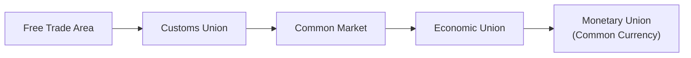

## Overview and Motivation

So, let's be honest: dealing with multiple countries, each with its own tariff schedules, rules, and currency arrangements, can feel more complicated than juggling your phone, keys, and coffee cup while rushing through airport security. Governments, businesses, and investors often look for ways to simplify these processes—and that’s exactly where trading blocs and regional integration step in. These frameworks aim to reduce barriers among member nations, potentially boosting trade, investment, and economic growth. 

At the same time, critics argue that such regional agreements may end up diverting trade away from cheaper external producers, influencing everything from local job markets to monetary policies. This section will explore the different types of regional trade agreements, such as free trade areas (FTAs), customs unions, common markets, economic unions, and monetary unions. We’ll also talk about major examples (like the EU and USMCA), trade creation, trade diversion, and practical details you’ll want to keep in mind—especially if you’re analyzing these blocs in your investment decisions or policy evaluations.

## Key Definitions and Levels of Integration

Perhaps you remember hearing about “NAFTA” (which became “USMCA”), or the “ASEAN” region, or even the “Eurozone.” All of these terms describe different levels of economic integration among countries. Let’s break down the classic progression from the simplest form (a free trade area) to the deepest form (a monetary union):

### Free Trade Area (FTA)

• In an FTA, member countries agree to eliminate tariffs, quotas, and other barriers on goods traded among themselves.  
• Importantly, each member still retains its own external trade policy—meaning it can set tariffs independently on non-member nations.  
• An example is the North American Free Trade Agreement (NAFTA), which originally eliminated duties on most products traded between the US, Canada, and Mexico (though it has since evolved into USMCA).

### Customs Union

• A customs union is one step above an FTA. In addition to removing trade barriers among members, it adopts a common external tariff for non-members.  
• This means a product entering any country within the customs union faces the same external tariff, simplifying trade rules for external parties.  
• The Southern Common Market (Mercosur) in South America is often cited as an example of a customs union.

### Common Market

• A common market contains all the attributes of a customs union plus free movement of factors of production (labor and capital) among members.  
• This can include policies that allow workers to cross borders and start working without many of the bureaucratic hurdles found elsewhere.  
• The Andean Community (CAN) in South America is sometimes characterized as a common market structure.

### Economic Union

• An economic union has the features of a common market but takes things further by harmonizing economic policies, regulations, and other standards.  
• That might mean integrated taxation rules, closely aligned monetary and fiscal policies, and shared regulations over industries and services.  
• The European Union (EU) is the most prominent example, although it’s also partially a monetary union for certain member states (the Eurozone).

### Monetary Union

• A monetary union goes the furthest in terms of integration: member states adopt a single currency under one monetary authority.  
• The best-known monetary union is the Eurozone, where most EU members use the euro. Indeed, the European Central Bank (ECB) handles the region’s monetary policy.

## Trade Creation and Trade Diversion

When a group of countries decides to form a trading bloc, the main idea is the potential increase in trade among member nations. But that can create two effects:

• Trade Creation: The shift of production from a less efficient local producer to a more efficient producer (possibly located in a bloc partner). Because tariffs are removed among the bloc’s members, goods flow from areas where they can be produced more cheaply. This ideally benefits consumers by lowering prices and improving choice, while also making industries more competitive globally.  
• Trade Diversion: The shift in trade away from more efficient outside producers to higher-cost producers within the bloc. Since external tariffs may remain in place, the bloc’s members might source from each other even if an external producer outside the bloc offers lower costs.

A quick example: Suppose the US, Canada, and Mexico form a free trade area. If the US can produce avocados more cheaply than a non-member, Canada might import avocados from the US rather than from that cheaper non-member, once all tariffs are removed for US-Canada trade. If the non-member was originally cheaper than the US, this is an example of trade diversion. 

So, the formation of blocs can lead to a complex interplay of benefits and disadvantages—often prompting economists and policymakers to weigh the gains in internal efficiency against the costs of external protectionism.

## Major Trading Blocs to Know

### The European Union (EU)

The EU is a large-scale economic and (for many of its members) monetary union. It began primarily as a coal and steel agreement (the European Coal and Steel Community) among six nations in the 1950s, evolving through several treaties to its current status of 27 member states. While not all EU members have adopted the euro (e.g., Sweden still uses its krona), those who do form the Eurozone. 

From a financial perspective, the single currency simplifies cross-border transactions and fosters deeper capital markets. However, Eurozone members relinquish control of individual monetary policy to the European Central Bank (ECB), which can sometimes stir heated debate when economic conditions differ across member states.

### USMCA (Successor to NAFTA)

NAFTA started in 1994 to reduce trade barriers among the US, Canada, and Mexico. In 2020, it was replaced by the US-Mexico-Canada Agreement (USMCA). While similar in core structure to NAFTA, the USMCA introduced updates such as stricter automotive rules of origin, new digital trade chapters, and revised labor provisions. 

From an investor’s standpoint, the USMCA continues to give North American firms access to each other’s markets with minimal tariffs, but also adds complexities around local content requirements and cross-border labor standards.

### ASEAN

The Association of Southeast Asian Nations (ASEAN) includes countries like Indonesia, Malaysia, the Philippines, Singapore, Thailand, and several others. ASEAN’s central mission includes economic integration, but the level of integration varies widely across policies and industries. Although it is sometimes described (rather loosely) as a free trade area, there are numerous exceptions and complex bilateral or region-wide agreements. 

Still, some broader frameworks—like the Regional Comprehensive Economic Partnership (RCEP)—expand ASEAN’s integration with partners like China, Japan, and Australia. For portfolio managers investing in Asia, understanding the intricate networks of trade agreements is essential.

### Mercosur

Created by the Treaty of Asunción in 1991, Mercosur (Argentina, Brazil, Paraguay, and Uruguay, plus several associate members) is often considered a customs union. Member countries share a common external tariff on many products, aiming to boost trade among themselves. However, differences in economic size and policy approaches have created some friction over the years. Some have joked that Mercosur is “more aspirational than functional,” but it remains an important entity representing efforts at deeper economic ties within South America.

## Political, Economic, and Social Motives

If you’ve ever witnessed a debate on trade, you know it’s about more than just tariffs and profit margins. Some core motivations for regional integration include:

• Political Cooperation and Stability: A key historical reason behind integration—particularly in Europe—was to bind economies so closely together that conflict became less likely.  
• Larger Markets and Economies of Scale: By removing barriers, businesses can access a bigger consumer base, leading to potential economies of scale.  
• Geopolitical Influence: Larger blocs often have more sway in global policy discussions, whether on trade negotiations, climate change, or security matters.  
• Social and Cultural Exchange: Free movement of people (within common markets or economic unions) allows ideas and cultures to mingle, arguably fostering cultural unity and innovation.

## Deeper Integration: Standardized Regulations and Macroeconomic Policies

In deeper forms of integration, member countries may create shared regulations or even align their fiscal policy stances. For instance:

• Consumer Protection and Environmental Regulations: The EU, for example, often harmonizes product standards to protect consumers and ensure fairness in cross-border commerce.  
• Labor Guidelines: Economic unions might prescribe minimum working conditions, wage standards, or benefits. A potential benefit is preventing a “race to the bottom” in wages; the downside is that less developed members might find it harder to remain competitive.  
• Shared Macroeconomic Policies: In a monetary union, a common central bank executes monetary policy. Fiscal rules may also be partly coordinated to ensure that one member’s excessive borrowing or high deficits don’t undermine the entire region—like the Stability and Growth Pact in the EU.  

## Potential Drawbacks and Pitfalls

It might sound all rosy, but let’s not kid ourselves—regional integration has its fair share of challenges:

• Loss of Policy Autonomy: Countries in an economic or monetary union yield some control over monetary or fiscal levers. This can limit how they respond to local recessions or crises.  
• Unequal Gains Among Members: Larger or more developed countries might capture more benefits, especially if they can produce goods more efficiently than smaller or developing bloc partners.  
• Complex Administrative Overheads: Coordinating standards, labor rules, and dispute resolution requires bureaucratic frameworks that can become cumbersome.  
• Risk of Political Fallout: When economic conditions vary drastically among member states, friction can escalate. We saw this tension with the Eurozone crisis (think Greece in the early 2010s).

## Practical Implications for Investors and Analysts

From a CFA candidate’s perspective, it’s important to grasp how trading blocs can influence:

• Currency Valuations: If a monetary union exists, exchange rate risk among members disappears—though external currency relationships might become more volatile.  
• Trade Dynamics: Investors might re-evaluate supply chain choices, focusing on within-bloc trade rather than external suppliers.  
• Foreign Direct Investment (FDI): Firms often invest in a new jurisdiction to gain direct entry to the entire bloc’s market.  
• Policy Risk: Changes in leadership or support for the bloc can shift trade policy quickly, affecting everything from consumer goods prices to capital flows.

## Personal Reflection

Back in graduate school, I remember having my eyes opened when I tried to figure out how countries actually handle “borderless” supply chains. I was working on an export project with a friend from Mexico City, and every time we turned around, we had new documents to fill out—unless it was NAFTA-eligible. It was like discovering a secret hallway in a giant maze that allowed you to walk right past all the red tape. That’s basically what free trade areas attempt to do: remove obstacles for their members. But ironically, if you’re not inside that hallway (i.e., you’re an outside participant), sometimes you’re forced to take a more complicated and longer route. 

## Best Practices and Common Pitfalls

• Always Distinguish Between the Type of Integration: When analyzing a region, confirm whether it’s just an FTA, customs union, or something deeper. This can affect currency exposure, regulatory alignment, and trade flows.  
• Watch Out for Policy Shifts: Political developments—like a change in government or a shift in public sentiment—can disrupt trade pacts (e.g., Brexit).  
• Monitor External Tariffs and Quotas: Even if trade is frictionless within the bloc, external barriers can create or destroy incentives for firms in other regions.  
• Evaluate the Strength of Institutions: Trading blocs need functioning institutions (e.g., dispute-resolution bodies, common rule-making processes) to effectively implement policies.

## Conclusion and Exam Relevance

From a CFA exam standpoint (especially heading onward to more advanced analyses in portfolio management), it’s crucial to appreciate how regional integration shapes trade patterns, economic policy, and investment flows. In your future exam questions, you may apply these concepts to hypotheticals on currency risk, trade operations, or analyzing the macroeconomic environment of a prospective investment. Keep an eye on whether a question describes a free trade area or a monetary union—these distinctions can dramatically influence recommended strategies.

Regional integration is an ever-evolving phenomenon, with new agreements forming and old ones being renegotiated. As a financial analyst or portfolio manager, staying informed helps you understand both the opportunities in expanded markets and the risks when external barriers reshape your firm’s competitive landscape.

## References and Further Reading

• European Commission’s official website:  
  https://ec.europa.eu/  
• World Bank on regional integration:  
  http://www.worldbank.org/  
• Salvatore, D. (various editions). International Economics.  

You may also wish to review ASEAN’s official page, Mercosur materials, and local government trade department websites for the latest developments on trade agreements.

---

## Practice Questions: Trading Blocs and Regional Integration



### Which statement correctly distinguishes a Free Trade Area (FTA) from a Customs Union?

- [x] In a Customs Union, member countries adopt a common external tariff toward non-members, while in an FTA they do not.  
- [ ] In a Customs Union, goods flow unrestricted to non-member states, while in an FTA they do not.  
- [ ] FTAs always include a shared currency, but Customs Unions maintain independent currencies.  
- [ ] FTAs are inherently larger in membership than Customs Unions.  

> **Explanation:** In an FTA, each member can set its own tariffs for non-members, whereas a Customs Union establishes a common external tariff.  

### How does trade diversion typically arise when forming a trade bloc?

- [x] A member country shifts from buying cheaper external goods to more expensive goods within the bloc.  
- [ ] Members replace local manufacturing with goods purchased from highly efficient external producers.  
- [ ] Tariffs on all goods (internal and external) increase proportionally.  
- [ ] Currency values within the bloc are fully pegged to an external currency.  

> **Explanation:** Trade diversion occurs if barriers exclude cheaper external producers, causing members to purchase goods at higher cost internally.  

### Which of the following best illustrates the difference between a Common Market and an Economic Union?

- [ ] A Common Market eliminates tariffs fully, whereas an Economic Union places high tariffs on all external goods.  
- [x] A Common Market has free movement of goods, services, and factors of production, while an Economic Union coordinates economic policies such as fiscal or monetary policies.  
- [ ] A Common Market includes a single currency; an Economic Union does not.  
- [ ] They are effectively the same, with only minor distinctions.  

> **Explanation:** A Common Market allows free movement of labor and capital, whereas an Economic Union goes further, involving policy harmonization across members.  

### Among major trading blocs, which group is known for both its customs union framework and for widely varying economic sizes among its member states?

- [ ] ASEAN  
- [ ] European Union  
- [x] Mercosur  
- [ ] USMCA  

> **Explanation:** Mercosur is often considered a customs union, including countries of notably different economic sizes (e.g., Brazil vs. Paraguay).  

### In the context of the European Union, which of the following is an advantage associated with adopting a single currency?

- [ ] Increased autonomy over interest rate policies in each member state.  
- [x] Elimination of exchange rate fluctuation risk among member states.  
- [ ] Guaranteed uniform fiscal policy across all members.  
- [ ] Complete removal of trade barriers with non-member states.  

> **Explanation:** A single currency removes currency exchange risk within the bloc. However, it also means countries lose independent monetary policy.  

### Which of the following is most commonly viewed as a benefit arising from deeper regional integration?

- [ ] Guaranteed increase in labor force participation across the bloc.  
- [x] Harmonization of standards and reduced transaction costs among member states.  
- [ ] Complete protection of domestic industries from foreign competition.  
- [ ] Fully open borders for external (non-member) investors.  

> **Explanation:** Deeper integration often reduces transaction costs and helps harmonize regulations, making cross-border transactions simpler.  

### How might a financial analyst interpret the effect of “trade creation” within a regional trading bloc?

- [x] It may lead to lower-cost sourcing options within the bloc, potentially improving profitability for companies that rely on imported inputs.  
- [ ] It generally increases reliance on external (non-member) suppliers.  
- [x] It can benefit consumers through more competitive pricing.  
- [ ] It guarantees a larger government budget surplus for member countries.  

> **Explanation:** Trade creation often enables companies and consumers to switch to more efficient producers within the bloc, boosting competitiveness and lowering prices.  

### Which of the following is a primary motive behind forming a monetary union?

- [ ] Reducing competition among member states.  
- [ ] Allowing for divergent monetary policies.  
- [x] Eliminating currency exchange risk and promoting financial market integration among members.  
- [ ] Imposing tariffs on internal trade within the union.  

> **Explanation:** A key goal of monetary unions is to unify monetary policy, thereby eliminating exchange rate fluctuations among members and creating a bigger, more integrated financial market.  

### A risk associated with a common market that does NOT exist under a simple FTA is:

- [x] Labor movements can become politically sensitive if one member’s industry finds itself flooded by workers from another part of the bloc.  
- [ ] Each member must accept a single currency.  
- [ ] Each member must abolish tariffs on external goods.  
- [ ] Members cannot negotiate individual free trade agreements with non-member nations.  

> **Explanation:** Once labor moves freely across borders in a common market, member states face migration-related political pressures. This doesn’t typically occur in an FTA, which focuses on reducing internal tariffs but not on labor mobility.  

### True or False: In Customs Unions, every member is obligated to maintain the same internal fiscal policy directives, including uniform tax rates and public spending levels.

- [x] False  
- [ ] True  

> **Explanation:** Customs Unions align external tariffs but do not necessarily standardize each member’s internal fiscal policies. Those are features more commonly associated with economic or monetary unions.  


