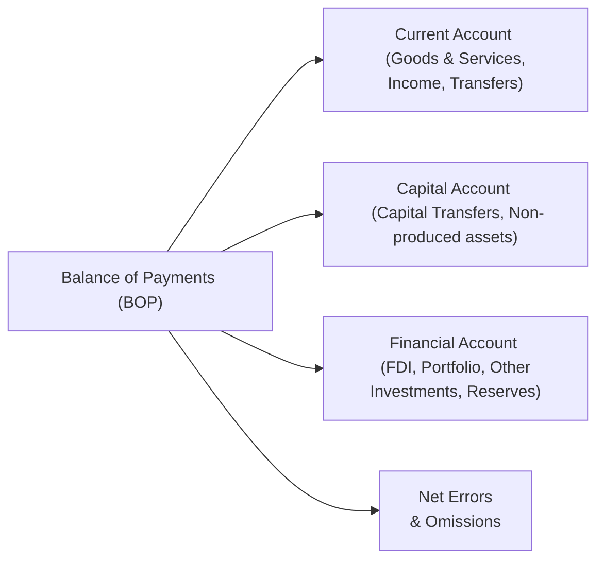

## Introduction

Balance of payments (BOP) data can feel a bit intimidating at first. If you've ever glanced at huge tables tracking exports, imports, investments, and reserves—well, it's easy to wonder, “How on earth do I make sense of all this?” Trust me, I’ve been there. I remember the first time I tried to study the BOP for a particular emerging market and got lost in the weeds of foreign direct investment (FDI) flows and weirdly large net errors and omissions. Eventually, though, I realized the BOP is basically a record of all economic transactions between one country’s residents and the rest of the world. Or in simpler terms: it’s like a giant financial statement capturing everything from day-to-day imports of coffee beans to massive cross-border mergers.

In this section, we explore the structure of the BOP and dissect the interplay between the current account, the capital account, and the financial account. We’ll look at how these components fit together to form an equation that always balances (at least in theory). Then we’ll tie this understanding back to practical cases for analysts and portfolio managers—because let’s face it, if you’re studying the CFA curriculum, you want to know how to apply these concepts in real-world decision-making, not just recite definitions.  

## Structure of the Balance of Payments

Before we dive into detail, let’s visualize the BOP in broad strokes. The BOP typically has three major subdivisions:

• The Current Account (CA)  
• The Capital Account (KA)  
• The Financial Account (FA)  

There’s also a category often referred to as “Net Errors and Omissions,” which zeros out any measurement mismatch. In many official statistical treatments, the capital account is quite small, so you’ll frequently see references to the “capital and financial account” being lumped together. But for conceptual clarity, it’s good to keep them distinct. Here’s a handy diagram showing how these pieces fit:

The defining principle is that the BOP must sum to zero when you include all items (current account + capital account + financial account + net errors and omissions = 0). If a country runs a current account surplus, it must necessarily run a deficit in the combined capital and financial account (or the other way around).  

## The Current Account

### Overview of Current Account Components

The Current Account is where you’ll find flows of goods, services, and certain types of cross-border income. You can think of it as a snapshot of real economic activities and relatively short-term financial flows.  

The key subdivisions are usually presented as:  
• Merchandise trade (exports minus imports of goods)  
• Services balance (exports minus imports of services)  
• Primary income (factor income such as dividends, interest, wages from abroad)  
• Secondary income (remittances, foreign aid, and other unilateral transfers)  

Let’s break them down:

• Merchandise Trade Balance. This is the difference between what a nation exports in tangible goods (like cars, machinery, agricultural produce) versus what it imports. Countries that rely heavily on manufacturing exports—Germany, China, Japan—often show large surpluses here. In contrast, countries importing more manufactured goods might register deficits.  

• Services Balance. If you saw my credit card statement after an overseas trip, you’d see transactions for lodging, tourism, international consulting, or even streaming-service subscriptions. All cross-border services get aggregated here.  

• Primary Income. This is sometimes called Factor Income. If a US-based investor receives dividends from stock in a European firm, that’s an inflow of primary income to the US. If you’re analyzing a country with big holdings of foreign assets or large foreign debt obligations, the primary income line could be quite significant.  

• Secondary Income (Current Transfers). Think of this as one-way flows: workers’ remittances sent back to families in home countries, foreign aid, and donations. They don’t directly exchange for goods or services.  

### Current Account Balance and Economic Interpretation

So why do we care if a country runs a current account surplus or deficit? Because it signals whether that country is a net lender or borrower in the global arena.  

• A surplus suggests the country is effectively sending out more goods/services than it receives (or receiving more net investment income than it pays). It accumulates foreign assets, lending capital abroad in various forms.  
• A deficit, by contrast, requires financing. It may reflect high consumer demand for imported goods or investment that can’t be fully funded domestically.  

Persistent deficits sometimes ring alarm bells about external vulnerability, especially if financed by short-term portfolio flows that can reverse quickly. On the flip side, persistent surpluses can create tension with trading partners who suspect currency manipulation or trade imbalances.  

From a portfolio management perspective, analyzing the current account gives insight into a country’s potential currency trends, trade competitiveness, and external debt sustainability. If you’re looking at fixed-income opportunities in a country running a large deficit and piling up foreign debt, you might price in additional default or exchange-rate risks.  

## The Capital Account

### What Goes Here?

Many people talk about “capital flows” as if that alone covers all forms of cross-border financing. But strictly speaking, the Capital Account in BOP terminology is quite narrow. It captures capital transfers (like debt forgiveness, transfer of intangible assets) and transactions involving non-produced, non-financial assets (like land or natural resource rights).  

This account is typically much smaller in magnitude than the Current Account or the Financial Account, which is why you might hear the phrase “The Current and Capital Account” used interchangeably with “Current and Financial Account.” The capital account can, however, become relevant for countries that receive major debt relief or significant intangible asset transfers.  

### Capital Account and Global Policy

Major capital transfers also can reflect policy shifts—like large-scale grants or reconstruction funds in post-conflict or disaster scenarios. Suppose a country receives huge intangible asset donations—like technology licenses or patent rights—then we’d see that show up here. As a future analyst, you might not spend as much time tracking the capital account line by line, but it’s good to know where to look if you see large anomalies in the BOP data.  

## The Financial Account

### Composition and Significance

The Financial Account (sometimes combined with the capital account) is where the big “money flows” appear. Financial Account entries represent how a current account imbalance is funded (in the case of a deficit) or how surplus funds are deployed.  

Key subcategories:  
• Foreign Direct Investment (FDI)  
• Portfolio Investments (equities, bonds)  
• Other Investments (bank loans, currency deposits, trade credits)  
• Reserve Assets (central bank holdings)  

Let’s say a country, call it Country A, imports more goods and services than it exports. That deficit must be financed somehow, so you’d look for a net inflow of funds in the financial account. Investors abroad might purchase A’s securities (portfolio investment) or purchase real assets, like factories or real estate (FDI). Conversely, if the country runs a surplus, it might accumulate foreign assets—like US Treasury bills or ownership stakes in foreign companies.  

### Foreign Direct Investment (FDI)

Ever read about a major automaker building a new manufacturing plant overseas? That’s classic FDI. For analytical purposes, FDI is typically considered more stable than short-term “hot money” flows, because direct investors commit capital for the long haul—constructing physical facilities and establishing local operations.  

### Portfolio Investment

This consists of cross-border flows into equities or debt that do not confer direct management or control. Investors can buy or sell much more quickly (think of foreign investors purchasing shares in local stock markets). Portfolio flows are sometimes more volatile and can reflect risk-on/risk-off sentiment in global markets. Unsurprisingly, large portfolio outflows can stress a country’s currency if global sentiment turns negative.  

### Other Investments and Reserve Assets

“Other investments” is a catch-all category—to record cross-border loans, currency deposits, or trade credits. Reserve assets represent central bank activity, including changes in official foreign exchange reserves (USD, gold, Special Drawing Rights from the IMF, etc.). These reserves matter a lot for a country’s ability to manage exchange-rate stability.  

## Balancing It All Out

### The BOP Equation

By definition, the overall BOP sums to zero:

Current Account + Capital Account + Financial Account + Net Errors & Omissions = 0

If a country records a positive current account balance, it must—net of the capital account—show a negative financial account balance or positive net errors and omissions (some measurement mismatch) for the entire BOP to balance. Economists are fond of saying, “The BOP always balances,” which is true in theory but sometimes clouds the conversation. The real question is how it balances, and which assets or liabilities move around to make it so.  

### Common Discrepancies

Net errors and omissions might scare you—like, how do we not know who’s paying for all these deficits or surpluses? Typically, measurement or timing errors creep in, especially for smaller economies that may not track official data meticulously. It’s also possible that some flows aren’t captured in formal channels (e.g., unreported capital flight).  

## Influences on the Current Account and Capital Flows

### Economic Policies and Exchange Rates

• Expansionary fiscal policy (e.g., government spending) can increase domestic demand, potentially leading to a larger current account deficit if imports spike.  
• Tight monetary policy can boost interest rates and make a country more attractive to foreign investors—leading to capital inflows under the financial account.  
• Exchange rate policies also matter. An overvalued currency makes a country’s exports more expensive and imports cheaper, which can widen a trade deficit. Opposite for an undervalued currency.  

### Interest Rate Differentials and Yield-Seeking Flows

Global capital tries to find the best risk-reward ratio. If a country’s interest rates are relatively high (and the perceived default risk is manageable), foreign investors may buy local bonds, creating capital inflows. Over time, such inflows could strengthen the local currency or feed asset price booms.  

### Tying It to Investment Portfolios

For Level I (and beyond), you’ll find that big changes in capital flows can alter asset prices, currency values, and overall financial stability. For instance, emerging markets might attract heavy inflows during low global interest rate environments. But if rates turn upward in major economies, that capital can leave quickly (the so-called “sudden stop”). An analyst must monitor these flows to foresee potential liquidity squeezes or solvency crises.  

## Practical Example: Hypothetical Country X

Suppose Country X runs a current account deficit of $50 billion. That means it spends $50 billion more on foreign goods, services, and income net outflows than it earns from exports, etc. Where’s that extra $50 billion coming from?  

• Maybe $30 billion is financed by issuing new sovereign bonds that foreigners buy. (Portfolio investment inflow.)  
• Another $15 billion might come from foreign direct investors establishing local factories or infrastructure. (FDI inflow.)  
• The remaining $5 billion might show up under other investments—like foreign banks offering short-term loans or lines of credit.  

So, the net effect is that Country X’s financial account registers a positive (surplus) of $50 billion, offsetting the $50 billion deficit in the current account. BOP is balanced.  

## Common Pitfalls, Challenges, and Best Practices

• Ignoring Future Obligations. A big current account deficit might be manageable today, but watch out for mounting external debt.  
• Overlooking Composition of Flows. Not all capital inflows are created equal. FDI tends to be more stable than short-term bond buying.  
• Misreading Short-Term Fluctuations. Monthly or quarterly data can jump around. Focus on trends and fundamental drivers.  
• Underestimating the Exchange Rate Impact. Shifts in currency policy can quickly change patterns in trade and capital flows.  

As a best practice, it’s helpful to look at multi-year data to identify structural trends—like if a country is consistently reliant on external financing or if large FDI projects are inflating net inflows.  

## Exam Relevance and Constructed-Response Tips

In the CFA exam context, the balance of payments might appear in item sets or constructed-response questions linking macroeconomic indicators to investment strategies:

• Be prepared to calculate how a current account deficit is financed by capital or financial account items.  
• Possibly, you might get a scenario about changes in fiscal or monetary policy that alter the current account or capital account patterns. Show how these changes flow through to currency valuations and interest rates.  
• In an essay-style question, you might have to argue the pros and cons of persistent deficits and interpret the country’s external debt metrics.  

Time Management Tip:  
When you see a question about the BOP, identify which “side” of the ledger is changing. Are they describing a rise in the current account surplus? Then predict how the financial account flips to a deficit, specifying the asset categories involved. Sketch a mini “t-account” if needed to ensure you keep track of surpluses vs. deficits.  

## Conclusion

Understanding the mechanics of the current account, capital account, and financial account will help you interpret macroeconomic data and anticipate shifts in global capital flows. Once you become comfortable reading balance-of-payments statements, you’ll start to see them as less of a random record-keeping exercise and more of a lens into a nation’s economic health, competitiveness, and investment climate.  

From an investment standpoint, BOP analysis helps forecast exchange rates, evaluate macroeconomic risk, and position portfolios accordingly. A big current account deficit might mean reliance on external financing, which can pose a vulnerability if global capital conditions tighten. Meanwhile, large surpluses might indicate undervalued currencies or robust export sectors that could be growth drivers.  

If you keep these concepts in mind, along with the interplay of trade balances, FDI, and portfolio flows, you’ll have a strong foundation for understanding cross-border finance—a crucial skill for global investment analysis.  

## Additional References

• International Monetary Fund (IMF): https://www.imf.org/external/data.htm  
• “International Economics” by Krugman and Obstfeld (for deeper theoretical background)  
• Bureau of Economic Analysis (US): https://www.bea.gov/  

## Test Your Knowledge of the Balance of Payments



### A country runs a current account surplus of $10 billion. Which of the following is most likely true regarding its capital and financial account balance, assuming zero net errors and omissions?

- [ ] It will also have a surplus of $10 billion.  
- [ ] It will be exactly zero.  
- [x] It will post a deficit of $10 billion.  
- [ ] The relationship cannot be determined from the information given.  

> **Explanation:** By definition, when the current account is in surplus, the combined capital and financial account (together) must be in deficit to balance the overall BOP.

### Which of the following appears in the primary income section of a country’s current account?

- [x] Dividends earned by domestic residents on foreign stocks.  
- [ ] Donations from charitable organizations abroad.  
- [ ] Income from domestic tourism receipts.  
- [ ] Imports of consumer electronics.  

> **Explanation:** Primary income includes factor incomes like dividends, interest, and wages received from abroad. Tourism receipts go under services, and imports of electronics belong under the goods balance. Donations fall under secondary income.

### What does the capital account primarily record?

- [ ] Net exports of goods and services.  
- [x] Capital transfers and transactions in non-produced, non-financial assets.  
- [ ] Foreign direct investment in domestic businesses.  
- [ ] Short-term portfolio investments.  

> **Explanation:** The capital account is narrow, capturing specific capital transfers (e.g., debt forgiveness) and intangible assets. FDI and portfolio investments go to the financial account.

### A persistent current account deficit might indicate:

- [ ] A guaranteed rise in exchange rates.  
- [x] Higher domestic consumption or investment financed by foreign capital.  
- [ ] A short-term budget surplus.  
- [ ] Inevitably robust export performance.  

> **Explanation:** Persistent deficits often suggest domestic spending exceeds domestic savings, requiring funds from abroad to balance the gap.

### If a country’s central bank increases its official foreign exchange reserves, how does this transaction typically appear in the BOP?

- [ ] As a decrease in the current account.  
- [ ] As a capital account credit.  
- [x] As a financial account debit.  
- [ ] It is not reported in the BOP.  

> **Explanation:** Increasing reserves is recorded as an outflow of funds (a debit) in the financial account, similar to the central bank “purchasing” foreign assets.

### In analyzing the financial account, which form of capital flow tends to be more stable?

- [x] Foreign direct investment.  
- [ ] Portfolio investment in government bonds.  
- [ ] Short-term bank loans.  
- [ ] Currency speculation.  

> **Explanation:** FDI is relatively stable because it involves long-term commitments to physical assets. Portfolio flows, bank loans, and speculative transactions can reverse quickly.

### Which of the following may appear under “secondary income” (current transfers) in the BOP?

- [x] Workers’ remittances sent home from abroad.  
- [ ] Dividends earned by foreign investors.  
- [x] Foreign aid provided by another government.  
- [ ] Income from business consulting services.  

> **Explanation:** Secondary income tracks unilateral transfers like workers’ remittances and foreign aid. Dividends are in primary income, and consulting services fall under trade in services.

### A strong domestic currency that is perceived as overvalued can lead to:

- [x] A worsening trade balance as imports become cheaper and exports relatively expensive.  
- [ ] An automatic increase in the current account surplus.  
- [ ] Reduced demand for imports.  
- [ ] Guaranteed reduction in foreign direct investment.  

> **Explanation:** If the domestic currency is strong (especially overvalued), exports can become less competitive, potentially worsening the trade balance over time.

### A surplus in the current account could be offset by which of the following in the financial account?

- [x] Net outflows of portfolio investment.  
- [ ] An immediate devaluation of the currency.  
- [ ] Reductions in domestic consumption.  
- [ ] Rising net errors and omissions.  

> **Explanation:** A current account surplus is balanced by an outflow of capital in the financial account (the country invests or accumulates more assets abroad).

### A factor that often increases short-term portfolio capital inflows into a country:

- [x] Higher domestic interest rates compared to global averages.  
- [ ] An appreciating currency that lowers returns on bond holdings.  
- [ ] Low domestic stocks and bond yields.  
- [ ] Strict capital controls preventing foreign investment.  

> **Explanation:** Yield-seeking behavior means investors chase higher returns, thus higher domestic rates can attract short-term capital inflows.


