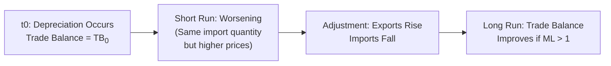

## Introduction and Overview 

Sometimes, when a country’s currency weakens, you’d think its trade balance (exports minus imports) would instantly improve. Well, spoiler alert: it’s not always that simple. In the short run, the trade balance might actually get worse before it gets better—something we call the J-Curve effect. And whether the trade balance eventually improves depends on a handy rule known as the Marshall-Lerner condition. 

In this section, we’ll discuss:
• The Marshall-Lerner condition and its meaning.  
• Price elasticities of exports and imports.  
• Why trade balances can initially worsen after a depreciation (the J-Curve).  
• Practical implications for macroeconomic policy and capital market expectations.  

This discussion is directly related to broad currency exchange rate topics (see also Chapter 6: Currency Exchange Rates), as well as macroeconomic considerations for investment strategy (Chapter 1: Economic Analysis and Setting Capital Market Expectations). Let’s jump right in.

## The Marshall-Lerner Condition

One of the biggest questions that arises whenever a currency loses value is: “Will this depreciation help or hurt the trade balance?” The answer is found in the Marshall-Lerner condition, which basically states that a currency depreciation will improve a country’s trade balance if:


|\text{Elasticity}_{\text{exports}}| + |\text{Elasticity}_{\text{imports}}| > 1


where:
• \\( |\text{Elasticity}_{\text{exports}}| \\) is the absolute value of the price elasticity of demand for exports.  
• \\( |\text{Elasticity}_{\text{imports}}| \\) is the absolute value of the price elasticity of demand for imports.  

### Why Elasticities Matter  
Elasticities are all about how sensitive—how intensely—buyers and sellers react when prices change. A large elasticity means demand changes a lot with a small price shift. If your exports become cheaper due to currency depreciation, foreign buyers will buy significantly more if their demand is quite elastic. On the import side, if your currency depreciation makes foreign goods more expensive, domestic consumers will cut back more sharply if their demand is highly elastic.

If both sides are strong enough (i.e., the sum of their elasticities is greater than 1), the overall spending on imports goes down and the overall revenue from exports goes up. This is because the quantity changes more than offset any adverse price effect. As a result, the trade balance eventually improves, meeting the Marshall-Lerner condition.

## Price Elasticities of Exports and Imports

To make this even more concrete:

• Price Elasticity of Exports (\\(E_x\\)): Measures how much the quantity of exports demanded by foreign buyers changes when the relative price of those exports changes. A higher \\(E_x\\) indicates that if your currency depreciates (exports become cheaper in foreign markets), foreigners greatly increase their purchases.

• Price Elasticity of Imports (\\(E_m\\)): Measures how much the quantity of imports demanded by domestic buyers changes when the relative price of those imports changes. A higher \\(E_m\\) suggests that if your currency depreciates (imports become more expensive locally), domestic buyers significantly reduce their imports.

The trade balance (TB) is simply:

\text{TB} = \text{Total Value of Exports} - \text{Total Value of Imports}.


If a depreciation occurs and \\(E_x + E_m > 1\\), the country will generally see an eventual improvement in TB. If \\(E_x + E_m \leq 1\\), things get trickier: the country may continue to run a deficit or simply not see the improvement it hopes for.

## The J-Curve Phenomenon

So if we say, “Aha, a depreciation should help us out,” why do we often notice a worsening trade balance at first? Well, personally, I remember noticing a real-world example: not too long ago, a country decided to let its currency float more. Exports were supposed to surge. But for a few months, the trade deficit actually expanded. This is the essence of the J-Curve. 

In the short run, contracts are in place that lock in prices. Importers might still pay for shipments at the older (higher) contractual price. Meanwhile, exporters might not be able to expand capacity or adjust distribution quickly. The immediate reaction, therefore, can be a bigger trade deficit until volumes respond. After enough time—for some goods, this might be months; for complex capital goods, maybe even years—quantities adjust more fully, fueling export growth and reducing import demand.

Below is a simple Mermaid diagram to illustrate how the trade balance might evolve over time after a currency depreciation:

The initial drop is the stem of the “J,” and the eventual improvement is the upward curve, forming—yes, you guessed it—a J-shaped path.

## Time Horizon and Real Exchange Rate Effects

### Short Run vs. Long Run
In the short run, people’s habits hardly change. Factories can’t ramp up exports overnight, and domestic consumers might not immediately find substitutes for imported goods. Over time, however, supply adjustments (like investing in new production lines to meet export demand) and consumption patterns (consumers shifting away from expensive imports) can greatly alter the trade balance.

It’s also crucial to mention that the elasticity of import demand or export demand tends to be lower in the short run and higher in the long run. That is, at first, foreigners might not immediately change how much they buy, and domestic consumers might keep on buying foreign goods. But with time, these behaviors can catch up to the new price realities.

### Real Exchange Rates
When discussing depreciation and trade, economists typically refer to real exchange rates instead of just nominal rates. The nominal exchange rate is simply how many units of domestic currency you need to buy one unit of foreign currency. But the real exchange rate adjusts this by relative price levels. If your domestic prices (inflation) are rising faster than foreign prices, the nominal rate might not reflect the true competitiveness of your goods.

Hence, if your real exchange rate effectively depreciates (meaning your goods become cheaper internationally even after adjusting for inflation), export volumes might (eventually) go up, reinforcing the Marshall-Lerner effect. Conversely, an overvalued real exchange rate makes a country’s exports less competitive abroad.

## Capacity Constraints and Other Complications

Let’s say the math checks out: \\(E_x + E_m > 1\\). Are we guaranteed a big improvement? Not always. Here’s some nuance:

• Capacity Constraints: Even if foreign demand increases, domestic firms may be limited by production capacity—factories might be already working near full tilt. Without capital investments or productivity gains, exports can’t expand enough to truly capitalize on the currency depreciation.  
• Supply Chain Disruptions: Imports might be necessary inputs in an export-oriented supply chain. If those imports get more expensive, your final product might not become sufficiently cheap overall.  
• Competitive Reactions: Competing countries might also devalue their currencies or impose trade barriers to counter your newfound “price competitiveness.” Policy shifts can undermine the beneficial effects you’d expect from the Marshall-Lerner condition.  

## Integrating These Concepts into Capital Market Expectations

For CFA exam and real-world portfolio decisions, it’s vital to connect the dots:

• **Macroeconomic Forecasting**: When anticipating currency movements, remember the J-Curve effect can lead to initial disruptions. A manager hedging currency exposure might consider short-run volatility in a country’s trade dynamics before reaping potential improvements.  
• **Equity and Fixed Income Implications**: An eventual improvement in the trade balance can contribute to GDP growth, impact inflation (through import prices), and influence yield curves. Corporate earnings in export-heavy sectors can surge. At the same time, higher import costs might squeeze certain domestic industries.  
• **Monetary and Fiscal Policy**: Central banks sometimes adjust interest rates in response to currency-led inflation or to manage short-run capital flows. Coordinated fiscal measures might also track these trade-balance swings, providing or withdrawing stimulus.  

## Potential Pitfalls and Exam Tips

• **Misapplication in the Short Run**: The biggest trap is forgetting that the J-Curve means the effect on trade balance is not instantaneous. If an exam item set states that the country’s currency just depreciated and wonders about immediate improvement, keep in mind it might not materialize right away.  
• **Ignoring Real vs. Nominal Exchange Rates**: Focusing on nominal rates alone can be misleading, especially if inflation rates differ widely across countries.  
• **Generic vs. Specific Elasticities**: Not all goods have the same elasticity. Commodities tend to be more price-inelastic than consumer goods or discretionary items. If the country’s exports are heavily skewed to commodities or if imports are essential goods with few substitutes, the sum of elasticities might not exceed 1.  
• **Exam Strategy**: On constructed-response (essay) questions, articulate the difference between the theoretical condition (Marshall-Lerner) and the observed short-run effect (J-Curve). Show the formula. Discuss capacity constraints. Use the time dimension in your argument.  

## Conclusion

The interplay between currency depreciation, trade balances, and economic growth is multifaceted. The Marshall-Lerner condition provides a neat, straightforward benchmark: if the export and import elasticities add up to more than 1, a weaker currency can eventually help net exports. But the J-Curve phenomenon reminds us of the real-world time lags—capacity cannot expand overnight, and consumption patterns don’t shift on a dime. Portfolio managers, macroeconomic analysts, and policymakers must account for both the short-run and long-run effects to set accurate capital market expectations.

## Reference List

• CFA Institute, “Currency Exchange Rates and International Trade,” in the official 2025 CFA Program Curriculum.  
• Mankiw, N. G., Macroeconomics (latest edition), “Open-Economy Macroeconomics.”  
• IMF and World Bank research studies on trade elasticities and exchange rate dynamics.  

## Mastering the Marshall-Lerner Condition: 10-Question Quiz



### Which statement best describes the Marshall-Lerner condition?

- [ ] A statement requiring that central banks adjust interest rates if inflation rises above 2%.  
- [ ] A statement that exports must match imports for balanced trade.  
- [x] A condition that a currency depreciation improves the trade balance only if the sum of export and import demand elasticities exceeds 1.  
- [ ] A requirement that foreign direct investment outflows exceed foreign direct investment inflows.  

> **Explanation:** The Marshall-Lerner condition specifically holds that depreciation of a currency improves trade balance when the absolute sum of elasticities of exports and imports exceeds 1.

### Which of the following helps explain the J-Curve effect?

- [x] Short-run import contracts are often fixed, causing the trade balance to worsen immediately after depreciation.  
- [ ] A depreciation instantly shifts both export and import quantities.  
- [ ] A depreciation improves the trade balance solely in the short run.  
- [ ] A depreciation has no effect on trade balance in the long run.  

> **Explanation:** In the short run, contract obligations and slow responsiveness of quantities can worsen the trade balance before long-run improvement occurs.

### According to the Marshall-Lerner condition, a currency depreciation will likely result in a trade balance improvement if:

- [x] The absolute sum of export and import price elasticities is greater than 1.  
- [ ] The private savings rate is high.  
- [ ] Government tax revenues exceed government spending.  
- [ ] Domestic consumption patterns remain unchanged.  

> **Explanation:** The key is that export and import demand must be sufficiently elastic for total receipts and payments to shift favorably after a depreciation.

### In the context of short-run vs. long-run elasticity:

- [ ] Both export and import elasticities are typically highest in the short run.  
- [ ] The Marshall-Lerner condition only considers short-run elasticity.  
- [x] Price elasticities are usually lower in the short run and higher in the long run, which contributes to the J-Curve phenomenon.  
- [ ] Price elasticities remain constant over time.  

> **Explanation:** Many consumers and producers need time to adjust to new prices, leading to elasticities that increase over time.

### If a country’s real exchange rate depreciates but its export industries are at full capacity:

- [x] Exports may not rise significantly due to production constraints.  
- [ ] The trade balance must immediately improve given the currency depreciation.  
- [x] There could be limited ability to meet increased external demand.  
- [ ] Monetary policy tools become irrelevant.  

> **Explanation:** Even with a weaker currency, if producers cannot ramp up production, export volumes may not increase enough for a noticeable effect.

### Which of the following statements about the J-Curve is correct?

- [x] It describes an initial deterioration of the trade balance before improvement.  
- [ ] It implies that the trade balance never improves.  
- [ ] It signifies no relationship between currency depreciation and trade balance.  
- [ ] It only occurs if a country has a fixed exchange rate regime.  

> **Explanation:** The J-Curve visually illustrates how the trade balance may dip right after depreciation, then eventually recover as quantities adjust.

### A country heavily reliant on imported oil might see limited benefit from currency depreciation because:

- [x] Inelastic import demand for a key commodity means import volume won’t drop much when prices rise.  
- [ ] It no longer imports oil.  
- [x] Price elasticity of the main import is low, reducing any improvement in the trade balance.  
- [ ] It immediately eliminates oil usage upon depreciation.  

> **Explanation:** If import demand for crucial commodities is inelastic, a currency depreciation may not curb import spending significantly.

### Which of the following best explains the difference between nominal and real exchange rates?

- [x] The real exchange rate adjusts the nominal rate by price levels (inflation) of the two countries.  
- [ ] There is no difference; the two terms are interchangeable.  
- [ ] The nominal rate always ensures competitiveness.  
- [ ] The real exchange rate only applies when a country’s currency is pegged.  

> **Explanation:** The real rate accounts for relative inflation, reflecting the true purchasing power of a currency abroad.

### If the sum of export and import price elasticities is less than 1, which outcome is likely?

- [x] The trade balance might not improve after a depreciation.  
- [ ] A guaranteed rapid improvement in the trade balance.  
- [ ] An automatic increase in net exports.  
- [ ] Central bank intervention becomes unnecessary.  

> **Explanation:** When \\(E_x + E_m \le 1\\), currency depreciation may fail to boost net exports adequately because quantity changes are insufficient.

### True or False? The J-Curve concept implies that all currencies will eventually rebound to their original exchange rate after a depreciation.

- [ ] True  
- [x] False  

> **Explanation:** The J-Curve concept focuses on the trade balance’s trajectory, not on whether exchange rates return to original levels.


