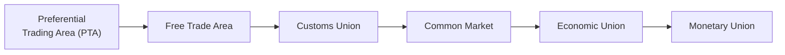

## Introduction

Economic integration refers to the cooperative arrangements between countries aimed at reducing or eliminating trade barriers and coordinating economic policies. If you’ve ever traveled between countries and noticed differences in import tariffs or currencies, you’ve already had a glimpse of this notion: the more integrated countries are, the lower the barriers and the greater the policy coordination. While economic integration might sound like a technical concept, understanding it can really help demystify some of the largest shifts in global trade, monetary policy, and political sovereignty.

Sometimes I remember hopping from country to country in Europe for the first time, thinking: “Wow, there’s no passport check here? Wait, they use the same currency here as well?” That’s an everyday example of deeper economic integration in action. On the other hand, you might have encountered places where crossing a border meant paying tariffs or coping with drastically different regulations. These differences stem from a spectrum of economic integration levels that nations adopt based on their mutual interests.

In the CFA curriculum, especially as you’re building your foundation in international trade, it’s critical to grasp each level of integration. From a single investor’s perspective, each progressive stage alters the capital market environment and can influence your asset allocation, currency exposure, and risk management strategies. Let’s see how!

## Progression of Economic Integration Levels

Below is a broad overview of these integration levels, from the simplest (a preferential trading area) to the most comprehensive (a monetary union). Many intermediate forms exist, but we generally distinguish six main categories:

- Preferential Trading Area (PTA)  
- Free Trade Area (FTA)  
- Customs Union  
- Common Market  
- Economic Union  
- Monetary Union  

It might look like a hierarchy, and, well, it actually is. Each level builds on the prior one, requiring deeper policy coordination and typically greater concessions of sovereignty.  

Let’s break them down one by one.

## Preferential Trading Area (PTA)

A Preferential Trading Area (PTA) is the most basic form of economic integration. In a PTA, member countries give each other partial trade preferences—like lower tariffs on certain goods—compared to non-member states. No universal free trade applies among members, but specific products or industries might enjoy reduced tariffs or other concessions.

• Example: A small group of countries in a region might agree to slash tariffs on agricultural products but keep higher tariffs on manufactured goods.  

• Policy Impact: Each country retains most of its existing tariff structure for outsiders. They just tweak it a little for each other’s benefit.

• Investment Angle: PTAs are usually the first step on the path of integration. They signal a willingness to explore mutual economic cooperation, but capital flows remain mostly unaffected since major trade barriers (apart from a few exceptions) are still in place.

## Free Trade Area (FTA)

In a Free Trade Area, member countries agree to eliminate (or significantly reduce) tariffs, quotas, and other barriers on substantially all trade among themselves. However, each member retains its own external tariff policy against non-member nations. This means Country A can charge a 10% tariff on imported cars from a non-member country, while Country B can charge 5% on those same cars.

• Example: The North American Free Trade Agreement (NAFTA, now replaced by the USMCA) is a well-known FTA involving the United States, Canada, and Mexico.

• Policy Impact: No internal trade barriers among member countries, but external policies remain distinct. This can introduce complexities such as “rules of origin”—to prevent goods from passing through the member country with the lowest external tariff.

• Investment Angle: FTAs can increase intra-bloc trade volumes. Companies within the free trade area often see better access to each other’s markets. However, investors and multinational corporations must still navigate multiple sets of external import/export laws when dealing with third parties outside the FTA.

## Customs Union

A Customs Union is an extension of an FTA. In addition to removing trade barriers among themselves, member countries also adopt a common external tariff (CET) on non-member countries. So if you’re inside the union, you can freely move goods among member states without further tariffs, and you pay the same tariff imports when trading with anyone outside the union.

• Example: The Southern Common Market (MERCOSUR) in South America—comprising Argentina, Brazil, Paraguay, and Uruguay—is a customs union.

• Policy Impact: The hallmark here is that countries must align external tariffs. That alignment leads to a single voice in negotiating trade deals with non-member countries. Currency arrangements, capital controls, and labor restrictions, however, may remain largely independent.

• Investment Angle: Customs unions often boost foreign direct investment (FDI) because a firm setting up production in one member country can export to the entire union with no additional tariffs. Additionally, trade negotiations with other countries become more centralized, thereby creating a more predictable environment for external investors.

## Common Market

A Common Market is like a Customs Union, but with one critical step forward: it includes the free movement of “factors of production,” such as labor and capital. Not only do countries remove internal trade barriers and share a common external tariff, but they also allow each other’s citizens and companies to cross borders more freely. This means less red tape for labor to work in other member states and for capital to be invested anywhere across the market.

• Example: The European Union (EU) started as a customs union and progressed toward a common market. Although “EU Single Market” is the broader term, it includes—at least in theory—free movement of goods, services, capital, and labor (the famed “four freedoms”).

• Policy Impact: Regulations begin to harmonize to allow easy cross-border work, travel, and investment. Governments at this stage may need to coordinate aspects of labor laws, capital requirements, and possibly some elements of social policies to make sure a worker from Country A is treated similarly in Country B.

• Investment Angle: The common market can transform the labor force and capital availability. Mobility leads to more efficient allocation of resources, potentially lowering production costs and stimulating growth. However, it can also create labor migration challenges or spark political tensions if wage differentials are large.

## Economic Union

An Economic Union goes beyond a common market by further harmonizing or unifying economic policies, such as fiscal policy (government spending, taxation) and other regulatory frameworks. In an ideal economic union, countries coordinate at a deep level to ensure consistent economic rules across the bloc, often including aspects of industrial policy, social policy, and macroeconomic management.

• Example: The European Union in many respects is an economic union, although not fully. EU member states follow a range of common regulations, including competition policy, agricultural policy, and others. They also have certain supranational institutions that enforce these rules. However, full fiscal integration across the EU remains incomplete.

• Policy Impact: Members cede significant sovereignty, adopting shared standards for taxation, government spending, and social security. In practice, the depth of integration can vary: some unions unify corporate tax codes, others unify only agricultural policies—there’s a spectrum.

• Investment Angle: From an investor’s perspective, an economic union can standardize and harmonize a wide range of business regulations, simplifying cross-border operations. But it can also introduce complexities when national governments must align budgets or debt issuance policies, sometimes leading to brisk political debates around how resources and responsibilities are shared.

## Monetary Union

In a Monetary Union, members agree to share a single currency and a unified monetary policy. That typically means they establish a common central bank—like the European Central Bank (ECB)—responsible for issuing currency and setting interest rates for the entire area.

• Example: The Eurozone, a subset of the European Union, is a prime example. Countries like France, Germany, Italy, and Spain have forgone their individual currencies in favor of the euro.

• Policy Impact: A shared currency removes the exchange rate risk among members (no more French francs or German marks), which can significantly reduce transaction costs across borders. However, individual countries lose independent monetary policy, meaning they can’t freely adjust their interest rates or conduct currency devaluations to respond to local economic conditions.

• Investment Angle: For investors, a shared currency is a powerful advantage for cross-border investment. You’re not worried about currency fluctuations within the bloc. However, it also means a single monetary policy might fit some member countries better than others. If an economic shock hits one member state hard, that country cannot simply devalue its currency. The complexities of a monetary union can create risk differentials within the bloc.

## Political Cooperation and Sovereignty Trade-Offs

As you can see, higher levels of integration often demand more political coordination and, in many ways, a trade-off in national sovereignty. A shared currency, for instance, implies that no single member controls monetary policy exclusively. Countries must trust a supranational authority (e.g., the ECB) to set interest rates and manage inflation. This can create friction—especially when member states have very different economic conditions or political preferences.

• Sovereignty Concerns: At deeper levels of integration, countries might need to harmonize not just trade policies but also labor, environmental, and tax regulations. Some nations worry that large supranational bodies could dilute their historical or cultural preferences.

• Political Union: In some contexts, countries might integrate so deeply that they move toward a political union, where broad governance structures and even foreign policies are unified under a central authority. Although not formally listed in our stepwise progression, it’s useful to note that a monetary union can be a stepping stone toward deeper political union. However, the complexity (and controversy) often makes that path a slow and uneven one.

## Real-World Examples and Case Studies

1. European Union and Eurozone:  
   The EU as an economic union demonstrates the complexities of alignment in taxation, labor standards, and financial regulations. The Eurozone subset forms a monetary union, which has huge benefits—like eliminating exchange rate uncertainty among members—but also fosters disputes about budget deficits and fiscal discipline.

2. United States–Mexico–Canada Agreement (USMCA), formerly NAFTA:  
   A free trade area in North America has boosted trade volume across these three countries, enabling integrated supply chains (especially for automotive and agricultural sectors). Still, each country retains its own external tariffs when dealing with non-members.

3. MERCOSUR:  
   A customs union in South America, MERCOSUR exemplifies how adopting a common external tariff can support regional trade integration but occasionally faces internal political friction or policy misalignments among member countries.

4. East African Community (EAC):  
   The EAC aims to create a common market among Kenya, Uganda, Tanzania, Rwanda, Burundi, and South Sudan. Free movement of labor and capital is a key priority. Ultimately, they have ambitious goals of implementing a monetary union.

All these examples show that integration is rarely linear or smooth; it’s often accompanied by negotiation, compromise, and sometimes political pushback.

## Best Practices for Analysis

• Study the specific rules of origin in a free trade area so you know which goods qualify for zero tariffs.  
• Pay attention to common external tariffs in a customs union—variation in sector-level tariffs can impact supply chains differently.  
• For a common market, focus on labor mobility and capital flow rules. Are there any hidden constraints or administrative barriers?  
• In an economic union, be prepared to analyze how fiscal policy coordination might affect government bond markets.  
• For a monetary union, watch out for divergences in business cycles across member states. Markets often price in risk premiums if they sense that not all members are on the same page economically.

## Potential Pitfalls and Challenges

1. Overlooking Political Dimensions:  
   Economic integration is inseparable from politics. Countries can change alliances or trade policies after elections or major geopolitical events, sometimes causing abrupt regulatory shifts.

2. Ignoring Social and Cultural Factors:  
   Free movement of labor sounds great on paper, but if cultural or linguistic barriers are high, labor might not move as fluidly as predicted.

3. Confusing Monetary and Fiscal Policy Tools:  
   In a monetary union, you might lose control over monetary tools but not necessarily over taxes and government spending. Understanding these nuances is crucial when analyzing macroeconomic stability and exchange rate risk.

4. Underestimating Transition Costs:  
   Moving from an FTA to a customs union involves establishing a unified external tariff system, which can require a huge administrative overhaul. Similarly, going from a common market to an economic union requires deeper political and institutional changes.

## Exam Relevance and Application

From a CFA Level I perspective, you need to interpret how different levels of integration affect trade flows, currency risks, and investment opportunities. Examine how deeper integration can reduce transaction costs, expand capital markets, and create new avenues for portfolio diversification—but also consider the constraints and risks it imposes on member states.

• Constructed Response: You might be asked to discuss how adopting a single currency impacts interest rates or inflation in a hypothetical region.  
• Item Sets: Often, they focus on trade policy changes, factor mobility, or examples of real-world trade blocs. You’ll need to identify which type of integration is at play and what the resulting implications might be.

On the exam, time management is everything. Quick recognition of the integration level in a question can help you answer succinctly and accurately, especially in scenario-based prompts.

## References and Further Reading

- European Union’s Official Portal:  
  https://europa.eu  
  (A comprehensive resource on the EU’s institutional framework, single market rules, and the euro.)

- World Trade Organization (WTO):  
  https://www.wto.org  
  (Covers trade agreements and frameworks for regional trade blocs.)

- Balassa, B. (1961). “The Theory of Economic Integration.”  
  (A classic reference outlining the theoretical underpinnings and progression of economic integration.)

- CFA Institute Code and Standards:  
  https://www.cfainstitute.org  
  (For deeper insights into ethical considerations in global investment practices, relevant to cross-border transactions and integrated markets.)

------------------

## Test Your Knowledge of Economic Integration



### Which of the following levels of economic integration is characterized by members maintaining their own external trade policies but removing trade barriers among themselves?

- [ ] Preferential Trading Area
- [x] Free Trade Area
- [ ] Customs Union
- [ ] Monetary Union

> **Explanation:** In a free trade area, member countries do away with tariffs and barriers among themselves but each retains its independent trade policies (e.g., different tariffs) toward non-members.

### When countries establish a customs union, they typically:

- [ ] Eliminate the free movement of labor and capital among member states.
- [x] Adopt a common external tariff against non-member countries.
- [ ] Share a single currency and monetary policy.
- [ ] Move toward complete fiscal unification.

> **Explanation:** Moving from an FTA to a customs union means that member countries agree to a unified tariff structure against the outside world, known as a common external tariff.

### One key difference between a common market and a customs union is that a common market:

- [x] Allows the free movement of labor and capital among member countries.
- [ ] Mandates that all members adopt the same currency.
- [ ] Retains different external tariffs among member countries.
- [ ] Primarily focuses on lowering tariffs on selective products only.

> **Explanation:** A common market includes the features of a customs union (free internal trade + common external tariff) plus factor mobility (i.e., free movement of labor and capital).

### The Eurozone is an example of:

- [ ] A preferential trading arrangement.
- [ ] A customs union without a common market.
- [ ] A free trade area with occasional tariffs.
- [x] A monetary union.

> **Explanation:** The Eurozone adopts a single currency and a central monetary policy authority (European Central Bank). This is the hallmark of a monetary union.

### Which statement best describes an economic union?

- [x] It combines free trade among members, a common external tariff, and further integration of economic policy.
- [ ] It solely focuses on removing quotas and tariffs on a few selected goods.
- [ ] It requires a single currency shared by all members.
- [ ] It primarily addresses customs procedures but not factor mobility.

> **Explanation:** An economic union builds upon the customs union and common market levels by coordinating or unifying economic policies such as taxation and government spending policies among member states.

### In a free trade area, a common challenge encountered is:

- [x] Rules of origin, preventing goods from entering via the member with the lowest external tariff.
- [ ] Needing a single currency to reduce exchange rate costs.
- [ ] Setting up a supranational government body with legislative powers.
- [ ] Eliminating labor regulations.

> **Explanation:** Because each member can maintain distinct external tariffs, products from non-members might enter through the country with the lowest external tariff. “Rules of origin” are introduced to address this concern.

### A key reason why many countries hesitate to move from economic union to monetary union is:

- [ ] They prefer to adopt exactly the same tariff structures for external trade.
- [x] They do not want to surrender independent monetary policy.
- [ ] They disagree on implementing any free trade within the region.
- [ ] They need to raise labor mobility barriers to match each other’s standards.

> **Explanation:** Monetary union implies a single currency and central monetary authority. Many countries fear losing control over interest rates and exchange rate policies, causing reluctance to proceed.

### In the context of the European Union, the concept of “four freedoms” primarily refers to the free movement of:

- [x] Goods, services, capital, and labor.
- [ ] Interest rates, taxation, government bonds, and political sovereignty.
- [ ] Currency, corporate governance, standardized wages, and local customs.
- [ ] Land, commercial property, intangible assets, and shipping services.

> **Explanation:** The EU’s Single Market is underpinned by the “four freedoms”: the free movement of goods, services, capital, and people among member states.

### From an investor’s perspective, which of the following typically increases the appeal of setting up operations in a customs union over a free trade area?

- [x] One common external tariff that simplifies trade relations with non-member countries.
- [ ] Multiple external tariffs create an opportunity for arbitrage in each member state.
- [ ] Availability of sector-specific subsidies uniform across all non-members.
- [ ] Complete mobility of labor and capital within member states.

> **Explanation:** A customs union standardizes external tariffs, making it easier for multinational firms to know the import duties for the entire bloc, rather than dealing with diverse tariffs in each member country.

### A monetary union implies that:

- [x] Member countries share a common currency and central monetary policy.
- [ ] Tariffs on trade between member countries are lowered for certain product categories.
- [ ] Each member country sets its own exchange rates relative to the group’s currency.
- [ ] Cross-border capital flows are strictly prohibited.

> **Explanation:** A monetary union involves adopting a single currency and a unified monetary authority. This removes exchange rate differentials within the union but restricts each country’s autonomy in monetary policy.


