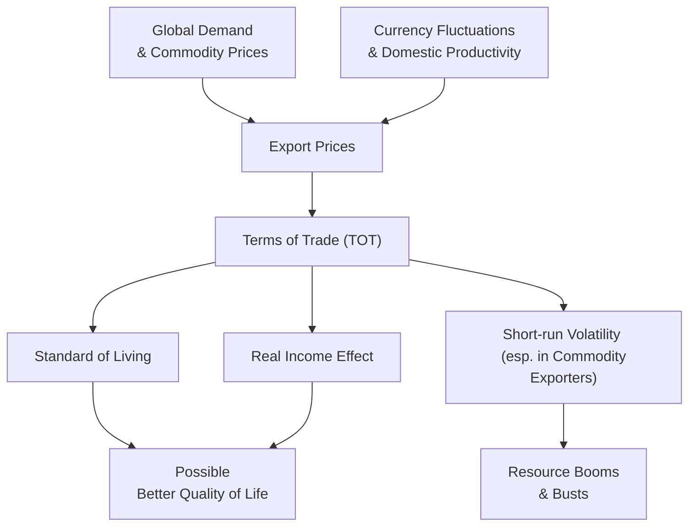

## TOT: An Introduction
Well, let me just say right off the bat: Terms of Trade (TOT) might sound like another dry economic ratio, but, trust me, it’s surprisingly central to how a country thrives in the global marketplace. TOT is basically the ratio of a country's export prices to its import prices. If that ratio is rising, we say the TOT is improving, because the country can now import more goods per unit of exports sold. And who doesn’t like getting more for less? On the flip side, if that ratio declines (also known as a deterioration), a country’s exports don't stretch as far in buying imports.

Formally, economists often compute TOT as:


\text{Terms of Trade} = \frac{\text{Export Price Index}}{\text{Import Price Index}} \times 100


That’s it—a neat little formula that has a big impact on a country’s standard of living and competitiveness. In other words, TOT is kind of a yardstick for how much a nation’s goods are fetching in world markets relative to what it’s paying for stuff from abroad.

## Key Forces Driving Terms of Trade
TOT doesn’t change spontaneously. Global demand, currency movements, commodity prices, and changes in domestic productivity are just some of the dynamic factors at play.

### Global Commodity Prices
Picture a country like Chile, a major copper exporter. When global copper prices spike, Chile’s export price rises. If import prices don’t move up as much—or if they even fall at the same time—Chile’s TOT improves. The resource-exporting countries (Brazil with soybeans, Saudi Arabia with oil, Australia with iron ore) tend to see TOT fluctuate sharply in line with commodity booms and busts. One day you’re flush with foreign exchange because oil is $100 a barrel; six months later, it’s $50 a barrel, and TOT—and government revenues—just took a nose dive.

### Shifts in Global Demand
Then there’s the demand side. Let’s say consumers worldwide suddenly fall in love with a certain country’s high-end electronics—think about the popularity of some new smartphone brand. As demand ramps up, the price of those exports may rise (though this depends on market competition and supply capacity, of course). If that export price climbs faster than what the country has to pay for imports, TOT heads upward.

### Currency Fluctuations
A stronger domestic currency sometimes means imports become cheaper in the local currency, which can help improve TOT if export prices remain stable or do not fall by the same magnitude. However, it can also make your exports more expensive to the rest of the world, potentially reducing export volumes and weakening your competitiveness over time. So the net effect of currency swings on TOT can be tricky. Some countries try to manage their exchange rates to steer TOT in favorable directions, but that’s best tackled in the “Exchange Rate Determination” topics (see Section 6.2 – Exchange Rate Determination and Regimes).

### Domestic Productivity
Improvements in productivity can mean you produce more output for each unit of input. The cost of producing goods might decline, which (if competitive pressures don’t fully pass the cost savings along to foreign buyers) can elevate your surplus margin. In some cases, improved productivity translates into lower export prices that stimulate demand for your exports, but it might reduce TOT if your export prices fall faster than your import prices. There’s a fine line here—lower export prices can spark bigger volume gains, but from the TOT angle, it could mean the ratio dips unless import prices fall equally.

## Impact on a Nation’s Standard of Living
I remember a professor who always used the analogy of TOT to your personal purchasing power. If your TOT is on the rise, you’re effectively “earning” more on each export, so you can afford more imports. That means you can buy more foreign technology, consumer goods, and capital equipment with the same volume of exported goods. This often leads to higher real income levels and, eventually, improved living standards. Conversely, when TOT deteriorates for a prolonged period, it can crimp real incomes, prompting households to cut back or forcing governments to intervene (often with unhelpful results if they’re trying to fix TOT through trade barriers—see 5.2 Tariffs, Quotas, and Other Trade Barriers).

### Real Income Effect
An improvement in TOT can result in what we call a “real income effect.” If export prices rise faster than the import prices, national income can expand (assuming export volume doesn’t plummet in the process). For many economies, especially those heavily dependent on commodity exports, TOT can be a robust bellwether for short-term economic health and for government revenues.

## TOT Volatility in Resource-Exporting Countries
Now, let’s talk resource exporters—countries like Venezuela (oil), Qatar (natural gas), and Indonesia (various commodities). Because the global prices of these resources are determined by complex supply and demand interactions—and occasionally by politics—these countries can experience wide swings in their TOT. A spike in oil prices due to a geopolitical event can send TOT sky-high for an oil exporter, resulting in a quick surge of export earnings. But if prices come crashing down—a scenario we’ve seen multiple times—it’s like a balloon popping.

This TOT volatility can lead to what’s often called the “resource curse” or “Dutch disease,” where a country’s currency appreciates so much during boom times that other export sectors (like manufacturing) can’t compete internationally. Then, if the resource price collapses, the country is left with a diminished non-resource export sector. The TOT measure is a nice, direct gauge of that roller-coaster ride.

## TOT as an Indicator of Competitiveness
A country’s TOT is sometimes used as a shorthand measure of its competitive standing in global trade. If your export prices remain robust relative to your import prices—or at least stable over time—it often suggests you’re either producing high-value goods the world wants or you’ve got resources in short supply (leading to a higher market price). A deteriorating TOT may hint at eroding competitiveness, higher input costs, or an unfavorable currency movement.

But be careful: TOT alone doesn’t tell the whole story of competitiveness. For example, TOT can rise because your export prices soared due to an unanticipated commodity boom. That’s great in the short run, but if you haven’t actually boosted your productivity, that TOT improvement might be fleeting. When the global commodity cycle turns, you could tumble right back down. Long-term competitiveness needs more structural foundations such as technology, skilled labor forces, stable governance, and efficient infrastructure.

## Diagram: TOT Influences and Outcomes
Below is a conceptual Mermaid diagram illustrating how different factors feed into TOT and the possible outcomes for a country’s economy:

In this chart:
• Global demand and commodity prices affect export prices.  
• Currency movements and domestic productivity also feed into export price shifts (and can indirectly influence import prices).  
• Combining export and import prices determines TOT.  
• TOT, in turn, impacts the nation’s standard of living, real income, and volatility in resource-exporting nations.  

## Practical Example: A Hypothetical Coffee Exporter
Consider “CafeLand,” a country that exports coffee and imports machinery for its agricultural sector. Last year, the global coffee price jumped 20%. Simultaneously, the price of imported machinery from abroad rose only 5%. As a result:

• CafeLand’s export price index soared thanks to the coffee boom.  
• Its import price index for machinery edged up modestly.  

Hence, the TOT ratio improved significantly. This TOT improvement let CafeLand’s coffee exporters earn more revenue for the same quantity sold, increasing national income. With those higher earnings, they can import more agricultural machinery to upgrade farms, further boosting productivity. But if coffee prices tumble next year, TOT might deteriorate quickly, possibly stalling economic development if the country relies primarily on coffee as a growth engine.

## Common Pitfalls and Challenges
• Overreliance on Commodity Exports: TOT can be extremely volatile, making it tough for governments and businesses to plan.  
• Misinterpreting Exchange Rate Effects: A currency appreciation might lower the cost of imports in local currency terms (seemingly boosting TOT), but hamper export competitiveness.  
• Ignoring Volume Changes: TOT measures prices, not volumes. A TOT improvement might come with a sharp drop in export volume if prices become too high for international buyers.  
• Policies to “Fix” TOT: Governments may impose tariffs or quotas to protect domestic industries, but that might only worsen competitiveness in the long run.  

## Best Practices for Managing TOT Risks
• Diversification of Exports: Spread dependency across multiple export products so that a single commodity price swing doesn’t upend your economy.  
• Hedging Strategies: Especially for commodity exporters, sophisticated financial tools (like derivatives) can safeguard against wild commodity price fluctuations.  
• Fostering Innovation and Productivity: Over the long term, competitiveness often depends on producing higher-value goods and innovative services that sustain export price advantages.  
• Monitoring Exchange Rate Policies: A stable exchange rate can moderate TOT volatility, though it may also limit policy flexibility in other areas.  

## Connections to Other Topics
• Chapter 6: Currency Exchange Rates – TOT is deeply influenced by exchange rate regimes and parity relationships.  
• Section 5.1: Comparative Advantage – TOT shifts play a role in shaping the comparative advantage of nations.  
• Section 1.5: Elasticities – The price elasticity of demand for exports and imports can amplify or mitigate TOT changes.  

## Glossary
• Terms of Trade (TOT): The ratio of a country’s export prices to its import prices.  
• TOT Improvement: A higher fraction or ratio, indicating relatively higher export prices or relatively lower import prices.  
• TOT Deterioration: A lower ratio, suggesting relatively lower export prices or higher import prices.  
• Real Income Effect: Changes in a nation’s actual purchasing power due to TOT fluctuations.  
• Commodity Exporters: Countries whose TOT is largely driven by resource price swings in global markets.

## Final Exam Tips
• Always consider the source of TOT changes—commodity spike, currency movement, or demand shift—to gauge how long an improvement might last.  
• Remember that TOT’s effect on real income is stronger if export volume remains stable, so watch for big volume changes in the data.  
• For scenario-based exam questions, read carefully whether changes in TOT came with structural shifts in productivity or merely superficial price flips. That can drastically change your recommended policy approach.  
• In essay (constructed-response) questions, incorporate TOT knowledge with references to elasticity, currency regimes, and balance of payments to form a well-rounded answer.

## References
- World Bank. “World Development Indicators.” (Extensive TOT data for various countries).  
- International Monetary Fund (IMF) Commodity Market Outlooks and Bloomberg for commodity price trends.  
- The Review of Economics and Statistics – Well-known scholarly journal featuring articles on TOT and trade dynamics.

## Assess Your Knowledge of Terms of Trade



### Which statement best describes an improvement in a country’s Terms of Trade (TOT)?

- [ ] The country’s currency appreciates and export volume rises.
- [x] The country can purchase more imports for each unit of export sold.
- [ ] The country’s export volume always increases due to cheaper exports.
- [ ] The country’s trade surplus automatically increases.

> **Explanation:** An improvement in TOT indicates that for each exported good, the country can afford more imports. This is because export prices rise relative to import prices.

### Which of the following factors most likely leads to a deterioration in TOT for an oil-importing nation?

- [ ] A sharp decline in the global price of oil.
- [ ] A strengthening domestic currency relative to the USD.
- [x] A rapid increase in the global price of oil.
- [ ] Rising productivity in the country’s export sector.

> **Explanation:** If the global price of oil increases for an oil-importing country, the cost of imports goes up. If export prices don’t rise as much, the ratio of export prices to import prices declines, causing TOT to worsen.

### A resource-exporting country experiences a sharp drop in the price of its main commodity export. Which immediate effect on TOT is most likely?

- [x] TOT deteriorates as export prices decline while import prices remain stable.
- [ ] TOT improves, as cheaper exports increase export volume.
- [ ] TOT remains unchanged because import prices usually adjust accordingly.
- [ ] TOT first improves, then deteriorates over a multi-year period.

> **Explanation:** A decrease in export prices reduces the numerator in the TOT ratio. If import prices aren’t dropping at the same pace, TOT will fall.

### Suppose the domestic currency of a country appreciates significantly. All else equal, which effect on TOT might occur in the short run if export prices remain unchanged in foreign currency terms?

- [x] An improvement in TOT from cheaper imports in domestic currency.
- [ ] A deterioration in TOT from lower export demand.
- [ ] Neutral impact on TOT since volumes don’t matter.
- [ ] TOT is unaffected; exchange rate changes do not impact TOT.

> **Explanation:** With a stronger local currency, imported goods become cheaper in domestic currency terms, potentially increasing the ratio of export prices (in local currency) to import prices (in local currency).

### Which scenario is most consistent with the “real income effect” of an improved TOT?

- [ ] The nation’s nominal income rises but its purchasing power for imports falls.
- [x] The nation’s purchasing power increases, leading to more imports for the same export revenue.
- [ ] The nation’s exchange rate automatically strengthens.
- [x] The nation’s current account deficits widen drastically, hurting living standards.

> **Explanation:** An improved TOT means that each unit of exports can now buy relatively more imports. This is effectively a real income gain, enhancing the country’s purchasing power.

### When analyzing TOT data, why is it crucial to consider export and import volumes in addition to price indices?

- [ ] Because including volume data double-counts TOT changes.
- [ ] Because TOT focuses only on the absolute exchange rate.
- [ ] Because volumes are irrelevant if prices are already measured.
- [x] Because a higher export price may decrease export volume, affecting total trade income.

> **Explanation:** TOT captures price relationships but doesn’t reflect how volume changes might offset or reinforce pricing effects. If high export prices reduce demand drastically, total export earnings might still fall.

### A country has a TOT of 105. Which interpretation is correct?

- [x] Export prices are 5% higher relative to import prices than in the base period.
- [ ] The country’s exports are entirely composed of commodities, driving TOT upward.
- [x] The country’s real income is always higher than that of comparable countries with a TOT below 100.
- [ ] The exchange rate must be fixed under a gold standard regime.

> **Explanation:** A TOT above 100 means export prices have increased relative to import prices compared with the base period. It doesn’t strictly guarantee higher real income compared to others; it’s just a ratio above its own historical benchmark.

### Which statement best characterizes short-run TOT volatility for resource-exporting countries?

- [x] Frequent and large swings in commodity prices cause wide fluctuations in export revenues.
- [ ] TOT typically stays stable because export demand for commodities is inelastic.
- [ ] Resource-exporting nations are always net beneficiaries of TOT improvements.
- [ ] TOT is less important for resource-exporting countries as they import fewer goods.

> **Explanation:** Commodity prices often fluctuate due to global events, speculation, weather factors, and political tensions, making TOT volatile for resource-rich countries.

### How might increased domestic productivity affect TOT in the long run, assuming global market conditions remain stable?

- [x] It could lead to lower export prices if savings are passed on, potentially reducing TOT.
- [ ] It always leads to higher TOT by boosting export prices indefinitely.
- [ ] It reduces exchange rate movements and stabilizes TOT.
- [ ] It ensures TOT remains constant over time.

> **Explanation:** While productivity gains can raise export competitiveness, increased output might bring export prices down if producers pass cost savings on to customers. This can reduce TOT, despite being beneficial in other ways (e.g., higher volume, more competitiveness).

### A significant TOT improvement with no underlying productivity gains is often described as:

- [x] A windfall that may not last if external conditions change.
- [ ] A guaranteed sign of long-term competitiveness.
- [ ] A result of an undervalued currency that locks in high revenues indefinitely.
- [ ] An indication that import volumes are falling drastically.

> **Explanation:** TOT gains driven solely by rising commodity prices or demand shifts can disappear when those factors reverse. Without structural improvements such as productivity, the boost is often temporary.


