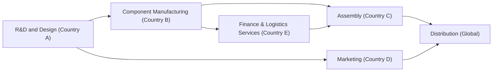

## Overview

Trade in services is a fascinating area of modern economics that touches nearly every industry, from finance and tourism to cloud computing and management consulting. Perhaps you’ve had a moment when you’re watching a streaming service at home—maybe binging on your favorite shows—only to realize that you’re effectively importing entertainment from half a world away. Services trade is booming, largely thanks to digitalization, improved telecommunications, and greater global connectivity. But because services are intangible—think about financial advice, legal counseling, or software delivered electronically—it can be tougher to measure, and that complexity extends to regulations, data privacy laws, and cross-border intellectual property (IP) concerns.

At the same time, the global economy has become more interconnected through global value chains (GVCs). Here, a single product might have components designed in California, software coded in India, physical assembly in Taiwan, and final marketing in Europe. While this fragmentation helps boost efficiency and innovation, it also makes the whole system more fragile, as disruptions in any one country can ripple across the entire chain.

This section explores how services trade and GVCs shape the world economy and, more importantly for aspiring finance professionals, how you can interpret these developments in investment decisions, corporate strategy, and macroeconomic analysis.

## The Growth of Services in Modern Trade

Services have always been a crucial part of cross-border commerce—consultancies, banks, and shipping firms have arranged international deals for centuries. However, new technology has catapulted services from a behind-the-scenes enabler to a primary component of world trade. For instance, streaming platforms, cloud-based software solutions, telemedicine, and even remote engineering services can be produced, marketed, and delivered to clients without a physical package changing hands.

• Services Are Intangible: Unlike goods, you can’t hold a service. This can make it challenging to categorize, measure, and tax. National statistical agencies wrestle with how to account for intangible flows like software licenses or subscription-based research services.

• Digital Delivery Raises Complexity: In many scenarios, digital services can be routed across multiple jurisdictions. A software developer in Toronto might work for a client in Japan, with code deployed on servers in Ireland but the final usage happening in Brazil. Understanding how to classify, regulate, or even tax these flows can be complicated.

• Financial and Accounting Implications: When analyzing a firm’s financial statements, keep in mind that services exports might show up under intangible assets, licensing fees, or other lines. As a CFA candidate, you might need to interpret how these intangible transactions affect a country’s balance of payments (particularly in the current account).

## Measuring Services Trade

Measuring services trade can be tricky. You might see metrics published by bodies like the World Trade Organization (WTO) or the Organisation for Economic Co-operation and Development (OECD), but data can be less precise than for goods. In your professional practice, you could come across:

• Balance of Payments Data: The current account includes trade in services, but it isn’t always as detailed as you’d hope.  
• Firm-Level Disclosures: Company reports might split out revenues from domestic versus international services, although they might not always give you the full picture.  
• Surveys and Estimates: Some international bodies rely on business surveys, extrapolations, or proxy measures to gauge service flows.  

Sometimes, you might find yourself evaluating an investment where the target company touts robust “international client revenues” but has no physical exports. This intangible nature might demand a deeper dive into licensing agreements, subscription contracts, or other intangible value drivers.

## The Rise of Global Value Chains (GVCs)

So, let’s talk GVCs. Picture a smartphone. The design originates at headquarters in one location, processors are sourced from specialized semiconductor manufacturers in another, screens come from yet another country, assembly happens somewhere with cost advantages, and finally the product is sold globally. This fragmentation of production is known as a global value chain.

A well-functioning GVC:

• Increases Specialization: Firms focus on what they do best—whether that’s designing microchips or providing high-end legal services—and outsource stages that other partners can handle more efficiently.  
• Encourages Innovation: If a company in Germany has the world’s best technology for a component, it can ship that component worldwide. Everyone benefits from cutting-edge processes, spurring further innovation.  
• Boosts Efficiency: By spreading out production according to comparative advantage, manufacturers can cut costs, enter new markets, and scale more quickly.  

But it’s not all rosy. GVCs can be fragile. A lockdown in one region can disrupt a critical link in the chain; a sudden policy shift—like a new tariff or export restriction—can force companies to scramble for alternative suppliers or even relocate entire production lines.

## Visualizing a Simplified Global Value Chain

Below is a simple Mermaid diagram showing how design, component manufacturing, assembly, and final distribution can be spread across multiple regions:

In practice, each node might involve many sub-stages, and there can be a tangled web of forward and backward linkages across different countries.

## Policy Dimensions of Services Trade

National regulators and trade negotiation bodies have been pushing for greater services liberalization—basically lowering the barriers to cross-border service delivery. However, services remain more heavily regulated in many jurisdictions than physical goods. Why?

• Licensing and Accreditation: Lawyers, accountants, or medical professionals usually need local licenses, which can curb foreign competition.  
• Data Privacy Laws: If you’re an online consulting firm storing personal data in the cloud, you must comply with data protection rules in each country of operation.  
• Intellectual Property Rights: Cross-border IP transfers (like patents, software code, brand names) require robust legal frameworks.  
• Trade Agreements: Global and regional attempts to harmonize these issues—like the General Agreement on Trade in Services (GATS)—aim to reduce friction. Still, many of these agreements have incomplete coverage, with carve-outs for sensitive sectors.

From an investment perspective, watch how changes in data protection regulation or licensing reciprocity might alter your target market’s ability to sell services abroad. For instance, telemedicine saw a surge in demand post-pandemic, but licensing requirements still vary widely by region.

## Services in GVCs: Why It Matters

People often think of GVCs in the context of manufacturing goods. However, services form a large (and growing) chunk of these value chains. Consider the smartphone example again. Alongside the physical components:

• Software Development: Providers around the world may write applications, develop the operating system, or test user interfaces.  
• Marketing and Branding: Global teams handle branding, advertising campaigns, and social media outreach.  
• Customer Service and After-Sales Support: Often outsourced to specialized call centers (some might be in the Philippines or India), these services ensure customer satisfaction.  
• Financial and Legal Advisory: Cross-border teams manage intellectual property, taxes, compliance, and risk management.

For economists, measuring the contributions of these specialized services can be more complex than simply tracking shipments of physical goods from factory to retailer. For investors, it underscores how intangible capabilities—like a brilliant marketing strategy or robust technology platform—can be just as important as having cost-effective manufacturing.

## Common Vulnerabilities in GVCs

It might sound like GVCs are unstoppable engines of cost savings. However, the interconnected structure also has drawbacks:

• Supply Chain Disruptions: A natural disaster, political upheaval, or labor strike in one location can halt production across multiple regions.  
• Regulatory Changes: Shifting trade policies, data localization rules, or embargoes can strain longstanding partnerships.  
• Coordination Costs: When a complex network of suppliers, assembly plants, and support services spans multiple countries, managing time zones, cultural differences, and legal constraints can be expensive.  
• Reputational Risks: Firms must be mindful of environmental or labor practices in any part of the chain. A scandal in one supplier’s factory can tarnish a global brand.

Investors often evaluate a firm’s supply chain resiliency as part of due diligence. Firms, meanwhile, may choose to “onshore” or “nearshore” certain production stages to mitigate the risk of being too dependent on distant partners.

## Case Example: Supply Chain Disruption in the Automotive Sector

Imagine that you are analyzing a global automotive parts supplier. One year, a tsunami hits a major factory belonging to a key chip supplier in Country B. Because the automotive sector’s GVC relies on just-in-time inventory management, assembly lines in multiple countries might grind to a halt almost immediately. The ripple effect can be enormous, with potential financial losses from halted production, penalty clauses in supply contracts, and a scramble to secure alternative chip sources at premium prices.

These fiascos highlight how GVC participants must weigh cost advantages against resiliency. From a macro perspective, disruptions can also show up in a country’s GDP if entire sectors slow production and, in turn, reduce exports.

## Linking Services and Digital Trade

Digital trade often relates to services delivered electronically—like streaming, cloud computing, online advertising, and data analytics. However, intangible digital services can also support physical goods in GVCs. For instance, real-time data analytics can optimize production lines on another continent, or an architecture firm can design building blueprints for a new manufacturing plant from halfway around the globe.

This digitalization can open new business models—for better or for worse. On one hand, new markets become accessible; on the other, competition intensifies if providers from anywhere can bid for the same design or consulting contracts. And it doesn’t stop at services: Blockchain-based supply chain tracking can add transparency to global logistics, though it brings its own set of regulatory questions (like how to treat cross-border digital ledgers under existing trade laws).

## Practical Financial Example: IP Licensing

Let’s say you’re assessing a global tech firm that develops cutting-edge software but handles manufacturing through third-party partners overseas. The firm may license its proprietary software to foreign manufacturers, who embed it into final products. The licensing fees then flow back to the origin company, showing up in the current account under service exports. If you’re building out a discounted cash flow (DCF) model, it’s crucial to understand how these licensing revenues are recognized and taxed across borders. Minor changes in tax treaties or licensing rules can significantly alter the firm’s effective tax rate and thus your valuation.

## Best Practices, Common Pitfalls, and Strategies

• Diversify Your Supply Chain: Overreliance on one country or supplier can be a pitfall. Consider “China plus one” strategies, or look for multiple threads in your GVC.  
• Monitor Regulatory Shifts: Keep tabs on new free trade agreements (FTAs), licensing requirements, or data privacy regulations—these can unlock new markets or close existing ones.  
• Develop Contingency Plans: Supply chain disruption is a question of “when,” not “if.” Smart managers pre-arrange alternative suppliers or store some buffer inventory.  
• Note Macro Trends: Watch national accounts. If a country invests heavily in broadband infrastructure or specialized workforce training, it could become a major services export hub in the future.

I remember chatting with a CFO who once said, “I never realized how fragile our chain was until the day we lost half our suppliers to a sudden policy shift.” That personal anecdote underscores the importance of GVC risk management and regulatory awareness in services, not just goods.

## Mermaid Diagram: Services Embedded in a GVC

Below is a more elaborate look at a GVC, showcasing how services can connect each stage:

Here, R&D (research and development), marketing, and finance/logistics services are provided by different countries, each specializing in its respective niche.

## Exam Tips and Application

• Exam Relevance: CFA exams often test your understanding of how economic data (like balance of payments) flows, the significance of trade balances, and the structure of global markets. Be prepared to discuss how services are categorized in a nation’s current account and integrated into GVCs.  
• Potential Essay Questions: You might have prompts about how a hypothetical disruption in a key services provider impacts a multinational’s earnings or how changes in regulatory frameworks alter the competitiveness of a services-based export.  
• Calculations and Derivatives: For item sets, you could be asked to compute the impact of licensing revenues on an economy’s trade balance or the effect of changing exchange rates on service import costs.  
• Strategy: In the real world, managers and analysts might choose to hedge currency risk, renegotiate supply contracts, or project new revenue streams from digital services expansions.  

Given how intangible and geographically diffuse these supply chains can be, well-rounded analysis typically covers operational, financial, and geopolitical considerations.

## Glossary

• Trade in Services: The exchange of intangible products (banking, insurance, consulting, software, etc.) across borders.  
• Global Value Chain (GVC): The international flow of goods and services across multiple stages of production.  
• Backward Linkages: When firms import intermediate inputs from foreign suppliers, feeding earlier stages of production.  
• Forward Linkages: When domestic output is used as an input in foreign production processes, effectively “exporting” your product to companies abroad.  
• Supply Chain Disruption: A breakdown in the flow of materials or services, often triggered by political, environmental, or operational crises.  
• Services Liberalization: Reducing regulatory barriers and administrative hurdles to cross-border services trade.  
• Digital Trade: The buying and selling of goods and services electronically, often coupled with global data flows and IP transfers.

## References and Further Reading

• World Trade Organization’s “Global Value Chain Development Report.”  
• OECD reports on services trade: [https://www.oecd.org/trade/topics/services-trade/](https://www.oecd.org/trade/topics/services-trade/)  
• Brookings Institution articles on the digital economy and services liberalization.  
• Various research papers in “The World Economy” journal focusing on services trade statistics.

---

## Test Your Knowledge: Trade in Services and Global Value Chains



### Which of the following best describes one reason why measuring trade in services is challenging?

- [ ] Services are typically sold in physical form, making them harder to track.
- [x] Services are intangible, often involving cross-border data or IP transfers.
- [ ] Services use fewer employees, making labor data complicated.
- [ ] Services do not contribute to a country’s GDP.

> **Explanation:** Services’ intangible nature, especially digital or IP-based transactions, makes them harder to categorize and measure than physical goods.

### Which statement correctly highlights a characteristic of a global value chain (GVC)?

- [ ] Each country completes an entire product from start to finish before exporting it.
- [x] Production stages are split among multiple countries depending on specialization.
- [ ] Only high-tech industries use GVCs to reduce inventory costs.
- [ ] GVCs apply strictly to the manufacturing of physical goods.

> **Explanation:** A key feature of GVCs is the fragmentation of production stages across multiple countries, leveraging comparative advantages and specialized expertise.

### What are backward linkages in the context of GVCs?

- [ ] When a firm sells its final product to another company abroad.
- [ ] When organizations focus more on designing than manufacturing.
- [x] When firms import intermediate inputs from foreign suppliers for their production.
- [ ] When domestic labor moves abroad for higher wages.

> **Explanation:** Backward linkages occur when a company’s production process depends on inputs imported from foreign suppliers.

### How might a supply chain disruption in one country impact a global value chain?

- [x] It can halt production across multiple regions that rely on the affected components or services.
- [ ] It generally benefits the countries downstream in the production chain.
- [ ] It rarely affects overall output because global demand for goods is uniform.
- [ ] It increases product quality as companies seek superior inputs elsewhere.

> **Explanation:** Because GVCs are interdependent, a breakdown in one segment can cause ripple effects throughout the entire chain, leading to halted production or increased costs.

### Which of the following could be considered an example of services liberalization?

- [x] A new agreement allowing foreign banking firms to operate more freely in domestic markets.
- [ ] The imposition of higher tariffs on imported steel.
- [ ] Strict data privacy regulations limiting cross-border data flows.
- [x] The extension of cross-border professional accreditations for architects.

> **Explanation:** Services liberalization refers to removing regulatory and administrative barriers to international service provision, such as easing market entry for foreign banks or recognizing professional credentials across borders.

### Digital trade primarily focuses on which aspect?

- [ ] Manufacturing physical products.
- [x] Electronically delivered services and cross-border data flows.
- [ ] Storing only tangible goods in warehouses.
- [ ] Increasing tariffs on e-commerce firms.

> **Explanation:** Digital trade involves the buying and selling of goods and services through electronic means and includes cross-border data and IP flows.

### Why might licensing requirements be a barrier to services trade?

- [ ] Licensing requirements only apply to goods, not services.
- [x] Professional services often need local accreditation, limiting foreign providers’ market access.
- [ ] They encourage firms to outsource their services.
- [ ] They reduce the need for data privacy legislation.

> **Explanation:** In many global markets, professionals must obtain local licenses or certifications to operate, constraining the free flow of cross-border service provision.

### Which best describes an example of forward linkages in a global value chain?

- [ ] A firm moves its high-value design center to another country.
- [x] A local component is shipped abroad to be integrated into a foreign company’s product.
- [ ] A supply disruption in raw materials stalls production lines in multiple countries.
- [ ] A digital advertising campaign is transferred internally between a parent firm and its subsidiary.

> **Explanation:** Forward linkages occur when the domestic output is used as an input in a foreign production process, effectively “moving forward” along the chain.

### What is a potential policy challenge for digital services trade?

- [ ] Discriminatory rules for shipping physical goods abroad.
- [x] Differing national data protection regulations that restrict cross-border data flows.
- [ ] Scarcity of shipping containers to handle intangible goods.
- [ ] Lack of interest from multinational tech companies in overseas markets.

> **Explanation:** Digital services often require transferring data across borders, so differing privacy and data regulations can complicate or restrict delivery of such services.

### True or False: A fragmented global production model can reduce manufacturing costs but increase a firm’s vulnerability to external disruptions.

- [x] True
- [ ] False

> **Explanation:** While splitting production across countries leverages cost efficiencies, it also creates interdependencies that can amplify disruptions in any single location.


