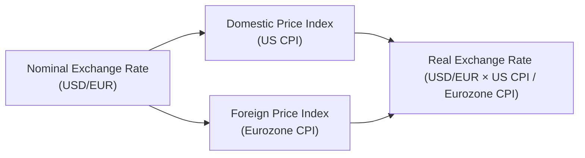

## Introduction

Sometimes when we see exchange rates on the news—like one US dollar equals so-and-so euros—we’re really talking about the “nominal” price of one currency in terms of another. It’s straightforward: “How many dollars does it take to buy one euro?” But in our quest to dig deeper into currency value, there’s a concept that often ends up underappreciated: the “real” exchange rate. The real exchange rate adjusts for differences in price levels—basically inflation—across countries. This measure often tells a more accurate story about how competitive a country’s goods and services are on the global stage.

I remember the first time I traveled abroad as a student, I found myself thinking, “Oh, the exchange rate is great right now, so I get more foreign currency for my dollar!” But after a few days of seeing how expensive goods were (relative to what I was used to paying back home), I realized there was a difference between the exchange rate on paper versus the exchange rate’s true impact on purchasing power. That difference is exactly where the “real exchange rate” helps us out.

Below, we’ll explore nominal exchange rates, how to derive real exchange rates, and why inflation can throw your nice, tidy mental calculations off. We’ll also provide a few real-life cases, a handy formula or two, and a short discussion about the implications for global trade and investment decisions.

## Nominal Exchange Rates

The nominal exchange rate is the rate most people are used to seeing. It’s published everywhere—television tickers, your currency converter apps, news websites, or money exchange kiosks at the airport. In short, the nominal exchange rate involves quoting one currency in terms of another. For instance, USD/EUR = 1.10 means it costs $1.10 US for each 1 euro.

• When you see “USD/EUR,” the first currency (USD) is called the “base currency,” while the second (EUR) is the “quoted” or “counter” currency.  
• Nominal exchange rates respond quickly to changes in market sentiment, interest rate differentials, geopolitical developments, central bank policies, and so on.  
• Because it’s sensitive to short-term news, the nominal rate can fluctuate sometimes by the minute.

Although the nominal exchange rate is important, it might not capture the full picture if you’re trying to figure out whether a currency has become “truly” more expensive or cheaper relative to another currency, once differences in local price levels or cost of living are considered.

## Real Exchange Rates

Here’s where the real exchange rate steps in. It attempts to show us how many goods and services in one country can be exchanged for goods and services in another country, after considering differences in the general price level. Broadly speaking, the real exchange rate answers: “How much purchasing power do I have in country X if I use currency Y, compared to my home currency’s purchasing power at home?”

We typically define the real exchange rate as:

( Real Exchange Rate ) = ( Nominal Exchange Rate ) × ( Domestic Price Index / Foreign Price Index )

Let’s break this down:

• Nominal Exchange Rate: The quoted, market-based rate.  
• Domestic Price Index: The price level (like CPI) in the domestic country.  
• Foreign Price Index: The price level (like CPI) in the foreign country.

If domestic prices go up more quickly than foreign prices (i.e., domestic inflation is higher), your real exchange rate appreciates less than you might think just by looking at the nominal exchange rate. In fact, if you have significantly higher inflation at home, your currency can lose competitiveness over time, even if the nominal exchange rate doesn’t move much.

## The Role of Inflation

Inflation changes the purchasing power of money. If your country’s inflation rate is elevated, goods and services in your home market become more expensive. Let’s think about the effect on an exchange rate:

• If your domestic inflation is higher than your trading partner’s, your exportable goods become relatively more expensive. Over time, this will tend to weigh on net exports; demand for your goods abroad could weaken without a compensating movement in the nominal exchange rate.  
• If, on the other hand, your inflation is lower than your trading partner’s, your real exchange rate can stay more competitively priced on the global stage. Your goods might appear “cheaper” to foreign buyers, potentially boosting exports.

So, the real exchange rate helps us see changes in relative prices between two countries. Plenty of macroeconomic studies track the real exchange rate as an indicator of “competitiveness.” If a country’s real exchange rate is overvalued, its exports can suffer. Conversely, an undervalued real exchange rate might spur exports and overall economic growth—though it might annoy trading partners who see this as a currency advantage.

## Visualizing Nominal and Real Exchange Rates

Below is a simple diagram to illustrate the relationship among domestic price levels, foreign price levels, and the nominal exchange rate in determining the real exchange rate.



We can see from the diagram that both domestic and foreign price indices feed into the real rate calculation. The nominal exchange rate itself is also essential—after all, we cannot calculate the real rate without a reference nominal rate.

## Practical Calculation Example

Let’s say we have:

• Nominal exchange rate (USD/EUR) = 1.20 (meaning 1 euro costs $1.20)  
• US CPI = 120 (let’s assume some base year was 100)  
• Eurozone CPI = 130  

Then the real exchange rate (RER) from the US perspective becomes:

( RER ) = 1.20 × ( 120 / 130 )  
( RER ) = 1.20 × ( 0.9231... )  
( RER ) ≈ 1.108  

Hence, while the nominal exchange rate is 1.20, the real exchange rate is about 1.108. In other words, once we recognize that goods in the Eurozone have become relatively more expensive than in the United States (by the difference in CPIs), we get a real exchange rate that is lower than the nominal rate.

This difference helps us understand that an American consumer’s purchasing power in Europe might be slightly better than just looking at the nominal 1.20 figure. The inflated prices in the Eurozone reduce how many goods a US dollar can buy in Europe.

## Using Python for a Simple Calculation

If you like coding or just want a quick computational tool, here’s a Python snippet that calculates the real exchange rate:

```python
def real_exchange_rate(nominal_rate, domestic_cpi, foreign_cpi):
    """
    Returns the real exchange rate given the nominal exchange rate
    and price indices (CPI) for the domestic and foreign countries.
    """
    return nominal_rate * (domestic_cpi / foreign_cpi)

nominal_rate = 1.20
us_cpi = 120
eurozone_cpi = 130

rer = real_exchange_rate(nominal_rate, us_cpi, eurozone_cpi)
print(f"The real exchange rate is approximately {rer:.3f}")
```

Running this snippet would give you the same numeric result we worked out by hand.

## Real Exchange Rates in Portfolio Management and Economic Analysis

You might be wondering, “So how does this theoretical idea factor into portfolio decisions?” Below are a few ways:

• Asset Allocation and Hedging: Investors looking to invest abroad might worry about their real return (or real purchasing power) after factoring in foreign inflation. Even if the nominal exchange rate is stable, high inflation in a target country could erode real returns.  
• Competitiveness and Revenue Projections: In equity valuation, especially for multinational firms, projecting revenue from international sales often involves assumptions about exchange rates. Using a real exchange rate can provide a more realistic sense of future competitiveness.  
• Macro Forecasting: Economic policy decisions are influenced by real exchange rates—central banks monitor real exchange rates to gauge external competitiveness. Changes in real exchange rates can lead to shifts in monetary policy, which in turn can affect bond yields, equity prices, and so on.

## Potential Pitfalls

Though the real exchange rate is crucial, there are a few pitfalls to keep in mind:

• Index Components: CPI might not always reflect the exact consumption basket relevant to international trade. Some items heavily traded globally may experience price movements that differ from general inflation.  
• Weighted Indices: Economists sometimes use a trade-weighted price index when comparing multiple trading partners. This can get more complicated but provides a more comprehensive view than simply comparing bilateral price indices.  
• Lagging CPI Data: Inflation figures come out with a lag, so “real-time” real exchange rates may partly rely on estimates.  
• Short-Term Versus Long-Term: In the short run, nominal exchange rates can deviate substantially from fundamentals like inflation differentials. Over longer horizons, real exchange rate changes tend to matter more for trade and competitiveness.

## Personal Anecdote on Real Exchange Rates

I’ll never forget a trip to a rapidly inflating country during a finance conference. I had checked the nominal exchange rate before departing and was thrilled at how “cheap” my daily budget looked in local currency. But from the moment I tried to buy coffee at the airport, I realized the local prices had soared in just a couple of months. The official nominal exchange rate didn’t save me from feeling I was paying a premium. Had I looked at an inflation-adjusted, real exchange rate measure, I would have anticipated that real cost difference—and planned accordingly.

## Concluding Thoughts

Nominal exchange rates can be eye-catching—especially if you’re checking how much currency you’ll receive on a trip or if you’re quickly scanning financial news. But they can also be misleading if that’s all you rely on. Inflation dynamics can significantly alter the “true” value of an exchange rate when it comes to buying goods and services. As professionals (and as global economic citizens), understanding and using real exchange rates is vital for a more accurate assessment of purchasing power, international competitiveness, and eventually, the potential impact on investment portfolios.

It’s also essential when constructing complex global portfolios to look beyond the nominal rates. By factoring in differences in inflation, you’ll be better able to forecast trade flows, corporate earnings, and the overall macro environment. If there’s one takeaway, it’s that real exchange rates are the critical bridge between currency quotes and real-world economic outcomes.

May this discussion serve as a helpful foundation and reminder that in finance and economics, the details (like adjusting for inflation) can turn a seemingly simple concept into a more precise—and more powerful—tool for analysis.

## Exam Tips

• Make sure you can apply the real exchange rate formula and interpret its meaning.  
• Be ready to discuss how inflation impacts the difference between nominal and real exchange rates.  
• Understand how the real exchange rate affects competitiveness, and how it can be used in macroeconomic forecasting and asset allocation.  
• Occasionally, a question might ask about scenarios where domestic inflation is higher/lower and how that influences trade flows and currency valuations. Don’t be surprised if the exam also weaves in monetary policy impacts.

Remember: In a Level I setting, you typically need to know how to calculate the real exchange rate and interpret it. At more advanced levels, you may need to integrate these ideas into more complex, multi-asset or macro-driven problems. But your foundation starts right here.

## References for Further Study

• Pilbeam, K. (2013). International Finance. Palgrave Macmillan.  
• Krugman, P. & Obstfeld, M. (2017). International Economics: Theory and Policy. Pearson.  
• [IMF Exchange Rate Resources](https://www.imf.org/en/Data)

---

## Test Your Knowledge: Mastering Nominal and Real Exchange Rates



### Which of the following best describes the nominal exchange rate?

- [x] The rate at which one currency can be exchanged for another, without inflation adjustments
- [ ] The rate adjusted for differences in national price levels
- [ ] The instantaneous rate used in forward currency agreements
- [ ] The central bank’s official “fair-value” exchange rate

> **Explanation:** The nominal exchange rate is simply the quoted market rate of exchanging one currency for another, with no adjustment for price levels.

### Holding everything else constant, what happens to a country's real exchange rate if its inflation rises relative to its trading partner’s inflation?

- [ ] The real exchange rate increases proportionally to the nominal rate
- [ ] The real exchange rate always decreases
- [x] The real exchange rate appreciates less than the nominal exchange rate (or depreciates)
- [ ] The real exchange rate is unaffected by inflation

> **Explanation:** Higher domestic inflation relative to a trading partner typically reduces competitiveness and causes the real exchange rate to appreciate less than the nominal rate would suggest—or even depreciate if inflation is substantially higher.

### How is the real exchange rate commonly calculated?

- [ ] (Nominal Exchange Rate) × (Foreign Price Index / Domestic Price Index)
- [x] (Nominal Exchange Rate) × (Domestic Price Index / Foreign Price Index)
- [ ] (Domestic Price Index – Foreign Price Index) / Nominal Exchange Rate
- [ ] (Nominal Exchange Rate) / (Domestic Price Index × Foreign Price Index)

> **Explanation:** The standard formula is RER = Nominal Exchange Rate × (Domestic Price Index / Foreign Price Index).

### A country with a slowly rising nominal exchange rate but high domestic inflation is likely experiencing:

- [ ] An appreciation in the real exchange rate
- [x] A less competitive position globally compared to the nominal rate movement alone
- [ ] A guaranteed increase in export volumes
- [ ] A stable real exchange rate

> **Explanation:** High domestic inflation can negate the effect of a slowly rising nominal exchange rate, making the country’s goods relatively more expensive abroad.

### When the real exchange rate is high (compared to its historical trend), it generally indicates:

- [x] Domestic goods are relatively expensive versus foreign goods
- [ ] Domestic goods are relatively cheap versus foreign goods
- [x] The currency may be overvalued in real terms
- [ ] The price levels at home and abroad are perfectly aligned

> **Explanation:** A high real exchange rate often means domestic goods cost more relative to foreign goods, suggesting potential overvaluation.

### Which of the following best characterizes a “trade-weighted” real exchange rate?

- [x] A measure of a currency's real value against a basket of multiple trading partners, weighted by trade volumes
- [ ] A measure of only bilateral currency pairs
- [ ] A purely nominal index that excludes domestic inflation
- [ ] A forecast of inflation differentials between two countries

> **Explanation:** A trade-weighted real exchange rate accounts for inflation differentials across multiple trading partners, weighted by each partner’s share of trade.

### In applying real exchange rates to investment decisions, which of the following is a key consideration?

- [x] Real exchange rates can influence multi-asset allocation, particularly foreign equities and fixed income
- [ ] Nominal exchange rates alone capture all inflation risks
- [x] Inflation-adjusted returns matter for purchasing power
- [ ] Foreign currency movements are irrelevant if the nominal exchange rate is stable

> **Explanation:** When investing internationally, inflation adjustments matter for real returns, so real exchange rates become pivotal in understanding true costs and returns.

### Which of the following might cause the real exchange rate to deviate from its fundamental value?

- [x] Temporary capital flows and speculative positions
- [ ] Explicit knowledge of future inflation
- [ ] Perfectly balanced trade between countries
- [ ] Wage controls that maintain fixed wages across all sectors

> **Explanation:** In the short run, speculative capital flows, market sentiment, or shifts in investor risk appetite can drive the real exchange rate away from fundamentals.

### If the domestic CPI is rising faster than the foreign CPI, but the nominal exchange rate remains constant, then:

- [x] The real exchange rate is likely appreciating (hurting export competitiveness)
- [ ] The real exchange rate stays the same
- [ ] The real exchange rate likely depreciates
- [ ] The nominal exchange rate automatically adjusts to offset inflation

> **Explanation:** If the nominal exchange rate is unchanged but domestic prices rise faster, exports become relatively more expensive, effectively raising the real exchange rate.

### When interpreting the real exchange rate, which of the following statements is true?

- [x] It measures purchasing power parity between countries, factoring in relative price levels
- [ ] It can only be applied to advanced economies
- [ ] It is always constant over the long term
- [ ] It ignores domestic inflation data

> **Explanation:** By adjusting for relative price levels (inflation), the real exchange rate measures how much purchasing power one currency has relative to another. It’s essential for all economies, not just advanced ones.


