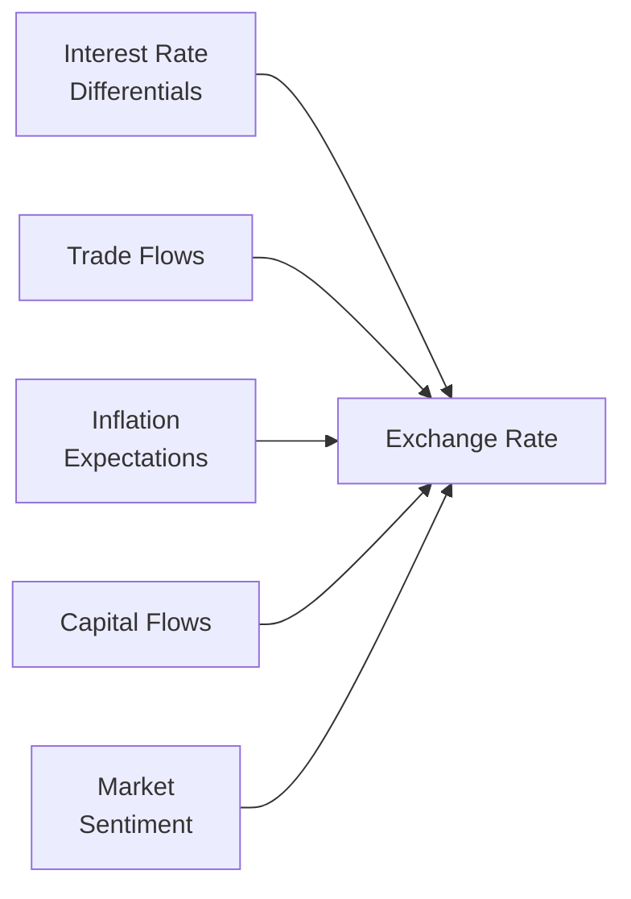

## Overview

Exchange rates—essentially the prices at which one currency can be exchanged for another—are central to global finance. They impact everything from the cost of imported goods to the competitiveness of exports, from international investment decisions to the direction of capital flows. Indeed, if you’ve ever traveled abroad and traded your domestic currency for foreign notes, you’ve participated in the foreign exchange (FX) market. But once you move beyond that tourist transaction, you’ll find that exchange rate determination is both an art and a science, influenced not only by raw economic fundamentals (such as interest rate differentials and inflation) but also intangible factors like investor sentiment and geopolitical events.

Below we’ll unpack the big drivers of exchange rates, then compare and contrast major exchange rate regimes—from pure floats to strict pegs—while reinforcing how these regimes affect market behavior. Meanwhile, I’ll share a couple of personal experiences along the way, because, well, sometimes watching the currency markets feels like watching an action movie—especially when a central bank decides to intervene out of nowhere!

## Key Drivers of Exchange Rate Determination

In a free or partially free market, exchange rates are still governed by basic principles of supply and demand. However, these drivers can be multifaceted and interwoven. Let’s break down a few important ones.

### Trade Flows

If you think about it, currencies are demanded when firms and consumers need to purchase goods or services from abroad. For example, if a U.S. importer needs to buy machinery from Japan, it usually needs Japanese yen to pay the exporting company. When a country exports more than it imports (i.e., a trade surplus), its currency may experience upward pressure. Conversely, if it imports more than it exports (a trade deficit), its currency might weaken—at least over the long run.

### Interest Rate Differentials

One of the biggest drivers in currency markets is often interest rate differentials between countries. Suppose the domestic interest rate is higher than the foreign interest rate. In that case, domestic assets may become more attractive to international investors seeking higher yields, increasing demand for the domestic currency. This relationship is frequently modeled through interest rate parity frameworks. One simplified version of uncovered interest parity can be shown as:


S_{t+1}^{\mathrm{expected}} = S_t \times \frac{1 + i_{\mathrm{dom}}}{1 + i_{\mathrm{for}}}


Where \\(S_t\\) is the spot exchange rate at time \\(t\\), \\(i_{\mathrm{dom}}\\) is the domestic interest rate, and \\(i_{\mathrm{for}}\\) is the foreign interest rate. Although real-world exchange rates rarely move exactly as predicted by simplistic formulas, the principle underscores how important interest rates can be.

### Inflation Expectations

High inflation generally erodes a currency’s value in the eyes of global investors. When domestic inflation is high, each unit of currency buys fewer goods. Over time, this can lead to currency depreciation. Many foreign exchange market participants keep a close eye on inflation indicators like CPI (Consumer Price Index) or PPI (Producer Price Index) because, well, nobody wants to hold a currency that loses value too quickly.

### Capital Flows and Investment Patterns

Large cross-border investments—whether from giant pension funds, hedge funds, or multinational corporations—also move exchange rates. For instance, in the build-up to major sporting events or big infrastructure projects, foreign direct investment (FDI) may flow into a host country, boosting demand for its currency. Similarly, shifts in global risk appetite can cause large “safe haven” flows into currencies like the U.S. dollar, Japanese yen, or Swiss franc.

### Market Sentiment and Speculation

I’ll never forget the time I was on a trading desk (unofficially assisting a portfolio manager friend) early one morning when rumors started swirling about a central bank cutting rates unexpectedly. The currency soared in volatility simply because of swirling predictions about what might happen. Sentiment and psychology can trigger short-term currency moves that often dwarf those driven by more fundamental factors.

Below is a simple conceptual diagram representing the interplay of these factors:



## Exchange Rate Regimes

Countries frequently adopt specific policy frameworks—often called “exchange rate regimes”—to guide how their currency behaves in international markets. The choice of regime can align with a nation’s macroeconomic objectives, historical norms, or even political considerations. As you might guess, each regime carries its opportunities and challenges.

### Floating (Flexible) Exchange Rate Regime

Under a floating regime, a currency’s value is determined primarily by market forces. Although central banks may perform occasional interventions (say, by selling foreign reserves to prop up the currency or by buying them to weaken it), there’s no official target or strict rule that authorities enforce. The U.S. dollar, euro, British pound, and Japanese yen generally float. 

One advantage of a floating regime is that it provides monetary policy autonomy: the central bank can focus on domestic goals (like controlling inflation or supporting growth) without worrying much about defending a specific currency level. However, large exchange rate swings can occur—sometimes beneficial, sometimes not. For example, if the currency appreciates too fast, exporters can suffer.

### Fixed (Pegged) Exchange Rate Regime

In a fixed regime, the central bank pegs its currency to another currency (or a basket). The Hong Kong dollar’s peg to the U.S. dollar is a notable example. Usually, the central bank commits to converting domestic currency at the fixed rate, maintaining large foreign currency reserves to defend that peg. This can stabilize trade relationships and limit exchange rate volatility, which is great for businesses used to predictable cross-border pricing. 

But with a fixed regime, the central bank often sacrifices monetary independence. If market pressure mounts and foreign reserves run low, the peg can break dramatically—consider the sterling crisis of 1992 or the more recent Swiss franc de-peg in 2015. Maintaining a peg can be expensive and complicated, and if speculators sense it’s unsustainable, they might “attack” the currency to force devaluation.

### Currency Board Arrangement

A stricter form of a peg, a currency board arrangement means the domestic money supply is backed 100% (or very close to it) by a foreign currency reserve, often with legal constraints preventing the central bank from issuing more local currency beyond the pegged limit. While this arrangement can inspire confidence, it’s extremely restrictive—imagine trying to manage a local recession when you can’t really tailor monetary policy because you’re locked into the anchor currency’s fate.

### Managed Float (Dirty Float)

Managed float regimes are a middle ground between free-floating and fixed. Here, the market mostly determines the exchange rate, but policymakers intervene to “smooth out” extreme volatility or guide the currency toward a desired path. Although some folks call it a “dirty float,” that label might sound a bit negative, whereas it’s often viewed as a pragmatic approach for emerging markets seeking some measure of exchange rate stability without fully giving up monetary policy freedom.

### Target Zones and Crawling Pegs

Some countries set a target exchange rate with relatively wider bands—a target zone. The currency is allowed to fluctuate within this band, but if it threatens to exit that zone, authorities intervene. This approach offers some flexibility but also tries to maintain stability. A “crawling peg” is a variation in which the central rate is adjusted periodically, often to reflect differences in inflation or other economic conditions.

## Policy Implications and Monetary Autonomy

A central theme in choosing an exchange rate regime relates to policy autonomy. In an ideal world, a country might want:

1. Free capital flows (to attract or deploy capital easily).
2. A stable exchange rate (to minimize currency risk for businesses and investors).
3. An independent monetary policy (so the central bank can control interest rates for domestic economic goals).

But the so-called “impossible trinity” suggests you can’t have all three simultaneously—at least not perfectly. You have to pick two. Floating exchange rates give you monetary independence and free capital mobility, but you sacrifice exchange rate stability. Pegged regimes can give you exchange rate stability, but you might lose some independence on interest rates. Managed floats and variations try to find a compromise.

## Practical Examples and Case Studies

Let’s illustrate with some real-life examples:

- ■ The Swiss National Bank’s sudden decision in January 2015 to remove its exchange cap with the euro rocked global currency markets. The Swiss franc soared approximately 30% against the euro in a single day, sending reverberations across global equity and currency markets. This abrupt shift underscores how quickly fixed or quasi-fixed regimes can unravel under strain.
- ■ Argentina’s historical use of a currency board in the 1990s pegged the Argentine peso to the U.S. dollar. Initially, it helped cure hyperinflation, but eventually, capital outflows and a need for independent monetary policy forced the abandonment of the arrangement, leading to a sharp devaluation.
- ■ China’s managed float approach to the renminbi, with a gradually widening trading band over time, reflects an effort to maintain stability while becoming more integrated into global capital markets.

## Implications for Portfolio Management

For Level III CFA candidates, you’ll often see exam questions focusing on whether or not to hedge currency risk, how exchange rate movements influence asset prices, and the potential for central bank intervention to upend forecasts. When you’re building or managing a global portfolio:

- ■ Carefully evaluate how a country’s exchange rate regime might affect currency volatility. Pegged currencies can lull you into a false sense of stability if you ignore the possibility of sudden de-pegging.
- ■ Factor in interest rate differentials for carry trades, but remember that carry trades can turn sour quickly during risk-off market episodes.
- ■ Monitor the policy stance of the country’s central bank: a shift from a managed float to a stricter peg (or vice versa) can dramatically change your risk assumptions.
- ■ Consider derivatives, such as currency forwards or options, to hedge exposure—particularly important when the currency in question is prone to big policy shifts or to episodes of high volatility.

## Best Practices, Common Pitfalls, and Exam Tips

1. Be on the lookout for “soft” pegs that might come under speculative attack. Don’t assume a peg is guaranteed unless there’s a bulletproof currency board (and even then, be cautious).
2. Watch out for large interest rate differentials with no fundamental justification—this can be a red flag that a currency is about to shift.
3. Don’t rely solely on the short-term interest rate differential to forecast currency movements. Sentiment and macro surprises can overshadow interest rates in the near term.
4. In a constructed-response exam setting, if you’re asked to recommend whether a country should peg or float, demonstrate your knowledge of the impossibility of combining free flow of capital, stable exchange rates, and independent monetary policy. 
5. Practice scenario analysis: for instance, if a country shifts from a fixed peg to a managed float, how do you adjust your currency exposure?

## Additional Formula Considerations

Beyond uncovered interest parity, you might also encounter purchasing power parity (PPP), especially in a long-run context. For instance:


\text{PPP: } e_{\mathrm{dom/for}} = \frac{P_{\mathrm{dom}}}{P_{\mathrm{for}}}


Where \\(P_{\mathrm{dom}}\\) and \\(P_{\mathrm{for}}\\) are domestic and foreign price levels, respectively, and \\(e_{\mathrm{dom/for}}\\) is the exchange rate. While PPP tends to predict movement over longer horizons, in an exam context, be prepared to show how differences in inflation or changes in relative prices feed into currency valuations eventually.

If you want a quick Python snippet to see how changes in interest or inflation rates might project forward exchange rates, you could do something like:

```python
def projected_exchange_rate(spot_rate, dom_rate, for_rate, years=1):
    """
    Project forward exchange rate based on interest differentials.
    """
    return spot_rate * ((1 + dom_rate)**years / (1 + for_rate)**years)

spot = 1.20  # EUR/USD
domestic_interest = 0.02
foreign_interest = 0.01
projection = projected_exchange_rate(spot, domestic_interest, foreign_interest, years=2)
print(f"Projected exchange rate over 2 years: {projection:.4f}")
```

Of course, in an exam context, you won’t be writing code—just be comfortable with the underlying math and logic.

## Conclusion

The determination of exchange rates hinges on a variety of economic forces—interest rates, inflation, trade flows, capital movements, and investor psychology. Countries choose among floating, fixed, and managed exchange rate regimes, each with its own trade-offs regarding monetary policy autonomy and exchange rate stability. For the aspiring CFA Charterholder, understanding exchange rate dynamics is essential not only for analyzing international investments but also for managing currency exposures and navigating the sometimes-turbulent waters of central bank interventions.

Keep in mind that no single model can fully capture the complex and ever-changing nature of currency markets. Experience, market awareness, and a robust analytical toolkit all come into play. Good luck exploring (and sometimes braving) the currency markets in your career and on the CFA exam!

## References

- Frankel, J. A. (2019). “The Plaza Accord, 30 Years Later.” Journal of Policy Modeling.  
- [Bank for International Settlements](https://www.bis.org/) – Publications on exchange rate regimes and currency policies.  
- [World Bank – Exchange Rate Policy](https://www.worldbank.org/) – Policy recommendations on exchange rate regimes.

---

## Test Your Knowledge: Mastering Exchange Rate Determination & Regimes



### 1. Which of the following factors typically drives long-term currency valuations?

- [ ] Government subsidies
- [x] Interest rate differentials
- [ ] Seasonal consumer demand
- [ ] Official central bank websites

> **Explanation:** While many things can influence exchange rates short term, long-term currency valuations often reflect differences in interest rates, inflation, and capital flows.

### 2. In a fixed (pegged) exchange rate regime, the central bank:

- [ ] Allows the currency to be determined entirely by market demand and supply.
- [ ] Never intervenes in currency markets.
- [x] Must maintain sufficient foreign exchange reserves to defend the peg.
- [ ] Always sets interest rates at zero.

> **Explanation:** A pegged regime requires the central bank to intervene, potentially selling or buying foreign currency to maintain the established exchange rate.

### 3. A managed float (dirty float) can best be described as:

- [ ] A system where the exchange rate is permanently fixed to a composite index.
- [x] A scenario where the currency is allowed to float but with periodic interventions.
- [ ] A free-floating regime with no government involvement whatsoever.
- [ ] A system in which multiple countries share a single currency.

> **Explanation:** Managed floats allow mostly market-driven exchange rates, but central banks step in when they feel it’s necessary.

### 4. If a country has high inflation relative to its trading partners, under Purchasing Power Parity (PPP):

- [ ] The currency should appreciate over time.
- [x] The currency should depreciate over time.
- [ ] The currency will remain unchanged.
- [ ] The currency must switch to a fixed peg.

> **Explanation:** PPP theory states that currencies of countries with higher inflation rates tend to lose value to maintain purchasing power equivalence.

### 5. Which statement about a currency board arrangement is correct?

- [ ] It always allows for flexible monetary policy.
- [x] It requires 100% backing of the domestic currency by foreign currency.
- [ ] It is considered a form of floating exchange rate.
- [ ] It reduces foreign exchange reserves to zero.

> **Explanation:** A currency board arrangement strictly ties money issuance to the accumulation of foreign currency reserves, restricting domestic policy flexibility.

### 6. Under the “impossible trinity,” a country cannot simultaneously have:

- [x] Free capital flows, a fixed exchange rate, and independent monetary policy.
- [ ] A floating exchange rate, financial openness, and stable prices.
- [ ] A fixed exchange rate, no capital flows, and no inflation.
- [ ] High interest rates, low inflation, and free capital flows.

> **Explanation:** The impossible trinity states that a country must choose two out of these three: open capital markets, fixed exchange rates, and independent monetary policy.

### 7. A currency experiencing a “speculative attack” in a fixed regime is typically facing:

- [ ] Excess reserves that can be sold easily.
- [ ] Zero inflation and stable prices.
- [x] Unsustainable pressures that cause investors to bet on a devaluation.
- [ ] Full immunity from exchange rate movements.

> **Explanation:** In a fixed or pegged regime under stress, speculators may challenge the central bank’s ability to maintain the peg when its reserves are insufficient.

### 8. A major advantage of a floating (flexible) exchange rate is that:

- [x] The central bank retains control over monetary policy.
- [ ] It completely eliminates investor sentiment from the markets.
- [ ] Currency values never fluctuate significantly.
- [ ] It prevents any form of carry trades.

> **Explanation:** Floating regimes offer greater autonomy for central banks to set interest rates independently of exchange rate targets.

### 9. Which of the following scenarios often precedes a sudden de-peg?

- [ ] Stable reserves and a narrow interest rate differential.
- [ ] Constant appreciation of the currency without any external shocks.
- [x] Declining foreign exchange reserves and rising market speculation.
- [ ] A complete lack of trade deficits or surpluses.

> **Explanation:** When foreign reserves are dwindling, sustaining the peg becomes more difficult, heightening the risk of a forced devaluation or breaking the peg.

### 10. True or False: A managed float exchange rate system means the currency is constantly intervened upon daily by the central bank.

- [x] True
- [ ] False

> **Explanation:** Although “managed” suggests controlled intervention, it doesn’t necessarily mean it occurs every single day. Still, the statement is technically true in that intervention happens when needed, but it can be frequent or infrequent. The key is that it’s not purely free-floating, nor is it rigidly fixed.


