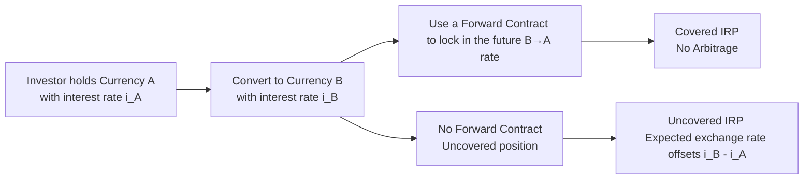

## Introduction

Have you ever gone on vacation, stepped off the plane, and discovered that your favorite cup of coffee abroad costs twice what you’d pay back home? Or—maybe—half as much? Sometimes this difference is just due to local supply, demand, and cost structures. But in global finance, there are tried-and-true theories explaining how exchange rates (eventually) adapt to ensure that goods and services are priced consistently around the world. Among these theories, Purchasing Power Parity (PPP) and Interest Rate Parity (IRP) play pivotal roles in shaping exchange rate expectations, risk management, and even your day-to-day portfolio decisions.

These theories are cornerstones of the global monetary system and underlie many exam-type questions on capital market expectations, macroeconomic forecasting, and global asset allocation. Understanding them deeply will help you navigate currency markets, manage foreign exchange (FX) hedges, and evaluate cross-border investment opportunities without getting lost in a sea of short-term speculation.

## Purchasing Power Parity

Purchasing Power Parity (PPP) is often summarized by the phrase “equalizing the cost of an identical basket of goods across countries.” It’s a cornerstone concept in macroeconomics that ties together exchange rates, inflation, and price levels.

### Absolute Purchasing Power Parity

Absolute PPP states that the price level of an identical basket of goods should, in principle, be the same around the globe once we convert prices into a common currency. In equation form, for a simplified two-country model:


S_{(USD/EUR)} = \frac{P_{\text{US}}}{P_{\text{EU}}},


where:  
• \\( S_{(USD/EUR)} \\) is the spot exchange rate (USD per EUR),  
• \\( P_{\text{US}} \\) is the price of the basket of goods in the United States,  
• \\( P_{\text{EU}} \\) is the price of the same basket in Europe, denominated in euros.

If you’re a coffee enthusiast—like me—Absolute PPP would imply that a latte in the U.S. and the same latte in Italy should cost the same when converted into one currency. Obviously, in real life, we see differences. Transportation costs, tariffs, taxes, brand power, and local tastes can drastically shift actual prices. Consequently, while Absolute PPP is conceptually simple, it’s not often observed perfectly in practice.

### Relative Purchasing Power Parity

Relative PPP takes a slightly different tack. Rather than focusing on identical price levels across countries, it focuses on **changes** in price levels over time. In other words, if Country A experiences inflation that’s higher than Country B, we’d expect Country A’s currency to depreciate to reflect that inflation differential.

Mathematically, we often see this as:


\frac{S_{1} - S_{0}}{S_{0}} \approx \pi_A - \pi_B,


where:  
• \\( S_{0} \\) is the current spot exchange rate,  
• \\( S_{1} \\) is the future spot exchange rate,  
• \\( \pi_A \\) is the inflation rate in Country A,  
• \\( \pi_B \\) is the inflation rate in Country B.

Relative PPP is a more practical guide. Although short-term exchange rates may wander off (sometimes quite dramatically) due to speculation, risk aversion, or global liquidity flows, over the long haul, many empirical studies show that exchange rates slowly adjust to reflect differences in inflation.

## Interest Rate Parity

While PPP zeroes in on how inflation drives exchange rates, Interest Rate Parity (IRP) focuses on how **interest rate differentials** can influence currency values, forward exchange rates, and the cost/benefit of foreign currency–denominated investments.

IRP says that you can’t earn a riskless profit by borrowing in one currency at a given interest rate, converting to another currency, and parking your funds there at a different interest rate. If you could, every hedge fund on the planet would jump in, exploit this arbitrage, and drive the opportunity away.

### Covered Interest Rate Parity

Under **Covered IRP**, an investor uses a forward contract to hedge the currency risk of a cross-border investment. Let’s break it down:

1. Suppose you start with currency A.  
2. You see that currency B’s interest rate is higher, so you exchange your funds into currency B to invest at that higher interest rate.  
3. To make sure you don’t get hammered by possible B → A exchange rate changes later, you simultaneously lock in a forward contract to convert back into currency A at a specific forward rate.  

Covered IRP states that the forward rate will adjust such that you can’t earn a riskless profit from this arrangement. In formula form:


F_{(A/B)} = S_{(A/B)} \left(\frac{1 + i_A}{1 + i_B}\right),


where:  
• \\( F_{(A/B)} \\) is the forward exchange rate (units of currency A per unit of currency B),  
• \\( S_{(A/B)} \\) is the spot exchange rate,  
• \\( i_A \\) is the risk-free interest rate in country A,  
• \\( i_B \\) is the risk-free interest rate in country B.

A forward **premium** or **discount** emerges depending on which country has the higher interest rate. If \\( i_A < i_B \\), currency B should trade at a **forward discount** against currency A because you gain more interest from investing in B-currency bonds.

### Uncovered Interest Rate Parity

**Uncovered IRP** skips the forward hedge. Instead, it says that if you invest in the higher-interest-rate currency without covering your FX risk, you should (on average) end up earning the same return as if you’d just stayed in your home currency—because the exchange rate movement is expected to offset the interest advantage. The expected future spot rate is the mechanism that “should” balance out the difference in interest rates.

In formula form, let:


\frac{E[S_{(A/B),1}] - S_{(A/B),0}}{S_{(A/B),0}} = i_A - i_B,


where \\( E[S_{(A/B),1}] \\) is the expected future spot rate. Notice you’re relying on an expectation rather than a contractual forward rate. Hence, there’s exchange rate risk that you’re not hedging.

## Interplay Between PPP and IRP

PPP and IRP are two sides of the same no-arbitrage coin. PPP indicates that exchange rates will adjust over the long run due to inflation differentials; IRP says that interest rates (which generally reflect inflation expectations, monetary policy, and other macro factors) will also drive the forward or expected spot rates. In essence:

• If a country’s inflation is high, nominal interest rates often rise (per the Fisher effect).  
• Higher interest rates, in turn, could make that currency appear more attractive—unless the forward markets and future spot expectations have already priced in depreciation.  
• Over time, actual exchange rates tend to move toward PPP-based fair values—but in the short to medium term, IRP steers forward rates and sets constraints on cross-border borrowing and lending.

## Practical Applications for Portfolio Managers

### Recognizing Deviations in Real Markets

In real life, exchange rates often deviate from the levels implied by PPP and IRP, sometimes significantly and for extended periods. Sentiment, speculation, capital controls, geopolitical turmoil, and investor eagerness to park money in perceived safe havens can overwhelm these theoretical anchors. As a portfolio manager:

• You might see a persistent forward rate mispricing. But comfort yourself: true arbitrage is often trickier than it looks. Market frictions (transaction costs, credit risk, regulatory barriers) can quickly eat up that “riskless” profit.  
• You may attempt to exploit perceived “value” in a currency if you believe it’s under- or overvalued relative to PPP. However, timing matters; some currencies can stay misaligned for years.

### Hedging FX Exposure

PPP and IRP are foundations for hedging strategies:

• **Covered IRP**: If your portfolio invests in international bonds, you can lock in your home-currency return using forward or futures contracts.  
• **Uncovered IRP**: Typically more speculative, but you might choose to remain unhedged if you think the currency’s expected appreciation will add to your total return.

### Best Practices and Common Pitfalls

• Don’t ignore transaction costs. The covered interest parity formula assumes frictionless markets. In reality, bid-ask spreads on both currencies and forwards can narrow or eliminate any gain.  
• Watch for credit and sovereign risk. A government might impose capital controls or default on local obligations, making IRP moot.  
• Remember that PPP is a **long-term** concept. Many short-term traders get burned betting that “the currency must revert to fair value soon.” The market can stay “irrational” longer than you can stay liquid.  
• Understand the monetary policy frameworks. Countries with credible central banks pursuing inflation targets (e.g., developed markets) typically align more closely with IRP and PPP. Emerging markets with volatile monetary regimes can deviate widely.

## Visualizing IRP and PPP

Here’s a simple flowchart illustrating the difference between covered IRP and uncovered IRP. Please note that, in practice, each step can involve multiple counterparties, fees, and settlement specifics.



## A Quick Python Illustration

Portfolio managers often use simple scripts to compare implied forward rates with actual forward quotes—just to see if any market opportunities exist. Below is a mini-example in Python to estimate a forward exchange rate given two interest rates and the spot rate:

```python
# Spot rate (Currency A per Currency B)
S_A_per_B = 1.20

i_A = 0.02  # 2%
i_B = 0.03  # 3%

F_A_per_B = S_A_per_B * ((1 + i_A) / (1 + i_B))
print(f"Implied 1-year forward rate (A/B): {F_A_per_B:.4f}")
```

If the market’s actual forward quote differs widely from the `F_A_per_B` output, you might dig deeper to see if the spread is large enough to cover transaction costs—or whether you should suspect that additional risks or real-world frictions are at play.

## Exam Tips and Key Takeaways

• **Know your formulas**: PPP (relative vs. absolute), interest rate parity (covered vs. uncovered).  
• **Interpret forward premiums/discounts**: If the forward price of a currency is higher than the spot (relative to another currency), it’s trading at a forward premium. If lower, it’s at a forward discount.  
• **Long vs. short horizons**: PPP is a guide for the long run, while IRP is typically more about short- to medium-term forward price relationships.  
• **Don’t forget the big picture**: Central banks, macroeconomic cycles, and (sometimes) politics can knock exchange rates significantly away from their no-arbitrage fundamentals.  
• **Watch out for misapplication**: IRP hinges on the assumption that capital is mobile and there’s no default or regulatory barrier. PPP requires that markets for goods are somewhat integrated or that trade can occur with minimal frictions.  

In the CFA Level III context, you’ll see these exchange rate concepts woven into portfolio management, asset allocation decisions, scenario analyses, and risk hedging strategies. You might see essay questions testing your ability to apply both PPP and IRP to real-world data. Be ready to calculate implied forward rates, detect mispricings, and discuss how a currency might move due to inflation or interest rates.

## References and Further Reading

• Rogoff, K. (1996). “The Purchasing Power Parity Puzzle.” Journal of Economic Literature.  
• Mishkin, F. (2018). “The Economics of Money, Banking and Financial Markets.” Pearson.  
• CFA Institute. (Current Edition). CFA® Program Curriculum, Level I & Level II Economics Readings.  
• OECD PPP Statistics: https://data.oecd.org/conversion/purchasing-power-parities-ppp.htm  

-------------------------

## Test Your Knowledge: Purchasing Power Parity and Interest Rate Parity



### Which statement best describes Absolute Purchasing Power Parity?

- [x] It holds that an identical basket of goods should cost the same across countries once converted to a common currency.  
- [ ] It asserts that inflation differentials drive exchange rates in the long run.  
- [ ] It is always observed in the absence of transportation costs.  
- [ ] It explains only short-term exchange rate fluctuations.  

> **Explanation:** Absolute PPP equates the actual price levels of identical goods across nations but often fails to hold perfectly due to transportation costs, tariffs, and other market frictions.

### Relative PPP is fundamentally concerned with:

- [x] Changes in price levels and how inflation differentials drive exchange rate movements over time.  
- [ ] Equalizing the price of a basket of goods at the current exchange rate.  
- [ ] Making profit from short-term currency fluctuations.  
- [ ] Regulating capital controls and interest rates.  

> **Explanation:** Relative PPP connects inflation differentials to exchange rate changes over longer periods rather than focusing on equalizing present absolute prices.

### Under Covered Interest Rate Parity, the main FX instrument used to hedge currency risk is:

- [x] A forward contract.  
- [ ] A currency swap.  
- [ ] An option contract (call/put).  
- [ ] No instrument is needed because IRP is automatic.  

> **Explanation:** Covered IRP typically uses a forward contract to lock in a future exchange rate, eliminating FX risk in foreign investment.

### Which of the following is a characteristic of Uncovered Interest Rate Parity?

- [ ] The future exchange rate is guaranteed by a forward contract.  
- [x] The expected future spot rate compensates for the interest rate differential.  
- [ ] It requires central bank intervention to hold.  
- [ ] It removes all currency risk for an investor.  

> **Explanation:** Uncovered IRP involves no forward hedge. Investors are exposed to actual currency movements, though in theory, the spot rate should adjust to offset interest differentials on average.

### If the spot USD/EUR rate is 1.1000, and the euro area has a 2% interest rate while the U.S. has a 4% rate, which of the following is true under IRP?

- [ ] The EUR should trade at a forward premium relative to the USD.  
- [x] The EUR should trade at a forward discount relative to the USD.  
- [ ] The forward rate equals the spot rate.  
- [ ] IRP suggests the EUR must appreciate in the long term.  

> **Explanation:** Because USD interest rates are higher, the euro should trade at a forward discount under covered IRP, balancing out the annualized 2% differential.

### Under Relative PPP, if Country A’s inflation is constantly higher than Country B’s, Country A’s currency is expected to:

- [x] Depreciate against Country B’s currency over time.  
- [ ] Strengthen, as higher inflation boosts nominal GDP.  
- [ ] Remain at the same level due to capital flows.  
- [ ] Appreciate if unemployment rates are lower.  

> **Explanation:** Higher inflation in Country A leads to a declining currency value relative to Country B, according to Relative PPP.

### One reason short-term exchange rates deviate from PPP is:

- [x] Speculative capital flows and market sentiment.  
- [ ] Precise alignment of inflation rates.  
- [ ] Guaranteed absence of government intervention.  
- [ ] Long-term consistency of absolute PPP.  

> **Explanation:** In the real world, speculation and investor sentiment cause short-term volatility that can deviate from PPP-based fundamentals.

### A fundamental assumption of Covered IRP is:

- [x] No default risk or capital controls that prevent currency conversions.  
- [ ] Guaranteed profit for investors using forward contracts.  
- [ ] Zero inflation differentials across countries.  
- [ ] Central bank pegged exchange rates.  

> **Explanation:** Covered IRP hinges on freely functioning capital markets, no significant default risk, and the ability to buy/sell forward contracts freely.

### If an investor believes a particular currency is undervalued relative to its PPP value and invests there without a forward hedge, which parity condition is the investor relying upon for upside?

- [ ] Covered IRP.  
- [x] Uncovered IRP.  
- [ ] Absolute PPP.  
- [ ] Covered PPP.  

> **Explanation:** An investor with no forward hedge is effectively using Uncovered IRP, hoping that the spot rate will appreciate to fair value as predicted by PPP.

### Covered Interest Rate Parity and Relative PPP both rely on:

- [x] The no-arbitrage principle.  
- [ ] Strict monetary policy targeting.  
- [ ] Fixed exchange rates.  
- [ ] Speculative strategies.  

> **Explanation:** Both theories assume that market forces and arbitrage eliminate persistent profit opportunities.  


