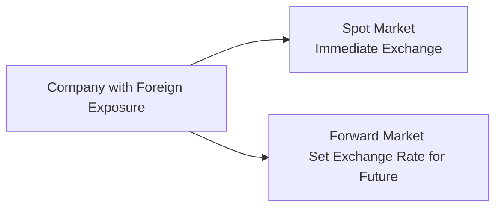

## Introduction and Key Concepts

Spot and forward exchange rates often come to life in daily headlines whenever major currencies experience some big swings. Maybe you’ve seen a news flash stating: “The EUR/USD spot rate hit a new high,” or “Exporters are locking in forward contracts in anticipation of future volatility.” These two terms—“spot” and “forward”—serve as the backbone of currency trading, hedging, and speculation in international markets. This section digs into the mechanics of spot and forward exchange rates, showing how they tie back to covered interest parity, hedging strategies, and day-to-day portfolio management.

In my experience, I once worked with a small importer of specialty teas. They were shipping tea leaves in from Japan, and because their profit margins were tight, they had to fret over every tenth of a yen in exchange rates. They’d jump right into forward contracts to lock in their costs. It seemed complicated at first, but the basic idea was simple: get rid of surprises by knowing today what you’ll pay tomorrow.

Spot and forward exchange rates are relevant for:

• Hedging against currency risk (for example, companies with foreign payables/receivables).  
• Speculation—trading on expectations of currency appreciation or depreciation.  
• Aligning asset-liability currency exposures in a global portfolio context.

Below, we explore spot exchange rates, forward exchange rates, their relationship to interest rates, and their direct applications in risk management and speculation.

## Spot Exchange Rates

Spot exchange rates reflect the value of one currency relative to another for immediate settlement. In most currency markets, “immediate” usually means settlement within two business days, although for certain currency pairs (e.g., USD/CAD) it can be one day. This settlement convention is sometimes referred to as T+2 (“trade date plus two days”).

Think of the spot rate as if you’re buying or selling a currency at your local foreign exchange booth. If you’re traveling from the U.S. to Europe, you trade U.S. dollars for euros at the then-prevailing spot rate.

### Practical Spot Market Dynamics

• The spot market is highly liquid, especially for major currency pairs (EUR/USD, USD/JPY, GBP/USD, etc.).  
• Spot rates reflect the immediate supply-and-demand conditions. Macroeconomic reports, political events, and sudden shifts in market sentiment can all affect the spot price in real time.  
• Large institutional players, like global banks, stand ready to buy and sell currencies around the clock, creating a 24-hour global market.

Spot rates form the baseline for most currency quotes and are often used as a benchmark to price forward contracts.

## Forward Exchange Rates

A forward exchange rate is an agreed-upon price to purchase or sell a currency at a specified future date. In other words, you lock in the exchange rate today, but actual settlement occurs at the forward contract’s maturity (for instance, 30 days, 90 days, or even a year from now).

### Why Use Forwards?

1. Hedging:  
   • An exporter expecting to receive foreign currency in three months might lock in today’s forward rate to convert that future foreign-currency inflow into her domestic currency.  
   • Similarly, an importer might fix the cost of foreign-currency payables.

2. Speculation:  
   • Some traders enter forward contracts if they believe the market’s forward rate is mispriced relative to their expectations of future currency moves.

3. Investment and Asset-Liability Management:  
   • A global fund manager might hold multiple international bonds denominated in different currencies. Using forwards helps align currency exposures with the fund’s base currency, mitigating unwanted currency risk.

### Relationship to Interest Rates: Covered Interest Parity

The valuation of forward contracts commonly reflects the interest rate differential between two currencies—an idea referred to as covered interest parity (CIP). CIP states that you cannot earn a riskless arbitrage profit by exchanging currency at the spot rate, investing at the local interest rate, and then exchanging back at a forward rate—everything should “even out.” Formally:

(Forward Rate) = (Spot Rate) ×  
                 ( (1 + i_domestic × t) / (1 + i_foreign × t) )

where:  
• t is the fraction of the year representing the forward contract’s maturity (e.g., 90 days is 90/360 or 0.25).  
• i_domestic is the domestic interest rate for that t period.  
• i_foreign is the foreign interest rate for that t period.

Because the forward currency price accounts for the opportunity cost or benefit of investing in each currency, CIP generally holds—especially for actively traded currencies. Persistent deviations are generally small or short-lived, or might reflect credit risk and transaction costs.

## Forward Quotations

Forward currency quotes can be expressed:

1. In absolute terms (forward points):  
   • Forward points indicate how many pips (the smallest quoted increment) are added to or subtracted from the spot quote. For example, if the spot EUR/USD is 1.0500 and the forward quote is +10 forward points, it might represent a forward rate of 1.0510.

2. As an annualized forward premium (or discount):  
   • The forward premium or discount shows how much the forward rate deviates from the spot rate on an annualized basis due to interest rate differentials.

For example:

Forward Premium =  
  ( Forward - Spot ) / Spot  × (360 / Forward Days to Maturity)

If the result is positive, the base currency (the one listed first in the quote) is expected to trade at a premium in the forward market. If it’s negative, it’s trading at a discount.

## Example: Pricing a 90-Day Forward

Let’s illustrate with a numeric example using the covered interest parity formula.

• Spot Rate (USD/EUR): 1.1000  
• 90-day USD interest rate: 1.20% annualized (i_domestic = 0.012)  
• 90-day EUR interest rate: 0.80% annualized (i_foreign = 0.008)  
• t = 90/360 = 0.25

Then:

Forward(USD/EUR)  
= 1.1000 × ( (1 + 0.012 × 0.25) ÷ (1 + 0.008 × 0.25) )  
= 1.1000 × ( (1 + 0.003) ÷ (1 + 0.002) )  
= 1.1000 × (1.003 ÷ 1.002)  
≈ 1.1000 × 1.000997  
≈ 1.1011

Thus, the forward rate for a 90-day contract is approximately 1.1011 USD/EUR. The slight markup over 1.1000 is consistent with the slightly higher interest rate in the U.S. over that quarter-year.

## Diagram: Spot vs. Forward Flows

Below is a simplistic Mermaid diagram illustrating how a single party can engage with both the spot and forward market for currency exchange. This can help visualize how currency exposures might be managed immediately and into the future.

In practice, these two markets operate in tandem. If you need currency right now, you trade in the spot market. If you need currency at a future date, you negotiate a forward contract.

## Hedging Applications

### Locking in Future Payables and Receivables

Companies and portfolio managers often use forward contracts to lock in an exchange rate for a foreign-currency outflow or inflow that will happen later. This approach removes the uncertainty of how rates might move in the interim. For instance, if your firm knows it must pay 1 million EUR in three months, you can buy EUR forward contracts now and fix the cost of those euros in your domestic currency. That way, you avoid any nasty surprises from a sudden drop or spike in the exchange rate.

### Minimizing Volatility in Investment Portfolios

Global portfolio managers who hold foreign-currency-denominated assets might use forwards to hedge partially or fully their currency exposure. If the main goal is to profit from the local investments rather than from currency movements, the manager can establish forward contracts to “neutralize” (or drastically reduce) currency fluctuations.

### Common Pitfalls in Hedging

1. Over/Under-Hedging:  
   • Hedging an incorrect amount can distort the portfolio’s realized returns.

2. Liquidity Constraints:  
   • Some emerging market currencies might have limited forward market liquidity. Daily volume is either minimal or the bid-ask spreads are wide, increasing transaction costs.

3. Marking to Market and Collateral:  
   • The forward’s value changes over time, so some arrangements might require posting collateral if the contract moves out of the money.

While these can be nuanced, a successful hedging framework generally relies on a thorough assessment of currency exposures, the liquidity of available forward contracts, and alignment with the firm’s risk tolerance and hedging objectives.

## Speculation and Profit Opportunities

Despite the theory of covered interest parity, currencies often exhibit short-term anomalies. Traders might attempt to profit if they believe:

• The forward rate misprices an expected appreciation or depreciation of a currency.  
• Central bank actions (e.g., unexpected interest rate changes) cause large swings in the forward market.

However, speculation can be risky. Market participants can find themselves on the wrong side of an unexpected policy change or event risk, such as a sudden credit crisis or geopolitical tension. Adhering to the CFA Institute Code of Ethics and Standards of Professional Conduct, professionals should ensure they do not misuse or misrepresent forward market information and remain mindful of potential conflicts of interest or insider information.

## Forward Contracts in Financial Statements (IFRS and US GAAP)

For those preparing financial statements:

• IFRS and US GAAP generally require derivative instruments (including currency forwards) to be carried at fair value on the balance sheet.  
• Gains or losses may flow directly through profit and loss or be deferred within other comprehensive income (for qualified hedges), depending on the hedge accounting treatment.  
• Proper documentation is critical to satisfy hedge accounting criteria.

In a portfolio management context, marking these positions to market is essential so that the portfolio’s net asset value reflects the current fair value of any open forward contracts.

## Example: Enterprise Hedging a Foreign Receivable

Imagine you have a mid-sized U.S. company expecting to receive 5 million CAD from a Canadian client in 60 days. You’re concerned the Canadian dollar (CAD) might depreciate. So you enter into a forward contract to sell 5 million CAD for USD at a forward rate of 0.73 USD/CAD for settlement in 60 days.

- If at maturity, the CAD spot rate is 0.71 USD/CAD, you benefit by having locked in the higher 0.73 forward rate.  
- If the spot rate ends up higher, say 0.75 USD/CAD, you miss out on that additional gain. But at least you knew from day one the exact revenue you’d receive in USD terms.

Hedging, in this sense, is about removing the guesswork from uncertain futures. Sure, you might miss some upside, but you guarantee yourself protection on the downside.

## Best Practices and Common Pitfalls

• Assess Forward Market Liquidity: Make sure the currency pair is actively traded at the desired maturity.  
• Understand Credit Exposure: Your counterparty may be a major bank, but it still introduces counterparty credit risk.  
• Document Hedge Objectives and Strategies: For compliance, especially under IFRS or US GAAP for hedge accounting, robust documentation is essential.  
• Beware Conflicts of Interest: Forward trades often involve insider knowledge (for example, if you know your firm’s earnings leak early). Comply with the CFA Institute’s Standards for Market Integrity and adhere to fair dealing.  
• Manage Rollover Risk: If the underlying exposure goes beyond the forward contract’s maturity, you may need to roll the contract forward at settlement. Market conditions or credit capacity may change, so have a plan.

## Conclusion and Final Exam Tips

Spot and forward exchange rates are at the heart of global finance and foreign exchange risk management. For the Level I exam, make sure you’re comfortable with:

• Definitions of spot and forward rates.  
• Calculations using covered interest parity.  
• Understanding how forward quotes relate to spot quotes (forward points, forward premium/discount).  
• The rationale behind and pitfalls of forward hedging.  

Then, be ready to interpret scenario-based questions where you might calculate the implied forward rate, identify whether a currency is trading at a premium or discount, or decide on the best hedging strategy. A common pitfall on exams is forgetting to convert interest rates to the correct time fraction (e.g., annual to a 90-day fraction). Another is mixing up premium and discount signs. Stay attentive, and always validate the sign and direction of the forward rate.

Good luck, and remember that in real-world practice, it’s not just about memorizing formulas but understanding the interplay among currencies, interest rates, and economic fundamentals that shape forward market pricing.

## References

• Hull, J. (2021). “Options, Futures, and Other Derivatives.” Pearson.  
• CFA Institute. (n.d.). “Currency Risk Management.” Retrieved from:  
  https://www.cfainstitute.org/en  
• IFRS Standards. (n.d.). Accessed via https://www.ifrs.org/  
• US GAAP In-Depth. (n.d.). Accessed via https://www.fasb.org/  

--------------------------------------------------------------------------------

## Spot and Forward Exchange Rates Knowledge Check



### Which best defines the spot exchange rate?

- [ ] A contract rate for a future exchange of currencies.  
- [x] The exchange rate for immediate delivery (typically settled in two business days).  
- [ ] The agreed-upon rate based on uncovered interest arbitrage.  
- [ ] An annualized approximation of next month’s exchange rate.  

> **Explanation:** The spot exchange rate is the current market price for currency exchange, usually settled within two business days.

### A corporation in the U.S. has a 60-day payable of 2 million EUR. To hedge currency exposure, it would likely:

- [ ] Purchase a put option on EUR.  
- [ ] Sell EUR in the spot market.  
- [x] Enter a forward contract to buy EUR in 60 days at a known rate.  
- [ ] Convert the payable into CAD.  

> **Explanation:** The firm should enter a forward contract to lock in the future cost of EUR. Selling EUR in the spot market makes no sense if you have a payable (you need to acquire EUR), while an option may be more expensive in premiums and is not a direct hedge.

### Using covered interest parity, if the domestic interest rate is higher than the foreign interest rate, the forward rate for the domestic currency will generally be:

- [ ] Below the spot rate.  
- [x] Above the spot rate.  
- [ ] Exactly equal to the spot rate always.  
- [ ] Unrelated to the spot rate.  

> **Explanation:** When the domestic rate exceeds the foreign rate, the domestic currency typically trades at a forward discount vs. the foreign currency (when you quote domestic currency per unit of foreign currency). Or, equivalently, the foreign currency has a forward premium. The direction depends on how the pair is quoted, but in a “domestic/foreign” quote, the forward rate is higher if the domestic interest rate is higher.

### Forward points in a currency quote refer to:

- [ ] The foreign central bank’s published interest rate.  
- [x] The difference between the forward quote and the spot quote (in pips).  
- [ ] An annual percentage difference between spot and futures prices.  
- [ ] The day count convention used for interest calculations.  

> **Explanation:** Forward points represent the pip addition or subtraction from the spot rate to obtain the forward rate.

### Which factor generally explains the difference between spot and forward exchange rates under covered interest parity?

- [ ] Supply and demand for the base currency in the spot market.  
- [x] The difference in interest rates between two currencies over the contract term.  
- [ ] The current account surplus or deficit between two countries.  
- [ ] The risk-free rate in the domestic market only.  

> **Explanation:** Covered interest parity states that forward rates reflect the interest rate differential, preventing arbitrage between investing domestically vs. abroad.

### A forward contract:

- [x] Is a binding agreement to buy or sell a currency at a specified price on a set date.  
- [ ] Is an option that grants the right, but not the obligation.  
- [ ] Must be settled daily on an exchange.  
- [ ] Is not influenced by credit risk.  

> **Explanation:** A forward contract is an over-the-counter derivative, binding both parties. Options grant a right, not an obligation. Futures are exchange-based, settled daily, while forwards are not.

### When a forward currency rate is higher than the spot rate, we often call this:

- [ ] A forward discount on the base currency.  
- [x] A forward premium on the base currency.  
- [ ] A spot premium on the base currency.  
- [ ] A covered interest discount.  

> **Explanation:** A rate higher than spot indicates a forward premium, meaning the base currency is expected to strengthen (or be more expensive) forward relative to the spot.

### Which of the following is a primary reason for a firm to hedge currency risk using forward contracts?

- [x] To reduce uncertainty about future cash flows in foreign currency transactions.  
- [ ] Because forward contracts always yield higher returns.  
- [ ] To speculate on likely future interest rate changes.  
- [ ] To ensure compliance with IFRS 9 and ASC 815.  

> **Explanation:** Firms typically use forwards to secure predictable cash flows. While IFRS 9 and ASC 815 provide guidance on derivative accounting, the principal motivation remains risk management.

### If a U.S. investor expects the EUR to appreciate against the USD, and interest rates in the Eurozone are lower than in the U.S., a forward contract to purchase EUR typically:

- [x] Will have a forward rate above the spot rate for EUR/USD.  
- [ ] Will be impossible to calculate unless real interest rates are known.  
- [ ] Will not reflect the interest rate differential according to CIP.  
- [ ] Will automatically be unprofitable.  

> **Explanation:** The forward rate is determined by the interest rate differential. Even if the Eurozone has lower interest rates, if the market expects the EUR to appreciate, the forward quotes may appear at a premium for the euro. CIP ensures interest rate differences are baked into the forward price.

### True or False: “Forward currency contracts must be settled before maturity if the spot rate moves in your favor.”

- [x] True  
- [ ] False  

> **Explanation:** It’s actually somewhat of a trick question. A forward contract is typically settled at maturity unless both parties agree to an early termination or you buy an offsetting position. You do not automatically close if the spot moves in your favor—there’s no obligation or standard rule requiring settlement before maturity. However, in practice you can “close out” or offset your position prior to maturity via a secondary transaction if needed.  


