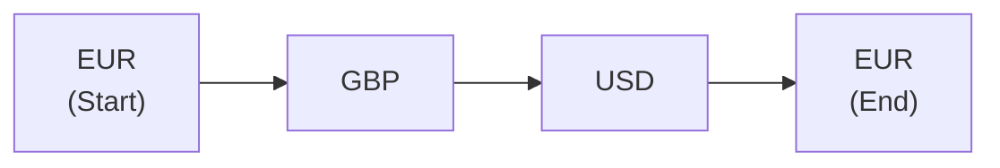

## Overview

I remember the first time somebody casually mentioned “triangular arbitrage” over coffee. I thought to myself, "Um, that sounds like something a magician would do, not a finance professional!" But it turns out it’s not magic at all—just a straightforward way to exploit exchange rate discrepancies among three different currencies.

Triangular arbitrage is all about ensuring consistency among exchange rates. If a currency pair is mispriced relative to their cross rate, a trader can bounce from one currency into another, then into a third, and back into the original to possibly lock in a riskless profit. Sounds simple enough, right? The key is spotting misalignments quickly.

This section examines how cross rates are derived, what triangular arbitrage is, how you can calculate it, and why it generally disappears the moment it appears—thanks to market efficiency. We’ll also walk through examples and highlight tips (and pitfalls) so that you’ll know when triangular arbitrage can actually be applied in real markets.

## Cross Rates Explained

A cross rate is the exchange rate between two non-reference currencies (often both are quoted against a third currency like the USD). For instance, if you have quotes for USD/EUR and USD/GBP, you can use those to figure out EUR/GBP. The formula is pretty direct:

If we denote:
• USD/EUR as the amount of USD per 1 EUR (let’s call this X),  
• USD/GBP as the amount of USD per 1 GBP (let’s call this Y),  

then, under direct quotes, EUR/GBP is typically:

( USD/EUR ) / ( USD/GBP ) = X / Y  

In words: "How many EUR do I get for one GBP?" or "How many GBP per EUR?" depends on how your quotes are set up. If you’re consistent with your quoting convention (e.g., all quotes are “price currency/base currency”), it’s usually X/Y or Y/X. The direction matters, so watch your fractions carefully.

### Example of Cross Rate Calculation

Let’s suppose:  
• USD/EUR = 1.2000 (i.e., 1 EUR = 1.20 USD),  
• USD/GBP = 1.4000 (i.e., 1 GBP = 1.40 USD).

If we want EUR/GBP (meaning, how many euros per pound), we divide:

EUR/GBP = (USD/EUR) / (USD/GBP) = 1.2000 / 1.4000 = 0.8571

So, 1 GBP is worth about 0.8571 EUR.  

If we wanted GBP/EUR instead, we’d invert that number: 1 / 0.8571 ≈ 1.1667.

These calculations might feel repetitive, but trust me, messing up the direction is such a common mistake it’s almost comical. I’ve lost track of the times I double-checked which currency was the base and which was the quote. And it’s crucial in triangular arbitrage, where even a tiny slip can wreck the entire trade.

## Triangular Arbitrage: The Big Picture

Triangular arbitrage is a strategy that exploits mispricing among three currency pairs. Conceptually, it looks like this:

1. You start with some amount of Currency A.  
2. You convert Currency A into Currency B.  
3. Then you convert Currency B into Currency C.  
4. And, finally, you convert Currency C back into Currency A.  

If, after these transactions, you end up with more of Currency A than you started with, you’ve effectively locked in a profit without taking any direct market risk (beyond transaction slippage). It might feel magical, but it’s really just arithmetic in disguise.

### Why Does Mispricing Occur?

In reality, severe currency mispricings are rare. We have highly liquid currency markets, electronic trading, and arbitrage-savvy participants who’d jump on any price discrepancy. That’s why most triangular arbitrage opportunities either don’t exist or vanish almost instantly. Yet, it’s still critical to understand the concept. It helps you see how currency quotes relate to each other, and it also underscores the power of market efficiency, a theme that resonates throughout Chapter 1 (Market Forces of Supply and Demand) and other sections on Market Efficiency in this volume.

### How Triangular Arbitrage Enforces Market Consistency

Let’s say you notice that the implied cross rate you compute from the quotes of two pairs doesn’t match the actual direct quote for the cross rate. You might do a quick cycle through the three currencies to profit from the discrepancy. By doing so, you’re effectively pushing prices back in line. Your buying and selling inject or withdraw liquidity and cause quotes to adjust. Ultimately, enough people do this, and the discrepancy disappears.

## Step-by-Step Triangular Arbitrage Illustrative Example

Let’s roll up our sleeves with a typical scenario. Suppose we have these quotes (all direct quotes in terms of Quote/Base, meaning how many quote currency units per one base currency unit):

• USD/EUR = 1.2000  
• USD/GBP = 1.4000  
• GBP/EUR = 1.1600  

Now, let’s check if the cross rates are consistent. If USD/EUR is 1.2000 and USD/GBP is 1.4000, the implied GBP/EUR should be (1.2000)/(1.4000) = 0.8571. However, the quoted GBP/EUR is 1.1600, which is much larger. There’s definitely a mismatch.

Let’s see how to exploit that. We’ll start with 10,000 EUR as our initial capital:

1. Convert EUR to GBP using the quoted GBP/EUR = 1.1600.  
   - This tells us: 1 EUR can buy 1.1600 GBP.  
   - So 10,000 EUR becomes 10,000 * 1.1600 = 11,600 GBP.  

2. Next, convert GBP to USD using USD/GBP = 1.4000.  
   - 1 GBP = 1.4000 USD, so 11,600 GBP becomes 11,600 * 1.4000 = 16,240 USD.  

3. Finally, convert USD to EUR using USD/EUR = 1.2000.  
   - 1 EUR costs 1.2000 USD, or 1 EUR = 1.2000 USD.  
   - So 16,240 USD can be converted back to EUR by dividing: 16,240 / 1.2000 = 13,533.33 EUR (approximately).  

Compare 13,533.33 EUR with your original 10,000 EUR—suddenly you have 3,533.33 EUR more. That’s your risk-free profit from the mispricing (pretty big, and probably unrealistic in well-monitored markets, but it’s a clear example of the concept).

### Checking for Realism

In reality, you’d pay various transaction costs, slippage, and the market quotes wouldn’t remain static while you completed each step. Also, big differences like 0.8571 vs. 1.1600 for GBP/EUR are extremely unlikely in a real market. But the principle? That’s exactly how arbitrage works. People see a mismatch, rush to trade, and price differentials close almost instantly.

## Diagram: Triangular Arbitrage Flow

Here’s a short Mermaid diagram showing the currency flow for the example. The path is EUR → GBP → USD → EUR:

You start with EUR, convert into GBP, then move from GBP to USD, then from USD to EUR. If the final EUR is more than the start, there's an arbitrage gain.

## Practical Considerations and Challenges

Even though this example seems straightforward, there are quite a few nuances in real markets:

• Transaction Costs: Spreads, commissions, and other fees can erase your profits if the discrepancy is not large enough.  
• Execution Speed: Currency quotes change by the second (or even millisecond if you’re using high-frequency trading systems). You might not get the same price across all three trades.  
• Mistakes in Quoting Conventions: Accidentally mixing up base and quote currencies can lead to serious confusion. Double-check everything.  
• Market Liquidity: While major currency pairs are highly liquid, crossing into exotic currencies might present slippage and wide spreads that eat away arbitrage gains.  

Another biggie: many participants use algorithms to continuously scan for such mispricings. If something even slightly favorable appears, trades can fire off faster than you can blink. That’s how markets become self-correcting and enforce the “law of one price” across currency pairs.

## Another Example with Detailed Rates

Let’s try a smaller discrepancy example. This time, let’s see if a more realistic deviation leads to arbitrage.

Quotes:  
• USD/EUR = 1.2500  
• USD/JPY = 100.00  
• EUR/JPY = 80.00  

Let’s see if that EUR/JPY quote is consistent with the implied cross rate from USD/EUR and USD/JPY. If we think of 1 EUR = 1.25 USD, and 1 USD = 100.00 JPY, then:

1 EUR should = 1.25 USD × 100.00 JPY/USD = 125 JPY

But the quote given is EUR/JPY = 80.00. That’s a big discrepancy. So:

1. Start with EUR 1,000.  
2. Convert EUR to USD at 1.2500 (1 EUR = 1.25 USD).  
   • 1,000 EUR = 1,000 × 1.25 = 1,250 USD.  
3. Convert USD to JPY at 100.00 (1 USD = 100 JPY).  
   • 1,250 USD = 1,250 × 100 = 125,000 JPY.  
4. Convert JPY to EUR at 80.00 (1 EUR = 80.00 JPY, or 1 JPY = 0.0125 EUR).  
   • 125,000 JPY can buy 125,000 / 80 = 1,562.5 EUR.  

You started with 1,000 EUR and ended with 1,562.5 EUR. Cha-ching: 562.5 EUR pure profit, ignoring transaction costs.

## Best Practices in Spotting Triangular Arbitrage

1. Keep a Real-Time Watch: Arbitrage opportunities are fleeting. Update your cross-rate calculations frequently if you’re an active FX trader.  
2. Normalize Quotes Correctly: Maintain consistent quoting formats across all currency pairs. If you’re mixing up direct/indirect quotes or base/quote currencies, you’ll get lost.  
3. Factor in Transaction Costs: Arbitrage might look wonderful in theory, but in practice, you must ensure your net gain exceeds all costs.  
4. Use Tools or Algorithms: Manual calculations can be slow. Automated systems can sniff out small discrepancies and execute near-instantaneous trades if you’re pursuing exchange-based arbitrage.  

## Potential Pitfalls

• Slippage: The price might move before your order is executed, reducing your profit or even turning it into a loss.  
• Human Error: Data entry mistakes are surprisingly common. For example, you might invert a rate that should not be inverted.  
• Overreliance on Public Quotes: Sometimes the best quotes come from specialized currency desks or off-exchange platforms. Public screens might be delayed or indicative quotes, not firm ones.  

## Linkages to Other Chapters

• From Chapter 7 (Monetary System, Monetary and Fiscal Policy): Exchange rates and interest rates are linked. Understanding interest rate parity (covered in Section 6.3) can help you see why triangular arbitrage seldom persists.  
• From Chapter 1 (Market Forces of Supply and Demand): Arbitrage is a prime example of market forces swiftly working to eliminate price discrepancies.  
• From Chapter 6.1 (Nominal versus Real Exchange Rates): Triangular arbitrage typically focuses on nominal exchange rates. Real exchange rates account for inflation differentials, which is more relevant for long-term exposures.  

Understanding these bigger-picture relationships can help you stay one step ahead in the currency game.

## Triangular Arbitrage in the Real World

Maybe you’re thinking, “This is all well and good in the textbook, but does this actually happen?” The truthful answer is, yes, but rarely. When it does happen, it’s generally corrected within microseconds by advanced trading bots and institutional traders. For the average portfolio manager, the main takeaway is not that you should attempt these trades yourself but that you should understand how exchange rates line up—and how quickly the market snaps them back into shape.

## Conclusion

Triangular arbitrage might sound fancy, but it’s really just a practical demonstration of how currency quotes must be consistent across pairs. Whenever a mismatch arises, a savvy (and extremely quick) trader can earn riskless profits. This is one of the strong reasons behind the well-known efficiency of currency markets.

If you walk away from this chapter remembering just one thing, let it be this: if your implied cross rate doesn’t match the posted cross rate, you can suspect a potential arbitrage. Get your numbers right, move fast, and keep an eye on those transaction costs. And if your next coffee break buddy drops the term “triangular arbitrage,” you can confidently break down the entire concept—and maybe even share your own favorite example.

## References and Further Reading

• Shapiro, A. C. (2013). “Multinational Financial Management.” Wiley.  
• [Investopedia: Triangular Arbitrage](https://www.investopedia.com/terms/t/triangulararbitrage.asp) – Basic definition and examples.  
• CFA Institute, “Currency Management: An Introduction,” in the CFA Program Curriculum (for deeper insights on FX market structure and parity conditions).  

----------

## Exam Tips for CFA Candidates

• Write out the logic behind your cross-rate formulas clearly. Graders look for understanding of the direction of currency conversions.  
• Show intermediate steps in your calculations. Partial credit is possible if the method is correct, even if you slip on a number.  
• Practice short “plug-n-chug” cross-rate examples so you can handle them quickly in the exam setting.  
• Watch your decimal places and quoting conventions. Many candidates lose easy points due to minor slipups in currency pairs.  
• Consider transaction costs even if not explicitly mentioned in the question. The exam might require you to comment on whether the described arbitrage is profitable after costs.

----------

## Test Your Knowledge: Triangular Arbitrage and Cross Rates



### Your firm has the following currency quotes: EUR/USD = 1.1000, USD/JPY = 110.00, and EUR/JPY = 122.00. What is the implied EUR/JPY cross rate from EUR/USD and USD/JPY?

- [x] 121.00
- [ ] 111.00
- [ ] 132.00
- [ ] 101.52

> **Explanation:**  
> Implied cross rate = EUR/JPY = (USD/JPY) × (EUR/USD) = (110.00) × (1.1000) = 121.00.

### Which of the following best describes triangular arbitrage?

- [x] Exploiting a mispricing among three currencies to earn a riskless profit
- [ ] A hedging strategy to reduce currency exposure across three currency pairs
- [ ] The practice of trading one currency pair through blockchain technology
- [ ] A method for diversifying a global equity portfolio across multiple regions

> **Explanation:**  
> Triangular arbitrage focuses on a mispriced cross rate among three currencies, allowing for riskless profit.

### Suppose you have the following exchange rates: AUD/USD = 0.7500, USD/NZD = 1.4000, and AUD/NZD = 1.0500. If you believe there is a triangular arbitrage opportunity, which chain of conversions would you likely perform first?

- [x] AUD → USD → NZD → AUD
- [ ] USD → AUD → NZD → USD
- [ ] NZD → USD → AUD → NZD
- [ ] AUD → NZD → USD → AUD

> **Explanation:**  
> To check for mispricing, you'd start with one currency (say AUD), convert it to USD, then to NZD, and finally back to AUD. The path you choose depends on the implied cross rate you suspect is incorrect.

### In a real market, why do triangular arbitrage opportunities generally disappear quickly?

- [x] Because other market participants rapidly trade away the discrepancy
- [ ] Because central banks intervene to fix exchange rates
- [ ] Because transaction costs are zero and universally known
- [ ] Because currencies are never mispriced

> **Explanation:**  
> Efficient markets and high-frequency traders quickly spot and correct any mispricing.

### You observe: USD/EUR = 1.2000, USD/CAD = 1.3000, and the posted EUR/CAD = 1.1200. What is the implied EUR/CAD cross rate from the given USD quotes?

- [x] 1.0833
- [ ] 1.5600
- [x] 1.0833
- [ ] 0.9231

> **Explanation:**  
> Implied EUR/CAD = (USD/CAD) / (USD/EUR) = 1.3000 / 1.2000 = 1.0833.

### Which condition is required for triangular arbitrage to yield a guaranteed or riskless profit?

- [x] The actual cross rate differs from the implied cross rate
- [ ] High transaction costs
- [ ] Government intervention in currency markets
- [ ] Limit orders in each currency pair

> **Explanation:**  
> Triangular arbitrage profits arise strictly from a difference between the market’s actual cross rate and the mathematically implied cross rate.

### Which of the following is NOT a common reason why a triangular arbitrage plan might fail to generate profits in practice?

- [x] Guaranteed trade execution speeds
- [ ] Slippage in currency quotes
- [x] Guaranteed trade execution speeds
- [ ] High transaction costs

> **Explanation:**  
> Fast execution is crucial; if the market moves or slippage hits before you complete trades, your expected profit evaporates. “Guaranteed trade execution speeds” do not typically exist in highly dynamic FX markets.

### In the context of triangular arbitrage, “market efficiency” refers to:

- [x] The rapid adjustment of currency prices to eliminate mispricing
- [ ] The elimination of non-deliverable forward markets
- [ ] The legal enforcement of exchange rate stability
- [ ] The ability to trade currencies 24 hours a day

> **Explanation:**  
> Market efficiency means that as soon as a mispricing occurs, traders step in, execute arbitrage transactions, and force the quotes back into alignment.

### A trader sees GBP/USD = 1.3000, USD/CNY = 6.5000, but the posted cross rate for GBP/CNY is 7.8000. The implied cross rate from GBP/USD and USD/CNY is 1.3000 × 6.5000 = 8.4500. Is there a potential arbitrage chance here?

- [x] Yes, because 7.8000 is lower than the implied rate of 8.4500
- [ ] No, because 7.8000 is higher than the implied rate of 8.4500
- [ ] No, because cross rates do not apply to these currency pairs
- [ ] Insufficient information

> **Explanation:**  
> The difference between 7.8000 and 8.4500 indicates a mispricing. A trader can exploit the discrepancy if transaction costs are low enough.

### Triangular arbitrage is considered “riskless” primarily because:

- [x] It involves simultaneous or near-simultaneous trades that lock in an immediate profit
- [ ] It relies on future contracts to hedge interest rate risk
- [ ] It guarantees profits over the long term regardless of market fluctuations
- [ ] Governments guarantee currency convertibility

> **Explanation:**  
> The idea is that you convert among currencies and end up at the starting currency within seconds or microseconds, locking in any mispricing immediately without exposure to underlying market moves over time.


