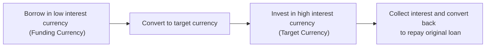

## Introduction
Sometimes folks talk about currency risk as if it’s the boogeyman that creeps up on your portfolio unannounced. And well, you know, in my early days of portfolio management, I swear I could almost feel this intangible “boogeyman” whenever the USD exchange rate started swinging wildly against emerging market currencies. That’s why a thorough knowledge of currency hedging, speculation opportunities, and the ever-popular carry trade can help you either keep that boogeyman at bay—or harness its power.

In today’s highly globalized markets, fluctuations in exchange rates can have a dramatic effect on investment returns. A well-structured hedging strategy might buffer your portfolio against adverse currency movements, while speculation might let you profit if you believe you see a trend coming. And then there’s the carry trade, a strategy that’s practically the poster child for seeking interest rate differentials. However, each approach demands a solid understanding of risk management, relevant regulations, and professional standards to ensure you’re applying them responsibly.

## The Purpose of Currency Hedging
Currency hedging, at its core, is about risk reduction. If an international equity fund manager purchases Japanese stocks denominated in JPY while measuring performance in USD, that manager faces foreign exchange (FX) risk. When the Japanese yen fluctuates against the USD, it can overshadow the underlying equity gains or losses. Hedging aims to neutralize (or at least reduce) this FX exposure and increase predictability of returns.

Under IFRS 9 (as well as relevant US GAAP guidelines), derivatives used for hedging can qualify for hedge accounting if specific documentation and effectiveness tests are met. This can influence how gains and losses on the hedge instruments are reported. For instance, a multinational company might lock in a forward rate to hedge upcoming payables or receivables in a foreign currency, limiting the unpredictability of future cash flows.

### Common Hedging Tools
• Forwards: Over-the-counter contracts to exchange currencies at a predetermined future date and rate.  
• Futures: Standardized versions of forwards traded on an exchange (e.g., Chicago Mercantile Exchange).  
• Options: Contracts giving the right, but not the obligation, to buy or sell a currency at a set price before or on a specified date.  
• Swaps: Agreements to exchange cash flows in one currency for cash flows in another. Currency swaps can lock in forex rates over time for interest and principal repayments.

## Tools for Currency Hedging
Imagine you’re an exporter about to receive EUR in six months. You’re worried the euro might depreciate against the USD in that timeframe, slashing the value of your future receipts. By entering into a forward or futures contract to sell EUR for USD at a locked-in exchange rate, you effectively insulate yourself from that adverse currency move.

Sometimes managers use an option-based hedge—a protective put option, for example—if they see potential reward in letting currency movements go in their favor, while seeking downside protection in case the currency turns the other way. Options can be more expensive than forwards or futures, but they give you that valuable upside optionality.

For large institutions, currency swaps might be chosen to manage long-dated exposures. If you’ve got a series of cross-border transactions, it can be more efficient to lock in ongoing currency exchanges for multiple future dates.  

In all these hedging scenarios, the main objective is the same: insure against currency risk so that your underlying investment or business operation’s returns remain stable.

## Speculation in Currency Markets
Then there’s the flip side—speculation. This is where market participants take on currency risk in hopes of making a profit from exchange rate movements. You might buy a currency in anticipation of its appreciation or short-sell a currency if you expect it to depreciate. For exam purposes, it’s helpful to recall speculative positions in:

• Spot Markets: Buying (going “long”) or selling (going “short”) a currency pair at current prices.  
• Derivatives: Using futures or options to gain leveraged exposure to a currency’s expected path.

Speculators often rely on macroeconomic indicators: interest rate announcements, inflation data, political stability, or central bank policy. They might also look to chart patterns or quantitative models to identify short-term price trends. A typical example is a hedge fund manager who sees telltale signs a central bank will raise interest rates. If that happens, the currency might appreciate. The trade: buy the currency now (or buy a call option).

### Ethical and Professional Considerations
From the CFA Institute’s Code of Ethics and Standards of Professional Conduct perspective, it’s crucial to maintain integrity when accessing information. For instance, if you have material nonpublic info about a prospective central bank intervention, exploiting that knowledge can violate Standard II(A): Material Nonpublic Information. Also, treat your clients equitably if you’re recommending currency speculation positions.

## The Carry Trade
A carry trade is kind of like that old notion of “borrow low, lend high.” You borrow in a low-interest-rate currency—often called the funding currency—and invest (or lend) in a high-interest-rate currency, the target currency. You pocket the interest rate spread, hoping exchange rates won’t shift against you.

Let’s say you find that currency A has a near-zero interest rate, while currency B has a 5% rate on short-term deposits. You borrow in currency A, convert to currency B (spot), invest at 5% in B, and then convert back to currency A at the end of the period to repay the loan. If the exchange rate is stable (or better yet, if currency B even appreciates), you earn the interest spread. However, if currency A appreciates relative to currency B, your conversions become more expensive, and you can lose significantly.

### Covered vs. Uncovered Interest Parity
Carry trades often relate to the concept of uncovered interest parity, which states that higher interest rates in the target currency are expected to be offset by currency depreciation in the future. This is not guaranteed, of course. Covered interest parity, which uses forward or futures markets to lock in exchange rates, generally holds more consistently in efficient markets because arbitrage eliminates risk-free profits.

## Risk Management
Currency markets can shift rapidly due to geopolitical shocks, changes in monetary policy, or random investor sentiment. In hedging, speculation, or carry trading, robust risk controls are essential. This involves:

• Setting position limits to contain overall exposure.  
• Implementing stop-loss or take-profit orders.  
• Stress testing potential adverse scenarios (e.g., using sensitivity analysis or scenario analysis).  
• Monitoring margin requirements in derivatives markets.  
• Diversifying across multiple trading strategies or currency pairs.  

Overconfidence bias can creep in if you’re consistently profitable in carry trades or speculation. One day you’re counting your interest spread, and the next day a surprise interest rate hike in your funding currency can invert your profit. Always consider the possibility of black swan events or unexpected macro trends—like central banks intervening to devalue their currencies.

## Visualizing a Carry Trade
Below is a simple Mermaid diagram illustrating a streamlined carry trade:

This flow seems straightforward: borrow cheaply, invest at a higher yield, and reap interest. The critical question: What if the funding currency appreciates sharply? You’d need more of the target currency to repurchase the funding currency loan. Boom—carry trade blow-up.

## Practical Example: Forward Hedge
Let’s do a brief numeric example to highlight hedging with a forward. Suppose a US-based investor has a future receivable of EUR 1,000,000 in three months:

• Spot EUR/USD rate = 1.1000 (meaning 1 EUR = 1.10 USD).  
• Forward Points for three months = +100 pips (roughly +0.0100).  

Then the three-month forward EUR/USD rate is 1.1100 (1.1000 + 0.0100 = 1.1100). By entering a forward contract to sell 1,000,000 EUR at 1.1100 USD/EUR in three months, the investor locks in a receivable of $1,110,000. Regardless of what happens to EUR/USD over the next three months, that is what the investor will receive, effectively hedging the currency risk.

## Real-World Implementation
• Multinational Corporations: They routinely hedge currency exposure for upcoming transactions (payables, receivables, intercompany loans), often using forward contracts or currency swaps.  
• Fund Managers: They decide whether to hedge or remain unhedged based on their house view on exchange rates and risk tolerance. For instance, an ABC Global Bond Fund might systematically hedge certain currency exposures while leaving others open for alpha generation.  
• Hedge Funds: Speculate in currencies or execute carry trades, sometimes leveraging multiple times. They combine interest rate forecasts, macroeconomic models, and technical analysis to spot mispricings.  
• Individual Investors: Might buy or sell currency ETFs or options to express a speculative view—though the notional amounts can be large, so caution is paramount.

## Conclusion
Currency hedging, speculation, and carry trading are distinct strategies, but they coexist in a global marketplace teeming with opportunities and risks. Hedging tries to remove unwanted exposure. Speculation aims to profit from predicted moves. Carry trades look to exploit interest rate differentials. But, oh boy, every strategy demands your respect for risk and a robust knowledge of the market. After all, exchange rates can be as fickle as the weather.

From a CFA perspective, these currency strategies also reflect the Code and Standards—particularly issues around risk disclosure, fair dealing, suitability, and the use of derivatives. A professional approach ensures you communicate these strategies effectively to clients or stakeholders, manage them responsibly, and remain compliant with all relevant accounting requirements and ethical standards.

## Final Exam Tips
• Understand how to interpret forward rates, forward points, and how to calculate forward premiums/discounts for exam-based item sets.  
• Remember the difference between covered and uncovered interest parity and their role in arbitrage-based questions.  
• Be ready for scenario analysis: a question might present an unexpected shift in interest rates or currency values, asking you to evaluate how a hedged or unhedged position would be affected.  
• Note that exam questions often test your knowledge of net payoff under different hedging strategies (forwards, futures, options) and your ability to choose the best hedge given cost and risk scenarios.  
• Watch out for the time value of money in a carry trade calculation. The exam might require you to discount or compound interest amounts appropriately.  
• Keep an eye on ethics: advanced item sets might present situations with potential misuse of material nonpublic information or conflicts of interest.  

In the Level III exam (though you’re introducing these concepts at Level I, they continue to matter in advanced portfolio management contexts), constructed-response questions might ask you to outline how to manage currency risk in a multi-asset portfolio or how to handle a mismatch in currency durations. clarity, thoroughness, and the ability to integrate code-and-standards considerations will be essential.

## References
• Burnside, C. (2011). “Carry Trades and Risk.” NBER Working Paper.  
• CME Group – Currency Futures. Available at: [CME Group FX](https://www.cmegroup.com/trading/fx/)  
• IFRS 9 Financial Instruments for Hedge Accounting  
• CFA Institute Standards of Practice Handbook (most recent edition)  

## Test Your Knowledge: Currency Hedging, Speculation, and Carry Trades



### Which of the following best describes the primary objective of currency hedging?

- [x] To reduce or eliminate foreign exchange risk.
- [ ] To maximize speculative gains from currency fluctuations.
- [ ] To profit from uncovered interest parity mispricing.
- [ ] To always create a net long position in a foreign currency.

> **Explanation:** Currency hedging is used to protect against undesired exchange-rate risk. It can help stabilize cash flows and lock in value instead of seeking speculative profit.

### An investor who borrows in a currency with a 1% interest rate and invests in a currency with a 4% interest rate is engaged in:

- [ ] A forward currency hedge.
- [ ] Intraday speculation.
- [x] A carry trade.
- [ ] A covered interest arbitrage.

> **Explanation:** In a classic carry trade, you borrow in the low-interest-rate currency and invest in the higher-yielding currency, pocketing the interest rate spread if exchange rates remain stable.

### In an options-based hedge, entering a long call on a foreign currency would protect against what risk?

- [ ] Risk of the foreign currency depreciating.
- [x] Risk of the foreign currency appreciating.
- [ ] Risk of the domestic currency strengthening unexpectedly.
- [ ] Risk of the option expiring worthless regardless of exchange rate movement.

> **Explanation:** A long call on a foreign currency gives the right to buy the currency at a set price. This locks in an upper limit on the effective cost if you need the foreign currency and fear its appreciation.

### A surprise interest rate hike in the funding currency of a carry trade may result in:

- [ ] No impact, as carry trades are immune to interest rate changes.
- [x] Adverse performance, because the funding currency can appreciate.
- [ ] Automatically offsetting gains in the target currency.
- [ ] Positive performance due to immediate interest rate parity adjustments.

> **Explanation:** If the funding currency appreciates, you need more of the target currency to repay your funding loan, which erodes or reverses carry trade profits.

### Which of the following statements about forward and futures contracts is most accurate?

- [x] Forwards are customized and traded over the counter, whereas futures are standardized and traded on exchanges.
- [ ] Both forwards and futures must be held to expiration without exception.
- [x] They carry no credit risk for either party.
- [ ] Margins are rarely required for either forwards or futures.

> **Explanation:** Forwards are private, customizable contracts with some counterparty risk. Futures are standardized, exchange-traded, and subject to margin requirements.

### Under IFRS 9, for a currency derivative to be used as a hedging instrument in hedge accounting, it must:

- [x] Be designated in a qualifying hedging relationship with documentation and effectiveness assessment.
- [ ] Show a premium paid upfront, regardless of contract type.
- [ ] Not be susceptible to credit risk from a counterparty.
- [ ] Be strictly an options contract.

> **Explanation:** IFRS 9 introduces specific documentation and effectiveness testing requirements for derivatives to qualify for hedge accounting. It applies to various derivative types, not just options.

### In speculative currency trading, a trader who “shorts” a currency:

- [x] Borrows and sells the currency, anticipating a decline in its value.
- [ ] Temporarily stops trading due to margin constraints.
- [x] Takes a bullish view, believing the currency will appreciate.
- [ ] Buys a call option on the currency at below-market strike prices.

> **Explanation:** Shorting a currency means selling something you don’t own, hoping to buy it back later at a lower price. This is a bearish bet on the currency.

### A US-based firm has future liabilities in Japanese yen. To hedge, it might:

- [x] Enter a forward contract to buy yen at the future date.
- [ ] Enter a short forward position on the yen.
- [ ] Borrow yen without converting them.
- [ ] Place yen in a local bank at prevailing interest rates.

> **Explanation:** If you owe yen in the future, you hedge by locking in the yen purchase rate, typically with a forward contract to buy yen at a known price.

### Which of the following is most characteristic of uncovered interest parity (UIP)?

- [ ] Exchange rates are locked in with no currency risk for cross-border transactions.
- [ ] Forward contracts always eliminate mismatched currency interest rates.
- [ ] Investors face no interest rate differentials in equilibrium.
- [x] The expected appreciation or depreciation of a currency offsets any interest rate advantage.

> **Explanation:** UIP suggests that a higher interest rate currency is expected to depreciate so that no arbitrage is possible, although in practice, deviations like profitable carry trades may arise.

### True or False: If you want unlimited upside potential but limited downside risk in currency exposure, a long forward contract is the best choice.

- [ ] True
- [x] False

> **Explanation:** A forward contract obligates you to transact at a set price, providing no upside beyond the forward rate—it merely fixes your future exchange rate. For unlimited upside yet limited downside, you’d typically use a call or put option.


