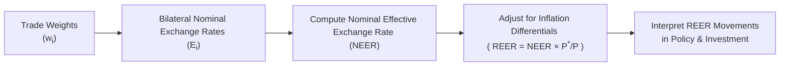

## Overview

It’s one thing to keep an eye on the US dollar versus the euro or the Japanese yen—like when we talk about EUR/USD or USD/JPY specifically. But, you know, in practice, no country trades with just a single partner. That’s why economists and analysts often use something called an "effective exchange rate index." An effective exchange rate index measures a currency’s value against a basket of other currencies, with each currency weighted by how important that country is as a trading partner.

When I first got involved in currency research, I distinctly remember rummaging through a stack of bilateral exchange rates, trying to figure out how my home currency was performing "on average." The task felt like juggling a dozen different exchange rates. Then someone introduced me to effective exchange rate indices (ERIs). Let me tell you, the day I discovered that I could reference a single index that blended all those exchange rates (with weights attached!) was a total eureka moment.

In this section, we’ll explore how effective exchange rate indices come together, why they matter for analyzing economic competitiveness, and how you might find them turning up on the CFA® exam and in real-world portfolio decisions. We’ll look at both the nominal effective exchange rate (NEER) and the real effective exchange rate (REER), and we’ll examine how inflation differentials matter. As we go along, we’ll tie it all together with a few practical examples and a cautionary note on the pitfalls of reading too much (or too little) from these metrics.

## Nominal Effective Exchange Rate (NEER)

Let’s start with the nominal effective exchange rate (NEER). The NEER is basically a weighted average of a home currency’s bilateral exchange rates against several foreign currencies. It does not care about inflation; it just focuses on nominal exchange rates and how important each trading partner is to the home country’s trade.

You might see notation like:

$$
\text{NEER} = \sum_{i=1}^{n} w_i \times E_i
$$

where:  
• \\(w_i\\) = weight of the \\(i^{\text{th}}\\) currency in the basket, typically based on trade shares (imports, exports, or total trade).  
• \\(E_i\\) = current nominal exchange rate of the \\(i^{\text{th}}\\) currency versus the home currency.  

Here, an exchange rate \\(E_i\\) might be expressed in "units of foreign currency per unit of home currency." If you see it expressed inversely, that’s fine too—just make sure you’re consistent in your calculations.

### Why Use NEER?

• To get a broad snapshot of a currency’s external performance without having to spend hours comparing multiple exchange rates.  
• To track the overall moves in a currency’s value over time.  
• To help policymakers and analysts see patterns in currency strength or weakness, independent of more complex adjustments like inflation.  

### Limitations of NEER

• It ignores price-level changes, so it doesn’t fully capture competitiveness.  
• A rising NEER might look like the currency is strengthening, but if domestic inflation is higher than in trading partners, you might be losing competitiveness despite the nominal measure.  

## Real Effective Exchange Rate (REER)

If the NEER is the unadjusted, "raw" measure, the real effective exchange rate (REER) is the inflation-adjusted measure, and it’s crucial for capturing the idea of "competitive" exchange rates. The REER modifies the NEER by factoring in price (or cost) differences between the home country and its trading partners. Formally, you might see something like:

$$
\text{REER} = \text{NEER} \times \frac{P^*}{P}
$$

where:  
• \\(P\\) = price level (or cost index) at home (often the Consumer Price Index, CPI).  
• \\(P^*\\) = weighted average of foreign price levels.  

This ratio \\(\frac{P^*}{P}\\) adjusts for the fact that if home inflation is higher than foreign inflation, your real exchange rate becomes effectively stronger. If your inflation is lower, your real exchange rate becomes relatively weaker.

### Why Is REER So Important?

• It tells you about the international competitiveness of your exports. Higher REER suggests your goods are becoming more expensive internationally, which might dent export potential.  
• Central banks and governments often track REER as part of policy discussions about trade imbalances, import competitiveness, and more.  
• In investment analysis, a rising REER might foreshadow a slowdown in export-driven corporate earnings or conversely indicate a shift in consumption toward cheaper imports.  

### A Quick Illustrative Example

Suppose a country’s NEER stays unchanged for a year. But the home country experiences a 5% inflation rate, while its major trading partners collectively average just 2% inflation. The real effective exchange rate would rise, because even though the nominal exchange rate didn’t move, the home country’s goods became pricier relative to foreign goods.

## Calculation Methods

Before diving deeper into the interpretation, let’s outline how NEER and REER calculations might look in more detail.

### Step 1: Choose the Currency Basket and Weights

Most effective exchange rate calculations start with selecting top trading partners. Say a country trades mostly with partners A, B, and C. Then you assign each partner a weight \\(\{w_A, w_B, w_C\}\\) proportional to trade flow (exports plus imports), possibly adjusted for trade in individual industries.

### Step 2: Gather Bilateral Exchange Rates

You measure your home currency against each partner’s currency. If you have more trade data, you might refine those weights by time period or type of goods, but the general idea is the same.

### Step 3: Compute the Nominal Index

Add up the weighted exchange rates. The formula can look a little different depending on whether you measure exchange rates directly (units of foreign currency per home currency) or inversely (units of home currency per foreign currency). In practice, many central banks or research institutions maintain standardized NEER indexes, so you might not have to calculate it from scratch daily unless you’re an analyst building models.

### Step 4: Adjust for Price Levels to Get the REER

In real terms, you’ll incorporate an index of relative prices. Sometimes analysts use consumer price indexes (CPIs). Other times they might prefer producer price indexes (PPIs), unit labor costs, or GDP deflators. The choice often depends on the aspect of competitiveness you’re trying to measure (e.g., cost of consumer goods vs. cost of production inputs or wages).

In short, we can imagine:

1. Calculate NEER.  
2. Multiply NEER by the ratio of foreign price level to home price level (each weighted by how important the respective trading partner is).  

If you prefer, you can do the weighting on the price level side as well, so that each partner’s price index is represented in proportion to their trade share.

### Visual Guide

Below is a simple flowchart that highlights the process of deriving NEER and then adjusting to get REER:

## Interpreting Effective Exchange Rate Indices

### Rising NEER

If your NEER is rising, it typically means your currency is, on average, strengthening against your trading partners’ currencies. But we can’t conclude you’re losing export competitiveness unless we factor in inflation, because a strong nominal exchange rate might be offset by relatively low domestic inflation.

### Rising REER

If the real effective exchange rate rises, it means your currency and domestic price levels have, collectively, made your goods more expensive relative to your top trading partners. That’s often interpreted as a "loss in competitiveness." Now, whether that’s always bad depends on context. If you’re mostly an importer, a stronger REER might improve your purchasing power of imports. But for a net exporter, it can be a drag on growth.

### Falling REER

If the REER is falling, your goods are likely becoming cheaper relative to foreign goods, boosting export competitiveness. This can be good for local industries driven by export sales—though it might put upward pressure on domestic inflation for imported goods.

### Policy and Investment Implications

• **Monetary policy**: Central banks watch REER to see if their currency is becoming uncompetitive. A central bank might adjust interest rates (or use other tools) if it sees a trend that’s detrimental to the broader economy.  
• **Trade policy**: Governments may respond to shifts in competitiveness. If REER appreciation is significant, you might see lobbying from export industries for relief or incentives.  
• **Portfolio decisions**: Changes in REER can shift performance among sector-specific stocks, especially export-oriented industries. Currency movements also affect fixed-income returns for international investors.  

## Real-World Examples

### Case: Euro vs. a Basket of Currencies

Consider the euro. If it strengthens significantly against the US dollar, but simultaneously weakens relative to the Swiss franc and the British pound, the net effect on the NEER or REER depends on how the Eurozone’s trade is split among the US, Switzerland, and the UK.

If the US accounts for 50% of Eurozone external trade, the UK accounts for 30%, and Switzerland accounts for 20%, you’ll get a big upward boost in the effective rate from the euro-dollar move, potentially overshadowing the effect of the euro's weakness against the franc and the pound.

### Case: A Country Facing Persistent High Inflation

In the 1980s, many emerging markets had persistent inflation. If their nominal exchange rate was pegged or changed slowly, their domestic price level could skyrocket relative to key trading partners. In NEER terms, maybe the index didn’t shift too much. But the REER soared, hammering export competiveness. Eventually, the central banks were forced to devalue or let the currency float to restore a more balanced real exchange rate.

## Potential Pitfalls and Common Mistakes

1. **Ignoring Trade Weights**: Some think effective exchange rates are just the average of exchange rates. You absolutely need to weight each currency’s importance, or you’ll get a misleading picture.  
2. **Forgetting Price Adjustments**: Analysts who only look at NEER might be misled about competitiveness if inflation is high at home or abroad.  
3. **Mismatch in Indices**: Using the CPI for one country and PPI for another can distort results. Consistency is key.  
4. **Overreliance**: An effective exchange rate is a handy summary measure, but it doesn’t replace deeper analysis of different sectors, timing of trade flows, or the composition of imports and exports.  

## Relevance for the CFA® Exam

Effective exchange rates might appear in item-set questions or short-answer (structured response) formats. You might be asked to:

• Calculate NEER given a set of bilateral rates and trade weights.  
• Derive REER by applying inflation differentials.  
• Interpret the results for trade implications or monetary policy.  

In some scenarios, you’ll have to connect these calculations to portfolio management decisions:

• How does a rising REER affect an exporter’s profitability?  
• Would you hedge currency exposure differently if you see a strong appreciation in the real exchange rate?

Remember, exam questions often test your ability to interpret these indices in the context of cross-border investing, foreign currency exposures, and price competitiveness.

## Conclusion

Effective exchange rate indices provide a single, integrated view of a currency’s overall external value. NEER offers a purely nominal snapshot, while REER accounts for relative price changes and, thus, competitiveness. Analysts, policymakers, and global investors each have a stake in following these measures. Whether you’re exploring the broad direction of the US dollar or grappling with a smaller country’s competitiveness, the effective exchange rate approach can help you see the forest rather than the trees.

Sometimes, though, it’s easy to forget how each piece—trade weighting, inflation, bilateral rates—plays a crucial role. But after you’ve done a few sample calculations and watched how they shift over time, you’ll quickly appreciate why bankers, economists, and CFOs alike keep these measures close at hand.

---

## References

• Chinn, M. (2006). “A Primer on Real Effective Exchange Rates.” Review of International Economics.  
• Bank of England – Effective Exchange Rates (https://www.bankofengland.co.uk/) – Offers official NEER and REER data, methodology, and insights.  
• CFA Institute Level I Curriculum, 2025 Edition.  
• International Monetary Fund’s Exchange Rate Indexes – For additional aggregated data sets on effective exchange rates.

---

## Test Your Knowledge: Effective Exchange Rate Indices



### 1. What is the primary distinction between a nominal effective exchange rate (NEER) and a real effective exchange rate (REER)?

- [ ] NEER is used only for developed markets while REER is used for emerging markets.  
- [x] NEER excludes inflation differentials, whereas REER accounts for relative price levels.  
- [ ] NEER is calculated only by central banks, while REER is calculated by commercial banks.  
- [ ] NEER uses GDP deflators only, while REER relies exclusively on CPI data.  

> **Explanation:** NEER is a weighted average of nominal exchange rates, while REER further adjusts for inflation (relative price levels) to measure competitiveness more accurately.

### 2. A rising REER generally implies:

- [ ] An improvement in domestic export competitiveness.  
- [ ] A decreasing domestic exchange rate relative to other currencies.  
- [x] Domestic goods have become relatively more expensive abroad.  
- [ ] Foreign currency values are converging with the domestic currency.  

> **Explanation:** A higher REER indicates the home currency and domestic prices have appreciated in real terms, making home goods more expensive relative to trading partners’ goods.

### 3. Which of the following data points is most critical when calculating NEER?

- [ ] The country’s nominal GDP growth rate.  
- [ ] The domestic unemployment rate.  
- [x] The share of trade (weights) with each partner’s currency.  
- [ ] The yield on government securities.  

> **Explanation:** NEER relies on bilateral exchange rates weighted by the proportion of trade with each partner. Without proper trade weights, the index can be distorted.

### 4. If a country’s NEER remains constant but its domestic inflation is higher than that of its trading partners, what happens to the REER?

- [ ] The REER stays the same.  
- [ ] The REER decreases.  
- [x] The REER increases.  
- [ ] The REER goes to zero.  

> **Explanation:** Higher domestic inflation, relative to foreign inflation, raises domestic prices, making exports less competitive and thereby increasing the real effective exchange rate.

### 5. When computing the real effective exchange rate, which of the following pairs is typically used?

- [x] NEER and a price index.  
- [ ] NEER and a measure of money supply (M1).  
- [ ] Bilateral exchange indices for three major trading partners.  
- [ ] REER and interest rate differential.  

> **Explanation:** REER is derived by adjusting the NEER for inflation differentials, typically using a price index (CPI, PPI, or another suitable measure).

### 6. One limitation of focusing solely on NEER is:

- [ ] It relies too heavily on inflation data.  
- [x] It does not account for domestic vs. foreign inflation differences.  
- [ ] It cannot be applied to developed economies.  
- [ ] It fails to track exchange rates across multiple currencies.  

> **Explanation:** NEER doesn’t consider changes in relative prices (inflation). So it fails to indicate whether goods are becoming more or less competitive, which REER captures.

### 7. In the context of REER, a high inflation country with a fixed exchange rate most likely experiences:

- [x] An increase in REER, indicating loss of competitiveness.  
- [ ] A decrease in REER, increasing export competitiveness.  
- [x] Potential future currency devaluation to rebalance competitiveness.  
- [ ] Rapid import growth with stable export growth.  

> **Explanation:** With a fixed nominal exchange rate, rising prices at home lead to a higher REER. Eventually, competitiveness deteriorates, prompting potential currency adjustments.

### 8. Suppose Country X has embedded trade weights of 40% for the US dollar, 30% for the euro, and 30% for the yen. The country experiences a strong inflation surge. Which measure would best reflect the new loss of competitiveness for Country X?

- [ ] Nominal bilateral rate for the USD.  
- [x] Real Effective Exchange Rate (REER).  
- [ ] Unweighted average of bilateral exchange rates.  
- [ ] Nominal Effective Exchange Rate (NEER).  

> **Explanation:** REER incorporates inflation to capture competitiveness. So if inflation in Country X rises, REER will reveal this change in real competitiveness more accurately than NEER alone.

### 9. Which of the following is the best reason policymakers watch REER?

- [ ] To track exclusive asset returns in domestic markets.  
- [x] To monitor the country’s export competitiveness and overall external balance.  
- [ ] To set daily currency exchange rates in forward markets.  
- [ ] To decide monetary policy exclusively for domestic inflation control.  

> **Explanation:** Policymakers watch REER to see if domestic goods are becoming more or less expensive compared to foreign goods, which directly influences trade flows and external balances.

### 10. True or False: A nominal effective exchange rate index accounts for inflation rates among all trading partners.

- [x] False  
- [ ] True  

> **Explanation:** By definition, NEER is a weighted average of bilateral nominal exchange rates and does not adjust for inflation or price-level changes.




