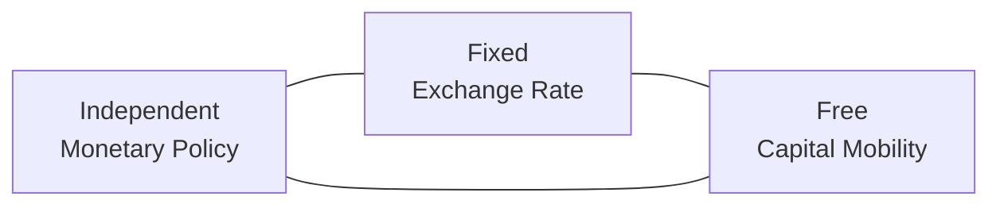
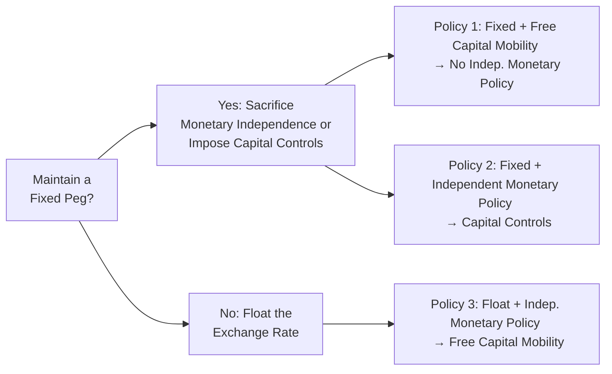

## Overview and Intuition

So, have you ever wondered why some countries peg their exchange rates and yet sometimes seem to have no real say over their own interest rates, while others have a floating currency but get hammered by volatile capital flows? That kind of situation is hardly a coincidence. In fact, there’s a famous concept called the Impossible Trinity—also called the Trilemma—that insists you can’t have it all. Specifically, you can’t simultaneously enjoy free capital flows, a fixed exchange rate, and a fully independent monetary policy. It’s a little like trying to juggle three bowling balls with just two hands. You might manage two of them, but keeping all three in the air at once? Good luck.

We’ll dig into what that actually means, how it impacts real countries, and how this principle, or constraint, shows up in policy decisions around the globe. And if you’ve ever looked at how central banks scramble when big capital inflows or outflows threaten their currency pegs, you’ll see the Impossible Trinity in action.

## Core Concepts of the Trilemma

Picture a triangle with three corners:

• One corner is Independent Monetary Policy: That’s your central bank’s ability to set interest rates and manage the money supply purely according to domestic objectives, like controlling inflation or spurring economic growth.

• Another corner is a Fixed Exchange Rate: This means the currency is pegged (or stabilized) against another currency or a basket of currencies, thereby reducing exchange-rate volatility. This can be great for businesses who hate foreign-exchange uncertainty, but it can also be restrictive.

• The last corner is Free Capital Mobility: This is the freedom for money to move across borders without restrictions. Investors love it, but it can cause big swings in capital flows.

The Impossible Trinity says you can pick two of these corners, but you must sacrifice the third. If, for instance, you want free capital mobility and a fixed exchange rate, you will have to give up an independent monetary policy. Likewise, if you want a fixed exchange rate and monetary policy independence, you can’t allow unrestricted capital flows. And if you want monetary policy independence and free capital flows, your exchange rate has to be flexible.

## Why Is This “Impossible”?

It might be helpful to think in terms of how money “arbitrages” between interest rates. Suppose your currency is pegged to another at a fixed rate, and your central bank tries to raise interest rates to fight inflation at home. If capital is free to flow in or out of your economy, foreign investors will flock in to take advantage of that higher rate, driving up the demand for your currency. Normally, that surge in demand would push your currency upward. But your exchange rate is supposedly fixed, so the central bank has to intervene—often by selling your currency and buying foreign currency—to maintain the peg. Over time, this can require enormous foreign-exchange reserves. If you do the opposite (say, you lower interest rates), capital might flee, pushing down your currency. Maintaining the peg means you have to buy your currency in the foreign-exchange market, which can also deplete your reserves. You quickly realize that a pegged exchange rate plus no restrictions on capital inflows and outflows effectively glues your domestic interest rates to the benchmark interest rates of the currency you’re pegging to.

In short, a central bank that tries to do anything different from the “anchor” currency’s central bank is forced to spend resources defending the peg. Eventually, that cost is too high. The Impossible Trinity ensures you can’t beat the market if you let capital move freely and you try to hold your exchange rate fixed.

## Policy Trade-Offs and Strategies

Countries all around the world manage this trilemma in different ways. In practice, no single solution is perfect for everyone at all times. Policy makers weigh national priorities—like controlling inflation, promoting exports, attracting foreign investment, or stabilizing domestic financial markets—and choose which corners of the triangle to keep and which to surrender.

### 1) Fixed Exchange Rate + Free Capital Mobility
Under this arrangement, the central bank maintains a stable (often pegged) exchange rate against a major currency or a basket while allowing cross-border flows with minimal restrictions. The result? You lose pretty much all autonomy in setting domestic monetary policy. Interest rates in your economy generally have to mirror the interest rates of the anchor currency’s central bank to maintain the peg. For instance, Hong Kong operates under a currency board system pegged to the US dollar. If the Federal Reserve tweaks interest rates, the Hong Kong Monetary Authority (HKMA) typically adjusts its rates accordingly to keep that peg stable.

### 2) Fixed Exchange Rate + Independent Monetary Policy
Here, your currency is pegged or managed in a narrow band, and your central bank wants to steer domestic interest rates in line with local economic needs. Let’s say your economy is overheating, and you want to raise interest rates. But to keep your peg, you also need to resist large inflows of capital. The compromise is capital controls. You might impose limits on the foreign exchange that individuals or companies can purchase, or you might tax certain types of cross-border transactions. Until a decade or two ago, China maintained a (mostly) fixed exchange rate and an independent monetary policy, relying on strict controls for capital flows. While these capital controls weren’t leakproof, they gave China’s central bank much more latitude in setting interest rates than it would have had with fully open capital borders.

### 3) Independent Monetary Policy + Free Capital Mobility
In this scenario, the exchange rate is left to float. Countries that prioritize internal policy goals (inflation targeting, for example) and want to remain open to global capital typically choose a floating or at least a managed-floating arrangement. This is what the United States has done for many years. By letting the dollar’s value fluctuate in the open market, the Federal Reserve isn’t constrained because they have no formal peg to defend. They can raise or lower rates as the domestic economy dictates since capital flows essentially adjust the exchange rate. Of course, a floating exchange rate means that businesses and investors face exchange risk, but the Fed has a freer hand in monetary policy.

To help visualize these three choices, see the table below:

| Policy Choice                                                         | What You Gain                                                                          | What You Sacrifice                                                             |
|----------------------------------------------------------------------|----------------------------------------------------------------------------------------|---------------------------------------------------------------------------------|
| Floating Exchange Rate +   Free Capital Mobility                  | • Independent monetary policy   • Exchange rate can absorb external shocks         | • Potentially higher exchange-rate volatility   • Currency risk in trade   |
| Fixed Exchange Rate +   Free Capital Mobility                     | • Exchange-rate stability   • Reduced currency risk for trade and investment       | • No monetary policy independence   • Must align domestic rates with anchor |
| Fixed Exchange Rate +   Independent Monetary Policy              | • Exchange-rate stability   • Control over domestic interest rates                 | • Must impose capital controls   • Reduced cross-border investment freedom  |

## Real-World Illustrations

• Eurozone: Member countries have essentially locked themselves into one exchange rate (the euro) and they have free capital mobility within the bloc. This arrangement forces them to cede independent monetary policy to the European Central Bank. If Germany wants a different interest rate from, say, Spain, well, tough luck, because policy is set centrally for the entire Eurozone.

• Hong Kong’s Currency Board: The Hong Kong dollar is fixed to the US dollar, and capital is allowed to move freely across Hong Kong’s borders. Consequently, Hong Kong relinquishes an autonomous monetary policy and effectively tracks the Federal Reserve’s stance.

• China’s Historical System: For many years, China prioritized a tightly managed exchange rate pegged to the US dollar, but it also wanted the ability to set domestic monetary policy. This required capital controls, restricting how and when money could flow in and out of the country.

## Examining Monetary Policy Implications

From a CFA perspective—actually from any perspective—understanding the trilemma sheds light on central-bank behaviors:

• Interest Rate Decisions: If a country runs a strict peg, interest rate moves are often designed more to maintain that peg than to address domestic inflation or stimulate local economic growth. This can create internal imbalances over time.

• Capital Flow Management: Countries with pegged or heavily managed exchange rates, but who also desire some monetary autonomy, frequently resort to tools like taxation of capital inflows (e.g., a “Tobin tax”), limit on foreign ownership of assets, or even requiring special approvals before large sums can cross borders.

• Exchange-Rate Volatility: Floating exchange rates can be volatile, exposing businesses and investors to currency risk. On the flip side, this flexibility helps an economy adjust better to external shocks—like global financial crises—by letting the currency appreciate or depreciate in response to supply and demand.

• Reserves Management: Central banks—especially those with a currency peg—often hold large reserves of foreign currency to defend that peg. In a crisis, these reserves can vanish quickly if the market doubts the sustainability of the regime. Think of the Asian Financial Crisis in 1997, where countries like Thailand tried defending their pegs with finite reserves until they finally had to devalue.

## Practical Tips, Pitfalls, and Strategies

• Be Wary of Speculative Attacks: If a country wants a fixed peg plus free capital flows, it’s vulnerable to speculative currency attacks. Investors who suspect a peg is overvalued will short the currency en masse, forcing the central bank to spend reserves defending it. George Soros famously bet against the Bank of England in 1992, leading to the collapse of the pound’s peg in the European Exchange Rate Mechanism.

• Understand Political Realities: Sometimes, governments choose a pegged currency arrangement because it’s politically popular to maintain a stable exchange rate, especially for countries that rely heavily on foreign trade. But this can hamper a central bank’s ability to fight domestic inflation or unemployment.

• Use Floating as a Pressure Valve: Many economists argue that letting the exchange rate float can help your economy ride out external shocks—like a global slowdown or commodity-price swings. The exchange rate adjusts, relieving some of the tension on your domestic economy.

• Partial Float or Managed Float: Not all countries choose a 100% free float. Some adopt a managed-float system, using periodic intervention to smooth out extreme currency volatility. They might allow capital flows to remain relatively free but keep an eye on big market moves. Brazil has often done something like this, intervening occasionally in foreign-exchange markets to curb excessive volatility.

• Communication Matters: If you’re a central banker, be mindful of how you communicate policy intentions. Markets are sensitive. If you claim to keep a peg but there’s suspicion your reserves are running thin, that can trigger the very speculative attack you fear.

## A (Slightly) Personal Perspective

I remember studying the Impossible Trinity and thinking, “Oh, I’m sure countries have found clever ways around that by now.” But the more you read, the more you see countries run into real trouble if they try to circumvent it. I once spoke with a friend working in Hong Kong’s financial sector who recounted how day-to-day, people rarely question the peg. But whenever the Fed hikes rates quickly, Hong Kong’s entire mortgage market feels it, because local banks must follow suit, even if Hong Kong’s domestic economy isn’t overheating. It’s a classic example of “you can’t have your cake and eat it too” in monetary policy.

## Diagram of Policy Choices

We can illustrate the typical paths policymakers might choose given the constraints:

This flowchart highlights the essential policy fork in the road: once you decide to fix your currency or not, the other two objectives are forced.

## Connecting to Other Principles

If you recall from earlier sections:

• In Chapter 6.2 (Exchange Rate Determination and Regimes), we talked about how countries choose between fixed, pegged, or floating rates. The Impossible Trinity helps explain those choices.

• In Chapter 7 on Monetary and Fiscal Policy, we look at how central banks set interest rates to achieve inflation or growth targets. Well, if they have a pegged rate plus open borders, their ability to steer the economy with interest rates is severely blunt.

• In Chapter 5 (International Trade and Capital Flows), we saw how capital flows are crucial for countries’ current and capital accounts. The extent to which these flows are regulated or not is a direct manifestation of the trilemma.

## References for Further Exploration

- Obstfeld, M. & Taylor, A. M. (1997). “The Great Depression as a Watershed: International Capital Mobility over the Long Run.” In The Defining Moment: The Great Depression and the American Economy in the Twentieth Century.
- Brookings Institution – Global Economy and Development Research (https://www.brookings.edu/) – Articles on policy trade-offs and capital flow management.
- For additional macroeconomics context, see the European Central Bank’s research papers on exchange-rate regimes and international policy coordination.

## Final Exam Tips

• Familiarize Yourself with Graphical Representations: In the CFA exam, you might be asked to identify which two objectives are being sacrificed or maintained in a scenario. Having that mental triangle is often the simplest way to keep it all straight.

• Connect the Dots with Monetary Policy Tools: Expect potential essay-style or item-set questions linking central-bank independence to changes in interest rates, growth, or inflation, subject to whether the currency is pegged or not.

• Look for Key Words in Vignettes: Terms like “capital controls,” “currency peg,” “fixed exchange regime,” or “free movement of capital” can be big clues about which corner of the trilemma is being sacrificed.

• Recognize Real-World Examples: The exam often references short vignettes that mimic real events (like the Hong Kong peg or Eurozone structure). Use your knowledge of the trilemma to match the country’s policy stance with its trade-offs.

Below are some practice questions to help you cement your understanding and feel more at ease with this topic.

## Test Your Knowledge: The Impossible Trinity Exam Prep



### A policymaker states: “Our country needs to keep the exchange rate fixed to the US dollar, but we absolutely must have free capital flows.” Which policy choice should the policymaker be prepared to give up under the Impossible Trinity?
- [ ] The requirement to hold foreign-exchange reserves.
- [ ] The goal of low inflation.
- [x] Independent monetary policy.
- [ ] The freedom of international trade in goods.

> **Explanation:** With a fixed exchange rate and free capital mobility, the country cannot maintain an independent monetary policy. The interest rate typically has to follow the anchor currency’s rate to keep the peg stable.

### Which of the following systems is an example of a fixed exchange rate combined with relatively free capital flows?
- [ ] China’s managed float with capital controls in the early 2000s.
- [x] Hong Kong’s currency board system.
- [ ] The Eurozone prior to introducing the single currency.
- [ ] The Bretton Woods system after it was dissolved.

> **Explanation:** Hong Kong’s currency board is a classic example of a firm peg to the US dollar with minimal capital controls. As a result, Hong Kong does not have its own fully independent monetary policy.

### Under a fixed exchange rate and no capital controls, if the central bank attempts to raise domestic interest rates beyond the global level, the most likely outcome is:
- [x] An inflow of foreign capital that pressures the currency to appreciate.
- [ ] A depreciation of the domestic currency.
- [ ] No impact on currency or capital flows due to pegged regime.
- [ ] A neutral effect on the central bank’s foreign-exchange reserves.

> **Explanation:** A higher interest rate attracts foreign capital, pushing up demand for the currency. But because the rate is fixed, the central bank must sell domestic currency (and buy foreign currency) to prevent the exchange rate from rising above the peg, eventually eroding monetary policy independence.

### Which of the following must happen if a country chooses a floating exchange rate and independent monetary policy?
- [ ] It must restrict international capital flows.
- [ ] It must peg its exchange rate to a basket of other currencies.
- [x] It must allow capital to move freely across its borders.
- [ ] It must pursue a policy of zero inflation.

> **Explanation:** If the country wants both a floating exchange rate (meaning it does not fix or tightly manage the currency) and the ability to set its own interest rates, it cannot restrict capital flows. This is the result of the trilemma stating that you can only choose two of the three goals.

### A government that imposes strict controls on foreign currency transactions likely does so primarily to:
- [ ] Keep inflation low by limiting budget deficits.
- [x] Maintain some control over interest rates while preserving a fixed exchange rate.
- [ ] Promote a purely floating currency regime with large capital inflows.
- [ ] Enhance consumer confidence and expand trade globally.

> **Explanation:** Imposing capital controls is a strategy to maintain a fixed or heavily managed exchange rate while retaining the ability to set domestic monetary policy. In that scenario, free capital mobility is sacrificed.

### A typical vulnerability of a country running a fixed exchange rate without strict capital controls is:
- [ ] Unlimited foreign-exchange reserves to defend the peg.
- [x] Increased risk of speculative attacks.
- [ ] Full freedom of domestic monetary policy.
- [ ] Abnormally high interest rates that never adjust.

> **Explanation:** Fixed exchange rates plus free movement of capital often create fertile ground for speculative attacks because market participants can move large sums quickly, betting on devaluation or revaluation of the currency.

### Which best describes the Eurozone in the context of the Impossible Trinity?
- [ ] Each country retains total control over its domestic monetary policy.
- [x] Individual member countries have no independent monetary policy and free capital mobility.
- [ ] Each country maintains capital controls against other EU members.
- [ ] The euro is pegged to the US dollar with a currency board.

> **Explanation:** Eurozone members share a single currency and central bank, so they forfeit an independent monetary policy and keep free capital flows within the bloc. The exchange rate is unified, so effectively it is “fixed” among Eurozone members themselves.

### A floating exchange rate primarily acts as a mechanism to:
- [ ] Insulate the banking sector from insolvency risks.
- [ ] Guarantee stable export revenues.
- [ ] Increase government budget surpluses.
- [x] Absorb external shocks through currency value adjustments.

> **Explanation:** A floating currency can shift in response to external economic conditions (like global demand/supply changes), helping the economy adjust more smoothly to trade imbalances or capital-flow swings.

### When a central bank tries to defend a fixed exchange rate by heavily intervening in currency markets, it primarily affects:
- [ ] Fiscal policy by raising taxes.
- [ ] The domestic bond market by default.
- [x] Its foreign-currency reserve levels.
- [ ] The money supply of the anchor currency.

> **Explanation:** To maintain a peg, the central bank must buy or sell domestic currency in exchange for foreign currency. This directly impacts the level of reserves held by the central bank.

### True or False: Under the Impossible Trinity, a country can simultaneously maintain a fixed exchange rate, a fully open capital account, and a completely independent monetary policy if it holds large gold reserves.
- [x] True
- [ ] False

> **Explanation:** Actually, this is a bit of a trick: The statement is false. No matter how large one’s reserves, eventually the market forces may overwhelm them if there is an unsustainable interest-rate or pegged-rate differential. Over the long run, no economy can afford to burn through infinite reserves; thus, the trilemma remains in effect.


