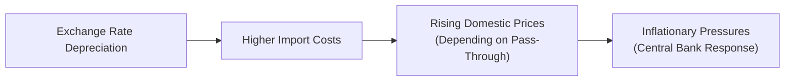

## Introduction
Exchange rate pass-through is a critical concept in both international economics and portfolio management. It describes how changes in currency values—whether through depreciation or appreciation—filter into domestic prices of imported goods, services, and ultimately consumer prices. Candidates preparing for higher-level investment examinations (such as the CFA) should be comfortable analyzing how currency fluctuations influence inflation, profit margins, and monetary policies in different markets.

In highly globalized economies, shifts in exchange rates can quickly ripple through supply chains. These effects are rarely uniform, due to differences in market structure, competition, and the extent to which companies choose (or are able) to “price to market.” This section connects the theoretical underpinnings of exchange rate pass-through to practical corporate and policy-level decisions. By understanding pass-through, Level I candidates build a foundation for more advanced discussions on inflation targeting, currency risk management, and global asset allocation in later studies.

## Key Concepts of Exchange Rate Pass-Through
Exchange rate pass-through (ERPT) measures the percentage change in local prices that results from a 1% change in the exchange rate. When a domestic currency depreciates, the cost of imported goods in local currency tends to rise, which can influence overall inflation. However, the degree of this effect hinges on multiple factors:

• Market Structure and Competition: If there is fierce competition, importers might be forced to absorb some of the cost changes rather than raise final prices significantly.  
• Product Differentiation and Branding: Producers of highly differentiated goods have more pricing power, which can lead to a higher pass-through.  
• Exchange Rate Hedges: Firms often hedge using financial instruments (e.g., currency futures or options) or operational strategies (e.g., relocating production facilities), which can moderate price transmission.  
• Central Bank Policy: A central bank closely monitoring inflation targets may intervene by adjusting interest rates or the money supply, thereby affecting import price movement.  
• Public Regulation: Governments may impose price controls, tariffs, or subsidies that can distort the direct link between exchange rates and final prices.

## Types of Exchange Rate Pass-Through
Economists often distinguish among three degrees of pass-through:

• Complete (Full) Pass-Through: A 1% depreciation in the domestic currency leads to a 1% increase in the domestic price of the imported product.  
• Partial (Incomplete) Pass-Through: The domestic price rises by less than 1%.  
• Zero Pass-Through: Theoretically, this would mean no effect on domestic prices following a currency movement (extremely rare in practice).

Many real-world situations involve partial pass-through, influenced by the elasticity of demand, brand loyalty, distribution costs, and the intensity of competition.

## Determinants of Pass-Through Intensity
### Pricing Strategies
Some exporters adopt “pricing-to-market” strategies: they set different prices for different countries, partially absorbing exchange rate swings to maintain stable local currency prices and market share. In contrast, other exporters may let local prices fluctuate more freely with the exchange rate.

### Supply Chain Considerations
Firms with global supply chains can mitigate exposure by adjusting where they source inputs. If a domestic currency weakens, companies might reduce imported content and substitute with local inputs to control costs.

### Hedging Activities
Financial derivatives—such as forwards, swaps, and options—can lock in favorable exchange rates for future periods. These arrangements shift or smooth out exchange rate risk, effectively lowering observed pass-through in prices.

### Government and Central Bank Intervention
Some economies employ managed exchange rate regimes or direct interventions. By influencing the currency directly (e.g., through open market operations or controlling capital flows), policymakers can dampen or accentuate pass-through effects.

## Measuring Exchange Rate Pass-Through
Analysts and policymakers often turn to econometric models to estimate how changes in exchange rates translate into import prices, producer prices, or consumer prices. Common measurement tools include:

• Simple Regressions: A basic regression of import prices (in local currency) on exchange rate movements.  
• Multivariate Models: Models that control for global commodity prices, local demand conditions, or tariffs.  
• Structural Vector Autoregression (SVAR): More advanced frameworks that capture dynamic responses and feedback loops between exchange rates, monetary policy, and domestic price indices.

An example regression for measuring pass-through might look like:

pₜ = α + β × (Eₜ) + δ × Xₜ + εₜ

where  
• pₜ = local currency import price index at time t  
• Eₜ = exchange rate (units of local currency per unit of foreign currency) at time t  
• Xₜ = control variables (tariffs, shipping costs, global commodity prices)  
• β = coefficient capturing pass-through (i.e., the extent of price response to exchange rate changes)

A β close to 1 suggests full pass-through; a β significantly less than 1 suggests partial pass-through.

## Economic and Policy Implications
### Inflation Targeting
Central banks aiming to maintain a stable inflation target closely observe exchange rate pass-through. Rapid depreciation can force inflation beyond target levels, sometimes compelling aggressive interest-rate hikes. Conversely, a strong currency may dampen inflation and spur looser monetary policy.

### Corporate and Portfolio Decisions
From a corporate standpoint, large importers or exporters must consider pass-through when setting offshore prices or planning expansions. In multi-asset portfolios, movements in exchange rates can significantly affect expected corporate earnings, especially for companies heavily reliant on imports. Asset managers often analyze pass-through sensitivity to estimate inflation risk across different regions—and to structure currency hedges.

### International Competitiveness
When pass-through is high, a depreciating currency can make imports more expensive, effectively protecting local producers from foreign competition. However, that same effect might raise production costs if local firms rely on imported inputs. This dynamic interplay can shift market shares, profit margins, and the sector composition of the broader economy.

## A Simple Numerical Illustration
Consider a situation where Country A’s currency has depreciated by 10% against the U.S. dollar (moving from 1.00 Local Currency Unit (LCU) per USD to 1.10 LCU per USD). Suppose an imported machine part from the U.S. originally cost $1,000, priced at 1,000 LCU before depreciation.

• After the 10% depreciation, the same part would cost 1,100 LCU if the pass-through is complete.  
• If the exporter decides to absorb some of the cost increase to maintain competitiveness (say only passing through 6% of the exchange rate change to importers in Country A), then the local price might rise only to 1,060 LCU.  
• That difference—between 1,100 and 1,060 LCU—illustrates the concept of partial pass-through, revealing how a global supplier’s pricing decisions moderate exchange rate impacts on final consumer prices.

## Visualizing Exchange Rate Pass-Through

In this diagram, a depreciation leads to higher import costs, which in turn can raise domestic prices. The ultimate effect on inflation depends on the degree of exchange rate pass-through and any policy interventions by the central bank.

## Relationship to Other Topics
Understanding the mechanisms behind exchange rate pass-through complements earlier discussions in this book on:
• Nominal vs. Real Exchange Rates (Section 6.1)  
• Purchasing Power Parity (Section 6.3)  
• Spot and Forward Markets (Section 6.4)  

Likewise, pass-through has direct ties to inflation dynamics (Chapter 4), business cycle fluctuations (Chapter 3), and trade flows (Chapter 5). By piecing these ideas together, candidates form a holistic view of how macroeconomic forces influence portfolio performance in real-time.

## Best Practices and Common Pitfalls
• Overlooking Non-Linear Effects: Exchange rate pass-through is not always linear. Price changes can accelerate or slow over time, and various thresholds exist (e.g., sudden large depreciations might spur different responses than gradual shifts).  
• Ignoring Local Distribution Costs: Even if import prices rise due to depreciation, local retailers might adjust margins or distribution processes, muting or amplifying final price effects.  
• Assuming Full Pass-Through: Many examinees assume a one-to-one translation of exchange rate changes into local prices. In reality, pass-through is almost always partial, influenced by hedging strategies and market power.  
• Failing to Integrate Policy Context: Central bank actions (like interest rate hikes) can overshadow or delay pass-through effects.  

## Exam Tips and Strategies
• Practice evaluating how a given exchange rate movement filters into domestic CPI. On the exam, you could face item sets presenting hypothetical scenarios of currency changes, import price data, and partial pass-through assumptions.  
• Be ready to integrate multiple factors—tariffs, shipping costs, or hedging—and link them to final price outcomes.  
• Understand how to differentiate pass-through to import prices at the port-of-entry level from pass-through to consumer prices downstream.  
• When presented with an essay question, systematically address the logic behind corporate hedging and how pass-through ties into inflation targeting or monetary policy stance.

## Conclusion
Exchange rate pass-through is a powerful concept that links currency fluctuations to domestic economic performance. Its importance spans from macro-level monetary policy decisions—where controlling inflation is a key concern—to micro-level strategic decisions made by international corporations and portfolio managers. By mastering the nuances of pass-through, candidates are better positioned to gauge inflationary pressures, anticipate central bank moves, design superior hedging strategies, and respond effectively to evolving global market conditions.

## References and Further Reading
• Goldberg, P. & Knetter, M. (1997). “Goods Prices and Exchange Rates: What Have We Learned?” Journal of Economic Literature.  
• World Trade Organization (WTO) Research – Exchange Rate and Trade:  
  https://www.wto.org/english/res_e/reser_e/reser_e.htm  

• CFA Institute Level I Curriculum (2025). Assigned Readings on Currency Exchange Rates and Inflation.

---

## Practice Questions on Exchange Rate Pass-Through



### In which situation is exchange rate pass-through most likely to be complete?
- [ ] When domestic producers face intense competition from abroad.
- [ ] When central banks repeatedly intervene in the foreign exchange market.
- [ ] When exporters adopt a pricing-to-market strategy.
- [x] When there is no absorption of exchange rate changes in profit margins.

> **Explanation:** Complete (full) pass-through occurs when 100% of an exchange rate change translates directly into local currency prices for imported goods. This happens when exporters/importers do not absorb any portion of the change in exchange rates into their margins.

### A depreciation of a domestic currency by 5% causes import prices to rise by 3% in local currency terms. Which of the following best describes this scenario?
- [ ] Full pass-through
- [x] Partial pass-through
- [ ] Zero pass-through
- [ ] Price controls

> **Explanation:** Partial pass-through occurs when local prices increase by less than the percentage change in the exchange rate. Here, a 3% price increase versus a 5% currency depreciation exemplifies partial pass-through.

### Which of the following factors can most reduce observed exchange rate pass-through into domestic prices?
- [ ] Absence of local competition
- [x] Hedging strategies by importers
- [ ] Low elasticity of demand
- [ ] Weak brand loyalty

> **Explanation:** Hedging strategies, such as using currency futures or options, allow firms to lock in an exchange rate and avoid passing currency fluctuations on to consumers.

### A country that imports a large share of its consumer products experiences a sudden 10% depreciation of its currency. Which of the following likely occurs in the short run if pass-through is high?
- [ ] Domestic prices remain stable.
- [ ] Foreign exporters reduce prices in their home currency.
- [x] Inflationary pressures rise quickly.
- [ ] Local currency appreciates further.

> **Explanation:** In an economy depending heavily on imports, a rapid and sizeable currency depreciation with high pass-through causes import prices in local currency to surge, often leading to higher inflation.

### Why might a central bank raise interest rates in response to high exchange rate pass-through?
- [ ] To support corporate profits.
- [x] To curb inflation brought about by more expensive imports.
- [ ] To encourage a bigger current account deficit.
- [ ] To raise aggregate demand.

> **Explanation:** When high exchange rate pass-through leads to inflation, a central bank may raise interest rates to cool domestic demand and stabilize prices.

### What term best describes a multinational firm adjusting its product prices specifically for each country to maintain competitive positioning?
- [ ] Arbitrage
- [ ] Hedging
- [x] Pricing-to-market
- [ ] Capital controls

> **Explanation:** Pricing-to-market is the practice of setting different prices in different geographic markets, allowing exporters to partially absorb exchange rate movements rather than pass them on fully to local consumers.

### Which of the following measurement methods is most likely to capture the dynamic feedback between exchange rate changes and inflation over time?
- [x] Structural Vector Autoregression (SVAR)
- [ ] Simple linear regression
- [ ] Univariate moving average
- [ ] Time-series decomposition

> **Explanation:** SVAR models can account for feedback loops between policy variables, exchange rates, and price indices, making them particularly well-suited for analyzing dynamic pass-through effects.

### If a local retailer chooses to maintain a stable domestic price on an imported good by reducing margins in response to a currency depreciation, this action:
- [ ] Eliminates future exchange rate fluctuations.
- [x] Reduces the observed pass-through to domestic prices.
- [ ] Guarantees rising profit margins.
- [ ] Forces the central bank to intervene.

> **Explanation:** By absorbing the cost increase in its profit margin, the retailer effectively lowers the degree of exchange rate pass-through to the final consumer price.

### Which of the following scenarios would most likely decrease the intensity of exchange rate pass-through?
- [ ] Rapid losses in the value of the domestic currency
- [ ] A decline in domestic competition
- [x] Tariffs on imported goods that reduce import volume
- [ ] A move to a flexible exchange rate regime

> **Explanation:** Tariffs can dampen import volumes and may incentivize importers to re-source production or remain more reluctant to raise prices further, potentially reducing effective pass-through to consumer prices.

### True or False: A higher degree of exchange rate pass-through makes it easier for the central bank to achieve inflation targets.
- [ ] True
- [x] False

> **Explanation:** High pass-through can complicate a central bank’s pursuit of stable inflation. Exchange rate movements can quickly affect imported goods prices and overall inflation, making monetary policy less predictable.


