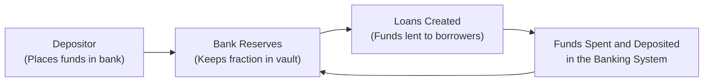

## Defining Money and Its Functions

Money. It might look like just pieces of paper (or digits on a screen), but it’s so much more. I remember once staring at a coin and thinking, “Why do we trust this thing to buy groceries?” It’s all about the shared belief that this object—a coin, paper bill, or electronic bank balance—serves specific roles in our economy.

Formally, money has three core functions:  
• Medium of Exchange: People accept it in return for goods and services, preventing the hassle of direct bartering.  
• Unit of Account: It provides a standard way to measure the value of goods and services. If you see a tomato priced at USD 2, you can easily compare that to a loaf of bread costing USD 3.  
• Store of Value: You can hold on to money and use it later without it spoiling or losing its face value (though inflation may erode its purchasing power over time).

In older times, individuals relied on barter, which is exchanging one good for another. But that didn’t work so well—imagine trying to trade your laptop for lunch if the restaurant doesn’t need your laptop. Once a common medium of exchange evolved (like gold or salt), trade became more efficient. Over centuries, societies transitioned from commodity-based currencies (like gold coins) to paper money backed by those commodities, and eventually we ended up with fiat money—currency decreed by governments to be legal tender but not backed by physical commodities.

## Evolution of Money: From Gold to Fiat

Early commodity-based monies (e.g., precious metals) had intrinsic value. Gold and silver, for instance, were prized for their rarity and divisibility. Governments minted coins with a specific metal content to ensure consistent value. However, carrying around large amounts of metal became cumbersome (trust me, lugging bricks of silver to the grocery store would be a workout!). Over time, banks issued paper receipts—representing gold deposits in their vaults. These receipts could be exchanged for gold on demand.

Eventually, governments realized they could issue paper money not directly convertible to gold. This is what we call fiat money. Fiat money works because of trust and government mandate, not because it can be exchanged for bullion. For many decades, most major currencies have been fiat currencies, supported by the full faith and credit of their issuing governments.

## The Role of Central Banks

Central banks, such as the Federal Reserve (United States), the European Central Bank (Eurozone), or the Bank of England (United Kingdom), sit at the heart of a nation’s (or region’s) monetary system. They’re tasked with:

• Regulating the Money Supply and Credit: Central banks influence how much money flows through the economy via tools like open-market operations or changing reserve requirements.  
• Supervising the Banking System: They set rules that banks must follow to maintain stability (like minimum capital requirements).  
• Acting as Lender of Last Resort: If commercial banks run into liquidity problems, the central bank can step in with emergency loans.  
• Maintaining Price Stability: Price stability—keeping inflation in check—is a key objective. High inflation (prices rising too quickly) erodes purchasing power; deflation (prices falling persistently) can hamper spending and growth.  
• Promoting Full Employment: In many jurisdictions, central banks aim to foster conditions that support stable employment, though balancing that with inflation control can be a tricky dance.

When it comes to day-to-day policy, central banks face a constant balancing act. Too little money in circulation can cause a slowdown in economic activity, while too much money can overheat the economy, creating inflationary pressures. It’s kind of like cooking a meal—there’s a “just right” temperature to ensure a delicious outcome.

## Monetary Aggregates: M0, M1, M2, and M3

To gauge how much money is floating around, economists group different forms of money into categories called monetary aggregates. Understanding these is crucial for analyzing liquidity in the financial system and potential inflationary pressures.

Below is a simplified table of common monetary aggregates:

| Aggregate | Components                                                                            |
|-----------|----------------------------------------------------------------------------------------|
| M0 (Monetary Base) | “High-powered money”: physical currency in circulation + reserves held by banks at the central bank. |
| M1            | M0 minus banks’ reserves + demand deposits (checking accounts) + other checkable deposits. |
| M2            | M1 + savings accounts (time deposits, small denomination CDs, money market deposits).        |
| M3            | M2 + larger time deposits + other broader, less liquid forms of money (definition can vary by region). |

The broader the aggregate, the less “liquid” the money tends to be— in other words, how quickly you can spend it. M1 is very liquid, while M2 and M3 capture money locked in short-term deposits or larger financial instruments.

## Fractional Reserve Banking and the Money Multiplier

Perhaps one of the more fascinating aspects of modern finance is how banks create money out of thin air—well, sort of. Under fractional reserve banking, commercial banks are only required to keep a fraction of depositors’ funds in reserve (for example, 10%). They lend out the rest to borrowers. And when those borrowers deposit the funds in another bank, that bank repeats the cycle!

This process is best visualized with a quick diagram:

• Step 1: A person deposits USD 1,000 in Bank A.  
• Step 2: Bank A must hold, say, 10% (USD 100) as reserves and can lend out USD 900.  
• Step 3: A borrower uses USD 900—perhaps to buy a new laptop—and the seller of that laptop deposits USD 900 into Bank B.  
• Step 4: Bank B keeps 10%, or USD 90, and can lend out USD 810.  
• Step 5: That USD 810 eventually gets deposited elsewhere, continuing the cycle.  

Yes, this money creation is carefully monitored. Central banks ensure non-excessive credit expansion—otherwise, inflation might spike. The relationship between an initial deposit and the total money created in the system is captured by the money multiplier. If the reserve requirement is r, then the theoretical money multiplier is 1/r. In real life, lower loan demand, higher reserve holdings, or people holding cash outside the banking system can reduce this multiplier’s effectiveness.  

## How Central Banks Control the Money Supply

### Open-Market Operations (OMO)

Central banks buy and sell government securities (like Treasury bonds) on the open market. When the central bank buys securities, it pays the seller by creating bank reserves, effectively increasing the monetary base. More reserves mean banks can lend more, expanding the money supply. Conversely, selling securities takes reserves away from the banking system, contracting money supply.

### Reserve Requirements

By setting the percentage of deposits banks must hold in reserve, central banks influence credit creation. If the reserve requirement rises from 10% to 12%, banks must keep more in their vaults (or at the central bank). That reduces the funds available for lending, contracting the money supply.

### Discount Rate (or Lending Rate to Banks)

Commercial banks can borrow overnight from the central bank to meet short-term liquidity needs. The rate charged on these loans (often called the discount rate in the U.S.) can influence banks’ willingness to borrow and lend. A high discount rate discourages borrowing from the central bank—leading to fewer loans and reducing the money supply. A low discount rate encourages more lending and more credit creation.

### Interest on Reserves

In many economies, central banks pay interest on the reserves that banks park at the central bank. If this interest rate is set high, banks are more inclined to keep their money in reserves rather than lending it out. That can tighten overall credit availability. If the interest on reserves is low, banks have an incentive to lend more to earn higher interest from borrowers, expanding the money supply.

## Practical Scenarios and Case Studies

• The 2008 Financial Crisis: After the collapse of major financial institutions, central banks worldwide lowered interest rates near zero and pumped liquidity into banks by buying massive volumes of government bonds (quantitative easing). This aimed to stabilize financial markets and stimulate economic activity.  
• COVID-19 Shock: Many central banks cut rates again and carried out unprecedented asset-purchase programs to support economies hit by lockdowns. Recalibrating the money supply became crucial to stave off deflationary pressures and later cope with emerging inflation.  
• High-Inflation Environments: Some countries experienced runaway inflation when their central banks lacked independence or over-issued currency to finance government spending. Zimbabwe and Venezuela are extreme cautionary tales.  

## Best Practices, Challenges, and Pitfalls

• Ensuring Central Bank Independence: When governments can pressure central banks to finance deficits, it often leads to inflation. Independence is crucial for price stability.  
• Avoiding Boom-and-Bust Credit Cycles: Too much lending can create bubbles (think housing crises), while too little can stifle growth. There’s a delicate balancing act.  
• Communication Strategies: Central banks increasingly focus on transparency—publishing forward guidance and policy statements to shape market expectations. Poor communication can spook markets or cause confusion.  
• Liquidity Traps: When interest rates are near zero, standard monetary policy (like cutting rates further) may be less effective. Unconventional tools such as quantitative easing or negative rates come into play and bring their own complexities.  

## Applications for the CFA® Level I Exam

Candidates in the CFA® Program should be comfortable applying money supply concepts to macroeconomic analyses. On the exam, you might see item sets that mix up definitions of M1 and M2, or that ask you to compute the implied change in money supply from an increase in deposits. You could also be tested on how a central bank’s open-market operation would affect bond yields and interest rates. Additionally, watch for questions linking monetary policy changes to potential impacts on GDP, inflation, or currency exchange rates.

## Exam Relevance and Tips

• Integrative Nature: Monetary policy interacts with fiscal policy, foreign exchange markets, and labor markets. Show you understand all sides of these relationships.  
• Calculation Confidence: Be sure you can calculate the money multiplier (1/r) and reason through examples of deposit expansion.  
• Policy Tools: Distinguish clearly between open-market operations, discount rate policy, reserve requirement adjustments, and interest on reserves.  
• Ethical Standards: The CFA Institute Code and Standards emphasize objectivity and rigorous analysis. This extends to evaluating how central bank actions might affect potential conflicts of interest in the banking sector.  
• Constructed Responses: You might have to write out the logic. Clearly present your steps, define the monetary aggregates, and explain how changes in policy tools feed through to interest rates and loans.

## Conclusion

Money is part trust, part legal framework, and part creative engineering by central banks and commercial banks working together. Witnessing how trust in fiat money can shift abruptly (just think about a country facing political upheaval or a wild inflation spree) serves as a reminder that money is ultimately a social construct supported by institutions and public confidence. Understanding the mechanisms behind it— from the role of central banks to the intricacies of fractional reserve banking—equips you with a powerful lens to interpret broader economic events.

You’ve seen the evolution from gold coins to fiat currency, the definitions of M0 through M3, and the ways central banks pull levers to keep economies stable (or at least attempt to!). For your CFA® Level I, take these building blocks seriously—money supply fundamentals are essential for analyzing interest rates, growth, inflation, and overall financial system health.

---

**References and Further Reading**  
• Mishkin, F. S. (2018). “The Economics of Money, Banking, and Financial Markets.” Pearson.  
• Board of Governors of the Federal Reserve System: https://www.federalreserve.gov/  
• European Central Bank: https://www.ecb.europa.eu  

---

## Mastering Money, Central Banks, and the Money Supply: Practice Questions



### Which of the following correctly describes a key function of money?

- [ ] Money is always backed by gold reserves.  
- [ ] Money is only a physical medium of exchange.  
- [ ] Money must have intrinsic value to be acceptable in transactions.  
- [x] Money serves as a medium of exchange, a store of value, and a unit of account.  

> **Explanation:** Money doesn’t have to be backed by gold or always exist in physical form. Its defining characteristics involve facilitating commercial transactions, measuring value, and preserving purchasing power over time, at least in nominal terms.

### Which monetary aggregate is often referred to as the “monetary base” or “high-powered money”?

- [x] M0  
- [ ] M1  
- [ ] M2  
- [ ] M3  

> **Explanation:** M0 includes currency in circulation plus the reserves that banks hold at the central bank, typically known as the monetary base.

### When a central bank wants to increase the money supply through open-market operations, it will typically:

- [ ] Raise the discount rate.  
- [x] Purchase government securities on the open market.  
- [ ] Increase reserve requirement ratios.  
- [ ] Restrict credit to commercial banks.  

> **Explanation:** Purchasing government securities injects reserves into the banking system, thereby increasing the monetary base and potentially expanding the money supply.

### Which of the following actions would generally decrease the total money supply in a fractional reserve banking system?

- [ ] Depositors moving funds from checking accounts to savings accounts.  
- [ ] A reduction in the discount rate.  
- [x] An increase in the reserve requirement.  
- [ ] The central bank buying government bonds.  

> **Explanation:** Raising the reserve requirement means banks must hold more of each deposit in reserve, leaving fewer funds available to lend, which reduces money creation.

### A lower interest rate on bank reserves held at the central bank typically:

- [ ] Lowers the money supply by encouraging banks to increase deposits.  
- [ ] Has no impact on the money supply.  
- [x] Increases the money supply by encouraging more commercial lending.  
- [ ] Forces the central bank to buy fewer government securities.  

> **Explanation:** If banks earn less interest on reserves, they are incentivized to lend more to achieve higher returns, thus expanding credit and the money supply.

### Suppose the central bank requires banks to hold 20% of deposits as reserves, but depositors typically keep 5% of their cash outside the banking system. What's the theoretical money multiplier?

- [x] Less than 1/(0.20) because of cash leakage.  
- [ ] Exactly 5.  
- [ ] Exactly 10.  
- [ ] Exactly 1/0.05.  

> **Explanation:** If depositors hold some cash, not all deposits re-enter the banking system. Hence, the multiplier is reduced below 1/0.20 = 5. The presence of currency leakage lowers the effective multiplier.

### Central bank “independence” is considered important primarily because:

- [x] It reduces political pressure to finance government deficits that might lead to inflation.  
- [ ] It ensures unlimited credit availability for commercial banks.  
- [x] It helps maintain credibility and stable markets.  
- [ ] It eliminates all risk from financial markets.  

> **Explanation:** Independence helps the central bank fight inflation without undue political interference, fostering credibility. This also contributes to stable economic growth over the long run.

### If a commercial bank borrows from the central bank at the discount window:

- [ ] Its reserves decrease, lowering its ability to lend.  
- [ ] Its reserves remain unchanged.  
- [x] Its reserves increase, which may expand its capacity to lend if it desires.  
- [ ] It violates most central bank regulations.  

> **Explanation:** Borrowing from the central bank provides additional reserves to the commercial bank. These funds may then be used for lending activities, assuming borrower demand and other constraints align.

### Which of the following best characterizes the difference between commodity money and fiat money?

- [ ] Commodity money always circulates in paper form.  
- [x] Commodity money has intrinsic value; fiat money’s value is established by government decree.  
- [ ] Fiat money cannot be issued by central banks.  
- [ ] Fiat money is valued only when matched with gold reserves.  

> **Explanation:** Commodity money (e.g., gold coins) is valuable in and of itself. Fiat money (like modern banknotes) has value because of trust and government regulation, not because it can be exchanged for a commodity.

### True or False: Increasing the reserve requirement ratio from 5% to 10% will likely shrink the money supply if no other changes are made.

- [x] True  
- [ ] False  

> **Explanation:** A higher reserve requirement means banks must hold more funds in reserve, reducing the amount available for lending, which contracts the money supply.


