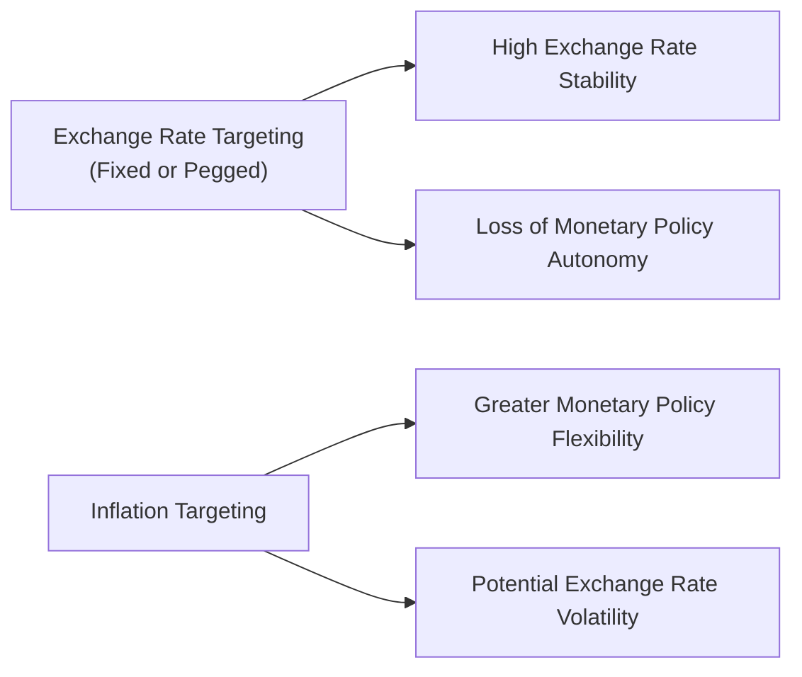
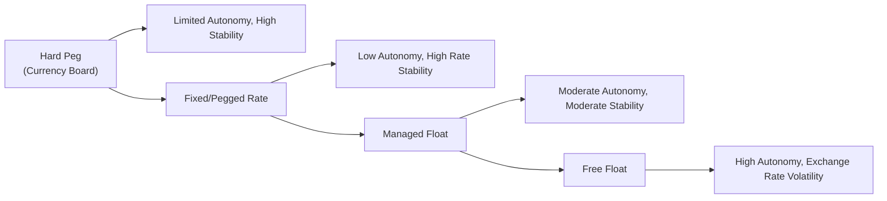

## Overview

Ever wonder why some countries seem to cling to a stable exchange rate while others let their currency float freely? Monetary policymakers face a fundamental choice: prioritize exchange rate stability or keep inflation under tight wraps. Honestly, it can feel a bit like deciding between wearing comfortable sneakers or fancy dress shoes—you can’t get the best of both worlds all the time. In this section, we’ll explore exchange rate targeting versus inflation targeting, diving into their relative advantages, pitfalls, and real-world applications. We’ll also check out hybrid regimes and extreme cases like currency boards, all to give you a better sense of how central banks align their monetary strategies with broader economic goals.

## Exchange Rate Targeting vs. Inflation Targeting

In broad terms, exchange rate targeting aims to keep the domestic currency at a fixed (or narrowly fluctuating) rate against another currency (often a major currency like the US dollar) or a set of currencies (like the Special Drawing Rights basket). Inflation targeting, by contrast, sets a publicly announced inflation rate (say 2%), and the central bank uses tools such as open market operations, policy interest rates, and so forth to steer price levels toward that goal. Each approach shapes the macroeconomic landscape differently.

- Exchange Rate Targeting:  
  • Greater stability in international trade and investment flows.  
  • Risk of losing monetary policy independence.  
  • Often used by smaller economies highly dependent on external trade.  

- Inflation Targeting:  
  • Focus on internal price stability.  
  • Allows independent monetary policy and reaction to domestic economic conditions.  
  • May introduce volatility in exchange rates, especially in capital-flow-sensitive markets.  

Let’s illustrate these key differences in a simple Mermaid diagram:

Here, we see how targeting the exchange rate yields stability in currency markets but often surrenders the flexibility (C) that inflation targeting (D) preserves.

## Benefits and Drawbacks of a Fixed Exchange Rate

### Benefits
1. Reduced Exchange Rate Risk  
   With a fixed exchange rate, businesses and investors can engage in cross-border trade without constantly worrying about currency fluctuation. This was one reason I heard a small exporter friend of mine rave about pegged regimes—he liked knowing his costs wouldn’t explode overnight due to a weaker currency.

2. Enhanced Policy Credibility  
   If a country has a reputation for high inflation or unsound monetary practice, pegging the currency to a stable one (like the US dollar) can create discipline and reassure markets that inflation won’t spiral out of control.

3. Clarity for International Investors  
   Everyone wants an environment where surprises don’t lurk around each corner. A fixed exchange rate can signal predictability, enticing foreign investors who might otherwise be wary.

### Drawbacks
1. Loss of Independent Monetary Policy  
   If the exchange rate is fixed, the central bank must intervene in foreign exchange markets to maintain the peg, thereby forgoing the ability to set interest rates purely based on domestic conditions.

2. Vulnerability to External Shocks  
   Suppose you peg your currency to a major currency that unexpectedly tightens or loosens monetary policy. You might be forced into pro-cyclical moves—tightening or loosening your economy at precisely the wrong time.

3. Risk of Currency Crises  
   If markets suspect the peg is unsustainable (reserves are running low, for instance), you can have dramatic speculative attacks that drain reserves. History is littered with examples of painful devaluations once a peg breaks.

## Benefits and Drawbacks of Inflation Targeting

### Benefits
1. Focus on Domestic Stability  
   Inflation targeting lets the central bank address purely domestic concerns related to price stability and growth. You don’t need to defend a currency peg, so you have more leeway to tweak interest rates as needed to prevent recessions or overheating.

2. Transparency and Accountability  
   Clear targets (e.g., 2% inflation) help anchor expectations. Market participants know the central bank’s aim, so they can plan wages, prices, and investments accordingly.

3. Reduction in “Beggar-Thy-Neighbor” Policies  
   Because it’s not pegged, an inflation-targeting nation won’t artificially hold down its exchange rate to support exports—helping reduce global friction around trade competitiveness.

### Drawbacks
1. Exchange Rate Volatility  
   Freedom from a hard peg typically means exchange rates fluctuate with capital flows and changing risk appetites. This can be stressful for companies reliant on stable exchange rates (like importers or exporters).

2. Potential for “Goal Conflict”  
   Sometimes central banks are tasked with multiple goals—like full employment, a stable currency, and a targeted inflation rate. Balancing them can be tricky if, for instance, fighting inflation conflicts with fostering employment.

3. Need for Institutional Credibility  
   Transparent inflation targeting works best when markets trust that the central bank won’t deviate from its commitment. This often requires central bank independence and a consistent track record.

## Hybrid Regimes: Crawling Pegs and Managed Floats

Reality isn’t always so black and white. Many countries adopt a “best of both worlds” approach, establishing partial control over the currency while allowing some market determining forces. Common examples:

• Crawling Peg: The currency is fixed but allowed to adjust periodically (e.g., monthly or quarterly) by small amounts. This tries to avoid large one-off devaluations, providing a smoother transition.  
• Managed Float (Dirty Float): The currency is primarily market-driven, but the central bank intervenes when the exchange rate moves away from desired levels. Think of the central bank as a guiding hand, nudging the exchange rate in a preferred direction, without fully dictating it.

In practice, many “floating” regimes are actually managed floats. Central banks maintain the right to step in if the market exchange rate seems misaligned with economic fundamentals or threatens financial stability.

## The Case of Currency Boards

A currency board represents an extreme form of exchange rate targeting. In a currency board arrangement, every unit of domestic currency in circulation is backed by a foreign reserve currency (often one considered stable, like the euro or the US dollar). The board must hold enough foreign currency to fully cover all outstanding domestic currency, in principle guaranteeing convertibility at a fixed exchange rate.

### Successes
• Strong Credibility: If you visit a country with a reputable currency board, you’ll notice that local currency is often treated almost like “dollarized” money, making import pricing straightforward.  
• Lower Inflation: Tying domestic currency issuance to foreign reserves restrains money creation, often reducing inflationary tendencies.

### Failures
• Limited Monetary Flexibility: Put simply, you can’t just print more money in a slump unless you have the foreign exchange reserves to back it. That restriction might worsen recessions.  
• Susceptible to Crisis: If a severe shock hits, the economy can’t independently adjust its exchange rate, and political or economic turmoil can drain reserves quickly, forcing abandonment of the board.

A notable case was Argentina’s currency board in the 1990s, which initially tamed hyperinflation but later collapsed amid economic pressures. The experience highlights currency boards’ extreme discipline—helpful when building credibility but risky when dealing with deep external shocks.

## Real-World Examples and Lessons

• Hong Kong’s Linked Exchange Rate: Hong Kong pegs its currency (HKD) to the US dollar. This approach offers exchange rate certainty crucial for its role as a global financial hub. However, the city’s monetary policy is effectively set by the United States, occasionally mismatching local economic conditions.  
• Canada’s Inflation Target: The Bank of Canada is well known for its inflation-targeting framework. Over decades, it has earned market confidence, and while the Canadian dollar floats, the country can pivot interest rates to stabilize inflation and output. Yet, exporters face exchange rate fluctuations tied to oil prices and global risk sentiment.  
• Singapore’s Managed Float: Singapore influences its exchange rate within a policy band by managing the nominal effective exchange rate. This has helped control imported inflation while maintaining export competitiveness, illustrating a useful hybrid strategy.

## Diagram: The Monetary Autonomy–Exchange Rate Continuum

Below is another Mermaid diagram showing how different regimes balance autonomy and exchange rate stability:

## Conclusion

Choosing between exchange rate targeting and inflation targeting isn’t just a neat academic exercise; it’s a high-stakes decision that can influence a country’s economic fortunes for years. It’s like picking the lens through which all other macro policies are viewed. If you prioritize a stable exchange rate, you might provide clarity for traders and investors, yet risk missing the chance to deploy your own monetary policy in times of trouble. If you concentrate on keeping inflation low, you may achieve stable prices and freer monetary response at home but watch your currency bounce around on global capital flows. Hybrid solutions and currency boards occupy different points along the continuum, each with its own combination of discipline, independence, and risk. The “perfect” model doesn’t exist—policymakers have to weigh trade-offs against their nation’s unique economic structure, history, and priorities.

## Final Exam Tips

• Thoroughly understand the trade-offs between monetary independence and exchange rate stability—this is foundational for real-world policy analysis.  
• Link the concepts here to the “Impossible Trinity” (capital mobility, exchange rate stability, and monetary independence). Knowing how policy makers choose among the three is a common exam question angle.  
• Practice scenario-based questions that test whether you can recommend suitable regimes under specific economic conditions (e.g., a small open economy reliant on exports might choose a peg, a diversified economy might lean toward inflation targeting).  
• For item set questions, remember to check if the question implies constraints such as large capital inflows, structural inflation issues, or external vulnerabilities; these often guide the correct policy regime.  

## References

• Obstfeld, M., & Rogoff, K. (1995). “The Mirage of Fixed Exchange Rates.” Journal of Economic Perspectives.  
• Ghosh, A. R., Gulde, A. M., & Wolf, H. C. (2002). “Exchange Rate Regimes: Choices and Consequences.” MIT Press.  
• CFA Institute. (2023). CFA Program Curriculum, Level III. (Reference to standards of practice regarding macroeconomic analysis.)  

## Test Your Knowledge: Monetary Policy Strategy and Regimes



### Which of the following is a common drawback of adopting a fixed exchange rate regime?

- [ ] Reduced exchange rate certainty for international investors
- [x] Loss of autonomous monetary policy
- [ ] Higher inflation due to unrestrained money supply
- [ ] Immediate reduction in the current account deficit

> **Explanation:** A fixed exchange rate regime often compels a nation to align its interest rates with the anchor currency’s, losing independent control over monetary policy.

### Which of the following best describes the benefit of inflation targeting?

- [ ] Guaranteed currency stability
- [ ] Immediate correction of external imbalances
- [x] Focus on domestic price stability and central bank credibility
- [ ] Elimination of exchange rate volatility

> **Explanation:** By setting an explicit inflation target, the central bank focuses on domestic conditions to stabilize prices and anchor expectations, thereby building credibility.

### When a country chooses to peg its currency to another major currency, it is:

- [x] Sacrificing some level of monetary independence in favor of exchange rate stability
- [ ] Strengthening its ability to experiment with unconventional monetary policies
- [ ] Eliminating vulnerability to speculative attacks
- [ ] Reducing economic integration with global capital markets

> **Explanation:** Pegging limits monetary independence because the central bank must intervene to maintain the fixed rate, often aligning domestic rates with the anchor currency’s policy.

### A managed float (dirty float) regime:

- [ ] Refers to completely free-floating exchange rates with zero central bank intervention
- [ ] Is the same as a hard peg or currency board
- [x] Allows exchange rates to move according to market forces while permitting central bank intervention
- [ ] Prohibits all types of capital inflows or outflows

> **Explanation:** A managed float is a hybrid. Market forces typically set the rate, but the central bank steps in occasionally to smooth out volatility or guide the currency.

### Under a currency board arrangement:

- [x] The central bank must hold foreign currency reserves equal to its monetary base
- [ ] Interest rates can be freely adjusted to combat recessions
- [ ] The exchange rate fluctuates based on daily market demand
- [x] Domestic currency is guaranteed convertibility at a fixed rate

> **Explanation:** A currency board ensures each unit of domestic currency is fully backed by foreign reserves and promises a fixed, reliable exchange rate.

### A primary drawback of inflation targeting is that:

- [x] The currency may experience significant fluctuations in foreign exchange markets
- [ ] Central banks lose their credibility
- [ ] The economy automatically goes into a recession
- [ ] Governments are barred from running budget deficits

> **Explanation:** While inflation targeting provides monetary flexibility, it also leads to exchange rate movements subject to market forces, creating FX volatility.

### An advantage of adopting an inflation-targeting framework:

- [x] Clear policy signaling and accountability for the central bank
- [ ] Guaranteed external balance in the current account
- [x] Greater flexibility to respond to domestic economic shocks
- [ ] Protection from all forms of speculative attacks

> **Explanation:** Inflation targeting clarifies policy goals and allows the central bank to respond to domestic issues with appropriate interest rate adjustments.

### A crawling peg approach differs from a hard peg because it:

- [x] Adjusts the fixed rate gradually over time
- [ ] Provides absolute certainty to exporters
- [ ] Completely eliminates speculative pressure
- [ ] Forbids any change in nominal exchange rates

> **Explanation:** A crawling peg follows a predictable path of small adjustments, helping to avoid abrupt realignments.

### Which statement about exchange rate targeting is most accurate?

- [x] It can help anchor price levels in countries with historically high inflation
- [ ] It is only feasible in very large, diversified economies
- [ ] It automatically prevents all currency crises
- [ ] It allows maximum flexibility in setting interest rates

> **Explanation:** A credible exchange rate target can impose monetary discipline. It is often adopted in smaller or developing economies, and though it fosters stability, it can’t guarantee the absence of currency problems.

### Under inflation targeting, central banks:

- [x] Emphasize price stability as their principal objective
- [ ] Must adopt an exchange rate peg simultaneously
- [ ] Completely eliminate foreign exchange market intervention
- [ ] Are required to implement only expansionary policies

> **Explanation:** If a country explicitly targets inflation, the central bank puts stable prices at the forefront, using tools like open market operations and benchmark interest rates to manage inflation within a target band.


