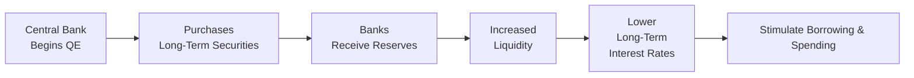

Sometimes, central banks find themselves in a tricky spot—interest rates are already near zero (or even negative!), yet the economy still needs a boost. Maybe growth is tepid, inflation is stubbornly below target, or credit markets are just not getting the job done. Well, this is often where unconventional monetary policy steps into the limelight. The most famous of these tools is quantitative easing (QE). In a nutshell, QE involves purchasing longer-term securities in large volumes to drive down long-term interest rates and, hopefully, spark some life into lending and spending. But like all big ideas in finance, QE has its fair share of controversies and complexities. Let’s talk about why it’s used, how it’s supposed to work, and what we know—or don’t know—about whether it actually meets its lofty goals.

Understanding the Rationale

When conventional monetary policy is already maxed out—that is, when short-term interest rates have been brought down close to zero—central banks can only do so much using traditional levers. If the economy still needs additional stimulus, policymakers often want a more direct method to affect the broader financial conditions. Enter QE: by buying large amounts of longer-term securities (often government bonds, but also mortgage-backed securities and corporate bonds in some cases), a central bank can push prices of those assets up and yields down. It’s more than a theoretical proposition; major central banks such as the U.S. Federal Reserve, the Bank of England, the European Central Bank (ECB), and the Bank of Japan have all used QE in the past two decades.

I remember chatting with a friend back in 2009, over coffee, who worked at a small regional financial firm. He was perplexed by how the Federal Reserve had decided to buy mortgage-backed securities. He was like, “What are they doing messing around in housing markets so directly?” But the logic was: if you can bring down mortgage rates, that might encourage home buying, stabilize home values, and ultimately ripple across the economy in a positive way. In essence, that was a specialized form of QE targeted at the mortgage market, sometimes also called “credit easing” because it aims to improve credit availability in specific market segments.

Mechanics of Quantitative Easing

The process of QE revolves around the central bank increasing the size of its balance sheet. While an average consumer might think, “Gee, that sounds like they’re just conjuring money out of thin air,” it’s not an entirely inaccurate description. The central bank does, in fact, create new reserves (liabilities on its balance sheet) and uses those reserves to purchase securities from banks or the open market. Let’s see how that flows:

• Asset Purchases. The central bank announces a targeted quantity of longer-term securities it plans to buy.  
• Balance Sheet Expansion. As it buys these assets, the central bank’s own balance sheet swells. On the asset side are newly purchased bonds. On the liability side are newly created reserves that go to the sellers of those bonds (often commercial banks).  
• Market Effects. Those banks now hold extra reserves, which can support additional lending if the banks feel confident in lending them out. The increased demand for the purchased securities pushes their prices up, which in turn lowers their yields.

Here’s a quick visual representation:

In practice, QE programs can come with specific “flavors”: for example, QE might exclusively target government bonds in some jurisdictions, while in others (like the United States during the 2008–2014 period), the central bank might also buy mortgage-backed securities to directly support the housing market.

Effects on the Economy

The hope is straightforward but powerful. By lowering long-term yields, QE reduces borrowing costs for households (mortgages, auto loans, etc.) and firms (corporate bonds, loans). As yields drop, bond prices climb, which can also boost equity prices if investors reallocate into stocks to seek higher returns. That increase in asset prices can encourage consumer spending via a wealth effect (individuals feel wealthier when their portfolios go up).

Curiously, QE can also have a psychological angle. If everyone is convinced the central bank is determined to do “whatever it takes” to jump-start the economy (a famous phrase used by the ECB in 2012, though not strictly about QE), that might raise confidence among investors, lenders, and consumers. Higher confidence can lead to more spending and investment.

However, the magnitude of these effects depends heavily on conditions in the broader economy and financial markets. If the economy is deeply troubled or banks are reluctant to lend, the extra reserves might just sit there gathering dust. That’s often referred to as a “liquidity trap,” where conventional monetary policy, and sometimes even QE, might see limited success in spurring real activity if the private sector simply won’t borrow or spend.

Credit Easing and Forward Guidance

While QE remains the poster child of unconventional monetary policies, several related tools deserve honorable mentions:

• Credit Easing. Picture a scenario where the central bank specifically targets sectors of the economy that are struggling to access credit. It might buy corporate bonds, commercial paper, or other private assets to bring down borrowing costs for businesses. This is a more targeted approach than broad-based government bond purchases.  
• Forward Guidance. Another crucial piece of the unconventional toolkit is clear communication about the future path of interest rates. If the central bank credibly signals that it will keep rates low for an extended period, markets and investors can adjust expectations accordingly. That helps keep longer-term yields lower too, even without immediate QE.

One could argue that forward guidance is almost free. You don’t physically buy any bonds. You just need to convincingly promise you won’t raise rates prematurely. Of course, if you break that promise, your credibility evaporates, so it’s a delicate balancing act.

Criticisms and Challenges

QE is not without controversy. Here are some of the common concerns:

• Asset Bubbles. By artificially compressing yields, QE can push investors to take on more risk. This might inflate equity markets, corporate bonds, and other asset classes in ways that overshoot their fundamental values. Critics worry this sets the stage for the next bubble.  
• Income and Wealth Inequality. Because QE tends to boost financial asset prices, those who already hold those assets may benefit disproportionately—potentially exacerbating wealth disparities.  
• Unwinding QE. When a central bank eventually tries to offload or reduce its holdings, there is a risk of unsettling markets. Investors may fear a sudden surge in interest rates, triggering significant volatility or even capital flight out of bond markets.

I remember hearing from a small business owner in 2014 who felt frustrated that QE seemed to help big financial institutions and stock markets more than it helped small businesses. They told me, “The banks still aren’t loaning to my business. They say it’s too risky.” That captures one of the tricky realities: QE is no guarantee that banks will suddenly lend abundantly to everyone. Many banks prefer to hold onto these reserves or invest in safer instruments rather than undertake riskier loans if the economic outlook remains shaky.

Empirical Evidence

The real question on many economists’ minds is: “Does QE actually work?” The evidence is mixed but generally points to QE having some positive effect on calming financial markets, lowering yields, and boosting asset prices. There’s also decent evidence that QE can modestly support economic growth and help bring inflation closer to targets, especially when the economy is in a severe downturn.

• United States. The Federal Reserve’s multiple rounds of QE (often dubbed QE1, QE2, QE3, and later adjustments) appeared to stabilize bond markets, reduce credit spreads, and spur equity market rallies. Some research by Krishnamurthy & Vissing-Jorgensen (2011) indicates QE did push down yields on Treasuries and mortgage-backed securities.  
• Eurozone. The European Central Bank’s asset purchase programs were more complex, including targeted longer-term refinancing operations (TLTROs) that provided cheap financing to banks willing to lend to the real economy. While the results have been somewhat positive in lowering yields across the eurozone, challenges remain in ensuring that these policies translate into tangible growth, especially in heavily indebted countries.  
• Japan. The Bank of Japan has been doing various forms of QE for years—some might argue decades. Outcomes have been mixed, with deflationary pressures persisting. However, it’s also plausible that the economy would have been in even worse shape without QE.

Overall, the general consensus is that QE helps stabilize financial markets under crisis conditions, but its ability to sustainably boost real economic activity and inflation can be limited unless accompanied by other supportive policies (like fiscal stimulus or structural reforms).

Final Exam Tips

• Think Holistically: On the exam, you might be given a scenario describing a global recession with policy rates at zero. Be prepared to discuss how QE—along with forward guidance—affects yield curves, asset valuations, and lending behaviors.  
• Critique vs. Support: Constructed-response questions might ask you to critique QE’s potential pitfalls, like the risk of asset bubbles or unequal wealth distribution. Demonstrate a balanced viewpoint by recognizing both short-term benefits (market stabilization) and long-term concerns (unwinding risks).  
• Connect to Portfolio Management: In item sets, you might be asked how lower long-term yields influence bond valuations, required returns, or equity risk premiums. Be ready to link the concept of QE to the broader frameworks of risk management and portfolio allocation.  
• Time Management: When addressing essay prompts on QE, outline your key points quickly—benefits, limitations, and real-world evidence—then dive deeper into each. Don’t get lost in minute details; keep your answers structured.  
• Pay Attention to Data: Sometimes the exam provides data on yield changes or central bank balance sheet expansions. Use that info to support your argument. Demonstrating that you can interpret economic indicators, connect them to a policy tool, and produce a well-focused analysis is essential at Level III.

References

• Krishnamurthy, A., & Vissing-Jorgensen, A. (2011). “The Effects of Quantitative Easing on Interest Rates.” Brookings Papers on Economic Activity.  
• Federal Reserve, “Policy Tools: Quantitative Easing” (https://www.federalreserve.gov/monetarypolicy/bst_openmarketops.htm).  
• Joyce, M., Miles, D., Scott, A., & Vayanos, D. (2012). “Quantitative Easing and Unconventional Monetary Policy – An Introduction.” The Economic Journal.  
• Bank of Japan, “Monetary Policy Measures” (https://www.boj.or.jp/en/mopo/outline/qqe.htm/).

Master the Concepts: Test Your Knowledge with 10 Questions



### Which of the following best describes a primary objective of quantitative easing (QE)?

- [x] Lowering long-term interest rates when policy rates are near zero
- [ ] Stimulating government revenue via higher taxes
- [ ] Concentrating economic support solely in the private sector
- [ ] Restricting credit for the banking sector

> **Explanation:** QE’s main goal is to reduce long-term rates (and thereby stimulate credit expansion) once short-term policy rates cannot be lowered further.

### An increase in the central bank’s balance sheet due to large-scale purchases of government bonds is referred to as:

- [ ] Debt monetization
- [x] Balance sheet expansion
- [ ] Reverse repo operations
- [ ] Forward guidance

> **Explanation:** When a central bank buys bonds, its balance sheet grows—this is typically known as balance sheet expansion. The bank gains assets (bonds) and creates new reserves (liabilities).

### Which of the following is a key criticism of QE?

- [ ] It reliably lowers stock prices
- [ ] It prevents central banks from modifying interest rates in the future
- [x] It may contribute to asset bubbles and wealth inequality
- [ ] It eliminates volatility in foreign exchange markets

> **Explanation:** QE can push investors further out on the risk spectrum, potentially inflating asset prices. Meanwhile, gains often accrue to wealthier individuals who hold those assets, possibly increasing inequality.

### Forward guidance is best described as:

- [x] Communication by the central bank about future policy rates
- [ ] The process of selling short-term debt
- [ ] The policy of setting negative nominal interest rates
- [ ] A tool to force commercial banks to issue mortgages

> **Explanation:** Forward guidance involves signaling how long the central bank expects to keep policy rates low, influencing expectations and market behavior.

### Credit easing differs from QE primarily because credit easing:

- [ ] Only targets forex markets
- [ ] Focuses on gold reserves
- [x] Aims to improve credit conditions in specific market segments
- [ ] Is always paired with higher policy rates

> **Explanation:** Credit easing targets particular areas of credit markets (e.g., corporate bonds or asset-backed securities) rather than broadly purchasing government securities.

### A central bank faces challenges unwinding QE because:

- [ ] It has to issue new retail banking licenses
- [x] Selling off large bond holdings may cause market volatility
- [ ] It no longer has legal authority to set short-term rates
- [ ] It permanently injects money that cannot be destroyed

> **Explanation:** The unwinding of QE can be complex, as markets might react negatively to the prospect of higher rates when central banks reduce their holdings.

### In many economies, QE’s success in stimulating growth depends heavily on:

- [x] Banks’ willingness to extend credit and consumers’ willingness to borrow
- [ ] Mandated caps on corporate profits
- [ ] Decrease in trade deficits
- [ ] Strict capital controls on foreign investors

> **Explanation:** Even if QE injects liquidity, it won’t translate into economic growth unless banks make loans and consumers/firms feel confident to borrow.

### Under QE, the central bank typically purchases:

- [ ] Short-term treasury bills exclusively
- [ ] Currencies of other countries
- [x] Longer-term securities like government bonds and mortgage-backed securities
- [ ] Precious metals such as gold and silver

> **Explanation:** When it comes to QE, buying longer-dated assets is a primary strategy to reduce long-term yields.

### Which of the following best describes a liquidity trap scenario relevant to QE?

- [x] Banks hoard reserves and the public is reluctant to borrow despite low rates
- [ ] Commodity prices rise aggressively with no effect on the bond yield curve
- [ ] Government imposes direct price controls on consumer goods
- [ ] The currency experiences hyperinflation because it’s no longer backed by gold

> **Explanation:** A liquidity trap occurs when injections of cash into the private banking system fail to stimulate lending and investment because banks and consumers are unwilling or unable to engage in new lending or borrowing.

### True or False: A primary benefit of forward guidance is that it may lower long-term interest rates without the central bank making additional bond purchases.

- [x] True
- [ ] False

> **Explanation:** By communicating that rates will remain low, the central bank can influence longer-term yields through market expectations, reducing the need for immediate asset purchases.


